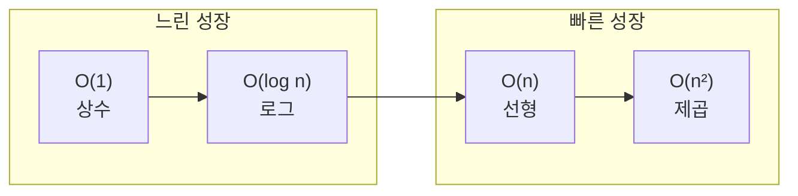
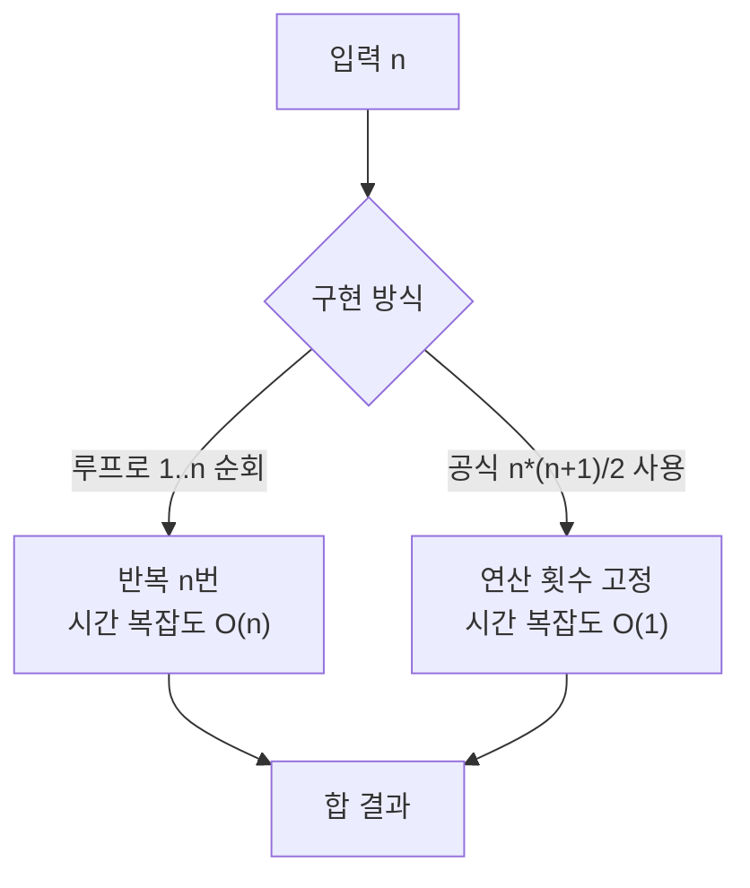
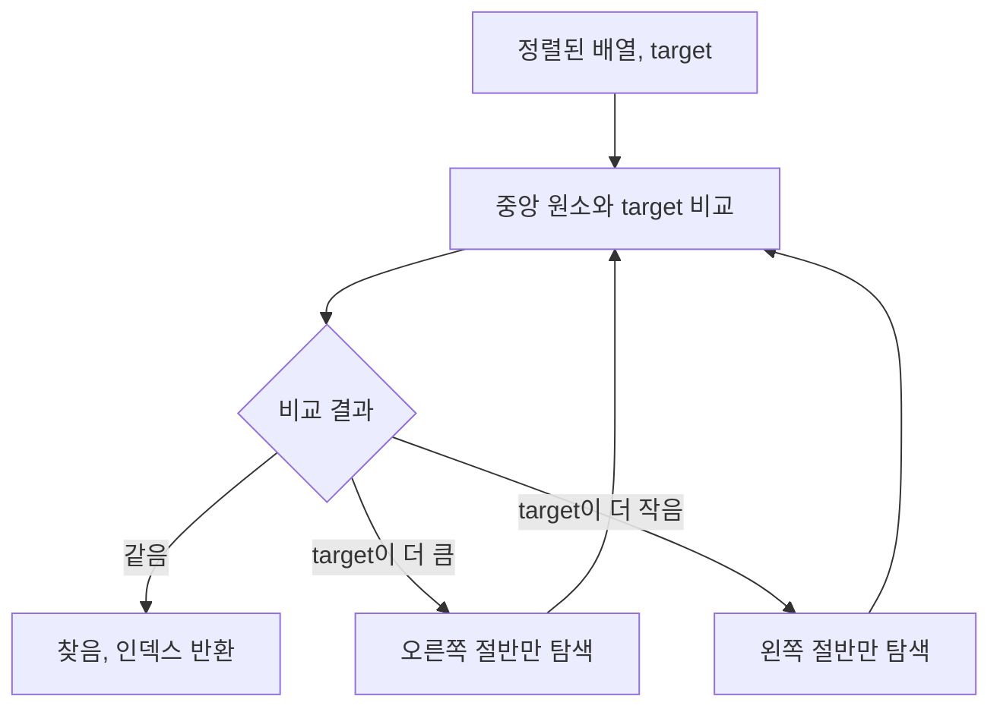

알고리즘 성능을 “빠르다/느리다”로만 말하긴 어렵습니다. 입력 크기에 따라 시간이 어떻게 늘어나는지를 설명하는 도구가 바로 **Big O 표기법**입니다. Sam Rose의 ‘Big O’는 상호작용 예제와 직관적인 시각화로 `O(1)`·`O(log n)`·`O(n)`·`O(n²)`의 차이를 체감하게 해 주는 훌륭한 안내서입니다. 이 글에서는 해당 글의 핵심 개념, **복잡도 분석 표**, **Mermaid 시각화**, 그리고 코드에 바로 적용할 수 있는 실무 팁까지 정리했습니다. 복잡도를 “암기”하기보다, 병목을 “식별하고 바꾸는” 감각을 얻어가세요.

## 자료 정보

| 항목 | 내용 |
|------|------|
| **원문** | [Sam Rose — Big O](https://samwho.dev/big-o/) |
| **형식** | 인터랙티브 시각화·코드 예제가 있는 웹 글 |
| **추천 대상** | Big O 입문자, 면접 준비, 실무 성능 점검이 필요한 개발자 |
| **언어** | 영어(원문), 본문 요약·코드는 한글·C++ |

## 요약

- **핵심**: Big O는 입력 크기에 따른 실행 시간 **증가율(성장 차수)**을 표현합니다. 벽시계 시간 자체보다 **입력과 시간의 관계**를 작게 기술하는 표기법입니다.
- **4가지 대표 복잡도**: `O(1)`(상수), `O(log n)`(로그), `O(n)`(선형), `O(n²)`(제곱). 별도 언급이 없으면 **최악 경우** 기준으로 설명하는 것이 일반적입니다.
- **사례**: 반복 합 `sum(1..n)`은 루프 구현 시 `O(n)`, 수학 공식 `(n*(n+1))/2` 사용 시 `O(1)`. 버블 정렬은 최악 `O(n²)`, 이진 탐색은 `O(log n)`.
- **실무 팁**: `Set/Map` 조회는 평균 `O(1)`이지만, 컬렉션을 새로 만드는 비용은 `O(n)`. 루프 안에서 `.indexOf`·`std::find` 같은 `O(n)` 호출을 피하고, 캐시로 중복 계산을 줄이세요.

## 글 소개

Sam Rose가 쓴 "Big O"는 빅오 표기법을 가장 직관적으로 설명하는 입문 글입니다. 단순한 이론 나열을 넘어, **상호작용 예제**와 **시각화**로 `O(1)`·`O(log n)`·`O(n)`·`O(n²)`의 차이를 체감하게 해 줍니다. 개발자라면 한 번 읽어볼 만한 글로, 면접 대비와 실무 성능 점검 모두에 유용합니다.

## 핵심 개념 정리

- **Big O의 목적**: 절대 시간이 아니라, 입력이 커질수록 시간이 **어떻게 늘어나는지(성장률)**를 표현합니다. 같은 작업이라도 구현 방식에 따라 성장 차수가 달라질 수 있습니다.
- **최악 기준(Worst-case default)**: 별도 언급이 없다면 최악 경우 복잡도로 기록합니다. (예: 버블 정렬은 역순 입력에서 `O(n²)`)
- **상수항·계수 무시**: `O(2n)`이나 `O(n+1)`도 결국 `O(n)`으로 표기합니다. 성장 차수만 남기는 게 관례입니다.

## 복잡도 분석 요약표

본문에서 다루는 알고리즘·연산의 시간·공간 복잡도를 표로 정리했습니다.

| 알고리즘·연산 | 시간 복잡도 | 공간 복잡도 | 비고 |
|---------------|-------------|-------------|------|
| 1~n 합 (루프) | $O(n)$ | $O(1)$ | 반복 횟수 n |
| 1~n 합 (공식) | $O(1)$ | $O(1)$ | `(n*(n+1))/2` |
| 버블 정렬 | $O(n^2)$ (최악) | $O(1)$ (in-place) | 이미 정렬 시 $O(n)$ |
| 이진 탐색 | $O(\log n)$ | $O(1)$ | 정렬된 배열 가정 |
| 배열 인덱스 접근 | $O(1)$ | — | |
| `std::find` / `indexOf` | $O(n)$ | $O(1)$ | 선형 탐색 |
| `unordered_set`/`unordered_map` 조회 | $O(1)$ (평균) | $O(n)$ | 해시 테이블 |
| Set/Map 생성 (n개 원소) | $O(n)$ | $O(n)$ | 한 번 빌드 후 재사용 권장 |

## 성장률 시각화 (Mermaid)

입력 크기 $n$이 커질 때 실행 시간이 어떻게 늘어나는지 개념적으로 나타낸 흐름입니다. “느린 성장”에서 “빠른 성장” 순으로 정렬했습니다.



다음 다이어그램은 “1부터 n까지 합”을 **루프**로 구할 때와 **공식**으로 구할 때의 분기입니다. 같은 결과라도 구현에 따라 복잡도가 달라짐을 보여 줍니다.



이진 탐색은 매 단계에서 후보 범위가 절반으로 줄어듭니다. 아래와 같이 “비교 후 절반 제거”가 반복되므로 $O(\log n)$입니다.



## 사례로 이해하는 Big O

### 1) 반복 합 vs 수학 공식

루프로 1부터 n까지 더하면 반복 횟수가 n번이므로 **$O(n)$**. 반면 `(n*(n+1))/2` 공식을 쓰면 입력 크기와 무관하게 연산 횟수가 일정해 **$O(1)$**입니다.

### 2) 버블 정렬(Bubble Sort)

인접 원소를 교환하며 정렬합니다. 이미 정렬되어 있으면 한 번 훑고 끝나 $O(n)$도 가능하지만, 일반적으로(특히 역순) **$O(n^2)$**입니다.

### 3) 이진 탐색(Binary Search)

정렬된 배열에서 절반씩 범위를 줄이며 찾습니다. 후보가 절반씩 사라지므로 **$O(\log n)$**. 10억 원소도 31회 내외의 비교로 찾을 수 있습니다.

## 샘플 코드

모든 코드 블록 상단에는 `42jerrykim.github.io에서 더 많은 정보를 확인할 수 있다`는 출처 주석을 두었습니다.

### O(n) vs O(1): 1부터 n까지 합

```cpp
// 42jerrykim.github.io에서 더 많은 정보를 확인할 수 있다
// O(n): 루프
long long sumLoop(long long n) {
  long long total = 0;
  for (long long i = 1; i <= n; ++i) {
    total += i;
  }
  return total;
}

// O(1): 공식
long long sumFormula(long long n) {
  return n * (n + 1) / 2;
}
```

### O(log n): 이진 탐색

```cpp
// 42jerrykim.github.io에서 더 많은 정보를 확인할 수 있다
// 정렬된 벡터에서 target의 인덱스를 반환, 없으면 -1
int binarySearch(const std::vector<int>& a, int target) {
  int left = 0, right = static_cast<int>(a.size()) - 1;
  while (left <= right) {
    int mid = left + (right - left) / 2;
    if (a[mid] == target) return mid;
    if (a[mid] < target) left = mid + 1;
    else right = mid - 1;
  }
  return -1;
}
```

### O(n²): 버블 정렬(교육용)

```cpp
// 42jerrykim.github.io에서 더 많은 정보를 확인할 수 있다
std::vector<int> bubbleSort(std::vector<int> a) {
  bool swapped;
  do {
    swapped = false;
    for (size_t i = 0; i + 1 < a.size(); ++i) {
      if (a[i] > a[i + 1]) {
        std::swap(a[i], a[i + 1]);
        swapped = true;
      }
    }
  } while (swapped);
  return a;
}
```

### 안티패턴: 루프 안의 indexOf vs 인덱스 루프

```cpp
// 42jerrykim.github.io에서 더 많은 정보를 확인할 수 있다
// O(n²): 루프 안에서 std::find 사용
std::string buildListBad(const std::vector<std::string>& items) {
  std::ostringstream out;
  for (const auto& item : items) {
    auto it = std::find(items.begin(), items.end(), item); // O(n)
    int index = static_cast<int>(std::distance(items.begin(), it));
    out << "Item " << (index + 1) << ": " << item << '\n';
  }
  return out.str();
}

// O(n): 인덱스 루프
std::string buildListGood(const std::vector<std::string>& items) {
  std::ostringstream out;
  for (size_t i = 0; i < items.size(); ++i) {
    out << "Item " << (i + 1) << ": " << items[i] << '\n';
  }
  return out.str();
}
```

### Set/Map: 조회는 O(1), 빌드는 O(n)

```cpp
// 42jerrykim.github.io에서 더 많은 정보를 확인할 수 있다
// 빈번 조회 시에만 unordered_set을 재사용하세요
std::vector<std::string> items = {"apple", "banana", "cherry"};
std::unordered_set<std::string> itemSet(items.begin(), items.end()); // 평균 O(n)
bool hasBanana = itemSet.count("banana") > 0;                        // 평균 O(1)
```

### 캐싱으로 중복 계산 줄이기(팩토리얼)

```cpp
// 42jerrykim.github.io에서 더 많은 정보를 확인할 수 있다
std::unordered_map<int, long long> memo{{0, 1}, {1, 1}};
long long factorial(int n) {
  auto it = memo.find(n);
  if (it != memo.end()) return it->second;
  long long result = static_cast<long long>(n) * factorial(n - 1);
  memo[n] = result;
  return result;
}
```

## 실무에서 자주 보는 실수와 개선 패턴

- **루프 내부의 선형 탐색 호출**: `std::find`를 루프 안에서 호출하면 전체가 $O(n^2)$가 됩니다. 인덱스 기반 for 루프로 바꾸세요.
- **즉석 Set/Map 빌드**: 조회는 평균 $O(1)$이지만 `std::unordered_set` 생성은 $O(n)$입니다. 빈번 조회가 아니라면 오히려 느려질 수 있으므로, 재사용 가능한 곳에서 한 번만 빌드하세요.
- **중복 계산**: 팩토리얼처럼 부분 문제가 반복되는 경우 **메모이제이션(캐시)**으로 평균 성능을 크게 개선할 수 있습니다.
- **항상 측정**: 온라인 글의 수치를 맹신하지 말고, 변경 전후를 **같은 환경에서 측정**해 실제 개선을 확인하세요.

## 읽는 순서 추천

1. 각 복잡도의 시각화를 통해 “성장률의 감각”을 익힌다.
2. 정렬·탐색 같은 친숙한 문제에 Big O를 적용해 본다.
3. 자신의 코드에서 **루프 안의 비싼 호출**, **불필요한 자료구조 빌드**, **중복 계산**을 찾아 치환한다.

## 참고 문헌 및 출처

- [Sam Rose — Big O](https://samwho.dev/big-o/) — 원문(인터랙티브 시각화·설명)
- [해다(HADA) — 빅오 표기법의 시각적 소개](https://news.hada.io/topic?id=22736) — 한글 요약·토론 링크
- [Wikipedia — Big O notation](https://en.wikipedia.org/wiki/Big_O_notation) — 수학적 정의·Bachmann–Landau 표기·다양한 예제
