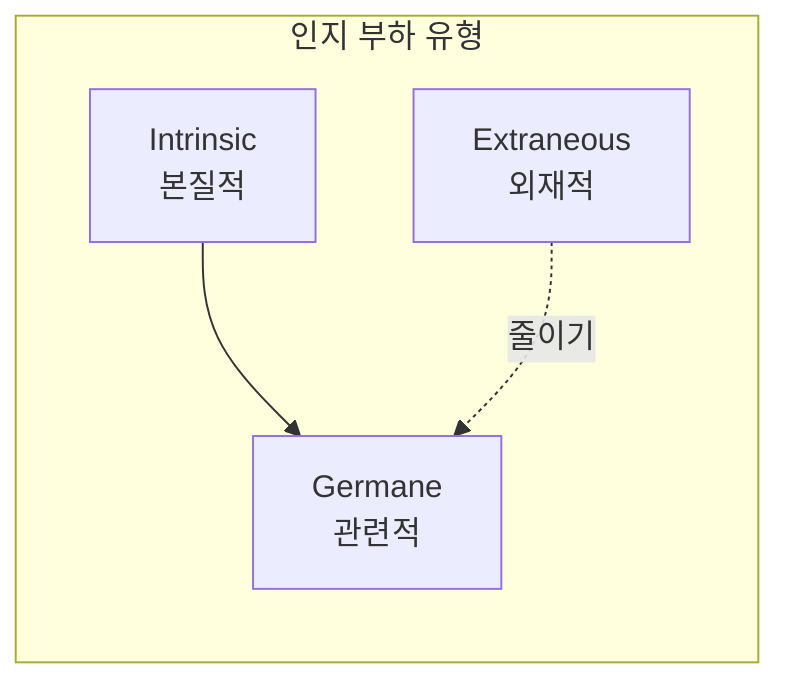
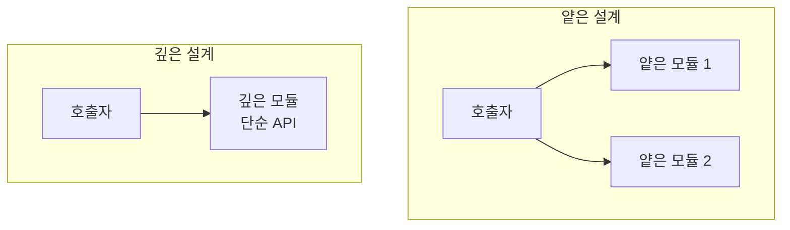

코드의 **인지 부하(Cognitive Load)**를 낮추면 읽기·수정이 쉬워지고, 온보딩 시간이 줄고, 팀 전체 속도가 붙는다. 이 글에서는 이론부터 실전 체크리스트·아키텍처 원리·지표 활용까지 한 번에 정리한다.

---

## 인지 부하란 무엇인가

### 신경과학·교육심리 관점

**인지 부하**는 어떤 작업을 이해하고 완수하는 데 필요한 **정신적 노력**을 말한다. 작업 기억(working memory)이 쓰이는 양과 같다고 보면 된다. [Wikipedia: Cognitive load](https://en.wikipedia.org/wiki/Cognitive_load)에서는 다음 세 가지를 구분한다.

- **Intrinsic(본질적)**: 도메인·문제 자체의 난이도. 예를 들어 “2+2”보다 “미분방정식 풀기”가 본질적으로 더 무겁다.
- **Extraneous(외재적)**: 정보가 **어떻게 제시되느냐** 때문에 생기는 부하. 설계로 줄일 수 있다.
- **Germane(관련적)**: 학습·이해를 위해 쓰는 부하. 스키마 구축에 기여하는 부분이다.

코드 품질 관점에서는 **Extraneous를 줄이고**, 필요한 복잡도는 **의미 있는 단위로 나누어** Intrinsic을 다루기 쉽게 만드는 것이 목표다.



### 코드 관점: Cognitive Complexity

**Cyclomatic Complexity**는 분기 개수만 세기 때문에, 사람이 느끼는 “이해 난이도”와 잘 맞지 않는다. **Cognitive Complexity**는 중첩·논리 연산·점프를 가중치를 두어 반영해, 유지보수성에 더 가깝게 측정하려는 지표다. [SonarSource: Cognitive Complexity](https://www.sonarsource.com/resources/cognitive-complexity/) 백서에서 정의와 계산 방식을 다룬다.

### 아키텍처 관점: 깊은 모듈

John Ousterhout의 [A Philosophy of Software Design](https://web.stanford.edu/~ouster/cgi-bin/aposd.php)에서는 **얕은 모듈**을 피하고, **강한 기능을 단순한 인터페이스 뒤에 숨기는 깊은 모듈**을 설계하라고 강조한다. 그러면 호출하는 쪽의 인지 부하는 줄고, 복잡도는 모듈 내부에 갇힌다.

---

## 코드 레벨 실전 체크리스트

### 1) 조건문 단순화

- 복잡한 논리를 **의미 있는 중간 변수**로 쪼갠다.
- 중첩을 줄이고 **조기 반환(guard clauses)**으로 해피 패스를 위쪽에 둔다.
- 한 조건문에 AND/OR가 많이 붙으면, 이름 붙은 불리언으로 빼서 “무엇을 검사하는지”가 드러나게 한다.

### 2) 흐름 제어 평탄화

- 깊은 `if`–`else` 대신 **빠른 실패(fail fast)**를 쓰고, 예외·에러는 경계에서 한 번에 처리한다.
- 루프 안의 중첩 분기는 헬퍼 함수나 조기 `continue`/`return`으로 줄인다.

### 3) 이름과 경계 강화

- 변수·함수·모듈 이름에 **의도**를 담아, 주석 없이도 역할이 보이게 한다.
- 모듈 경계를 **좁고 명확**하게 잡고, 데이터가 한 방향으로 흐르도록 단순화한다.

### 4) 얕은 추상화 거부

- 실질 가치가 없는 래퍼·추상화는 제거하고, **진짜 복잡도는 내부 구현**에서 처리한다.
- “이름만 바꾼” 얇은 레이어는 호출자 인지 부하만 늘린다.

### 5) 측정과 리뷰 루프

- **Cognitive Complexity**와 정적 분석을 CI에 넣고, PR 단위로 수치와 근거를 같이 논의한다. [SonarSource](https://www.sonarsource.com/resources/cognitive-complexity/) 지표를 팀 규칙에 녹이면 일관된 기준이 생긴다.


---

## 예시: 조건문 리팩토링

### 나쁜 예

한 줄에 조건이 몰려 있으면 “무엇을 검사하는지”를 매번 해석해야 해서 인지 부하가 커진다.

```ts
if (val > LIMIT && (isMember || isAdmin) && (isVerified && !isBanned)) {
  proceed();
}
```

### 개선 예

의미 있는 중간 변수와 조기 반환으로, **작업 기억에 동시에 올려둘 정보**를 줄인다.

```ts
const isValid = val > LIMIT;
const isAllowed = isMember || isAdmin;
const isSecure = isVerified && !isBanned;

if (!isValid) return;
if (!isAllowed) return;
if (!isSecure) return;

proceed();
```

실전 예시와 원칙 모음은 [GitHub: cognitive-load](https://github.com/zakirullin/cognitive-load)에서 더 볼 수 있다.

---

## 아키텍처: 얕은 모듈 vs 깊은 모듈

**얕은 모듈**이 많으면, 호출하는 쪽에서 여러 API와 내부 동작을 다 알아야 해서 인지 비용이 퍼진다. **깊은 모듈**은 강한 기능을 **간단한 표면 API**로만 노출해, 호출자 부담을 최소화한다. [APOSD](https://web.stanford.edu/~ouster/cgi-bin/aposd.php)에서 “깊이”와 인터페이스 설계를 자세히 다룬다.



---

## 지표의 활용과 한계

- **Cyclomatic vs Cognitive Complexity**: 분기 수만 세는 지표보다 Cognitive Complexity가 “이해 난이도”에 더 가깝다. 다만 수치만으로 결론 내리지 말고, **맥락**과 **리뷰어의 설명**을 함께 둔다.
- CI에서 임계치를 두되, 예외가 필요한 경우(예: 파서·상태 머신)는 팀 합의로 예외 규칙을 두는 것이 현실적이다.

---

## 참고 자료

- [GitHub: Cognitive Load — 예시·원칙 정리 (zakirullin/cognitive-load)](https://github.com/zakirullin/cognitive-load)
- [Wikipedia: Cognitive load](https://en.wikipedia.org/wiki/Cognitive_load)
- [SonarSource: Cognitive Complexity white paper](https://www.sonarsource.com/resources/cognitive-complexity/)
- [John Ousterhout: A Philosophy of Software Design](https://web.stanford.edu/~ouster/cgi-bin/aposd.php)
