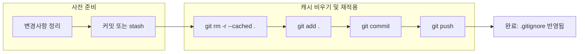

개발을 하다 보면 `.gitignore`에 분명히 추가했는데도 `node_modules`, 빌드 산출물, 로그 파일 등이 계속 `git status`에 잡히는 경험을 하게 됩니다. 이는 해당 파일들이 이미 한 번 "추적(tracked)" 상태가 되었기 때문으로, 규칙을 고쳐 쓰는 것만으로는 소급 적용되지 않습니다. 이 글은 인덱스(스테이징 영역)만 안전하게 비워 규칙을 재적용하는 방법, 특정 파일·폴더만 선택적으로 해제하는 방법, `git check-ignore -v`로 원인을 정확히 추적하는 요령, 그리고 패턴·인코딩·줄바꿈·공백 등 실제 현장에서 자주 놓치는 함정을 정리했습니다. Git 공식 문서와 주요 가이드를 바탕으로 실수 없이 적용할 수 있는 최소-위험 절차를 제시합니다.

## 개요

| 항목 | 내용 |
|------|------|
| **문제** | `.gitignore`를 새로 추가·수정했는데 무시 규칙이 즉시 적용되지 않음. 이미 추적 중인 파일은 계속 추적됨. |
| **핵심 해결** | 인덱스(스테이징)에서만 해당 경로를 제거한 뒤, 규칙을 재적용하는 커밋을 수행. |
| **추천 대상** | Git을 쓰는 모든 개발자, 팀 저장소에 불필요한 파일이 올라간 적 있는 경우. |

**한 줄 요약**: 이미 추적된 파일은 `.gitignore`만으로 해제되지 않으므로, `git rm --cached`로 인덱스에서만 제거한 뒤 `git add`·커밋으로 규칙을 반영한다.

## 처리 흐름 (전체 절차)

아래 플로우는 "전체 인덱스 비우기" 방식의 권장 순서를 나타냅니다.



- **사전 준비**: 작업 중인 변경사항을 커밋하거나 `git stash`로 임시 저장해 두는 단계.
- **캐시 비우기 및 재적용**: 인덱스만 제거한 뒤 다시 추가·커밋·푸시하여 `.gitignore` 규칙이 적용된 상태로 만드는 단계.

## 배경: 왜 즉시 적용되지 않을까?

Git은 **이미 버전 관리에 들어간(추적 중인) 파일**을 `.gitignore`로 소급해 "자동 해제"하지 않습니다. `.gitignore`는 "아직 추적하지 않는 파일"을 앞으로 추적하지 말라고 하는 규칙일 뿐이므로, 한 번 추적된 파일은 **인덱스에서 명시적으로 제거**해야 이후 커밋부터 무시 규칙이 반영됩니다.

- **인덱스(스테이징 영역)**: 다음 커밋에 포함될 내용이 잡혀 있는 곳. `git add`로 채워지고, `git rm --cached`로 경로만 제거 가능.
- **워킹 트리**: 실제 디스크에 있는 파일. `git rm --cached`는 워킹 트리 파일을 건드리지 않는다고 공식 문서에 명시되어 있습니다.

> Use this option to unstage and remove paths only from the index. Working tree files will be left alone.  
> — [git-rm](https://git-scm.com/docs/git-rm), Git 공식 문서

## 안전 절차 1: 전체 인덱스 비우고 규칙 재적용

**1단계**: 변경사항 커밋 또는 스태시로 안전 확보  
**2단계**: 인덱스만 초기화한 뒤 규칙 재적용

```bash
git rm -r --cached .
git add .
git commit -m "Apply .gitignore rules by clearing index cache"
git push
```

- `git rm -r --cached .`: 현재 디렉터리 기준으로 인덱스에 있는 모든 항목을 인덱스에서만 제거. `-r`은 디렉터리 재귀, `--cached`는 워킹 트리는 그대로 두라는 의미.
- `git add .`: 워킹 트리 기준으로 다시 스테이징. 이때 `.gitignore` 규칙이 적용되어 무시 대상은 스테이징되지 않음.
- 이후 커밋·푸시하면 원격에도 반영됩니다.

## 안전 절차 2: 특정 파일·폴더만 추적 해제

전체 인덱스를 비우는 것이 부담스럽다면, 문제가 되는 경로만 선택적으로 제거할 수 있습니다.

```bash
# 단일 파일만 추적 해제
git rm --cached path/to/file

# 디렉터리만 추적 해제
git rm -r --cached path/to/directory

git add .
git commit -m "Stop tracking generated assets"
```

- `path/to/file`, `path/to/directory`는 실제 경로로 바꿔 사용합니다.
- 부분 제거 후에도 `git add .`와 커밋으로 변경을 확정해야 합니다.

## 디버깅: 규칙이 먹히지 않을 때

### 1. 어떤 규칙이 적용됐는지 확인

의심되는 경로에 대해 어떤 무시 규칙이 매칭되는지(또는 매칭되지 않는지) 확인하려면:

```bash
git check-ignore -v path/to/suspect
```

- `-v`(verbose)로 "어느 규칙·어느 파일 몇 번째 줄"이 적용됐는지 출력됩니다.
- 이미 추적 중인 파일은 기본적으로 check-ignore 결과에 안 나올 수 있으므로, "규칙 자체가 맞는지" 확인할 때는 [공식 문서](https://git-scm.com/docs/git-check-ignore)의 `--no-index` 옵션을 참고하면 좋습니다.

### 2. 패턴 작성 시 자주 하는 실수

| 목적 | 권장 예시 | 비고 |
|------|-----------|------|
| 특정 디렉터리 전체 | `logs/` | 리포 루트 기준 해당 디렉터리 |
| 어디서든 해당 이름 | `**/logs` | 하위 어디든 `logs` |
| 예외 허용 | `!important.log` | 디렉터리 단위로 무시된 하위는 예외 불가한 경우 있음 |

### 3. 인코딩·줄바꿈·공백

- **인코딩**: `.gitignore`는 UTF-8 텍스트로 두는 것이 안전합니다. Windows에서 UTF-16/UCS-2 등으로 저장되면 Git이 규칙을 제대로 읽지 못하는 사례가 있습니다.
- **줄바꿈**: CRLF/LF 불일치로 한 줄로 붙어 버리면, 첫 줄만 규칙으로 인식되고 나머지가 주석처럼 취급될 수 있습니다. 에디터에서 EOL을 통일(예: LF)하고 저장하세요.
- **공백·주석**: 행 맨 앞·맨 끝 공백은 피하고, 주석은 같은 줄 끝이 아니라 **별도 라인**에 두세요. 같은 줄에 `# 주석`을 붙이면 그 줄 전체가 주석으로 해석됩니다.
- **파일명**: Windows에서 `.gitignore`가 `.gitignore.txt`로 저장돼 있진 않은지 확인하세요. 확장자 없이 `.gitignore` 한 개만 있어야 합니다.

## 전역·로컬 제외 규칙 활용

- **전역 무시(사용자 공통)**: 여러 리포에서 공통으로 쓰고 싶다면:

  ```bash
  touch ~/.gitignore
  git config --global core.excludesFile ~/.gitignore
  ```

- **로컬 전용(공유 안 함)**: 해당 리포에서만 쓰고 커밋은 하지 않으려면 `.git/info/exclude`에 패턴을 추가합니다.

## 자주 묻는 질문 (FAQ)

**Q. `git rm -r --cached .`는 위험한가요?**  
A. 워킹 트리 파일은 삭제되지 않습니다. 인덱스만 갱신되고, 이후 `git add .`로 `.gitignore`가 반영된 상태로 스테이징됩니다. 그래도 불안하면 **대상 파일·폴더만** `git rm --cached`로 제거하세요.

**Q. 규칙이 맞는 것 같은데 왜 계속 추적되나요?**  
A. 이미 추적 중인 파일이라서 그렇습니다. 먼저 `--cached`로 인덱스에서 제거한 뒤 커밋해야 합니다.

**Q. 예외 규칙(`!...`)이 통하지 않아요.**  
A. 디렉터리 단위로 무시된 경우(`logs/` 등), 그 하위 파일을 `!logs/important.log`로 되살리는 것은 Git 동작상 불가능한 경우가 있습니다. 필요한 파일만 예외로 두는 구조로 패턴을 다시 설계해 보세요.

## 빠른 레퍼런스: 자주 쓰는 명령

```bash
# 전체 인덱스 비우고 규칙 재적용
git rm -r --cached . && git add . && git commit -m ".gitignore re-apply"

# 특정 파일·폴더만 추적 해제
git rm --cached <file>
git rm -r --cached <directory>

# 어떤 규칙이 적용됐는지 추적
git check-ignore -v <path>
```

## 참고 문헌

1. Contributor9, "[.gitignore 파일이 바로 적용이 안될때 해결방법: git 캐시 삭제](https://adjh54.tistory.com/376)", 티스토리.
2. Git 공식 문서: [git-rm](https://git-scm.com/docs/git-rm), [git-check-ignore](https://git-scm.com/docs/git-check-ignore).
3. GitHub Docs, "[Ignoring files](https://docs.github.com/en/get-started/git-basics/ignoring-files)".
4. Stack Overflow, "[Gitignore not working](https://stackoverflow.com/questions/25436312/gitignore-not-working)" (원인: 이미 추적된 파일, 인코딩·줄바꿈·공백 등 다수 사례 정리).
