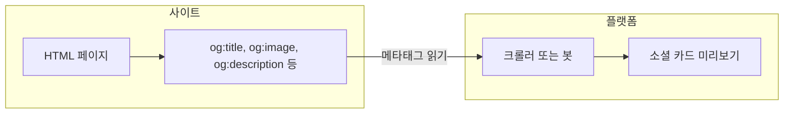
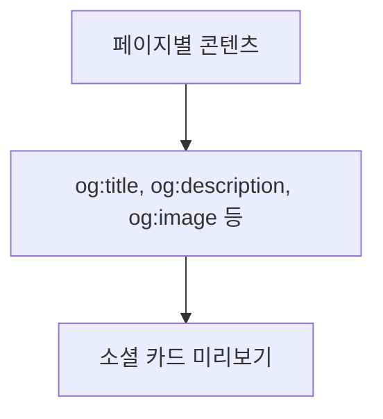

Open Graph(OG)는 링크가 소셜 미디어·메신저·슬랙 등에 공유될 때 보이는 카드(제목·설명·이미지)를 결정하는 메타데이터 표준이다. 이 글은 [Open Graph Examples](https://opengraphexamples.com/)의 실제 사례와 도구를 바탕으로, 필수 메타태그 작성법부터 이미지 자동화·검증·캐시 전략까지 실무에 바로 적용할 수 있는 흐름을 구조화해 정리한다.

## 이 글에서 다루는 내용

- **Open Graph란 무엇인가**: 프로토콜 개념과 소셜 미리보기 동작 원리
- **OpenGraphExamples.com 소개**: 예시 카탈로그, 메타태그 가이드, 디버거·생성기·스크린샷 API 등 실무 도구
- **필수 OG 메타태그**: 최소 권장 태그와 이미지 규격·텍스트 길이·다국어 고려사항
- **실무 적용 흐름**: 전략 수립 → 구현 → 이미지 생산 → 검증·디버깅 → 캐시 관리
- **참고 링크**: 공식 문서·도구·자동 생성 서비스

---

## Open Graph란 무엇인가

오픈 그래프는 웹페이지를 소셜 그래프의 "리치 오브젝트"로 표현하기 위한 메타데이터 표준이다. HTML `<head>`에 OG 메타태그를 추가하면 Facebook, X(트위터), LinkedIn, 메신저, 슬랙 등 **공유·링크 언퍼링** 환경에서 제목·설명·이미지·URL이 일관되게 미리보기 카드로 노출된다. 개념 설명은 [What is Open Graph?](https://opengraphexamples.com/posts/open-graph/)에서 확인할 수 있다.

### 소셜 미리보기가 만들어지는 흐름

아래 다이어그램은 링크 공유 시 OG 메타태그가 어떻게 읽히고 카드로 표시되는지 요약한다.



- **YourSite**: 웹페이지에 OG 메타태그가 포함되어 있으면, 플랫폼 쪽 크롤러가 해당 URL을 요청해 메타데이터를 수집한다.
- **Platform**: 수집한 `og:title`, `og:image`, `og:description` 등으로 카드 UI를 렌더링해 사용자에게 보여 준다.

---

## OpenGraphExamples.com은 무엇을 제공하나요?

[Open Graph Examples](https://opengraphexamples.com/)는 소셜 미리보기를 위한 OG 사례·베스트 프랙티스·실무 도구를 한곳에 모은 리소스 허브다. 다양한 서비스의 실제 OG 이미지 구현 예시를 카탈로그로 제공하며, 메타태그 가이드·디버거·이미지 생성기·에디터·스크린샷 기반 자동화 등으로 연결된다.

| 구분 | 설명 | 링크 |
|------|------|------|
| 예시 컬렉션 | 카테고리별 최신 OG 이미지 사례, 메타태그 구현 방식 확인 | [All Examples](https://opengraphexamples.com/examples/) |
| 메타태그 가이드 | OG 핵심 태그와 작성 요령 | [Open Graph Meta Tags](https://opengraphexamples.com/posts/open-graph-meta-tags/) |
| 디버거/체커 | 공유 전 미리보기·경고 점검 | [Open Graph Debugger](https://opengraphexamples.com/open-graph-debugger/) |
| 이미지 생성 | 템플릿 기반 OG 이미지 생성 | [OG Image Generator](https://opengraphexamples.com/posts/og-image-generator/) |
| 이미지 편집 | OG 이미지 간단 편집 | [OG Image Editor](https://opengraphexamples.com/posts/open-graph-image-editor/) |
| 스크린샷 API | 페이지 스크린샷을 OG 이미지로 자동 렌더링 | [OG images with Screenshot API](https://opengraphexamples.com/posts/og-image-screenshot-api/) |

자동 생성 서비스 [ogimage.org](https://ogimage.org)도 같은 맥락에서 참고할 수 있다.

---

## 필수 Open Graph 메타태그와 권장 사항

### 최소 메타태그 예시(권장)

```html
<meta property="og:title" content="페이지 제목" />
<meta property="og:description" content="콘텐츠를 요약한 1-2문장" />
<meta property="og:image" content="https://example.com/og-image.png" />
<meta property="og:url" content="https://example.com/page" />
<meta property="og:type" content="website" />
```

- **og:title**: 카드에 노출되는 제목. 잘림 없이 보이도록 적정 길이 유지.
- **og:description**: 요약 문장. 플랫폼별 글자 수 제한을 고려해 작성.
- **og:image**: 절대 URL. 권장 규격 1200×630(px), 비율 1.91:1(플랫폼별 권장치 참고).
- **og:url**: 캐노니컬 URL.
- **og:type**: `website` 또는 `article` 등 콘텐츠 유형.

자세한 설명과 추가 속성은 [Open Graph Meta Tags](https://opengraphexamples.com/posts/open-graph-meta-tags/)를 참고하면 된다.

### 메타태그 결정과 카드 결과의 관계



- **Input**: 실제 페이지의 제목·요약·대표 이미지.
- **Tags**: 위 값을 OG 메타태그에 반영.
- **Output**: 플랫폼이 이 메타데이터로 렌더링한 카드.

권장 사항 요약:

- **이미지**: 1200×630(px), 1.91:1 비율, 플랫폼 가이드 참고.
- **텍스트**: 제목·설명은 플랫폼별 잘림을 고려해 길이 조절.
- **다국어**: 사이트 언어/로케일에 맞춘 일관된 표시.

---

## 실무 적용 흐름(체크리스트)

1. **전략 수립**  
   기본(사이트 공통) OG 이미지와 페이지별 OG 이미지를 함께 쓸지 결정. 브랜드 일관성과 제작 비용을 저울질한다.

2. **메타태그 구현**  
   Hugo, Next.js, Nuxt 등 프레임워크 또는 CMS에서 템플릿화해 누락·오타를 방지한다. [Open Graph Meta Tags](https://opengraphexamples.com/posts/open-graph-meta-tags/) 가이드를 참고한다.

3. **이미지 생산**  
   정적 템플릿, 동적 렌더(서버리스/엣지), 스크린샷 API 중 선택. [OG images with Screenshot API](https://opengraphexamples.com/posts/og-image-screenshot-api/), [ogimage.org](https://ogimage.org)를 참고한다.

4. **검증·디버깅**  
   공유 전 [Open Graph Debugger](https://opengraphexamples.com/open-graph-debugger/)로 카드 미리보기와 경고를 점검한다.

5. **캐시 관리**  
   플랫폼·프록시·CDN 캐시 때문에 변경이 늦게 반영될 수 있으므로, 수동 리프레시나 URL 파라미터 전략 등 캐시 무효화를 준비한다.

---

## OpenGraphExamples.com이 특히 유용한 이유

- **실제 사례 중심**: 서비스별 OG 이미지 설계·브랜딩을 한눈에 비교할 수 있다.
- **도구 체인**: 생성기·에디터·체커·스크린샷 API 등 실무 도입을 바로 지원한다.
- **문서 품질**: 개념 → 구현 → 디버깅이 연결된 흐름을 제공해 팀 온보딩에 적합하다.

---

## 참고 링크

| 용도 | URL |
|------|-----|
| 메인 | [Open Graph Examples](https://opengraphexamples.com/) |
| 개요 | [What is Open Graph?](https://opengraphexamples.com/posts/open-graph/) |
| 메타태그 | [Open Graph Meta Tags](https://opengraphexamples.com/posts/open-graph-meta-tags/) |
| 디버거 | [Open Graph Debugger](https://opengraphexamples.com/open-graph-debugger/) |
| 이미지 생성기 | [OG Image Generator](https://opengraphexamples.com/posts/og-image-generator/) |
| 이미지 에디터 | [OG Image Editor](https://opengraphexamples.com/posts/open-graph-image-editor/) |
| 스크린샷 API | [OG images with Screenshot API](https://opengraphexamples.com/posts/og-image-screenshot-api/) |
| Public API | [OG Public API](https://opengraphexamples.com/posts/api/) |
| 이미지 자동화 | [ogimage.org](https://ogimage.org) |
