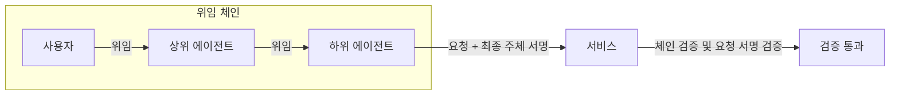
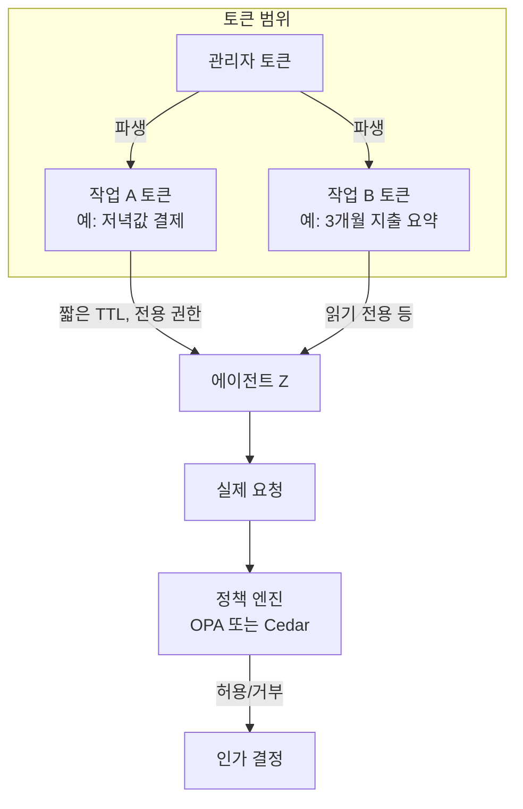

## 개요

Positiveblue의 글 [「The Web Does Not Need Gatekeepers」](https://positiveblue.substack.com/p/the-web-does-not-need-gatekeepers)는 에이전트 시대의 웹 거버넌스에 중요한 문제 제기를 던진다. 한 회사가 운영하는 허가목록(allowlist)식 「서명된 에이전트(signed agents)」·「검증된 봇(verified bots)」 모델이 **개방형 웹의 기본 원리**와 충돌한다는 주장이다.

**핵심 메시지**: 인터넷은 프로토콜로 열려 있었기에 혁신이 가능했고, 다음 세대 사용자(에이전트)에게도 그 원칙이 유지되어야 한다. 인증·인가·과금은 **기업 승인**이 아니라 **공개 프로토콜**로 해결되어야 한다.

**추천 대상**: 웹·API·보안 아키텍트, 에이전트·봇 정책 설계자, 오픈 웹 표준에 관심 있는 개발자.

---

## 왜 「게이트키퍼 없는 웹」인가

### 역사적 선례: 개방 표준이 폐쇄 플러그인을 이긴 사례

폐쇄 플러그인(Flash, Silverlight)은 개방 표준(HTML5·Open Web Platform)에 밀려났다. Flash는 2020년 12월 지원 종료되었고, Silverlight는 2021년 10월 지원이 종료되었다. HTML5는 2014년 W3C 권고안으로 확정되었다. 개방형 표준이 혁신을 가속한 대표적 사례다.

- [W3C HTML5 Recommendation (2014-10-28)](https://www.w3.org/TR/2014/REC-html5-20141028/)
- [Adobe Flash Player End of Life](https://www.adobe.com/products/flashplayer/end-of-life.html)
- [Microsoft Silverlight 지원 종료](https://learn.microsoft.com/ko-kr/lifecycle/announcements/silverlight-end-of-support)

### 구조적 위험: 단일 사업자 허가목록

단일 사업자가 발급·심사하는 「봇 여권」 모델은 웹을 **벤더 정책의 정원**으로 바꾼다. 목록에 오르지 못하면 기본적으로 의심받는 구조는 **개방형 기본값**을 훼손한다. 관련 맥락: [Cloudflare Bot 솔루션 개요](https://developers.cloudflare.com/bots/).

---

## 에이전트 시대 인증과 인가: 무엇이 달라져야 하나

### 인증(Authentication) — 「누가 행동하는가」

「누가 행동하는가」를 검증해야 한다. 단일 서명 토큰만으로는 위임 체인과 실제 요청 주체를 담보하기 어렵다.

- **DNS에 공개키 게시**: 기업이 `example.com`의 DNS에 공개키를 게시하면, 제3자 신원을 회사 도메인·키 소유 증명으로 검증할 수 있다. 기본 상태는 개방이고, 각 사이트는 필요 시 차단·허용 정책을 추가한다.
- **위임 체인 + 요청 레벨 서명**: 사용자 → 상위 에이전트 → 하위 에이전트 순의 위임을 체인으로 명시하고, **실제 HTTP 요청에는 마지막 주체의 서명**을 포함해, 요청을 만든 주체가 체인 최종 주체임을 증명한다.

### 인가(Authorization) — 「무엇을 할 수 있는가」

「무엇을 할 수 있는가」를 **작업(Task) 단위**로 부여해야 한다. 일반 목적 에이전트에게 관리자 키를 장기 보관시키는 관행은 위험하다.

- **제약 가능한 짧은 수명 토큰**: 마카룬(Macaroons), 비스킷(Biscuit) 같은 토큰으로 권한을 축소하며 위임한다. [Macaroons (computer science)](https://en.wikipedia.org/wiki/Macaroons_(computer_science)), [Biscuit](https://github.com/eclipse-biscuit/biscuit)
- **정책 분리**: 인가 결정을 중앙 코드와 분리해 OPA(Rego)·AWS Cedar 같은 고수준 정책 언어로 선언·검증한다. [Open Policy Agent](https://www.openpolicyagent.org/), [AWS Cedar](https://www.cedarpolicy.com/en)

---

## 위임 체인과 작업 단위 인가 구조 (개념도)

### 위임 체인 + 요청 서명

### 작업 단위 인가(Task-scoped) 흐름

---

## 「서명된 에이전트」 접근의 기술적 한계

1. **인증·인가 혼동**: 패스포트 같은 단일 신원 표식으로 인가 문제까지 해결하려는 설계는 실패하기 쉽다. 실제 세계에서도 여권만으로는 은행 계좌를 열 수 없고, 본인이 현장에 있어야 한다.
2. **양도 위험**: 이동 가능한 토큰 하나로 신원을 증명하면, 제3자에게 토큰을 넘겨도 동일 권한이 행사된다. 「봇 여권」을 들고 다니는 것만으로는 요청 주체가 누구인지 보장할 수 없다.
3. **단일 실패 지점**: 중앙 허가목록은 오판·정책 변경·사업 리스크에 따라 대규모 정지·오탐을 유발할 수 있다.

---

## 대안 아키텍처 요약

| 영역 | 접근 방식 |
|------|-----------|
| **도메인-키 정체성** | DNS에 공개키 게시, DNSSEC·리졸버로 무결성 보강 |
| **위임 체인 + 요청 서명** | 사용자→상위 에이전트→하위 에이전트 체인 명시, HTTP 요청에 최종 주체 서명 포함 |
| **작업 단위 인가** | 마카룬/비스킷으로 짧은 TTL·상호 전용·하위 위임 가능한 제약식·블록 |
| **정책 분리와 감시** | OPA(Rego)·Cedar로 RBAC/ABAC 정책 외부화, 감사 추적·재현 가능한 결정 로그 |

---

## 실무 체크리스트

- **DNS 키 게시**: 서비스별 공개키 게시 계획 수립(DNS TXT/SRV; 회전 주기·키 롤오버 포함).
- **요청 서명 표준화**: 요청 본문/헤더 포함 방식, 재전송 방지(Nonce/타임스탬프) 합의.
- **제약 토큰 도입**: 마카룬/비스킷을 PoC로 붙여 작업 단위 권한·짧은 TTL·체인 위임 검증.
- **정책 엔진**: OPA(Rego) 또는 Cedar로 RBAC/ABAC 정책을 코드와 분리하고 테스트 케이스화.
- **모의 차단/허용**: 중앙 허가목록 없이도 공격 완화가 가능한지 Bot 방어 룰셋과 레이트리밋을 리허설. 참고: [Cloudflare Bot](https://developers.cloudflare.com/bots/).

---

## 결론: 게이트는 기업이 아니라 프로토콜이 지켜야 한다

웹의 힘은 **개방**과 **상호운용성**이다. 에이전트가 주류 사용자가 되는 다음 세대에도, 인증·인가·과금은 **기업 승인**이 아니라 **공개 프로토콜**로 해결되어야 한다. 위임 체인과 요청 서명, 작업 단위 제약 토큰, 정책 엔진은 이미 손에 잡히는 도구들이다. 이제 필요한 것은 구현과 합의다.

**한 줄 요약**: 에이전트 시대에도 웹은 게이트키퍼가 아니라 열린 프로토콜로 지켜져야 하며, DNS 기반 정체성·위임 체인·작업 단위 인가·정책 엔진이 그 실현 수단이다.

---

## 참고 문헌

1. Positiveblue, 「The Web Does Not Need Gatekeepers」 — [https://positiveblue.substack.com/p/the-web-does-not-need-gatekeepers](https://positiveblue.substack.com/p/the-web-does-not-need-gatekeepers)
2. Cloudflare, 「Cloudflare bot solutions」 — [https://developers.cloudflare.com/bots/](https://developers.cloudflare.com/bots/)
3. W3C, 「HTML5 Recommendation (2014-10-28)」 — [https://www.w3.org/TR/2014/REC-html5-20141028/](https://www.w3.org/TR/2014/REC-html5-20141028/)
4. Adobe, 「Adobe Flash Player End of Life」 — [https://www.adobe.com/products/flashplayer/end-of-life.html](https://www.adobe.com/products/flashplayer/end-of-life.html)
5. Microsoft Learn, 「Silverlight 지원 종료」 — [https://learn.microsoft.com/ko-kr/lifecycle/announcements/silverlight-end-of-support](https://learn.microsoft.com/ko-kr/lifecycle/announcements/silverlight-end-of-support)
6. Wikipedia, 「Macaroons (computer science)」 — [https://en.wikipedia.org/wiki/Macaroons_(computer_science)](https://en.wikipedia.org/wiki/Macaroons_(computer_science))
7. GitHub, 「eclipse-biscuit/biscuit」 — [https://github.com/eclipse-biscuit/biscuit](https://github.com/eclipse-biscuit/biscuit)
8. Open Policy Agent — [https://www.openpolicyagent.org/](https://www.openpolicyagent.org/)
9. AWS Cedar — [https://www.cedarpolicy.com/en](https://www.cedarpolicy.com/en)
10. Agent Identity & Discovery (AID), DNS for Agents — [http://aid.agentcommunity.org](http://aid.agentcommunity.org)
