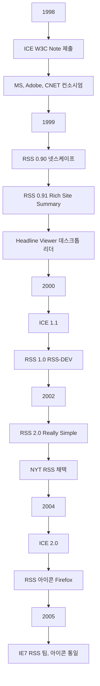
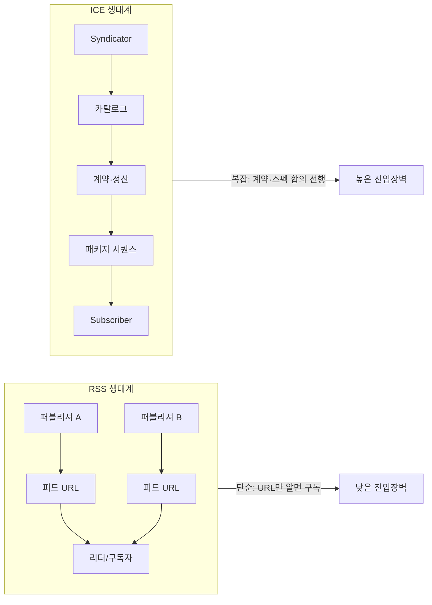

## 개요

1990년대 말 웹은 **신디케이션(syndication)**이라는 새 흐름을 맞았습니다. 한 출처의 콘텐츠를 여러 사이트·앱·채널로 재배포·구독·동기화하는 메커니즘이 핵심이었고, 마이크로소프트·어도비·CNET 등 대기업 연합이 밀던 **ICE(Information and Content Exchange)**와 블로거·개발자들이 선택한 **RSS**가 충돌했습니다. 결국 **단순함과 개방성**이 복잡한 탑다운 규격을 이겼고, 오늘날 RSS는 이메일·팟캐스트·콘텐츠 파이프라인의 뼈대로 자리 잡았습니다. 이 글에서는 두 표준의 차이, RSS가 승리한 이유, 그리고 제품·표준 전략에 대한 시사점을 정리합니다.

**이 포스트가 도움이 되는 독자**: 웹 표준·기술사에 관심 있는 개발자, API·피드 설계를 고민하는 엔지니어, 단순함 vs 기능 과다 설계를 놓고 고민하는 제품·아키텍처 담당자.

---

## 신디케이션이란?

**웹 신디케이션**은 한 출처(퍼블리셔)의 콘텐츠를 다른 사이트·앱·채널로 재배포·구독·자동 동기화하는 메커니즘입니다. 생산자와 소비자가 **포맷과 프로토콜**을 합의해 업데이트를 반복적으로 전달합니다.

### 핵심 구성요소

- **포맷**: 피드 스키마(RSS, Atom 등)로 콘텐츠와 메타데이터를 표현
- **전송 모델**: 풀(pull)·푸시(push) 및 주기·스케줄
- **운영 요소**: 권한·저작권·브랜딩, 성공/실패 확인(confirmation)

### 구현 관점에서의 차이

- **RSS**: 공개 XML 피드(URL)를 제공하고, 리더·서비스가 주기적으로 **풀**합니다. 정적 파일 한 개로 시작 가능합니다.
- **ICE**: 계약·카탈로그·패키지/시퀀스·컨펌까지 포괄하는 **B2B 워크플로**를 포함한 프로토콜입니다.

### 대표 사례

뉴스·블로그 피드, 팟캐스트(enclosure), RSS→이메일, 상품 카탈로그 전파, 검색 색인·ETL 파이프라인 등. 장점은 배포 비용 절감, 도달 확장, 사용자 선호 채널에서의 소비, **느슨한 결합**입니다. 유의할 점은 과도한 스펙·합의가 보급을 늦춘다는 것이며, **단순 포맷과 쉬운 구현**이 네트워크 효과에 유리합니다.

---

## 배경: 1998~2006, 신디케이션의 꿈

1990년대 후반 포털 전쟁과 블로깅의 부상 속에서, 빅테크는 웹을 **신디케이션 경제**로 만들려 했습니다. Kevin Werbach는 1999년 Release 1.0에서 신디케이션이 "인터넷 경제의 핵심 모델"이 될 것이라 예측했습니다.

### ICE의 등장(1998)

- **ICE**는 웹 간 콘텐츠·카탈로그의 자동 교환, 가격 협상·권리·만료·브랜딩 등 **B2B 시나리오**를 포괄하는 프로토콜+DTD로 제안되었습니다.
- W3C에 [NOTE-ice-19981026](https://www.w3.org/TR/1998/NOTE-ice-19981026)으로 제출되었고, 마이크로소프트·어도비·Sun·CNET·Reuters 등이 참여했습니다.
- Vignette는 ICE 서버를 약 5만 달러에 판매했고, iSyndicate에 1,400만 달러를 투자해 ICE 전용 채택을 이끌었습니다.

### RSS의 등장(1999~2002)

- **RSS 0.90/0.91**: 넷스케이프의 마이넷스케이프 채널을 위한 경량 포맷에서 출발했습니다.
- 넷스케이프가 RSS 개발에서 손을 뗀 뒤, **Dave Winer**(UserLand)가 0.91을 정리하고 2002년 **RSS 2.0(Really Simple Syndication)**을 발표했습니다.
- 최소 코어는 **제목·설명·링크** 세 요소로, 누구나 피드를 만들고 구독할 수 있었습니다.

### 타임라인 요약

아래 다이어그램은 ICE와 RSS의 주요 사건을 한눈에 보여 줍니다. 노드 ID는 camelCase이며, 라벨에 특수문자가 있을 경우 큰따옴표로 감쌌습니다.

---

## 왜 ICE는 실패하고 RSS는 이겼나

### 목표의 차이

| 구분 | ICE | RSS |
|------|-----|-----|
| 초점 | 계약·정산·스케줄·컨펌·재전송 등 **엔터프라이즈 운영** | **게시-구독의 최소 단위** |
| 장점 | 포괄성, B2B 시나리오 지원 | 즉시 생성·배포 가능 |
| 단점 | 구현·합의 비용, 58,000자급 가이드 | 확장 시 네임스페이스 등 논란 |

ICE는 카탈로그·가격 협상·콘텐츠 만료·브랜딩 적용까지 스펙에 포함했고, [Getting-Started 가이드](https://web.archive.org/web/20010602170008/http://www.icestandard.org/spec/icecookbook2.pdf)만 해도 수만 자에 달했습니다. RSS는 제목·설명·링크만 있으면 호환 피드로 인정되어, 개인 블로거와 소규모 서비스가 **진입 장벽 없이** 참여할 수 있었습니다.

### 진입 장벽과 네트워크 효과

- **ICE**: 서버·도구·벤더 조합과 사내·파트너 간 합의가 선행되어야 했습니다.
- **RSS**: 정적 XML 한 파일이면 시작 가능했고, Headline Viewer·my.userland.com 같은 **무료 리더**가 바닥에서부터 네트워크를 만들었습니다.
- [TwoBitHistory](https://twobithistory.org/2018/12/18/rss.html)에 따르면, NYT 같은 대형 언론이 RSS를 채택하면서 임계치를 넘겼습니다.

### 표준 거버넌스와 브랜드

- **ICE**: 컨소시엄·벤더 중심. 1.1, 2.0 업데이트는 있었으나 **오픈 구현과 커뮤니티 에너지**가 부족했습니다.
- **RSS**: RDF 계열·Atom 등 사양 논쟁이 있었어도 **"간단히 쓰자"는 실용주의**가 채택을 이끌었고, [Harvard RSS 2.0 사양](https://cyber.harvard.edu/rss/rss.html)이 사실상의 기준이 되었습니다.

아래 Mermaid 다이어그램은 **RSS 생태계**와 **ICE 생태계**의 구조 차이를 단순화해 보여 줍니다. 노드 ID는 예약어를 쓰지 않고 camelCase로 했으며, 라벨에 등호·연산자가 있으면 큰따옴표로 감쌌습니다.

---

## 사례로 보는 전환: MS의 RSS 수용과 아이콘 표준화

마이크로소프트는 ICE 컨소시엄의 핵심이었으나, 2005년경부터 **RSS**에 플랫폼 레벨 투자를 시작했습니다.

- 브라우저 내 **피드 아이콘 통일**과 IE7의 공용 피드 목록·동기화 엔진이 도입되었습니다.
- [Microsoft RSS Blog](https://learn.microsoft.com/en-us/archive/blogs/rssteam/) 아카이브에는 IE7 피드 읽기, Windows RSS Platform, 피드 보안·enclosure 등에 대한 글이 남아 있습니다.

이 결정은 사실상 **ICE에 대한 시장의 퇴장 선언**에 가까웠고, 이메일·팟캐스트·검색·자동화 파이프라인까지 RSS가 확장되는 계기가 되었습니다. [Buttondown 블로그](https://buttondown.com/blog/rss-vs-ice)는 "RSS가 마이크로소프트를 이긴 이야기"를 단순함과 개방성의 승리로 요약합니다.

---

## RSS, Atom 그리고 현재

- **RSS 2.0**: 최소 코어에 **네임스페이스 확장**으로 생태계 확장을 선택했습니다.
- **Atom**: 스키마·MIME 타입 등 **형식적 엄밀성**을 강화한 IETF 표준(RFC 4287)입니다.

실무에서는 RSS가 **뉴스·블로그·팟캐스트**에, Atom은 **API/게시 시스템** 등에 병행 사용됩니다. 중요한 것은 **구독 가능한 개방형 피드**라는 공통 철학입니다. [Wikipedia RSS](https://en.wikipedia.org/wiki/RSS), [Wikipedia ICE](https://en.wikipedia.org/wiki/Information_and_Content_Exchange) 항목에서 역사와 대조를 더 볼 수 있습니다.

---

## 오늘의 시사점: 제품·표준 전략

1. **단순함은 기능의 결핍이 아니라 확장의 초석**  
   최소 가용 제품(MVP)·최소 코어 사양으로 생태계를 먼저 만든 뒤, 필요하면 확장하는 접근이 유리합니다.

2. **개방성과 구현 가능성**  
   사양 문서보다 **누구나 쉽게 구현**할 수 있는 참고 구현과 도구가 채택을 이끕니다.

3. **거버넌스의 투명성**  
   컨소시엄 기반의 무거운 합의 구조는 시장 타이밍을 놓치기 쉽습니다. **커뮤니티-우선, 레퍼런스-우선** 접근이 유리합니다.

4. **VHS vs Betamax와의 유사성**  
   [Buttondown](https://buttondown.com/blog/rss-vs-ice)이 비유하듯, ICE는 "더 정교했지만 더 비싸고 덜 개방적"이었고, RSS는 더 단순하고 개방되어 블로거와 독자 층이 몰리며 이겼습니다.

---

## 참고 문헌

1. [Buttondown – The story of how RSS beat Microsoft](https://buttondown.com/blog/rss-vs-ice)  
   RSS가 ICE를 이긴 과정을 간결함·개방성 관점에서 정리한 글.

2. [W3C Note – Information and Content Exchange (ICE) Protocol](https://www.w3.org/TR/1998/NOTE-ice-19981026)  
   ICE 프로토콜과 포맷의 공식 W3C 제출 문서.

3. [Harvard Law – RSS 2.0 Specification](https://cyber.harvard.edu/rss/rss.html)  
   RSS 2.0 사양의 공개 레퍼런스.

4. [Wikipedia – RSS](https://en.wikipedia.org/wiki/RSS)  
   RSS 역사·버전·현재 사용 현황 요약.

5. [Wikipedia – Information and Content Exchange](https://en.wikipedia.org/wiki/Information_and_Content_Exchange)  
   ICE의 역사·구현·참여 기업 정리.

6. [TwoBitHistory – The Rise and Demise of RSS](https://twobithistory.org/2018/12/18/rss.html)  
   RSS의 부상과 쇠퇴, 포크(Atom)·거버넌스 논란까지 다룬 장문 분석.

7. [Microsoft Learn – Microsoft RSS Blog (Archive)](https://learn.microsoft.com/en-us/archive/blogs/rssteam/)  
   IE7·Windows RSS Platform 등 마이크로소프트의 RSS 관련 공식 블로그 아카이브.
