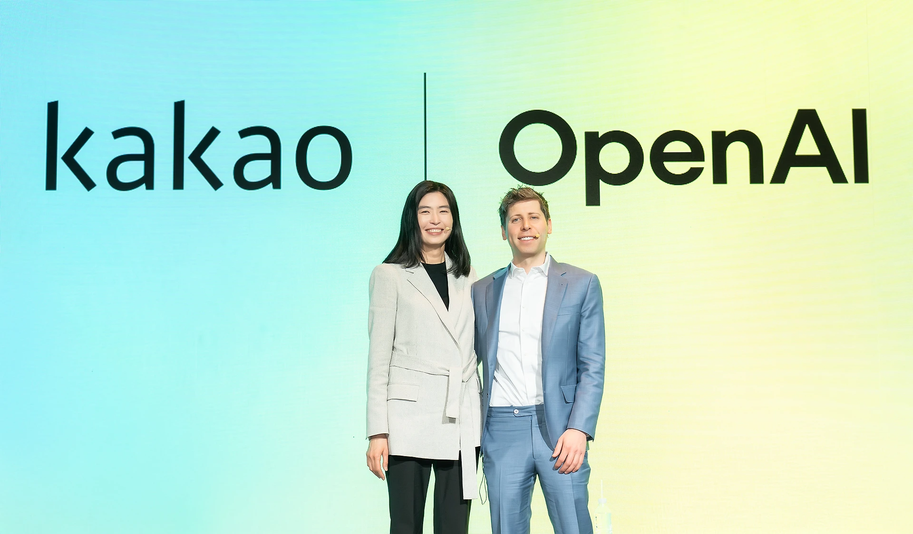

## 한눈에 보기

- 카카오는 2025년 2월 4일, 국내 최초로 오픈AI와 전략적 제휴를 발표했습니다.
- 핵심은 카카오톡·카나나에 오픈AI의 최신 AI 기술(API) 적용과 ChatGPT 엔터프라이즈 도입입니다.
- 카카오의 AI 오케스트레이션 전략을 강화하고, 공동 상품 개발로 AI 서비스 대중화를 앞당깁니다.
- 발표 현장에는 카카오 대표 정신아, 오픈AI CEO 샘 올트먼이 참석해 비전과 향후 방향을 논의했습니다.
- 공식 출처: [카카오 보도자료](https://www.kakaocorp.com/page/detail/11450?lang=KOR).

## 발표 개요

- 일정/장소: 2025-02-04, 서울 더플라자 호텔
- 참석자: 정신아(카카오 대표), 샘 올트먼(오픈AI CEO)
- 목적: 더 많은 이용자가 쉽게 쓰는 “개인화된 AI”를 위한 기술 협력 및 공동 상품 개발 추진

## 협력 범위와 적용

- 카카오톡·카나나에 오픈AI 최신 모델 API 적용 계획
- 엔터프라이즈 환경을 위한 ChatGPT 엔터프라이즈 도입 결정
- 카카오 자체 모델 + 외부 우수 API를 적재적소에 조합하는 AI 오케스트레이션 전략 강화
- 카나나(Kanana): 1:1은 물론 그룹 대화에서도 맥락을 이해하고 답변하는 AI 에이전트 서비스로, 오픈AI 기술과 결합해 고도화 예정
- 기술 협력을 넘어 한국 사용자 이해(카카오)와 글로벌 AI 경쟁력(오픈AI)을 결합한 공동 상품 개발 추진

## 왜 중요한가

- 메신저·에이전트 등 대규모 일상 접점에 최첨단 AI를 통합해 실제 사용자 경험을 혁신
- 내부 모델과 외부 API의 오케스트레이션으로 서비스 품질·개발 속도·확장성 동시 확보
- 엔터프라이즈급 보안·거버넌스 요구를 만족하는 ChatGPT 엔터프라이즈 도입으로 기업 활용성 제고
- 한국 사용자에 특화된 이해와 글로벌 기술력의 결합으로 로컬라이제이션과 글로벌 경쟁력 균형

## 대표 발언(요지)

- 오픈AI 샘 올트먼: 카카오는 기술로 일상을 풍요롭게 하는 깊은 이해가 있으며, 수많은 이용자에게 첨단 AI를 제공하고 소통 방식을 혁신하는 데 협력하게 되어 기쁘다고 언급.
- 카카오 정신아: 글로벌 AI 선도 기업과의 협업은 오케스트레이션 전략 고도화와 미래를 앞당기는 전환점이 될 것이라고 강조.

## 참고 링크

- 보도자료: [카카오, 국내 최초로 오픈AI와 전략적 제휴 체결](https://www.kakaocorp.com/page/detail/11450?lang=KOR)
- 영상 스케치 ①: [카카오 유튜브 – 정신아 대표](https://www.youtube.com/watch?v=NCDuhNV60p8)
- 영상 스케치 ②: [카카오 유튜브 – Fireside Chat](https://www.youtube.com/watch?v=WTB9SOALnZA)

