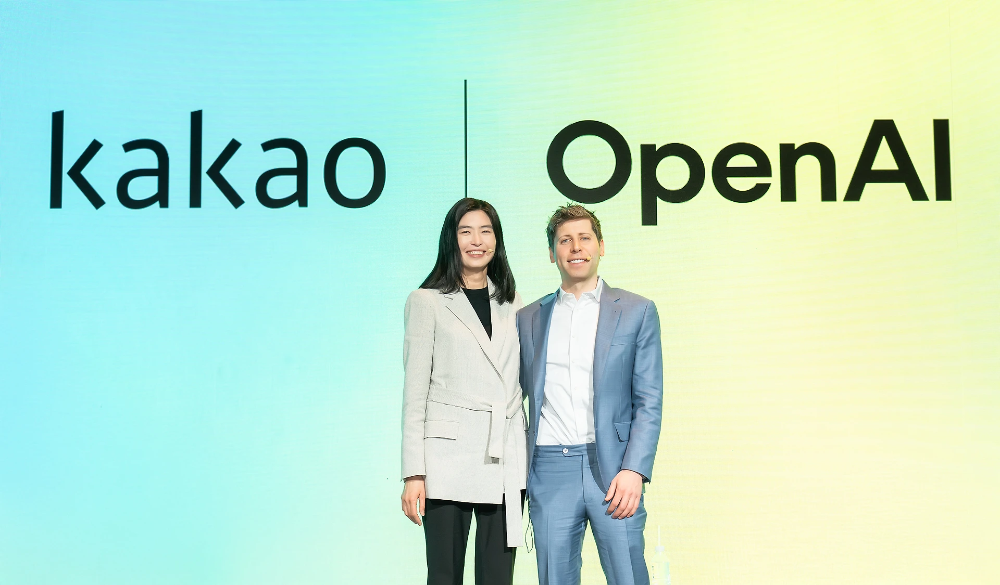
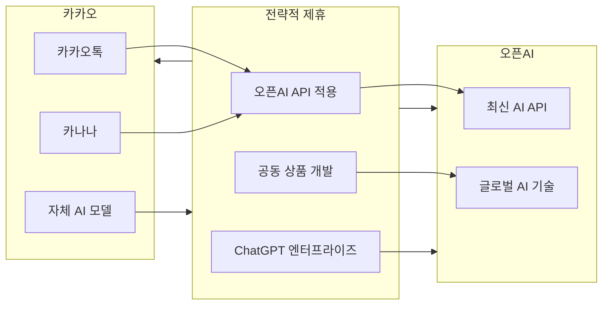
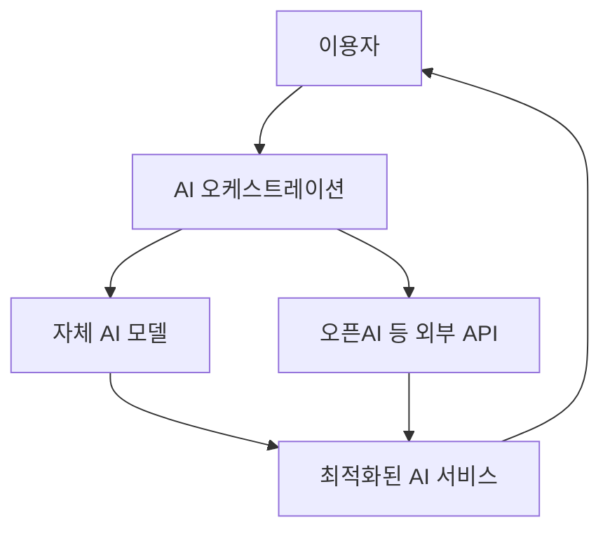

## 한눈에 보기

| 항목 | 내용 |
|------|------|
| **일정** | 2025년 2월 4일 |
| **장소** | 서울 중구 더플라자 |
| **참석** | 정신아(카카오 대표), 샘 올트먼(오픈AI CEO) |
| **성격** | 국내 최초 오픈AI 전략적 제휴(Strategic Collaboration) |
| **핵심** | 카카오톡·카나나에 오픈AI 최신 API 적용, ChatGPT 엔터프라이즈 도입, AI 오케스트레이션 강화, 공동 상품 개발 |

- 카카오는 2025년 2월 4일, 국내 최초로 오픈AI와 전략적 제휴를 발표했다.
- 카카오톡·카나나 등 주요 서비스에 오픈AI 최신 AI 기술(API)을 적용하고, ChatGPT 엔터프라이즈를 도입한다.
- 자체 모델과 외부 API를 조합하는 **AI 오케스트레이션** 전략을 강화하고, 공동 상품 개발로 AI 서비스 대중화를 앞당긴다.
- 공식 출처: [카카오 보도자료](https://www.kakaocorp.com/page/detail/11450?lang=KOR).

---

## 배경 및 발표 개요

### 발표 개요

- **일정·장소**: 2025년 2월 4일, 서울 더플라자 호텔
- **참석자**: 정신아(카카오 대표), 샘 올트먼(오픈AI CEO)
- **목적**: 더 많은 이용자가 쉽게 쓰는 **개인화된 AI**를 위한 기술 협력 및 공동 상품 개발 추진

카카오와 오픈AI는 2024년 9월부터 “AI 서비스 대중화”라는 공통 목표 아래 기술·서비스·사업 등 협력 방안을 논의해 왔고, 그 결과 2025년 2월 전략적 제휴 체결을 공식 발표했다. 이날 공동 기자간담회와 함께 두 대표의 파이어사이드 채팅(Fireside Chat)이 진행되어 협업 비전과 향후 방향성이 공유되었다.

### 전략적 제휴 구조

양사 협력 관계와 적용 영역을 다음 다이어그램으로 요약할 수 있다.

```mermaid
flowchart LR
  subgraph KakaoSide["카카오"]
    KakaoTalk["카카오톡"]
    Kanana["카나나"]
    InternalModel["자체 AI 모델"]
  end
  subgraph Collaboration["전략적 제휴"]
    APIApply["오픈AI API 적용"]
    JointProduct["공동 상품 개발"]
    Enterprise["ChatGPT 엔터프라이즈"]
  end
  subgraph OpenAISide["오픈AI"]
    LatestAPI["최신 AI API"]
    GlobalTech["글로벌 AI 기술"]
  end
  KakaoTalk --> APIApply
  Kanana --> APIApply
  InternalModel --> Collaboration
  APIApply --> LatestAPI
  JointProduct --> GlobalTech
  Enterprise --> OpenAISide
  Collaboration --> KakaoSide
  Collaboration --> OpenAISide
```

- **카카오 측**: 카카오톡, 카나나, 자체 AI 모델이 제휴의 주요 적용 대상이다.
- **제휴 내용**: 오픈AI 최신 API 적용, 공동 상품 개발, ChatGPT 엔터프라이즈 도입이 한 묶음으로 추진된다.
- **오픈AI 측**: 최신 API와 글로벌 AI 기술을 제공하며, 엔터프라이즈 솔루션으로 기업 환경까지 확장한다.

---

## 협력 범위와 적용

### 카카오톡·카나나에 오픈AI 기술 적용

- **카카오톡**: 오픈AI 최신 AI 기술(API)을 활용해 메신저 내 AI 경험을 고도화할 예정이다.
- **카나나(Kanana)**: 1:1 대화뿐 아니라 **그룹 대화에서도 맥락을 이해해 답변하는 AI 에이전트** 서비스로, 자체 언어모델과 오픈AI 모델을 함께 활용해 수준을 높인다.
- **ChatGPT 엔터프라이즈**: 카카오는 “AI 네이티브 컴퍼니” 전환 가속을 위해 ChatGPT 엔터프라이즈를 도입하기로 했으며, 엔터프라이즈급 보안·거버넌스 요구를 충족하는 환경에서 내부 활용을 확대할 계획이다.

### AI 오케스트레이션 전략 강화

카카오는 2024년 10월 개발자 컨퍼런스 if(kakaoAI)에서 **AI 모델 오케스트레이션** 전략을 공개한 바 있다. 자체 개발 AI 모델과 외부 우수 API를 **적재적소에 조합**해 이용자에게 최상의 서비스를 제공한다는 방향이다. 이번 오픈AI와의 제휴는 해당 전략을 한층 강화하는 사례다.

```mermaid
flowchart TB
  User["이용자"]
  Orchestration["AI 오케스트레이션"]
  Internal["자체 AI 모델"]
  External["오픈AI 등 외부 API"]
  Service["최적화된 AI 서비스"]
  User --> Orchestration
  Orchestration --> Internal
  Orchestration --> External
  Internal --> Service
  External --> Service
  Service --> User
```

- **내부 모델**: 카카오 자체 언어·에이전트 모델.
- **외부 API**: 오픈AI 최신 모델 API 등.
- **오케스트레이션**: 상황·업무에 맞는 모델 선택과 조합으로 품질·속도·확장성을 동시에 확보한다.

### 기술 협력을 넘어선 공동 상품 개발

양사는 단순 API 도입을 넘어 **공동 상품 개발**을 추진한다. 한국 이용자를 깊이 이해하는 카카오의 데이터·서비스 역량과, 글로벌 AI 기술력을 가진 오픈AI의 협업으로 국내 시장에 맞는 새로운 AI 상품과 경험을 만들 계획이다.

---

## 왜 중요한가

### 일상 접점에서의 AI 혁신

메신저·에이전트 등 **대규모 일상 접점**에 최첨단 AI를 통합함으로써, 실제 사용자 경험을 바꾼다는 점이 중요하다. “챗GPT를 써 본 적 있는 사람”을 넘어, 카카오 서비스를 쓰는 수많은 이용자가 자연스럽게 고도화된 AI를 접하게 되는 구조다.

### 오케스트레이션으로 얻는 이점

- **서비스 품질**: 상황에 맞는 최적 모델 선택으로 응답 품질·일관성 향상.
- **개발 속도**: 검증된 외부 API 활용으로 신규 기능·상품 출시 속도 확보.
- **확장성**: 트래픽·용도 증가에 대응한 유연한 아키텍처.

### 엔터프라이즈와 보안

ChatGPT 엔터프라이즈 도입은 **기업용 보안·거버넌스·정책** 요구를 충족하려는 움직임이다. B2B·내부 업무·민감 데이터 처리까지 고려한 AI 활용이 확대될 수 있다.

### 로컬과 글로벌의 결합

한국 사용자에 특화된 이해(카카오)와 글로벌 AI 경쟁력(오픈AI)을 결합해, **로컬라이제이션과 글로벌 수준 기술**을 동시에 갖추는 모델이다.

---

## 대표 발언 요지

### 오픈AI 샘 올트먼

- 카카오는 **기술이 일상을 풍요롭게 하는 방식**에 대한 깊은 이해를 갖고 있으며, 이용자에게 혁신적인 경험을 지속적으로 제공해 왔다.
- 카카오의 수많은 이용자에게 첨단 AI를 제공하고, 카카오 서비스에 기술을 통합해 **소통과 연결 방식을 혁신**하는 데 협력할 수 있게 되어 기쁘다는 취지로 발언했다.

### 카카오 정신아

- **글로벌 AI 선도 기업과의 협업**에 기대가 크다.
- 이번 제휴는 **오케스트레이션 전략의 고도화**는 물론, “필요한 미래를 더 가깝게 만들려는” 카카오의 노력에 **전환점**이 될 것이라고 강조했다.

---

## 시사점 정리

| 관점 | 요약 |
|------|------|
| **사용자** | 카카오톡·카나나 등 익숙한 서비스 안에서 고성능 AI를 더 쉽게 접할 전망이다. |
| **기업** | ChatGPT 엔터프라이즈 도입으로 보안·규정을 고려한 내부 AI 활용이 늘어날 수 있다. |
| **산업** | 국내 대형 플랫폼과 글로벌 AI 기업의 전략적 제휴 사례로, AI 대중화·로컬 적용 모델에 참고가 된다. |
| **기술** | 자체 모델과 외부 API의 오케스트레이션은 확장성·품질·비용 균형을 위한 전형적 패턴으로 자리 잡고 있다. |

---

## 참고 문헌

1. **카카오 보도자료** – [카카오, 국내 최초로 오픈AI와 전략적 제휴 체결](https://www.kakaocorp.com/page/detail/11450?lang=KOR) (2025-02-04, 카카오)
2. **영상** – [카카오 \| 오픈AI, 공동 기자간담회 현장 스케치 ① : 카카오 정신아 대표](https://www.youtube.com/watch?v=NCDuhNV60p8) (카카오 유튜브)
3. **영상** – [카카오 \| 오픈AI, 공동 기자간담회 현장 스케치 ② : Fireside Chat with Shina & Sam Altman](https://www.youtube.com/watch?v=WTB9SOALnZA) (카카오 유튜브)
