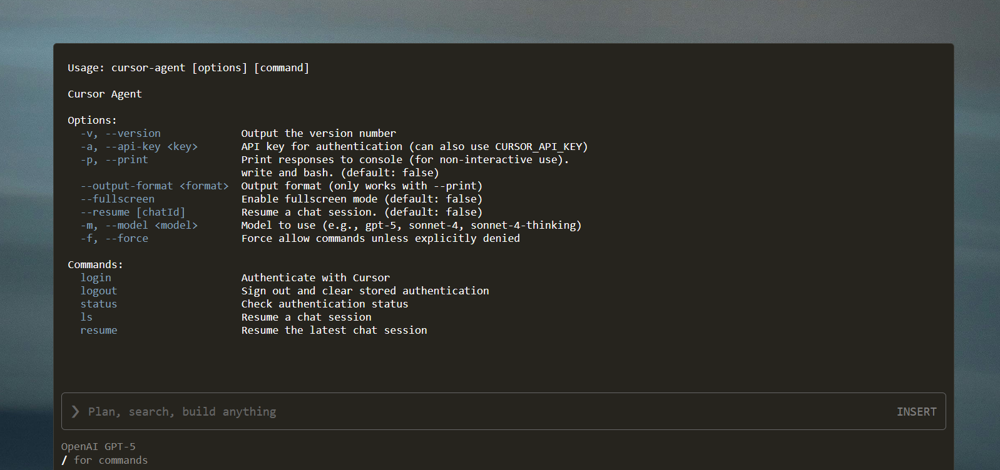

> 본 글은 공식 페이지 정보를 바탕으로 작성했습니다. 자세한 내용은 [Cursor CLI 공식 페이지](https://cursor.com/cli)를 참고하세요.



## 요약
- **한 줄 설치**: `curl https://cursor.com/install -fsS | bash`
- **동일한 명령 체계**: 터미널과 IDE 어디서나 같은 워크플로
- **최신 모델 액세스**: GPT-5, Claude, Gemini, Grok 등
- **실시간 조향**: 진행 중 에이전트에 즉시 개입·되돌리기
- **규칙 기반 커스터마이징**: Rules, AGENTS.md, MCP로 팀 규칙 적용

## 주요 특징
- **에이전트 편집 검토**: 터미널에서 코드 변경을 바로 확인·적용
- **실시간 스티어링**: `a`로 유지, `z`로 되돌리기, 좌·우로 파일 전환
- **멀티 IDE 통합**: Cursor, JetBrains, VSCode, Android Studio 등
- **자동화 스크립팅**: 문서 자동 업데이트, 보안 점검 트리거, 커스텀 에이전트
- **항상 최신 모델**: 공급자별 최신 모델을 즉시 사용

## 설치
아래 스크립트를 터미널에 붙여넣으면 설치가 시작됩니다.

```bash
curl https://cursor.com/install -fsS | bash
```

설치 후 CLI에서 `/`로 명령 팔레트를 열어 주요 명령을 탐색할 수 있습니다.

## 사용 예시
- 프로젝트 루트에서 CLI 실행 후 작업을 시작합니다.
- 진행 중 에이전트 작업을 실시간으로 조향하고 변경 사항을 터미널에서 검토합니다.
- 저장소에 `Rules`, `AGENTS.md`, MCP 구성을 버전 관리해 팀 워크플로를 표준화합니다.

## 인터랙티브 모드
대화형 세션을 시작해 목표를 설명하고, 제안된 변경을 검토하고, 명령 실행을 승인할 수 있습니다.

```bash
# 대화형 세션 시작
cursor-agent

# 초기 프롬프트를 바로 전달하여 시작
cursor-agent "refactor the auth module to use JWT tokens"
```

문서: [Interactive mode](https://docs.cursor.com/en/cli/overview)

## 비대화형(Non-interactive) 모드
스크립트, CI 파이프라인, 자동화에 적합한 인쇄 모드로 실행합니다.

```bash
# 특정 프롬프트와 모델 지정 실행
cursor-agent -p "find and fix performance issues" --model "gpt-5"

# Git 변경 내역을 포함해 보안 리뷰 요청, 텍스트 출력 형식
cursor-agent -p "review these changes for security issues" --output-format text
```

문서: [Non-interactive mode](https://docs.cursor.com/en/cli/overview)

## 세션 관리
이전 대화를 이어 받아 컨텍스트를 유지할 수 있습니다.

```bash
# 과거 채팅 나열
cursor-agent ls

# 최신 대화 재개
cursor-agent resume

# 특정 ID로 재개
cursor-agent --resume="chat-id-here"
```

문서: [Sessions](https://docs.cursor.com/en/cli/overview)

## 워크플로 통합 포인트
- **일관성**: IDE와 터미널 어디서나 동일한 명령 세트를 유지
- **재현성**: 규칙과 설정을 코드로 관리하여 팀 단위 자동화 확장
- **보안**: 공식 문서에 명시된 보안 정책과 SOC 2 인증 기반 운영

## 참고 링크
- [Cursor CLI 공식 페이지](https://cursor.com/cli)
- [Cursor CLI 문서: Overview](https://docs.cursor.com/en/cli/overview)
- 설치 스니펫: `curl https://cursor.com/install -fsS | bash`
- 문의: `hi@cursor.com`


