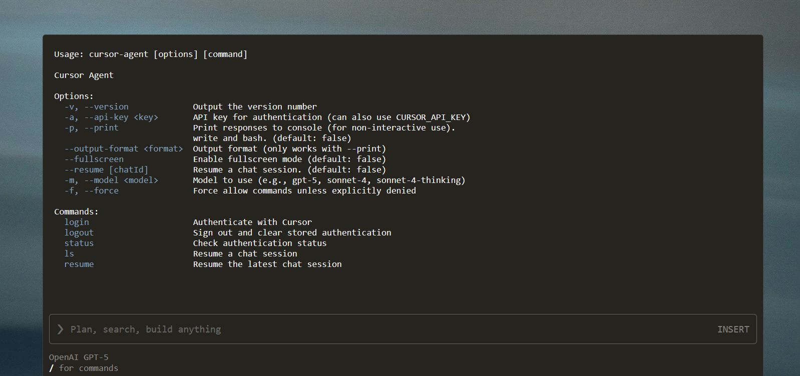
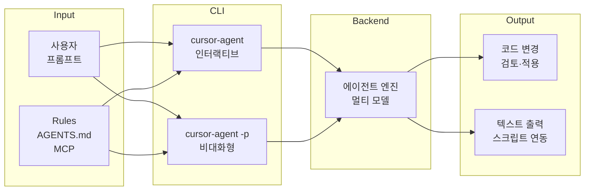

> 본 글은 [Cursor CLI 공식 페이지](https://cursor.com/cli)와 문서를 바탕으로 작성했습니다. 최신 정보는 공식 사이트를 참고하세요.



## 개요

### 한눈에 보기

Cursor CLI는 **터미널에서 바로 코딩 에이전트를 실행**할 수 있는 공식 CLI 도구다. IDE(Cursor, VSCode, JetBrains, Android Studio 등)와 터미널 어디서나 **동일한 명령 체계**를 유지하며, GPT-5·Claude·Gemini·Grok 등 **프론티어 모델**에 즉시 접근할 수 있다.

- **한 줄 설치**: `curl https://cursor.com/install -fsS | bash`
- **동일한 명령 체계**: 터미널과 IDE에서 같은 워크플로
- **최신 모델 액세스**: Anthropic, OpenAI, Gemini, Cursor 등 다중 공급자
- **실시간 조향**: 진행 중 에이전트에 즉시 개입·되돌리기
- **규칙 기반 커스터마이징**: Rules, AGENTS.md, MCP로 팀 규칙 적용

### 추천 대상

- 터미널·SSH 환경에서도 에이전트 기반 개발을 쓰고 싶은 개발자
- CI/CD·스크립트에 헤드리스 에이전트를 넣고 싶은 팀
- 여러 IDE를 쓰면서도 일관된 에이전트 경험을 원하는 사용자
- 문서 자동 갱신, 보안 리뷰 트리거, 커스텀 에이전트 등 **자동화**를 설계하는 경우

---

## 설치

아래 한 줄을 터미널에 붙여넣으면 설치가 시작된다.

```bash
curl https://cursor.com/install -fsS | bash
```

설치가 끝나면 CLI에서 **`/`** 로 명령 팔레트를 열어 주요 명령을 탐색할 수 있다. Windows·macOS·Linux를 공식 지원한다.

---

## 핵심 기능

### 에이전트 편집 검토

터미널에서 에이전트가 제안한 **코드 변경을 바로 확인·적용**할 수 있다. 변경된 파일을 좌우 키로 전환하며 diff를 보고, 적용(a) 또는 되돌리기(z)로 결과를 제어할 수 있다.

### 실시간 스티어링

- **`a`**: 제안 유지·적용
- **`z`**: 제안 되돌리기
- **좌·우 키**: 파일 전환

진행 중인 에이전트 작업에 **즉시 개입**할 수 있어, 방향을 바꾸거나 특정 변경만 골라 적용하기 쉽다.

### 멀티 IDE 통합

Cursor, JetBrains, VSCode, Android Studio 등 **선호 IDE**에서 그대로 사용할 수 있다. 환경이 바뀌어도 동일한 에이전트·규칙·세션을 쓸 수 있다.

### 자동화·스크립팅

- 문서 자동 업데이트
- 보안 점검 트리거
- 커스텀 에이전트 구축

공식 문서에서는 Headless CLI, Shell Mode, GitHub Actions 연동 가이드를 제공한다.

### 항상 최신 모델

공급자별 **최신 프론티어 모델**을 별도 설정 없이 선택해 쓸 수 있다. `/model` 로 Auto, Composer, Opus, Codex, Gemini, Grok 등을 전환할 수 있다.

---

## 사용 흐름 개요

아래 다이어그램은 Cursor CLI의 **전형적인 사용 흐름**을 단순화한 것이다. 인터랙티브 모드와 비대화형 모드 모두 터미널·스크립트에서 동일한 에이전트 엔진을 사용한다.


```mermaid
flowchart LR
    subgraph Input
        A["사용자</br>프롬프트"]
        B["Rules</br>AGENTS.md</br>MCP"]
    end
    subgraph CLI
        C["cursor-agent</br>인터랙티브"]
        D["cursor-agent -p</br>비대화형"]
    end
    subgraph Backend
        E["에이전트 엔진</br>멀티 모델"]
    end
    subgraph Output
        F["코드 변경</br>검토·적용"]
        G["텍스트 출력</br>스크립트 연동"]
    end
    A --> C
    A --> D
    B --> C
    B --> D
    C --> E
    D --> E
    E --> F
    E --> G
```

- **노드 ID**: 공백 없이 camelCase·단어 조합 사용, 예약어 미사용
- **라벨**: 줄바꿈은 `</br>` 사용

---

## 인터랙티브 모드

대화형 세션을 열어 **목표를 설명**하고, 제안된 변경을 **검토**한 뒤, **명령 실행을 승인**하는 방식이다. 터미널에서 대화하듯 에이전트를 쓰고 싶을 때 적합하다.

```bash
# 대화형 세션 시작
cursor-agent

# 초기 프롬프트를 바로 전달하여 시작
cursor-agent "refactor the auth module to use JWT tokens"
```

문서: [Cursor CLI Overview](https://cursor.com/docs/cli/overview)

---

## 비대화형(Non-interactive) 모드

스크립트, CI 파이프라인, **자동화**에 맞는 모드다. 프롬프트와 모델을 인자로 넘기면 **인쇄 가능한 텍스트**로 결과를 받을 수 있다.

```bash
# 특정 프롬프트와 모델 지정 실행
cursor-agent -p "find and fix performance issues" --model "gpt-5"

# Git 변경 내역을 포함해 보안 리뷰 요청, 텍스트 출력
cursor-agent -p "review these changes for security issues" --output-format text
```

문서: [Non-interactive mode](https://cursor.com/docs/cli/overview)

---

## 세션 관리

이전 대화를 **이어 받아** 컨텍스트를 유지할 수 있다.

```bash
# 과거 채팅 나열
cursor-agent ls

# 최신 대화 재개
cursor-agent resume

# 특정 ID로 재개
cursor-agent --resume="chat-id-here"
```

문서: [Sessions](https://cursor.com/docs/cli/overview)

---

## 워크플로 통합 포인트

| 관점 | 설명 |
|------|------|
| **일관성** | IDE와 터미널 어디서나 동일한 명령 세트·규칙을 유지 |
| **재현성** | Rules, AGENTS.md, MCP 구성을 코드로 관리해 팀 단위 자동화 확장 |
| **보안** | 공식 문서에 명시된 보안 정책·SOC 2 인증 기반 운영 |

프로젝트 루트에서 CLI를 실행하고, Rules·AGENTS.md·MCP를 버전 관리에 넣으면 **팀 전체가 같은 에이전트 규칙**을 쓰게 할 수 있다.

---

## 사용 시나리오 요약

1. **프로젝트 루트에서 CLI 실행** 후 작업 지시를 입력한다.
2. **진행 중 에이전트 작업**을 실시간으로 조향하고, 변경 사항을 터미널에서 검토·적용한다.
3. **저장소에 Rules, AGENTS.md, MCP 구성**을 커밋해 워크플로를 표준화한다.
4. **CI/스크립트**에서는 `cursor-agent -p "..."` 로 헤드리스 리뷰·리팩터링·문서 갱신을 트리거한다.

---

## 참고 문헌 및 링크

- [Cursor CLI 공식 페이지](https://cursor.com/cli) — 소개, 설치 스니펫, 학습 링크
- [Cursor CLI 문서: Overview](https://cursor.com/docs/cli/overview) — 인터랙티브·비대화형 모드, 세션
- [Cursor Docs – Get started with Cursor CLI](https://cursor.com/docs/cli/overview) — 설치 가이드, 에이전트, MCP 통합

설치 한 줄: `curl https://cursor.com/install -fsS | bash`  
문의: hi@cursor.com
