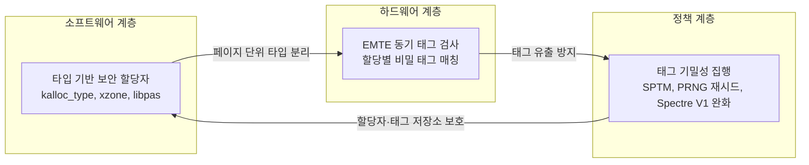
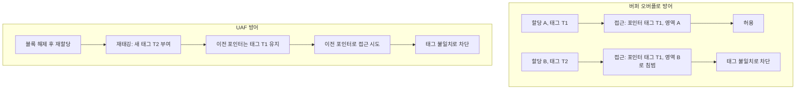

메모리 안전은 현대 소비자 운영체제 보안의 마지막 난제다. Apple은 A12에서의 PAC 도입, iOS 15의 kalloc_type, iOS 17의 xzone malloc을 거쳐, 2025년 iPhone 17·A19 세대에서 **Memory Integrity Enforcement(MIE)**를 공개했다. MIE는 Enhanced Memory Tagging Extension(EMTE)의 동기 태그 검사와 타입 기반 보안 할당자, 태그 기밀성 집행을 깊게 통합해 커널을 포함한 핵심 공격 면에 **상시(on by default)** 메모리 안전을 제공한다. 본 글은 MIE의 설계 배경과 원리, 성능·보안 트레이드오프, Android MTE 대비 차별점을 정리한다.

## 한눈에 보기

- **핵심**: MIE는 타입 기반 보안 할당자(kalloc_type, xzone malloc, WebKit libpas)와 **EMTE(Enhanced MTE)**의 **동기 태그 검사**, 그리고 **Tag Confidentiality Enforcement(태그 기밀성 집행)**을 결합한, iPhone 17 및 iPhone Air 세대의 **상시(on-by-default) 메모리 안전** 체계다.
- **효과**: 버퍼 오버플로·사용후해제(UAF) 같은 대표적 메모리 오류가 태그 불일치로 즉시 차단되며, 커널을 포함한 주요 공격 면에서 **공격 난이도와 비용을 급격히 상승**시킨다.
- **성능**: 페이지(16KB) 단의 타입 분리와 **동적 소용량 할당에만 정밀하게 EMTE를 적용**하는 아키텍처로 **체감 오버헤드를 최소화**한다.
- **차별점**: 단순 "디버깅용 MTE"가 아니라, **동기식·상시·플랫폼 통합형**으로 설계되어 OS·실리콘·프레임워크에 깊게 녹아 있다.
- **개발자**: Xcode의 Enhanced Security 설정을 통해 EMTE를 포함한 보호를 앱 단위로 시험할 수 있다.

## MIE 설계 구조 개요

MIE는 소프트웨어(타입 기반 할당자)와 하드웨어(EMTE), 그리고 태그 기밀성 정책이 한 번에 맞물려 동작한다. 아래 다이어그램은 이 세 요소의 관계를 요약한다.

- **노드 ID**: camelCase·일반 단어 사용, 예약어 미사용.
- **라벨**: 특수문자·등호 없음으로 규칙 준수. 줄바꿈은 ` ` 사용.

## 왜 필요한가: 메모리 안전과 공격 현실

메모리 안전 결함은 플랫폼을 가리지 않고 고가의 공격 체인에서 반복 활용된다. Apple은 언어 차원의 안전성(Swift)과 함께 **배치(placement) 자체를 통제하는 타입 기반 할당자**로 소프트웨어 방어선을 끌어올렸고, 여기에 **하드웨어 태깅(EMTE)**을 결합해 **같은 타입 버킷 내부의 미세한 충돌까지 방지**한다. 목표는 디버깅의 편의가 아니라, **현실 공격자에게 실질적 제약을 강제**하는 것이다.

## 설계 개요: 소프트웨어와 하드웨어의 결합

### 1) 타입 기반 보안 할당자

서로 다른 타입은 **페이지 수준**에서 분리되어 교차 오염을 어렵게 한다. kalloc_type(커널), xzone malloc(유저랜드), WebKit libpas가 대표 사례다. 동일 타입 버킷 내부 충돌은 페이지 단위 보호만으로는 부족하므로, EMTE로 보완한다.

### 2) EMTE(Enhanced Memory Tagging Extension)

각 할당에 비밀 태그를 부여하고, **액세스 시 태그 일치**를 하드웨어가 동기식으로 검사한다. 인접 블록은 **서로 다른 태그**를 사용하므로, 범위를 벗어난 접근은 즉시 차단된다. 해제 후 재할당 시 **재태깅(retagging)**되어 UAF(Use-After-Free)를 차단한다.

### 3) Tag Confidentiality Enforcement

태그 유출을 막기 위해 커널 백킹 스토어와 태그 저장소를 **Secure Page Table Monitor(SPTM)**로 보호하고, **PRNG 자주 재시드**로 태그 예측을 어렵게 하며, **추측실행(Spectre V1) 완화**를 타입 분리 아이디어(TDI 유사)로 저비용 구현한다.

## EMTE는 무엇이 다른가: 동기 vs 비동기, 태그 비기밀성의 봉쇄

- **동기 검사만 채택**: 비동기 모드는 탐지-중단 사이의 레이스 윈도우가 있어 실전 방어에 취약하다. MIE는 **항상 동기식**으로 예외를 일으켜 즉시 중단·로깅한다.
- **비태그 메모리 접근 방어**: 원래 MTE는 전역 등 비태그 영역 접근을 검사하지 않는다. **EMTE는 태그된 영역에서 비태그 메모리 접근에도 해당 영역의 태그 지식이 요구**되도록 명세·구현해, 태깅 회피 경로를 차단한다.
- **커널 대리 접근 동일 규칙**: 커널이 앱을 대신해 메모리에 접근하는 경우에도 동일한 태그 검사 규칙을 강제한다.

## 무엇을 실제로 막는가: 두 대표 시나리오

아래 흐름은 버퍼 오버플로와 UAF 시에 MIE가 어떻게 개입하는지 단순화한 것이다.

- **버퍼 오버플로**: 인접 할당 간 태그가 다르므로, **경계를 넘는 접근은 태그 불일치로 차단**된다.
- **사용후해제(UAF)**: 해제된 블록은 **재태깅**되어, 이전 포인터로의 접근은 **오래된 태그**로 인해 거부된다.

## 성능 공학: 어디에 얼마나 적용되는가

EMTE 태그 검사는 비용이 있으므로, MIE는 **타입 분리로 가능한 범위를 먼저 소프트웨어로 방어**하고, **남는 미세 충돌 영역(동적·소용량)만 EMTE로 정밀 방어**한다. Apple은 OS가 어디에서 태그 검사를 필요로 하는지 **정확히 모델링**하고, **A19/A19 Pro** 실리콘에서 이를 감당하도록 **태그 저장 메모리·CPU 영역·속도**를 설계했다. 그 결과 **상시·동기 검사**를 유지하면서도 **사용자 체감 성능 저하를 최소화**했다. EMTE가 없는 이전 기기에도 **타입 기반 할당자**를 통해 상당한 보호가 즉시 제공된다.

## 보안 평가: 공격자 모델에 미치는 파급효과

2020~2025년 내부 오펜시브 분석으로 과거 실전 체인과 최근 취약점을 **MIE 환경에서 재구성**해본 결과, **연쇄 단계의 근본적 차단으로 체인 복원이 불가능**해졌다. 일부 **할당 내부(intra-allocation) 오버플로**만이 제한적으로 생존하지만, **실용적 익스플로잇으로 발전하기 어렵다**. EMTE가 열어둘 수 있는 마지막 통로였던 **Spectre V1**도 저비용 완화로 **유의미한 연쇄 가능성에 25개 이상의 V1 시퀀스가 필요**한 수준까지 약화됐다.

## Android MTE와의 비교 포인트

- **옵트인 vs 상시 적용**: Android는 위험 사용자 대상 옵트인 프로그램이 중심인 반면, MIE는 **플랫폼 차원의 상시 보호**다.
- **OS 통합의 깊이**: EMTE는 **OS·할당자·실리콘**이 맞물린 설계로, 단순 태깅 도입과는 수준이 다르다.
- **태그 기밀성**: StickyTags, TikTag 등으로 보고된 **태그 유출형 사이드채널**을 실리콘 단계부터 고려해 설계했다.

## 개발자와 조직을 위한 체크리스트

- **Xcode → Enhanced Security**로 앱에서 EMTE를 시험하고, 크래시/로그를 분석한다.
- **Swift 도입·리라이팅**: 신규 코드 및 핵심 컴포넌트는 메모리 안전 언어를 기본값으로.
- **할당자 사용 점검**: 타입 기반 보안 할당자 사용을 확인하고, 커스텀 할당은 최소화한다.
- **UAF/OOB 취약 클래스 집중 개선**: 해제 후 사용, 범위 초과 접근을 우선 제거한다.
- **사이드채널 인식**: 타이밍/추측실행 기반 정보 유출 테스트를 CI에 통합한다.

## 자주 묻는 질문(FAQ)

- **Q. MIE는 어떤 기기에서 활성화되나?**
  - **A.** EMTE는 **A19/A19 Pro** 기반의 iPhone 17·iPhone Air에서 하드웨어 지원과 함께 작동한다. 이전 기기는 **타입 기반 보안 할당자**로부터 상당한 보호를 받는다.

- **Q. 성능 영향은?**
  - **A.** EMTE 적용 범위를 정밀하게 한정하고, 실리콘·OS를 공동 설계해 **상시·동기 검사에도 체감 오버헤드는 낮다**.

- **Q. 개발자는 무엇을 할 수 있나?**
  - **A.** Xcode의 **Enhanced Security**로 테스트하고, Swift를 채택하며, UAF/OOB 제거와 타입 기반 할당자 사용을 보편화한다.

## 맺음말

MIE는 **메모리 안전을 플랫폼 기본값**으로 끌어올리는 시도다. **타입 분리 + 동기 태깅 + 태그 기밀성**의 삼중 설계로, 공격자의 자유도를 핵심 단계에서 줄이고 **실전 체인을 구조적으로 파괴**한다. 이는 메모리 결함이 지배하던 지난 25년의 익스플로잇 풍경을 재편할 잠재력이 있다.

## 참고 문헌

- [Apple Security Research — Memory Integrity Enforcement](https://security.apple.com/blog/memory-integrity-enforcement/) — MIE 공식 발표 및 설계·보안 평가 요약.
- [Towards the next generation of XNU memory safety: kalloc_type](https://security.apple.com/blog/towards-the-next-generation-of-xnu-memory-safety/) — 타입 기반 커널 할당자 배경 및 메모리 안전 분류.
- [Enabling enhanced security for your app — Apple Developer](https://developer.apple.com/documentation/xcode/enabling-enhanced-security-for-your-app) — Xcode에서 Enhanced Security·EMTE 시험 방법.
- [Spectre Attacks: Exploiting Speculative Execution](https://spectreattack.com/spectre.pdf) — Spectre V1 등 추측실행 공격 배경.
