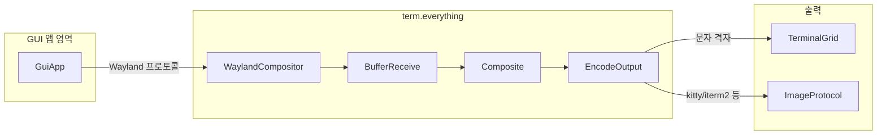

## 개요

### 이 포스트에서 다루는 것

**term.everything**은 리눅스에서 GUI 애플리케이션의 창을 모니터가 아닌 **터미널**에 그려 주는, 자체 제작 Wayland 컴포지터 기반의 오픈소스 도구다. “터미널만 있어도 GUI를 쓸 수 있는가?”라는 질문에 대한 실험적이면서도 실용적인 답으로, SSH·원격 서버·데모 환경에서 X 포워딩이나 VNC 없이 데스크톱 앱을 실행·조작할 수 있게 한다.

### 핵심 정보 한눈에

| 항목 | 내용 |
|------|------|
| **무엇** | 터미널에서 GUI 창을 렌더링하는 Wayland 컴포지터 |
| **플랫폼** | Linux (X11·Wayland 호스트 모두 지원) |
| **전송** | 로컬·SSH 모두 동작, 원격 터미널에서도 사용 가능 |
| **출력 방식** | 터미널 문자 격자 또는 kitty·iTerm2 등 이미지 프로토콜(SIXELS 등) |
| **상태** | 베타 — 일부 앱은 실행 실패·크래시 가능 |
| **라이선스** | AGPL-3.0 |
| **저장소** | [mmulet/term.everything](https://github.com/mmulet/term.everything) |

### 추천 대상

- 원격 리눅스 서버에서 가끔 GUI 도구(브라우저, 파일 매니저, 설정 UI)를 써야 하는 사용자  
- X 포워딩·VNC 설정 없이 터미널만으로 데모·강의·시연을 하고 싶은 사람  
- “터미널용 뷰어를 또 만들지 말고, 기존 GUI 앱을 터미널에서 쓰자”는 접근에 관심 있는 개발자  

---

## 왜 흥미로운가

리눅스 서버나 원격 환경에서는 “GUI가 꼭 필요한데 X 포워딩·VNC는 번거롭다”는 상황이 자주 있다. **term.everything**은 터미널이 있는 어디서든 GUI를 가져올 수 있게 하고, SSH를 통해 화면·데모·간단한 조작을 빠르게 공유할 수 있게 한다. 또한 “터미널용 파일 뷰어를 새로 만들지 말고, 이미 있는 파일 매니저를 터미널에서 그대로 쓰자”는 재치 있는 문제의식도 담고 있어, 기술적 실험과 실용성을 함께 다룬다.

---

## 동작 원리와 구조

### 개념 요약

- **Wayland 컴포지터 내장**: 프로젝트 자체가 Wayland 컴포지터로 동작하며, 외부 디스플레이 서버 없이 앱 창 버퍼를 직접 수신·합성한다.  
- **터미널로 출력**: 합성된 결과를 터미널의 문자 격자(예: chafa 기반) 또는 이미지 프로토콜(kitty·iTerm2 등)을 이용해 렌더링한다.  
- **해상도·성능 트레이드오프**: 터미널 행·열을 늘리면 화질은 좋아지지만 프레임 레이트가 낮아질 수 있다. 이미지 지원 터미널에서는 고해상도 출력이 가능하나 대역폭·CPU 비용이 커질 수 있다.

### 처리 흐름 (구조)

아래 다이어그램은 GUI 앱이 터미널에 그려지기까지의 흐름을 단순화한 것이다.



- **GuiApp**: 실행된 GUI 애플리케이션.  
- **WaylandCompositor**: 내장 Wayland 컴포지터.  
- **BufferReceive → Composite → EncodeOutput**: 창 버퍼 수신, 합성, 터미널용 인코딩(문자 또는 이미지).  
- **TerminalGrid** / **ImageProtocol**: 터미널 행·열 격자 출력 또는 kitty·iTerm2 등 이미지 프로토콜 출력.

자세한 구현 내막은 저장소의 기술 기록을 참고하면 된다. [HowIDidIt.md](https://github.com/mmulet/term.everything/blob/main/resources/HowIDidIt.md) (동일 저장소 내 리소스).

---

## 설치와 실행

### 기본 절차

1. **바이너리 다운로드**  
   [Releases](https://github.com/mmulet/term.everything/releases)에서 정적 실행 파일(현재 Alpine Linux 기반 단일 바이너리)을 내려받는다.  
2. **실행 권한 부여**  
   파일명이 길므로, 권한 부여 후 필요하면 짧은 이름으로 변경해 사용한다.  
   ```bash
   chmod +x term.everything❗mmulet.com-dont_forget_to_chmod_+x_this_file
   mv ./term.everything❗mmulet.com-dont_forget_to_chmod_+x_this_file ./term.everything
   ```  
3. **실행**  
   예: Firefox를 터미널에서 띄우기.  
   ```bash
   ./term.everything firefox
   ```

### 터미널 선택

- **kitty**, **iTerm2** 등 이미지 프로토콜(SIXELS 등)을 지원하는 터미널을 쓰면 더 높은 해상도와 품질을 기대할 수 있다.  
- 일반 터미널에서는 문자 격자로 출력되며, 해상도와 프레임 레이트는 터미널 크기와 성능에 따라 달라진다.

---

## 호환성과 제약

| 구분 | 내용 |
|------|------|
| **플랫폼** | Linux 전용. 호스트가 X11이든 Wayland든 동작하도록 설계됨. |
| **전송** | SSH 상에서도 동작. 네트워크·터미널 성능에 따라 지연·프레임이 달라질 수 있음. |
| **앱 호환성** | 베타 단계. 일부 앱은 실행 실패·크래시 가능. 문제 시 [이슈](https://github.com/mmulet/term.everything/issues) 리포트 권장. |
| **빌드** | 최신 버전은 Go와 소량의 C로 작성되어 있으며, 이전에는 TypeScript(Bun)·C++ 조합이 사용되기도 했다. |

---

## 활용 시나리오

- **원격 서버**: 브라우저·파일 매니저·도구 UI를 터미널만으로 잠깐 띄워 확인.  
- **라이브 데모·강의**: X11/VNC 설정 부담 없이 GUI를 터미널 스트림으로 공유.  
- **최소 권한 SSH**: 가벼운 UI 상호작용만 필요할 때 데스크톱 환경 없이 사용.

---

## 로드맵과 기술 스택

저장소에서 제시하는 로드맵은 대략 다음과 같다.

1. **Term some things** — 현재 단계 (일부 앱만 안정 동작).  
2. **Term most things** — 대부분의 앱 지원 목표.  
3. **Term everything** — 최종 목표.

기술 스택은 버전에 따라 다르며, 최근 릴리스는 **Go + 소량 C**로 정적 바이너리 제공으로 이식성·빌드 단순화를 꾀하고 있다. 과거에는 TypeScript(Bun)와 C++이 혼합되어 있었다.

---

## 종합 평가

### 장점

- **설정 최소화**: X 포워딩·VNC·별도 디스플레이 서버 없이 터미널만으로 GUI 실행.  
- **SSH 친화적**: 원격 리눅스에서 SSH 세션 안에서 바로 GUI 앱 사용·데모 가능.  
- **오픈소스·실험적 가치**: Wayland 컴포지터를 터미널 출력과 결합한 접근이 독특하고, 학습·기여 대상으로 적합.  
- **단일 바이너리**: 최신 배포는 정적 실행 파일 하나로 배포·실행이 단순함.

### 단점·주의점

- **베타**: 일부 앱은 실행 실패·크래시 가능. 프로덕션 필수 환경에는 부적합할 수 있음.  
- **성능·해상도 트레이드오프**: 터미널 해상도·이미지 프로토콜 사용에 따라 프레임·대역폭 부담이 커질 수 있음.  
- **Linux 전용**: Windows·macOS에서는 SSH로 리눅스에 접속한 뒤에만 사용 가능.

### 한 줄 평

터미널만 있어도 GUI를 쓸 수 있게 해 주는 실험적이면서도 실용적인 Wayland 컴포지터로, SSH·원격·데모 환경에서 가볍게 써 보기 좋다.

---

## 참고 문헌

1. **term.everything 저장소** — [https://github.com/mmulet/term.everything](https://github.com/mmulet/term.everything)  
2. **릴리스 및 사용법** — [Releases](https://github.com/mmulet/term.everything/releases)  
3. **구현 기술 기록** — [HowIDidIt.md](https://github.com/mmulet/term.everything/blob/main/resources/HowIDidIt.md) (저장소 내 리소스)
