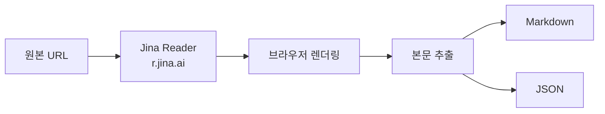

## 개요

**Jina AI Reader**는 웹 콘텐츠를 LLM이 이해하기 쉬운 입력으로 바꾸는 도구다. 어떤 URL이든 앞에 `https://r.jina.ai/`를 붙여 요청하면, Jina 측에서 브라우저로 렌더링한 뒤 읽기 좋은 **마크다운**으로 돌려준다. PDF도 지원하며, 스트리밍·JSON 모드, 이미지 캡션, SPA 대기 등 옵션이 풍부해 에이전트·RAG·리서치 파이프라인에 바로 끼워 넣기 좋다.

**추천 대상**
- LLM 에이전트·오토메이션에서 URL 본문을 안정적으로 추출해야 하는 개발자
- RAG(검색 증강 생성) 전처리로 크롤링·정제·임베딩을 단순화하고 싶은 팀
- 여러 기사·문서를 일관된 마크다운으로 받아 비교·요약하는 리서치 활용자

---

## 동작 흐름

Reader는 URL을 받아 브라우저 엔진으로 렌더링한 뒤, 본문을 추출해 마크다운 또는 JSON으로 반환한다. 전체 흐름은 아래와 같다.



- **Read 모드**: `https://r.jina.ai/{대상 URL}` → 마크다운(기본) 또는 `Accept` 헤더로 JSON·스트리밍 선택.
- **Search 모드**: `https://s.jina.ai/{검색 쿼리}` → 상위 결과를 읽어 요약된 형태로 제공.

---

## 왜 유용한가

- **입력 품질 향상**: 원문의 레이아웃·광고·스크립트 등 노이즈를 제거하고 핵심 본문만 마크다운으로 정제해, 에이전트·RAG의 정확도와 일관성을 높인다.
- **브라우저 이슈 대신 처리**: SPA·동적 로딩·이미지 캡션 등 브라우저 의존 영역을 서버에서 처리하므로, 클라이언트 코드를 단순하게 유지할 수 있다.
- **무료·오픈소스**: 공개 인프라(`r.jina.ai`, `s.jina.ai`)와 [GitHub 저장소](https://github.com/jina-ai/reader)가 함께 제공되어, 확장·자체 호스팅이 가능하다.

---

## 핵심 기능 한눈에 보기

| 구분 | 설명 |
|------|------|
| **Read** | `https://r.jina.ai/https://your.url` 로 어떤 URL이든 LLM 친화적 마크다운으로 변환 |
| **Search** | `https://s.jina.ai/your+query` 로 웹 검색 결과 상위 5건을 읽고 요약된 형태로 제공 |
| **이미지 캡션** | `X-With-Generated-Alt: true` 로 이미지에 자동 캡션 주입 |
| **스트리밍** | `Accept: text/event-stream` 으로 점진적 수신, 마지막 청크가 가장 완전함 |
| **JSON 모드** | `Accept: application/json` 으로 단순 JSON 응답 |
| **응답 형식** | `x-respond-with: markdown`(기본), `text`, `html`, `screenshot` 등 |
| **SPA 대응** | `x-wait-for-selector`, `x-timeout` 등으로 동적 로딩·해시 라우팅 페이지 대기 |
| **기타** | `x-proxy-url`, `x-no-cache`, 토큰 예산·타임아웃 등 풍부한 헤더 옵션 |

---

## 빠르게 시작하기

### 단일 URL 읽기

```text
https://r.jina.ai/https://en.wikipedia.org/wiki/Artificial_intelligence
```

### 웹 검색(상위 5건 자동 읽기)

```text
https://s.jina.ai/Who%20will%20win%202024%20US%20presidential%20election%3F
```

### 스트리밍 / JSON / 이미지 캡션(cURL)

```bash
curl -H "Accept: text/event-stream" "https://r.jina.ai/https://example.com"
curl -H "Accept: application/json" "https://r.jina.ai/https://example.com"
curl -H "X-With-Generated-Alt: true" "https://r.jina.ai/https://example.com"
```

### SPA·동적 로딩 페이지

```bash
curl -H "x-timeout: 30" "https://r.jina.ai/https://example.com"
curl -H "x-wait-for-selector: #content" "https://r.jina.ai/https://example.com"
```

---

## 실전 활용 팁

### 북마클릿(현재 페이지를 Reader로 열기)

브라우저 주소창에 북마클릿으로 저장해 두고, 읽고 싶은 페이지에서 실행하면 해당 URL이 Reader를 거친 결과로 열린다.

```javascript
javascript:(function(){window.location.href = "https://r.jina.ai/" + document.URL;})()
```

### macOS Automator 서비스(우클릭 → 서비스에서 실행)

선택한 URL을 Reader URL로 바꿔 기본 브라우저로 연다. [긱뉴스 댓글](https://news.hada.io/topic?id=14498)에서 소개된 방식이다.

```applescript
on run {input, parameters}
  try
    set selectedURL to item 1 of input
    set finalURL to "https://r.jina.ai/" & selectedURL
    tell application "System Events"
      open location finalURL
    end tell
  on error errMsg
    display dialog "Error: " & errMsg
  end try
  return input
end run
```

---

## 사용 시나리오와 제한 사항

**추천 시나리오**
- **에이전트/오토메이션**: 브라우저 제어 없이 안정적인 본문 추출이 필요할 때
- **RAG 파이프라인**: 크롤링 → 정제 → 임베딩 전처리를 한 단계로 단순화할 때
- **리서치/요약**: 다수의 기사·문서를 일관된 마크다운으로 받아 비교·요약할 때

**주의·제한**
- 로그인·인증이 필요한 페이지는 지원하지 않는다.
- 동일 URL은 일정 시간(예: 5분) 캐시되며, 최신화가 필요하면 `x-no-cache` 등 옵션을 활용한다.
- 복잡한 SPA는 `x-wait-for-selector`, `x-timeout` 조합으로 대기 시간을 늘려 보는 것이 좋다.

---

## 참고 문헌

1. [Jina AI Reader - URL을 LLM 친화적인 입력으로 바꿔주는 도구 (GeekNews)](https://news.hada.io/topic?id=14498)
2. [GitHub - jina-ai/reader](https://github.com/jina-ai/reader)
3. [Jina Reader API 공식 문서](https://jina.ai/reader/)
