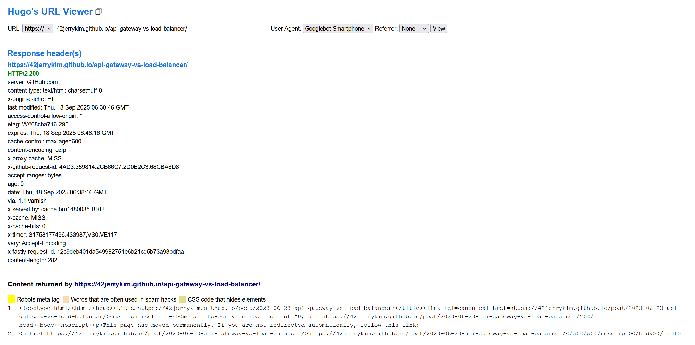

Hugo URL Viewer는 입력한 URL을 지정한 사용자 에이전트(User Agent)와 리퍼러(Referrer)로 열어 보는 간단한 웹 도구다. Googlebot(모바일/데스크톱), Bingbot, 일반 브라우저(Chrome/Firefox/Edge)를 선택해 크롤러 관점과 사용자 관점의 응답 차이를 빠르게 확인할 수 있다.

공식 사이트: [Hugo's URL Viewer](https://view.hugo-decoded.be)

## 무엇을 할 수 있나

- 스킴 선택: `https://`, `http://`
- URL 입력: `example.com` 형태로 대상 주소 입력
- 사용자 에이전트 선택: "Googlebot Smartphone"(기본값), "Googlebot Desktop", "Bingbot", "Chrome", "Firefox", "Edge"
- 리퍼러 선택: "Google", "Bing", "Yahoo", "None"
- View 버튼으로 해당 조건으로 페이지 로드

이를 통해 다음을 점검할 수 있다.

- 크롤러와 브라우저 사이의 콘텐츠/메타태그 차이
- 리다이렉트(301/302) 동작과 최종 도착 URL
- `robots` 메타태그 및 `X-Robots-Tag` 응답 헤더 반영 여부
- `canonical`, `hreflang`, Open Graph/Twitter Card 등 메타 데이터 노출

## 사용 방법

1. 상단에서 `https://` 또는 `http://`를 선택한다.
2. 도메인 또는 전체 URL을 입력한다. 예: `example.com/path`.
3. User Agent에서 점검하려는 대상을 고른다. SEO 점검은 보통 "Googlebot Smartphone"을 권장한다.
4. Referrer를 선택한다. 검색 유입 시나리오를 보려면 "Google"을, 직접 유입이면 "None"을 사용한다.
5. View를 눌러 결과를 확인한다.

### 확인 체크리스트

- 상태 코드가 200으로 정상 응답하는가
- 모바일(Googlebot Smartphone)과 데스크톱(Chrome/Edge) 간 콘텐츠가 동등한가
- `noindex`, `nofollow` 등 의도치 않은 차단이 없는가
- `rel=canonical`이 자기 참조 또는 의도한 URL을 가리키는가
- 지역/언어 페이지의 `hreflang`이 올바른가
- 소셜 미리보기(Open Graph/Twitter Card)가 제대로 보이는가

## 활용 시나리오

- SEO 기술 점검: 크롤러 관점에서의 렌더링/메타 반영 확인
- 배포 검증: CDN/캐시/리다이렉트 규칙이 기획대로 동작하는지 확인
- 회귀 테스트: 테마/템플릿 변경 후 메타태그/정규화 규칙 유지 여부 검사

## 한계와 주의사항

- IP나 지리적 위치는 변경되지 않는다. VPN/프록시가 아니므로 위치 기반 콘텐츠나 봇 전용 IP 화이트리스트를 사용하는 사이트에서는 실제 봇과 결과가 다를 수 있다.
- 실제 Googlebot은 고정된 IP 대역과 자체 렌더링 파이프라인을 사용한다. 이 도구는 User Agent/Referrer를 바꿔보는 수준의 빠른 확인용이다.
- 로그인/쿠키가 필요한 페이지의 동작은 브라우저 상태에 따라 달라질 수 있다.

## 마무리

Hugo URL Viewer는 크롤러/브라우저 관점에서의 응답 차이를 손쉽게 비교하는 데 유용한 경량 도구다. 배포 전후 점검, 리다이렉트/메타태그 검증, 모바일 퍼스트 최적화 확인에 특히 도움이 된다. 자세한 사용은 공식 페이지를 참고하자: [Hugo's URL Viewer](https://view.hugo-decoded.be).

