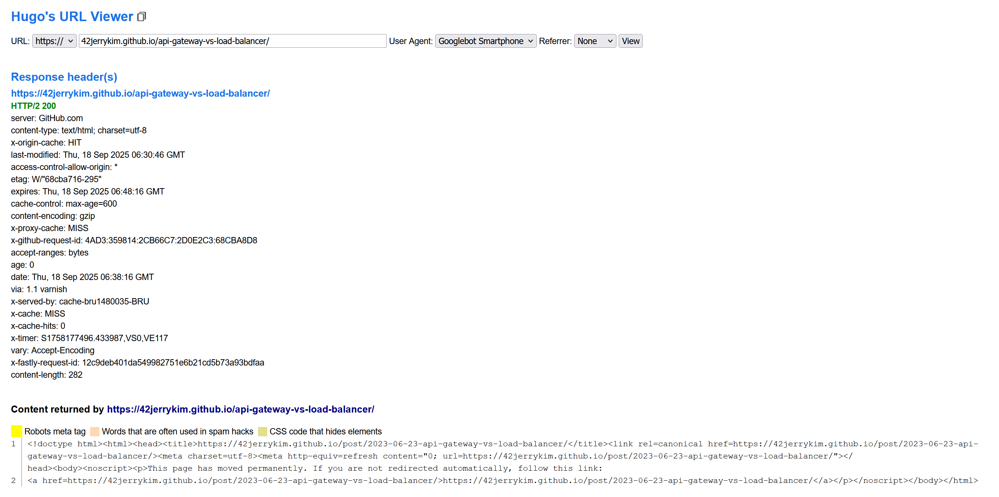
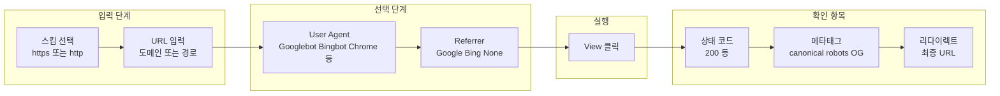

Hugo URL Viewer는 입력한 URL을 **지정한 사용자 에이전트(User Agent)**와 **리퍼러(Referrer)**로 열어 보는 간단한 웹 도구다. Googlebot(모바일/데스크톱), Bingbot, 일반 브라우저(Chrome/Firefox/Edge)를 선택해 크롤러 관점과 사용자 관점의 응답 차이를 빠르게 확인할 수 있다. SEO 점검, 배포 검증, 회귀 테스트에 활용하기 좋다.

**공식 사이트**: [Hugo's URL Viewer](https://view.hugo-decoded.be)

---

## 도입: 왜 URL 뷰어가 필요한가

웹사이트는 **검색 엔진 크롤러**와 **일반 사용자 브라우저**에 서로 다른 응답을 줄 수 있다. 클로킹(Cloaking), 모바일/데스크톱 버전 불일치, 잘못된 `noindex`·`canonical` 설정은 검색 노출과 사용자 경험에 직접 영향을 준다. Hugo URL Viewer는 별도 프록시나 VPN 없이 **User Agent와 Referrer만 바꿔** 해당 URL이 봇·브라우저에게 어떻게 보이는지 한 화면에서 비교할 수 있게 해 준다. Hugo 정적 사이트 생성기와 같은 이름이지만, 독립된 무료 웹 서비스이며 Hugo 프로젝트와 무관하게 어떤 URL이든 입력해 사용할 수 있다.

---

## Hugo URL Viewer가 할 수 있는 것

도구에서 제공하는 옵션은 다음과 같다.

- **스킴 선택**: `https://`, `http://` 중 선택
- **URL 입력**: `example.com` 또는 `example.com/path` 형태로 대상 주소 입력
- **사용자 에이전트 선택**: "Googlebot Smartphone"(기본값), "Googlebot Desktop", "Bingbot", "Chrome", "Firefox", "Edge"
- **리퍼러 선택**: "Google", "Bing", "Yahoo", "None"
- **View 버튼**: 위 조건으로 페이지를 로드해 결과 표시

이를 통해 다음을 점검할 수 있다.

- 크롤러와 브라우저 사이의 **콘텐츠·메타태그 차이**
- **리다이렉트(301/302)** 동작과 최종 도착 URL
- `robots` 메타태그 및 `X-Robots-Tag` 응답 헤더 반영 여부
- `canonical`, `hreflang`, **Open Graph·Twitter Card** 등 메타 데이터 노출

---

## 사용 흐름 (Mermaid)

아래 다이어그램은 Hugo URL Viewer 사용 시 **입력 → 선택 → 확인** 흐름을 요약한다. 노드 ID는 camelCase·PascalCase를 사용했고, 라벨에 등호·특수문자가 있는 경우 큰따옴표로 감쌌다.

```mermaid
flowchart LR
  subgraph inputGroup["입력 단계"]
    scheme["스킴 선택</br>https 또는 http"]
    urlInput["URL 입력</br>도메인 또는 경로"]
  end
  subgraph selectGroup["선택 단계"]
    userAgent["User Agent</br>Googlebot Bingbot Chrome 등"]
    referrer["Referrer</br>Google Bing None"]
  end
  subgraph actionGroup["실행"]
    viewBtn["View 클릭"]
  end
  subgraph resultGroup["확인 항목"]
    statusCode["상태 코드</br>200 등"]
    metaTags["메타태그</br>canonical robots OG"]
    redirect["리다이렉트</br>최종 URL"]
  end
  scheme --> urlInput
  urlInput --> userAgent
  userAgent --> referrer
  referrer --> viewBtn
  viewBtn --> statusCode
  statusCode --> metaTags
  metaTags --> redirect
```

---

## 사용 방법 (단계별)

1. 상단에서 **`https://`** 또는 **`http://`**를 선택한다.
2. **도메인 또는 전체 URL**을 입력한다. 예: `example.com`, `example.com/path`.
3. **User Agent**에서 점검하려는 대상을 고른다. SEO 점검은 보통 "Googlebot Smartphone"을 권장한다.
4. **Referrer**를 선택한다. 검색 유입 시나리오를 보려면 "Google"을, 직접 유입이면 "None"을 사용한다.
5. **View**를 눌러 결과를 확인한다.

### 확인 체크리스트

점검 시 아래 항목을 순서대로 확인하면 실무에서 놓치기 쉬운 부분을 줄일 수 있다.

| 구분 | 확인 항목 |
|------|-----------|
| 응답 | 상태 코드가 200으로 정상 응답하는가? |
| 동등성 | 모바일(Googlebot Smartphone)과 데스크톱(Chrome/Edge) 간 콘텐츠가 동등한가? |
| 차단 | `noindex`, `nofollow` 등 의도치 않은 차단이 없는가? |
| canonical | `rel=canonical`이 자기 참조 또는 의도한 URL을 가리키는가? |
| 다국어·지역 | `hreflang`이 올바르게 설정되어 있는가? |
| 소셜 | Open Graph·Twitter Card 미리보기가 제대로 보이는가? |

---

## 활용 시나리오

- **SEO 기술 점검**: 크롤러 관점에서의 렌더링·메타 반영 확인. 모바일 퍼스트 인덱싱 대비 Googlebot Smartphone 결과를 우선 확인하는 것이 좋다.
- **배포 검증**: CDN·캐시·리다이렉트 규칙이 기획대로 동작하는지, 배포 전후에 같은 URL을 여러 User Agent로 비교해 검증한다.
- **회귀 테스트**: 테마·템플릿 변경 후 메타태그·정규화 규칙이 유지되는지 빠르게 검사한다.

---

## 한계와 주의사항

- **IP·지리적 위치**: 이 도구는 IP나 지리적 위치를 바꿔 주지 않는다. VPN·프록시가 아니므로, 위치 기반 콘텐츠나 봇 전용 IP 화이트리스트를 쓰는 사이트에서는 실제 봇과 결과가 다를 수 있다.
- **실제 Googlebot과의 차이**: 실제 Googlebot은 고정된 IP 대역과 자체 렌더링 파이프라인을 사용한다. Hugo URL Viewer는 **User Agent·Referrer를 바꿔 보는 수준**의 빠른 확인용이며, 공식 검증은 Google Search Console·URL 검사 도구 등을 함께 사용하는 것이 좋다.
- **로그인·쿠키**: 로그인·쿠키가 필요한 페이지의 동작은 브라우저 상태에 따라 달라질 수 있다. 도구 자체는 사용자 세션을 유지하지 않는다.

---

## 언제 쓰고 언제 피할지

| 사용해도 좋은 경우 | 피하는 것이 좋은 경우 |
|-------------------|------------------------|
| 메타태그·canonical·리다이렉트 빠른 점검 | 실제 Googlebot 인덱싱 결과 공식 확인 |
| 배포 전 크롤러/브라우저 응답 비교 | 지리적 위치·IP 기반 차별화 검증 |
| 회귀 테스트·QA 워크플로에 포함 | 로그인 필수·복잡한 세션 페이지 검증 |

---

## 마무리 및 참고 자료

Hugo URL Viewer는 크롤러·브라우저 관점에서의 응답 차이를 **손쉽게 비교**하는 데 유용한 경량 도구다. 배포 전후 점검, 리다이렉트·메타태그 검증, 모바일 퍼스트 최적화 확인에 특히 도움이 된다. 공식 페이지에서 직접 사용해 보며, 더 정밀한 검증이 필요할 때는 검색엔진 제공 도구(Google URL 검사, Bing URL 검사 등)를 함께 활용하는 것을 권한다.

**한 줄 요약**: User Agent·Referrer만 바꿔 크롤러와 브라우저 관점의 URL 응답을 빠르게 비교할 수 있는 무료 웹 도구로, SEO·배포·회귀 테스트에 활용하기 좋다.

### 참고 문헌·링크

1. [Hugo's URL Viewer (공식)](https://view.hugo-decoded.be) — 도구 사용 화면 및 입력 옵션
2. [Bing Webmaster Tools](https://www.bing.com/webmasters) — Bing 크롤러 관점의 사이트 점검·URL 검증 (로그인 필요)
3. [Bing Webmaster Guidelines](https://www.bing.com/webmaster/help/webmaster-guidelines-30fba23a) — Bing 크롤링·인덱싱·검색 가이드라인 (canonical, 리다이렉트, robots 등)
