Windows 11에서 듀얼 모니터를 쓰며 **해상도 1920×1080**, **주사율 120Hz**, **배율 100%(96 DPI)**를 모두 동일하게 맞추고 싶을 때, 설정 앱을 일일이 열지 않고 한 번에 적용하는 PowerShell 스크립트를 정리했다. 외부 유틸 없이 `user32.dll`을 P/Invoke로 호출해 해상도·주사율을 적용하고, DPI는 레지스트리를 통해 100%로 설정한다.

이 포스트에서는 스크립트 전체, 사용법, 내부 동작(플로우 포함), 코드 상세, 제한사항, FAQ, 참고 문헌까지 한 번에 다룬다.

---

## 목차

1. [스크립트 전체](#스크립트-전체)
2. [빠른 사용법](#빠른-사용법)
3. [동작 흐름(플로우)](#동작-흐름플로우)
4. [내부 동작 원리](#내부-동작-원리)
5. [코드 상세 설명](#코드-상세-설명)
6. [제한사항과 주의점](#제한사항과-주의점)
7. [자주 묻는 질문](#자주-묻는-질문)
8. [참고 문헌](#참고-문헌)

---

## 스크립트 전체

```powershell
param(
  [int]$Width = 1920,
  [int]$Height = 1080,
  [int]$Refresh = 120,
  [switch]$SignOutAfter
)

# Change resolution/refresh for all attached displays and set system DPI to 100%.
# This version avoids Marshal.SizeOf binder issues by initializing sizes inside C# wrappers.

Add-Type -TypeDefinition @"
using System;
using System.Runtime.InteropServices;

public static class DisplayUtil
{
    public const int ENUM_CURRENT_SETTINGS = -1;

    public const int DM_BITSPERPEL = 0x00040000;
    public const int DM_PELSWIDTH = 0x00080000;
    public const int DM_PELSHEIGHT = 0x00100000;
    public const int DM_DISPLAYFREQUENCY = 0x00400000;

    public const int CDS_UPDATEREGISTRY = 0x00000001;
    public const int CDS_TEST = 0x00000002;

    public const int DISP_CHANGE_SUCCESSFUL = 0;
    public const int DISP_CHANGE_RESTART = 1;

    public const int DISPLAY_DEVICE_ATTACHED_TO_DESKTOP = 0x00000001;
    public const int DISPLAY_DEVICE_PRIMARY_DEVICE = 0x00000004;

    [StructLayout(LayoutKind.Sequential, CharSet = CharSet.Unicode)]
    public struct DEVMODE
    {
        [MarshalAs(UnmanagedType.ByValTStr, SizeConst = 32)]
        public string dmDeviceName;
        public ushort dmSpecVersion;
        public ushort dmDriverVersion;
        public ushort dmSize;
        public ushort dmDriverExtra;
        public uint dmFields;

        public int dmPositionX;
        public int dmPositionY;
        public uint dmDisplayOrientation;
        public uint dmDisplayFixedOutput;

        public short dmColor;
        public short dmDuplex;
        public short dmYResolution;
        public short dmTTOption;
        public short dmCollate;

        [MarshalAs(UnmanagedType.ByValTStr, SizeConst = 32)]
        public string dmFormName;
        public ushort dmLogPixels;
        public uint dmBitsPerPel;
        public uint dmPelsWidth;
        public uint dmPelsHeight;
        public uint dmDisplayFlags;
        public uint dmDisplayFrequency;
        public uint dmICMMethod;
        public uint dmICMIntent;
        public uint dmMediaType;
        public uint dmDitherType;
        public uint dmReserved1;
        public uint dmReserved2;
        public uint dmPanningWidth;
        public uint dmPanningHeight;
    }

    [StructLayout(LayoutKind.Sequential, CharSet = CharSet.Unicode)]
    public struct DISPLAY_DEVICE
    {
        public int cb;
        [MarshalAs(UnmanagedType.ByValTStr, SizeConst = 32)]
        public string DeviceName;
        [MarshalAs(UnmanagedType.ByValTStr, SizeConst = 128)]
        public string DeviceString;
        public int StateFlags;
        [MarshalAs(UnmanagedType.ByValTStr, SizeConst = 128)]
        public string DeviceID;
        [MarshalAs(UnmanagedType.ByValTStr, SizeConst = 128)]
        public string DeviceKey;
    }

    [DllImport("user32.dll", CharSet = CharSet.Unicode)]
    public static extern bool EnumDisplayDevices(string lpDevice, uint iDevNum, ref DISPLAY_DEVICE lpDisplayDevice, uint dwFlags);

    [DllImport("user32.dll", CharSet = CharSet.Unicode)]
    public static extern bool EnumDisplaySettingsEx(string lpszDeviceName, int iModeNum, ref DEVMODE lpDevMode, int dwFlags);

    [DllImport("user32.dll", CharSet = CharSet.Unicode)]
    public static extern int ChangeDisplaySettingsEx(string lpszDeviceName, ref DEVMODE lpDevMode, IntPtr hwnd, int dwflags, IntPtr lParam);

    public static bool EnumDisplayDevicesInit(uint iDevNum, out DISPLAY_DEVICE device)
    {
        device = new DISPLAY_DEVICE();
        device.cb = Marshal.SizeOf(typeof(DISPLAY_DEVICE));
        return EnumDisplayDevices(null, iDevNum, ref device, 0);
    }

    public static bool EnumDisplaySettingsInit(string deviceName, int modeNum, out DEVMODE mode)
    {
        mode = new DEVMODE();
        mode.dmSize = (ushort)Marshal.SizeOf(typeof(DEVMODE));
        return EnumDisplaySettingsEx(deviceName, modeNum, ref mode, 0);
    }

    public static int TestOrApply(string deviceName, ref DEVMODE mode, bool test)
    {
        int flags = test ? CDS_TEST : CDS_UPDATEREGISTRY;
        return ChangeDisplaySettingsEx(deviceName, ref mode, IntPtr.Zero, flags, IntPtr.Zero);
    }
}
"@

function Get-DisplayAdapters {
  $result = @()
  $i = 0
  while ($true) {
    $dd = New-Object DisplayUtil+DISPLAY_DEVICE
    $ok = [DisplayUtil]::EnumDisplayDevicesInit([uint32]$i, [ref]$dd)
    if (-not $ok) { break }
    if (($dd.StateFlags -band [DisplayUtil]::DISPLAY_DEVICE_ATTACHED_TO_DESKTOP) -ne 0) {
      $result += $dd
    }
    $i++
  }
  return $result
}

function Get-ModesForAdapter([string]$deviceName) {
  $modes = @()
  $modeIndex = 0
  while ($true) {
    $dm = New-Object DisplayUtil+DEVMODE
    $ok = [DisplayUtil]::EnumDisplaySettingsInit($deviceName, $modeIndex, [ref]$dm)
    if (-not $ok) { break }
    $modes += [pscustomobject]@{
      Width = [int]$dm.dmPelsWidth
      Height = [int]$dm.dmPelsHeight
      Frequency = [int]$dm.dmDisplayFrequency
      BitsPerPel = [int]$dm.dmBitsPerPel
      Interlaced = (($dm.dmDisplayFlags -band 0x2) -ne 0)
      DevMode = $dm
    }
    $modeIndex++
  }
  return $modes
}

function Set-DisplayMode([string]$deviceName, [int]$width, [int]$height, [int]$frequency) {
  $available = Get-ModesForAdapter -deviceName $deviceName | Where-Object { $_.Width -eq $width -and $_.Height -eq $height -and -not $_.Interlaced }
  if (-not $available) {
    Write-Warning "[$deviceName] ${width}x${height} not supported. Skipping."
    return $false
  }
  $target = $available | Where-Object { $_.Frequency -eq $frequency } | Select-Object -First 1
  if (-not $target) {
    $target = $available | Sort-Object Frequency -Descending | Select-Object -First 1
    Write-Warning "[$deviceName] ${width}x${height}@${frequency} not found. Using ${width}x${height}@${($target.Frequency)} instead."
  }

  $dm = $target.DevMode
  $dm.dmFields = [DisplayUtil]::DM_PELSWIDTH -bor [DisplayUtil]::DM_PELSHEIGHT -bor [DisplayUtil]::DM_DISPLAYFREQUENCY -bor [DisplayUtil]::DM_BITSPERPEL
  if ($dm.dmBitsPerPel -eq 0) { $dm.dmBitsPerPel = 32 }

  $test = [DisplayUtil]::TestOrApply($deviceName, [ref]$dm, $true)
  if ($test -ne [DisplayUtil]::DISP_CHANGE_SUCCESSFUL) {
    Write-Warning "[$deviceName] Mode rejected on test (code $test). Skipping."
    return $false
  }

  $apply = [DisplayUtil]::TestOrApply($deviceName, [ref]$dm, $false)
  if ($apply -eq [DisplayUtil]::DISP_CHANGE_SUCCESSFUL) {
    Write-Host "[$deviceName] Applied ${($dm.dmPelsWidth)}x${($dm.dmPelsHeight)}@$($dm.dmDisplayFrequency)Hz"
    return $true
  } elseif ($apply -eq [DisplayUtil]::DISP_CHANGE_RESTART) {
    Write-Host "[$deviceName] Applied (requires restart)."
    return $true
  } else {
    Write-Warning "[$deviceName] Failed to apply (code $apply)."
    return $false
  }
}

function Set-GlobalDpi100 {
  try {
    New-ItemProperty -Path 'HKCU:\Control Panel\Desktop' -Name 'Win8DpiScaling' -PropertyType DWord -Value 1 -Force | Out-Null
    New-ItemProperty -Path 'HKCU:\Control Panel\Desktop' -Name 'LogPixels' -PropertyType DWord -Value 96 -Force | Out-Null
    New-ItemProperty -Path 'HKCU:\Control Panel\Desktop\WindowMetrics' -Name 'AppliedDPI' -PropertyType DWord -Value 96 -Force | Out-Null
    Write-Host "[DPI] Set to 100% (96 DPI). Sign-out required to fully apply."
    return $true
  } catch {
    Write-Warning "[DPI] Failed: $($_.Exception.Message)"
    return $false
  }
}

$adapters = Get-DisplayAdapters
if (-not $adapters) {
  Write-Error "No active display adapters found."
  exit 1
}

$successAny = $false
foreach ($ad in $adapters) {
  $ok = Set-DisplayMode -deviceName $ad.DeviceName -width $Width -height $Height -frequency $Refresh
  if ($ok) { $successAny = $true }
}

$dpiOk = Set-GlobalDpi100

if ($SignOutAfter -and $dpiOk) {
  Write-Host "Signing out to apply DPI changes..."
  Start-Process -FilePath "shutdown.exe" -ArgumentList "/l" -WindowStyle Hidden
}

if (-not $successAny) {
  Write-Warning "No display modes were changed. Verify that ${Width}x${Height}@$Refresh is supported on your monitors."
}
```

---

## 빠른 사용법

- **기본값 적용**(1920×1080, 120Hz, DPI 100%):

```powershell
powershell -ExecutionPolicy Bypass -File .\change-display.ps1
```

- **DPI 변경을 즉시 반영**하려면 자동 로그아웃 옵션 추가:

```powershell
powershell -ExecutionPolicy Bypass -File .\change-display.ps1 -SignOutAfter
```

- **해상도·주사율을 다르게** 지정하려면:

```powershell
powershell -ExecutionPolicy Bypass -File .\change-display.ps1 -Width 1920 -Height 1080 -Refresh 60
```

---

## 동작 흐름(플로우)

스크립트 실행 시 처리 순서는 아래와 같다.

```mermaid
flowchart LR
  subgraph Init["초기화"]
    A[스크립트 시작]
    B[Add-Type C# DisplayUtil]
  end
  subgraph Enum["디스플레이 열거"]
    C[Get-DisplayAdapters]
    D["바탕화면 연결 어댑터만 필터"]
  end
  subgraph ApplyMode["해상도·주사율 적용"]
    E["각 어댑터별 Get-ModesForAdapter"]
    F["1920x1080 비인터레이스 모드 필터"]
    G["120Hz 또는 최대 주사율 선택"]
    H["CDS_TEST 후 CDS_UPDATEREGISTRY 적용"]
  end
  subgraph Dpi["DPI 설정"]
    I[Set-GlobalDpi100]
    J["LogPixels 96, AppliedDPI 96 레지스트리"]
  end
  subgraph Optional["선택"]
    K["SignOutAfter?"]
    L["로그아웃 실행"]
    M[종료]
  end
  A --> B
  B --> C
  C --> D
  D --> E
  E --> F
  F --> G
  G --> H
  H --> I
  I --> J
  J --> K
  K -->|"Yes"| L
  K -->|"No"| M
  L --> M
```



- **초기화**: C# `DisplayUtil` 클래스를 런타임에 추가해 Win32 API를 노출한다.
- **디스플레이 열거**: `EnumDisplayDevices`로 어댑터를 열거하고, `DISPLAY_DEVICE_ATTACHED_TO_DESKTOP`인 것만 사용한다.
- **해상도·주사율**: 각 어댑터에 대해 `EnumDisplaySettingsEx`로 모드를 얻고, 1920×1080 비인터레이스 중 120Hz(또는 최대 주사율)를 골라 `ChangeDisplaySettingsEx`로 테스트 후 적용한다.
- **DPI**: `HKCU\Control Panel\Desktop` 및 `WindowMetrics`에 96 DPI 값을 쓰고, 완전 반영을 위해 로그아웃이 필요하다는 메시지를 출력한다.
- **선택**: `-SignOutAfter`가 지정되면 로그아웃을 실행한다.

---

## 내부 동작 원리

| 항목 | 설명 |
|------|------|
| **해상도·주사율** | `EnumDisplayDevices` → `EnumDisplaySettingsEx` → `ChangeDisplaySettingsEx`로 각 어댑터에 대해 1920×1080에서 120Hz가 가능하면 적용하고, 불가하면 동일 해상도에서 가능한 최대 주사율을 적용한다. |
| **DPI 100%** | `HKCU\Control Panel\Desktop`의 `LogPixels=96`, `Win8DpiScaling=1`, `HKCU\Control Panel\Desktop\WindowMetrics`의 `AppliedDPI=96`을 설정한다. DPI 반영은 **로그아웃 후** 완전히 적용된다. |
| **안정성** | 구조체 크기(`cb`, `dmSize`) 초기화를 C# 래퍼 메서드 안에서 처리해 PowerShell에서의 `Marshal.SizeOf` 바인더 오류를 피한다. `CharSet.Unicode`로 선언해 한글 환경에서도 안전하게 문자열을 처리한다. |

---

## 코드 상세 설명

### Add-Type과 P/Invoke 래퍼

PowerShell에는 해상도·주사율 변경용 기본 cmdlet이 없어, `Add-Type -TypeDefinition`으로 C# 코드를 런타임 컴파일해 Win32 API를 호출한다. 구조체 크기(`cb`, `dmSize`)는 C# 래퍼 메서드에서 `Marshal.SizeOf`로 채워 PowerShell에서 직접 호출 시 생길 수 있는 바인더 오류를 막는다.

### 구조체 레이아웃과 CharSet

`DEVMODE`, `DISPLAY_DEVICE`는 Windows 헤더와 같은 필드 순서·크기를 갖도록 `StructLayout(LayoutKind.Sequential)`을 사용한다. 문자열은 `CharSet.Unicode`로 선언해 한글 장치명 등에서도 안전하게 동작한다. `dmFields`에 `DM_PELSWIDTH | DM_PELSHEIGHT | DM_DISPLAYFREQUENCY | DM_BITSPERPEL`을 설정해 해당 필드가 유효함을 표시한다.

### 디스플레이 열거 로직

`Get-DisplayAdapters`는 `EnumDisplayDevices`를 0부터 증가시키며 호출하고, `StateFlags`에 `DISPLAY_DEVICE_ATTACHED_TO_DESKTOP`이 있는 어댑터만 결과에 넣는다.

### 지원 모드 수집

`Get-ModesForAdapter`는 각 어댑터에 대해 `EnumDisplaySettingsEx`를 인덱스 0부터 실패할 때까지 반복해 모든 모드를 수집하고, 해상도·주사율·인터레이스 여부 등을 PowerShell 객체로 반환한다.

### 모드 선택과 적용 절차

`Set-DisplayMode`는 1920×1080 비인터레이스 모드만 필터한 뒤, 요청 주사율(120Hz)이 있으면 그대로 선택하고 없으면 같은 해상도에서 최대 주사율을 선택한다. 그다음 `CDS_TEST`로 검증한 뒤 `CDS_UPDATEREGISTRY`로 실제 적용한다. 반환값이 `DISP_CHANGE_RESTART`이면 재부팅이 필요할 수 있다.

### DPI 레지스트리 설정

`Set-GlobalDpi100`은 전역 배율 100%에 해당하는 96 DPI를 사용자 레지스트리(HKCU)에 기록한다. 완전 반영에는 로그아웃이 필요하다.

---

## 제한사항과 주의점

- 제조사·케이블·포트(HDMI/DP) 조합에 따라 지원 주사율이 다를 수 있다.
- 이 스크립트는 **해상도·주사율·전역 DPI**만 변경하며, 모니터 배치(좌표·회전)는 건드리지 않는다.
- Windows의 퍼-모니터 DPI(모니터별 배율)는 이 API만으로 강제 통일하기 어렵다. 본 스크립트는 **전역 DPI**를 100%로 맞춘다.
- 적용 결과가 `DISP_CHANGE_RESTART`인 경우, 재부팅이 필요할 수 있다.
- 관리자 권한은 필수가 아니지만, 환경에 따라 관리자로 실행하면 더 안정적일 수 있다.

### 확장 아이디어

- 특정 어댑터만 대상으로 하는 파라미터(예: 기본 모니터만 적용)
- 해상도·주사율을 파라미터로 받아 프로파일처럼 저장·복원
- 회전(가로/세로) 또는 다중 디스플레이 배치 좌표까지 제어

---

## 자주 묻는 질문

**Q. 모니터가 120Hz를 지원하지 않으면 어떻게 되나요?**  
A. 같은 해상도(1920×1080)에서 **가능한 최대 주사율**을 자동으로 선택한다.

**Q. 관리자 권한이 필요한가요?**  
A. 필수는 아니지만, 디스플레이 드라이버·권한 설정에 따라 **관리자 권한**으로 실행하면 더 안정적일 수 있다.

**Q. DPI 100%가 바로 적용되지 않아요.**  
A. 레지스트리 기반이라 **로그아웃 후 재로그인**해야 완전히 반영된다. `-SignOutAfter` 옵션을 쓰면 스크립트가 로그아웃까지 수행한다.

**Q. 한쪽 모니터만 바꾸고 싶어요.**  
A. 현재 스크립트는 **모든 바탕화면 연결 어댑터**에 동일 설정을 적용한다. 특정 어댑터만 대상으로 하려면 스크립트에 디바이스 이름 필터를 추가해야 한다.

---

## 참고 문헌

1. [EnumDisplaySettingsExW - Win32 apps \| Microsoft Learn](https://learn.microsoft.com/en-us/windows/win32/api/winuser/nf-winuser-enumdisplaysettingsexw) — 디스플레이 그래픽 모드 정보 조회
2. [ChangeDisplaySettingsExA - Win32 apps \| Microsoft Learn](https://learn.microsoft.com/en-us/windows/desktop/api/winuser/nf-winuser-changedisplaysettingsexa) — 지정 디스플레이의 그래픽 모드 변경
3. [EnumDisplayDevicesA - Win32 apps \| Microsoft Learn](https://learn.microsoft.com/en-us/windows/desktop/api/winuser/nf-winuser-enumdisplaydevicesa) — 현재 세션의 디스플레이 디바이스 정보 조회

---

외부 도구 없이 PowerShell만으로 듀얼 모니터의 해상도·주사율·배율을 한 번에 통일할 수 있다. 팀·랩 환경에서 표준 디스플레이 설정을 자동화할 때 특히 유용하다.
