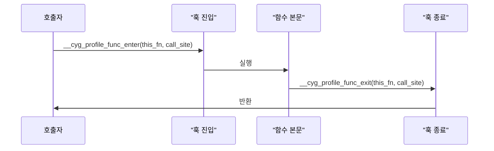

## 개요

GCC(GNU Compiler Collection)는 C, C++, Fortran 등 여러 언어를 컴파일하는 표준 도구다. 그중 **`-finstrument-functions`** 플래그는 컴파일 시 **각 함수의 진입·종료 지점에 훅(hook) 함수 호출을 자동 삽입**하여, 실행 흐름 추적·프로파일링·디버깅을 가능하게 한다. 성능 분석, 호출 그래프 수집, 임베디드/저수준 디버깅에 널리 쓰인다.

**대상 독자**: C/C++ 기본과 컴파일·링크 과정을 알고 있는 개발자.  
**기준 환경**: GCC 13.x, Linux(glibc).  
**활용 목적**: 함수 단위 실행 추적, 소요 시간 측정, 호출 관계 분석.

---

## 메커니즘 이해

`-finstrument-functions`를 사용하면 컴파일러가 **비인라인 함수**마다 다음 두 훅을 삽입한다.

- **함수 진입 직후**: `__cyg_profile_func_enter(void *this_fn, void *call_site)` 호출  
- **함수 반환 직전**: `__cyg_profile_func_exit(void *this_fn, void *call_site)` 호출  

인자 의미는 다음과 같다.

| 인자 | 의미 |
|------|------|
| `this_fn` | 현재 함수의 주소(함수 포인터) |
| `call_site` | 이 함수를 호출한 위치의 반환 주소 |

훅은 **사용자가 직접 정의**해야 하며, libgcc 기본 구현은 없다. 훅 안에서 로그 출력, 시간 측정, 스택/메모리 추적 등을 자유롭게 구현할 수 있다.

**계측에서 제외되는 경우**: 인라인된 함수, 일부 생성자/소멸자, 최적화로 제거된 함수.  
**선택적 제외**: `-finstrument-functions-exclude-file-list`, `-finstrument-functions-exclude-function-list`로 특정 파일·함수를 제외할 수 있다.

### 실행 흐름 도식

계측된 함수가 호출될 때의 흐름은 아래와 같다.



---

## 기본 사용법

### 1. 컴파일 옵션

아래는 간단한 C 예제다. `example.c`:

```c
#include <stdio.h>

void sub_function(int x) {
    printf("Sub function called with %d\n", x);
}

int main(void) {
    for (int i = 0; i < 3; i++) {
        sub_function(i);
    }
    return 0;
}
```

컴파일 시 플래그 추가:

```bash
gcc -finstrument-functions -g example.c -o example
```

`-g`는 디버그 정보로, 주소를 심볼로 해석할 때 유용하다.

### 2. 훅 함수 구현

훅을 정의한 별도 소스 `hooks.c`를 만들고 링크한다. Linux에서는 `dladdr(3)`으로 함수 주소를 심볼 이름으로 바꿀 수 있다.

```c
#include <stdio.h>
#include <dlfcn.h>

void __cyg_profile_func_enter(void *this_fn, void *call_site) __attribute__((no_instrument_function));
void __cyg_profile_func_exit(void *this_fn, void *call_site) __attribute__((no_instrument_function));

void __cyg_profile_func_enter(void *this_fn, void *call_site) {
    Dl_info info;
    if (dladdr(this_fn, &info) && info.dli_sname) {
        printf("Entering function: %s at %p\n", info.dli_sname, this_fn);
    }
}

void __cyg_profile_func_exit(void *this_fn, void *call_site) {
    Dl_info info;
    if (dladdr(this_fn, &info) && info.dli_sname) {
        printf("Exiting function: %s at %p\n", info.dli_sname, this_fn);
    }
}
```

**필수**: 훅 함수 자체는 **계측 대상에서 제외**해야 한다. 그렇지 않으면 훅이 자기 자신을 호출해 무한 재귀에 빠진다. 따라서 `__attribute__((no_instrument_function))`를 선언에 붙인다.

컴파일·링크 예:

```bash
gcc -finstrument-functions -g example.c hooks.c -ldl -o example
```

실행:

```bash
./example
```

출력 예:

```
Entering function: main at 0x401136
Entering function: sub_function at 0x4010f0
Sub function called with 0
Exiting function: sub_function at 0x4010f0
Entering function: sub_function at 0x4010f0
Sub function called with 1
Exiting function: sub_function at 0x4010f0
Entering function: sub_function at 0x4010f0
Sub function called with 2
Exiting function: sub_function at 0x4010f0
Exiting function: main at 0x401136
```

---

## 고급 활용

### 성능 프로파일링(함수별 소요 시간)

`clock_gettime(CLOCK_MONOTONIC)`으로 진입·종료 시각을 재어 각 함수의 소요 시간을 출력하는 예는 아래와 같다. 훅 내부에서만 시간을 쓰므로, 훅 자체는 `no_instrument_function`으로 두는 것이 좋다.

```c
#define _GNU_SOURCE
#include <stdio.h>
#include <time.h>
#include <dlfcn.h>

static struct timespec start_time;

void __cyg_profile_func_enter(void *this_fn, void *call_site) __attribute__((no_instrument_function));
void __cyg_profile_func_exit(void *this_fn, void *call_site) __attribute__((no_instrument_function));

void __cyg_profile_func_enter(void *this_fn, void *call_site) {
    Dl_info info;
    if (dladdr(this_fn, &info) && info.dli_sname) {
        printf("ENTER: %s\n", info.dli_sname);
        clock_gettime(CLOCK_MONOTONIC, &start_time);
    }
}

void __cyg_profile_func_exit(void *this_fn, void *call_site) {
    Dl_info info;
    struct timespec end_time;
    if (dladdr(this_fn, &info) && info.dli_sname) {
        clock_gettime(CLOCK_MONOTONIC, &end_time);
        double elapsed = (end_time.tv_sec - start_time.tv_sec)
            + (end_time.tv_nsec - start_time.tv_nsec) / 1e9;
        printf("EXIT: %s (%.6f s)\n", info.dli_sname, elapsed);
    }
}
```

이렇게 하면 함수별 실행 시간을 볼 수 있다. 다만 **모든 함수 호출마다 훅이 실행되므로 오버헤드가 크다**. 프로덕션보다는 개발·테스트·프로파일링 전용 빌드에 쓰는 것이 적절하다.

### 제외 옵션 사용

특정 파일·함수만 제외해 노이즈를 줄일 수 있다.

```bash
gcc -finstrument-functions \
  -finstrument-functions-exclude-file-list=main.c \
  -finstrument-functions-exclude-function-list=init,main \
  example.c hooks.c -ldl -o example
```

`main`, `init`처럼 호출 빈도가 높거나 분석 가치가 낮은 함수를 제외하면 로그가 읽기 쉬워진다.

### 다중 스레드 환경

여러 스레드가 동시에 훅을 호출하면 로그가 섞일 수 있다. 공유 자원(파일, 전역 버퍼 등)을 쓸 때는 뮤텍스나 thread-local 저장소를 사용해 스레드 안전성을 확보한다.

```c
#include <pthread.h>

static pthread_mutex_t log_mutex = PTHREAD_MUTEX_INITIALIZER;

void __cyg_profile_func_enter(void *this_fn, void *call_site) __attribute__((no_instrument_function)) {
    pthread_mutex_lock(&log_mutex);
    /* 로그 기록 등 */
    pthread_mutex_unlock(&log_mutex);
}

void __cyg_profile_func_exit(void *this_fn, void *call_site) __attribute__((no_instrument_function)) {
    pthread_mutex_lock(&log_mutex);
    /* 로그 기록 등 */
    pthread_mutex_unlock(&log_mutex);
}
```

출력만 한다면 `fprintf` 등이 스레드 세이프한 환경에서는 뮤텍스 없이 쓸 수 있으나, 버퍼를 직접 다루거나 한 줄을 여러 번 쓸 때는 동기화가 필요하다.

### 다른 도구와의 조합

- **GDB**: 훅 함수에 브레이크포인트를 걸어 호출 순서·인자를 확인.
- **Valgrind / perf**: `-finstrument-functions`는 소스 단위 계측이고, Valgrind·perf는 바이너리/하드웨어 기반이다. 목적에 따라 소스 계측과 병행하거나 대체.
- **커스텀 트레이서**: 훅에서 파일·소켓 등으로 이벤트를 보내 원격 수집·시각화 가능.

---

## 제한사항과 주의점

| 항목 | 설명 |
|------|------|
| **오버헤드** | 모든 (비인라인) 함수 호출마다 훅이 두 번 호출되므로, 런타임이 **10~50% 이상** 늘어날 수 있다. 작고 자주 불리는 함수일수록 영향이 크다. |
| **인라인·최적화** | `-O2` 이상에서는 일부 함수가 인라인되어 계측되지 않는다. 계측 범위를 넓히려면 `-fno-inline` 등을 쓸 수 있으나, 실제 실행과 성능 특성이 달라진다. |
| **플랫폼** | `dladdr`는 Linux/glibc 등에서 사용 가능하다. Windows에서는 `SymFromAddr` 등 다른 API로 주소→심볼 변환을 구현해야 한다. 크로스 컴파일 시 훅 구현도 타깃 환경에 맞춰야 한다. |
| **재귀·루프** | 훅 자체는 반드시 `no_instrument_function`으로 두어, 훅이 다시 훅을 부르지 않도록 한다. |
| **대안** | 더 세밀한 분석이 필요하면 Intel VTune, ARM Streamline, LLVM instrumentation 패스, 바이너리 계측(예: DynamoRIO) 등을 검토할 수 있다. |

---

## 정리

`-finstrument-functions`는 **함수 단위 실행 추적**을 컴파일 타임에 삽입하는 GCC 기능이다. 훅을 직접 구현해 로깅·시간 측정·호출 그래프 수집 등에 쓸 수 있으며, 제외 옵션과 `no_instrument_function`을 잘 쓰면 오버헤드와 노이즈를 줄일 수 있다. 프로덕션 전용 빌드보다는 디버깅·프로파일링·분석용 빌드에 적용하는 것을 권장한다.

더 많은 GCC·C/C++ 관련 글은 [42jerrykim.github.io](https://42jerrykim.github.io)에서 볼 수 있다.

---

## 참고 문헌

1. **GCC – Program Instrumentation Options**  
   [https://gcc.gnu.org/onlinedocs/gcc/Instrumentation-Options.html](https://gcc.gnu.org/onlinedocs/gcc/Instrumentation-Options.html)  
   `-finstrument-functions` 및 제외 옵션 공식 문서.

2. **dladdr(3) – Linux manual page**  
   [https://man7.org/linux/man-pages/man3/dladdr.3.html](https://man7.org/linux/man-pages/man3/dladdr.3.html)  
   주소를 심볼 정보로 변환할 때 참고.

3. **GCC – Common Function Attributes**  
   [https://gcc.gnu.org/onlinedocs/gcc/Attributes.html#Common-Function-Attributes](https://gcc.gnu.org/onlinedocs/gcc/Attributes.html#Common-Function-Attributes)  
   `no_instrument_function` 속성 설명.
