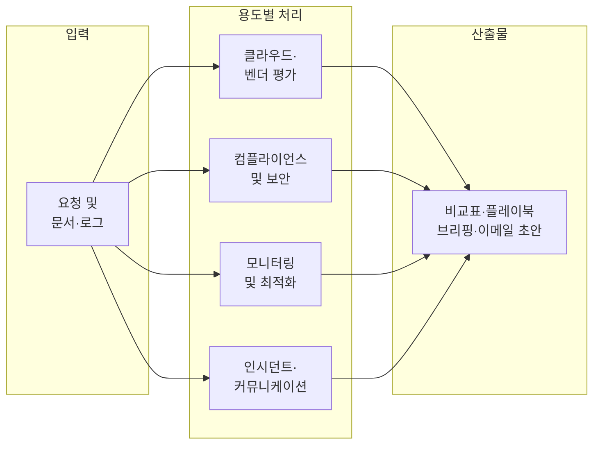

## 개요

IT 팀은 시스템의 보안, 효율성, 접근성을 유지하는 책임을 지며, 수많은 반복 업무·문서화·의사결정 지원에 시간을 쏟는다. **ChatGPT**는 로그 요약, 자동화 단계 작성, 복잡한 구성 설명, 비기술 팀 대상 기술 소통 등에서 보조 도구로 활용할 수 있다. 본문에서는 클라우드·벤더 평가, IT 컴플라이언스·보안, 모니터링·최적화, 인시던트·커뮤니케이션까지 **실무에 바로 쓸 수 있는 프롬프트**와 활용 방식을 정리한다.

**추천 대상**: IT 관리자, 보안·컴플라이언스 담당자, DevOps·SRE 엔지니어, 시스템 운영팀, 기술 의사결정을 담당하는 리더.

---

## ChatGPT로 IT 업무를 지원하는 흐름

IT 팀이 ChatGPT를 활용할 때의 대표 흐름을 단순화하면 아래와 같다. 입력(요청·문서·로그)을 넣으면, 용도별로 비교·분석·초안 작성이 이루어지고, 표·플레이북·브리핑 등 **산출물**로 정리된다.



---

## 클라우드 및 벤더 평가

ChatGPT는 클라우드 서비스, IT 벤더, 관찰 가능성·제로 트러스트 등 **기술 솔루션 비교**와 전략적 의사결정을 돕는다. 최신 데이터가 필요할 때는 **Deep Research**와 **웹 검색** 기능을 함께 쓰는 것이 좋다.

### 클라우드 제공업체 비교

**프롬프트:**

```
우리의 사용 사례를 위해 AWS, Azure, GCP를 비교해주세요: [워크로드 또는 환경 삽입].
비용, 가동 시간, 글로벌 가용성 및 통합 용이성을 고려하세요.
2025년 데이터를 사용하여 연구하고, 각 제공업체를 비교하는 표를 작성한 후
마지막에 권장 사항을 제시해주세요.
```

[ChatGPT에서 시도하기](https://chatgpt.com/?prompt=우리의%20사용%20사례를%20위해%20AWS,%20Azure,%20GCP를%20비교해주세요:%20[워크로드%20또는%20환경%20삽입].%20비용,%20가동%20시간,%20글로벌%20가용성%20및%20통합%20용이성을%20고려하세요.%202025년%20데이터를%20사용하여%20연구하고,%20각%20제공업체를%20비교하는%20표를%20작성한%20후%20마지막에%20권장%20사항을%20제시해주세요.)

### 벤더 비교 차트 생성

**프롬프트:**

```
기업용 원격 액세스 벤더를 조사하고 비교해주세요.
기능, 가격, 통합 및 지원 품질에 중점을 두세요.
2025년 데이터를 사용하고, 결과를 메모가 포함된 비교 표로 요약해주세요.
```

[ChatGPT에서 시도하기](https://chatgpt.com/?prompt=기업용%20원격%20액세스%20벤더를%20조사하고%20비교해주세요.%20기능,%20가격,%20통합%20및%20지원%20품질에%20중점을%20두세요.%202025년%20데이터를%20사용하고,%20결과를%20메모가%20포함된%20비교%20표로%20요약해주세요.)

### AI 관찰 가능성 도구 비교

**프롬프트:**

```
저는 [회사 삽입]의 IT 관리자입니다. 관찰 가능성 플랫폼을 평가하고 있습니다.
현재 제공 사항, 가격, 지원되는 환경 및 2025년의 주요 차별화 요소를 조사해주세요.
출처를 인용하고 중간 규모 엔지니어링 조직을 위한 권장 사항과 함께
비교 표로 인사이트를 요약해주세요.
```

[ChatGPT에서 시도하기](https://chatgpt.com/?prompt=저는%20[회사%20삽입]의%20IT%20관리자입니다.%20관찰%20가능성%20플랫폼을%20평가하고%20있습니다.%20현재%20제공%20사항,%20가격,%20지원되는%20환경%20및%202025년의%20주요%20차별화%20요소를%20조사해주세요.%20출처를%20인용하고%20중간%20규모%20엔지니어링%20조직을%20위한%20권장%20사항과%20함께%20비교%20표로%20인사이트를%20요약해주세요.)

### 제로 트러스트 프레임워크 조사

**프롬프트:**

```
저는 제로 트러스트 모델 도입을 진행 중인 보안 아키텍트입니다.
주요 프레임워크(예: NIST 800-207)와 2024-2025년의 최신 모범 사례 업데이트를 조사해주세요.
가능한 경우 실제 구현 사례 연구를 포함하세요.
요약된 비교와 임원 대상 브리핑을 제공해주세요.
```

[ChatGPT에서 시도하기](https://chatgpt.com/?prompt=저는%20제로%20트러스트%20모델%20도입을%20진행%20중인%20보안%20아키텍트입니다.%20주요%20프레임워크(예:%20NIST%20800-207)와%202024-2025년의%20최신%20모범%20사례%20업데이트를%20조사해주세요.%20가능한%20경우%20실제%20구현%20사례%20연구를%20포함하세요.%20요약된%20비교와%20임원%20대상%20브리핑을%20제공해주세요.)

---

## IT 컴플라이언스 및 보안

ChatGPT는 **컴플라이언스 요구 사항**, 액세스 검토, 보안 상태 평가에 대한 조사와 문서 초안 작성에 활용할 수 있다. 실제 적용 시에는 내부 정책·규제 전문가 검토가 필수다.

### 글로벌 데이터 레지던시 법규 평가

**프롬프트:**

```
저는 글로벌 데이터 스토리지 아키텍처를 계획하는 IT 컴플라이언스 리드입니다.
EU, 미국, APAC, LATAM 전반의 2025년 데이터 레지던시 요구 사항을 조사해주세요.
규제 제한 사항과 선호하는 클라우드 지역을 포함하세요.
공식 문서를 인용하고 지역별로 그룹화된 표로 결과를 요약해주세요.
```

[ChatGPT에서 시도하기](https://chatgpt.com/?prompt=저는%20글로벌%20데이터%20스토리지%20아키텍처를%20계획하는%20IT%20컴플라이언스%20리드입니다.%20EU,%20미국,%20APAC,%20LATAM%20전반의%202025년%20데이터%20레지던시%20요구%20사항을%20조사해주세요.%20규제%20제한%20사항과%20선호하는%20클라우드%20지역을%20포함하세요.%20공식%20문서를%20인용하고%20지역별로%20그룹화된%20표로%20결과를%20요약해주세요.)

### 규제 업데이트 요약 및 영향 평가

**프롬프트:**

```
2025년 1분기의 GDPR, HIPAA 및 SOC 2 업데이트를 조사해주세요.
각 프레임워크에 대한 주요 변경 사항, 준수 영향 및 조치 가능한 다음 단계를 요약하세요.
컴플라이언스 팀을 위한 간략한 브리핑으로 제시해주세요.
```

[ChatGPT에서 시도하기](https://chatgpt.com/?prompt=2025년%201분기의%20GDPR,%20HIPAA%20및%20SOC%202%20업데이트를%20조사해주세요.%20각%20프레임워크에%20대한%20주요%20변경%20사항,%20준수%20영향%20및%20조치%20가능한%20다음%20단계를%20요약하세요.%20컴플라이언스%20팀을%20위한%20간략한%20브리핑으로%20제시해주세요.)

### 재해 복구 플레이북 초안 작성

**프롬프트:**

```
중요한 프로덕션 서비스를 위한 재해 복구 플레이북 초안을 작성해주세요.
이 시스템 다이어그램과 복구 목표(RTO, RPO)를 사용하세요.
서비스 중단 전, 중, 후에 취해야 할 단계로 플레이북을 구성해주세요.
```

[ChatGPT에서 시도하기](https://chatgpt.com/?prompt=중요한%20프로덕션%20서비스를%20위한%20재해%20복구%20플레이북%20초안을%20작성해주세요.%20이%20시스템%20다이어그램과%20복구%20목표(RTO,%20RPO)를%20사용하세요.%20서비스%20중단%20전,%20중,%20후에%20취해야%20할%20단계로%20플레이북을%20구성해주세요.)

### 다운타임에 대한 내부 커뮤니케이션 작성

**프롬프트:**

```
[시스템 또는 도구 삽입]에 대한 계획된 다운타임을 알리는 전문적인 내부 커뮤니케이션을 작성해주세요.
시간, 영향을 받는 사용자, 업무에 미치는 영향 및 문의할 담당자를 포함하세요.
IT 팀 업데이트 톤으로 메시지를 작성해주세요.
```

[ChatGPT에서 시도하기](https://chatgpt.com/?prompt=[시스템%20또는%20도구%20삽입]에%20대한%20계획된%20다운타임을%20알리는%20전문적인%20내부%20커뮤니케이션을%20작성해주세요.%20시간,%20영향을%20받는%20사용자,%20업무에%20미치는%20영향%20및%20문의할%20담당자를%20포함하세요.%20IT%20팀%20업데이트%20톤으로%20메시지를%20작성해주세요.)

### 오류 로그를 평이한 언어로 번역

**프롬프트:**

```
이러한 시스템 오류 로그를 비기술 임원이 이해할 수 있는 언어로 번역해주세요.
필요한 경우 정의를 사용하고, 각 로그 항목이 의미하는 바를 몇 가지 명확한 문장으로 요약하세요.
설명을 이메일 초안으로 제시해주세요.
```

[ChatGPT에서 시도하기](https://chatgpt.com/?prompt=이러한%20시스템%20오류%20로그를%20비기술%20임원이%20이해할%20수%20있는%20언어로%20번역해주세요.%20필요한%20경우%20정의를%20사용하고,%20각%20로그%20항목이%20의미하는%20바를%20몇%20가지%20명확한%20문장으로%20요약하세요.%20설명을%20이메일%20초안으로%20제시해주세요.)

### SaaS 도구 중복성 평가

**프롬프트:**

```
IT, 엔지니어링 및 운영에서 사용하는 현재 SaaS 도구 목록을 검토해주세요.
비용, 팀 사용량 및 도구 기능이 포함된 첨부된 스프레드시트를 사용하세요.
중복되는 도구를 식별하고 통합을 위한 3-5개의 후보를 추천하며,
각각이 선택된 이유를 짧은 요약 보고서로 설명해주세요.
```

[ChatGPT에서 시도하기](https://chatgpt.com/?prompt=IT,%20엔지니어링%20및%20운영에서%20사용하는%20현재%20SaaS%20도구%20목록을%20검토해주세요.%20비용,%20팀%20사용량%20및%20도구%20기능이%20포함된%20첨부된%20스프레드시트를%20사용하세요.%20중복되는%20도구를%20식별하고%20통합을%20위한%203-5개의%20후보를%20추천하며,%20각각이%20선택된%20이유를%20짧은%20요약%20보고서로%20설명해주세요.)

---

## IT 모니터링 및 최적화

ChatGPT는 **로그**, 가동 시간, 시스템 성능 데이터를 바탕으로 개선 포인트와 트렌드를 요약·제안하는 데 활용할 수 있다. 실제 조치는 운영 팀 판단과 절차를 거치는 것이 안전하다.

### 시스템 상태 트렌드 요약

**프롬프트:**

```
지난 30일간의 시스템 상태 로그를 분석해주세요.
CPU/메모리 급증, 서비스 중단 및 반복되는 오류 코드에 중점을 두세요.
주요 문제에 대한 간결한 요약을 제공하고 가능한 원인이나
필요한 후속 조치에 대한 간략한 코멘트를 추가해주세요.
```

[ChatGPT에서 시도하기](https://chatgpt.com/?prompt=지난%2030일간의%20시스템%20상태%20로그를%20분석해주세요.%20CPU/메모리%20급증,%20서비스%20중단%20및%20반복되는%20오류%20코드에%20중점을%20두세요.%20주요%20문제에%20대한%20간결한%20요약을%20제공하고%20가능한%20원인이나%20필요한%20후속%20조치에%20대한%20간략한%20코멘트를%20추가해주세요.)

### 시스템 모니터링 개선 제안

**프롬프트:**

```
현재 구성 및 최근 경고 이력을 기반으로 [시스템 삽입]에 대한
모니터링 설정을 검토해주세요. 경고 범위의 공백, 노이즈 감소 또는
메트릭 조정과 같은 개선을 위한 2-3개 영역을 식별하세요.
제안 사항을 짧은 내부 메모로 제시해주세요.
```

[ChatGPT에서 시도하기](https://chatgpt.com/?prompt=현재%20구성%20및%20최근%20경고%20이력을%20기반으로%20[시스템%20삽입]에%20대한%20모니터링%20설정을%20검토해주세요.%20경고%20범위의%20공백,%20노이즈%20감소%20또는%20메트릭%20조정과%20같은%20개선을%20위한%202-3개%20영역을%20식별하세요.%20제안%20사항을%20짧은%20내부%20메모로%20제시해주세요.)

### 서비스 가동 시간 및 인시던트 빈도 분석

**프롬프트:**

```
지난 분기 동안 [서비스 삽입]에 대한 일일 가동 시간 % 및 인시던트 로그가
포함된 이 CSV를 검토해주세요. 중단 패턴, 심각도별 문제 빈도를 식별하고
전체 가동 시간을 계산하세요. 결과를 요약하고 개선을 위한 조치를
간략한 보고서로 제안해주세요.
```

[ChatGPT에서 시도하기](https://chatgpt.com/?prompt=지난%20분기%20동안%20[서비스%20삽입]에%20대한%20일일%20가동%20시간%20%%20및%20인시던트%20로그가%20포함된%20이%20CSV를%20검토해주세요.%20중단%20패턴,%20심각도별%20문제%20빈도를%20식별하고%20전체%20가동%20시간을%20계산하세요.%20결과를%20요약하고%20개선을%20위한%20조치를%20간략한%20보고서로%20제안해주세요.)

### 사용자 액세스 로그의 이상 징후 감사

**프롬프트:**

```
이 사용자 액세스 로그 내보내기를 분석해주세요.
비정상적인 액세스 빈도, 업무 외 시간 로그인 또는 실패한 시도가 있는
사용자 또는 IP 주소를 식별하세요. 의심스러운 패턴을 표시하고
보안 검토 형식으로 결과를 요약해주세요.
```

[ChatGPT에서 시도하기](https://chatgpt.com/?prompt=이%20사용자%20액세스%20로그%20내보내기를%20분석해주세요.%20비정상적인%20액세스%20빈도,%20업무%20외%20시간%20로그인%20또는%20실패한%20시도가%20있는%20사용자%20또는%20IP%20주소를%20식별하세요.%20의심스러운%20패턴을%20표시하고%20보안%20검토%20형식으로%20결과를%20요약해주세요.)

### IT 지원 티켓 볼륨 예측

**프롬프트:**

```
지난 12개월 동안 주별 지원 티켓 볼륨 내보내기를 분석해주세요.
계절성 트렌드를 식별하고 다음 분기의 볼륨을 예측하세요.
트렌드를 시각화하고 용량 계획을 위한 코멘트를 제공해주세요.
```

[ChatGPT에서 시도하기](https://chatgpt.com/?prompt=지난%2012개월%20동안%20주별%20지원%20티켓%20볼륨%20내보내기를%20분석해주세요.%20계절성%20트렌드를%20식별하고%20다음%20분기의%20볼륨을%20예측하세요.%20트렌드를%20시각화하고%20용량%20계획을%20위한%20코멘트를%20제공해주세요.)

---

## 활용 팁

### Deep Research 활용

최신 기술 트렌드, 벤더 비교, 규제 변경이 필요할 때는 ChatGPT의 **Deep Research** 기능을 사용해 2025년 기준 데이터와 출처를 함께 확보하는 것이 좋다.

### 웹 검색 통합

실시간 보안 업데이트, CVE, 규제 개정안 등은 **웹 검색**을 켜고 질의하면 더 정확한 결과를 얻을 수 있다.

### 프롬프트 커스터마이징

위 프롬프트는 템플릿이다. **회사 환경, 사용 중인 도구, 프로세스**에 맞게 [워크로드 삽입], [시스템 삽입] 등을 구체적으로 채워 넣어 사용하자.

### 반복적 개선

첫 응답에서 부족한 부분은 **추가 질문·역할 지정**(예: “임원 브리핑용으로 두 문단으로 더 압축해줘”)으로 다듬으면 실용도가 높아진다.

---

## 종합 평가

### 장점

- **문서·비교표·플레이북 초안**을 빠르게 뽑아 반복 작업을 줄일 수 있다.
- 클라우드·컴플라이언스·모니터링 등 **여러 도메인**을 한 도구로 보조할 수 있다.
- Deep Research·웹 검색으로 **최신 정보**를 반영한 요약을 요청할 수 있다.

### 단점 및 주의

- **민감 정보**(로그, 계정 정보, 내부 아키텍처 상세)는 입력하지 않고, 요약·가이드 수준만 활용하는 것이 안전하다.
- 규제·컴플라이언스·보안 관련 결론은 **내부 정책·법무·감사** 검토를 거쳐 최종 확정해야 한다.
- 모델 학습 시점 한계로 **실시간 장애·패치**는 웹 검색과 공식 채널을 병행해야 한다.

### 한 줄 평

**ChatGPT는 IT 팀의 조사·문서화·의사결정 지원을 가속하는 보조 도구로 쓰기 좋고, 프롬프트를 환경에 맞게 다듬고 검토 절차를 유지하면 실무 효율을 높일 수 있다.**

---

## 참고 문헌

1. [OpenAI Academy – ChatGPT for IT](https://academy.openai.com/public/clubs/work-users-ynjqu/resources/use-cases-it) — IT 팀용 ChatGPT 사용 사례 및 프롬프트 팩.
2. [NIST – Zero Trust Architecture (SP 800-207)](https://www.nist.gov/publications/zero-trust-architecture) — 제로 트러스트 아키텍처 정의·배포 모델·사례.
3. [OpenAI Help Center – Creating a GPT](https://help.openai.com/en/articles/8554397-creating-with-chatgpt) — ChatGPT 커스텀 GPT 생성 및 활용 방법.
