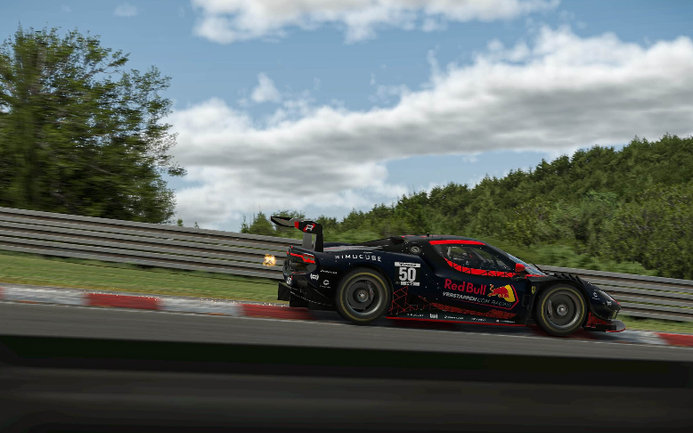
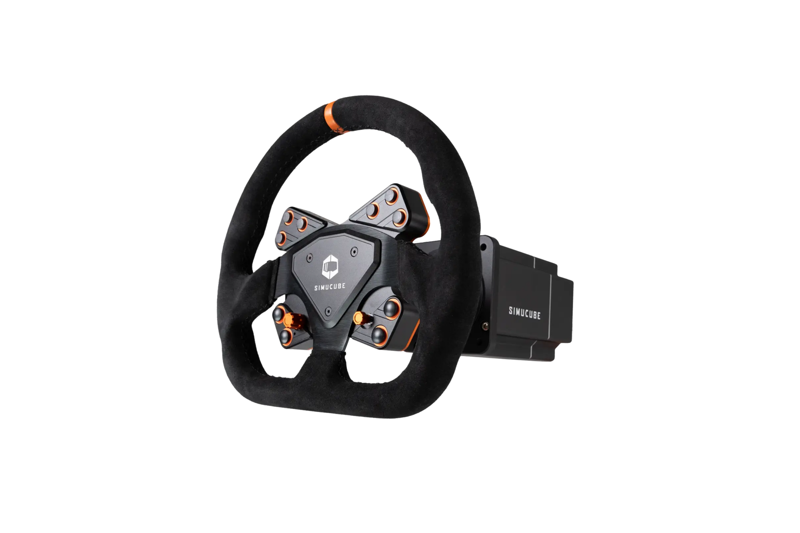
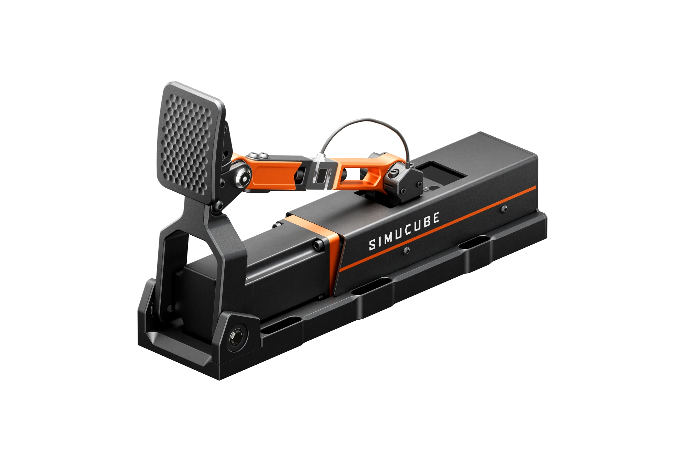

## 심레이싱이란?

심레이싱은 가상으로 트랙에서 다른 사람들과 경주하는 이스포츠입니다. PC와 실제 자동차를 운전하는 것처럼 느껴지게 하는 장비로 진행됩니다.

오늘날 빠르게 성장하는 스포츠이며, 현재 장치의 현실성은 최고 모터스포츠 드라이버들도 레이스 연습을 위해 심레이싱을 사용할 수 있게 합니다. 포스 피드백을 제공하는 ActivePedal과 같은 혁신으로 Simucube는 가장 현실적인 경험을 원하는 사람들을 위한 선택입니다.

심레이싱 커뮤니티는 다양한 배경을 가진 레이싱 애호가들의 열정적인 그룹으로, 초보자부터 노련한 베테랑까지 포함합니다. 커뮤니티는 iRacing과 Assetto Corsa 같은 인기 시뮬레이터에서 온라인 이벤트와 대회를 참여하고 조직하며 다양한 레이싱 종목을 다룹니다.

## Simucube 소개

**Simucube**는 핀란드 탐페레에 본사를 둔 **Granite Devices Oy**가 운영하는 프리미엄 심레이싱(Sim Racing) 장비 제조사입니다. 실제 레이스카의 경험을 제공하면서도 실제 레이싱보다 훨씬 저렴한 비용으로 경쟁적인 레이싱 욕구를 충족시킬 수 있는 최고급 시뮬레이터 장비를 제공합니다.

60명 이상의 전문가로 구성된 Simucube 팀은 다양한 관심사와 재능을 가진 인재들로 이루어져 있으며, 전 세계 심레이서들에게 최고의 장비와 프리미엄 서비스를 제공하는 것에 열정을 쏟고 있습니다. 특히 Simucube는 직원 소유(employee-owned) 회사로, 팀원들이 회사의 주인이자 운영자입니다.

심레이싱 커뮤니티는 Simucube의 핵심입니다. 글로벌 이벤트에 적극적으로 참여하고, 활발한 Discord 채널을 통해 열정적인 심레이서들이 직접 제품 개발에 영향을 미칩니다. 커뮤니티의 피드백이 바로 Simucube의 제품 개발을 이끌어갑니다.

## 회사의 역사

Simucube의 여정은 커뮤니티와 함께 성장해온 혁신의 역사입니다:

### 2007-2016: 시작
Simucube의 모회사인 Granite Devices Oy가 설립되었습니다. 처음 8년간은 산업용 프로젝트에 주력했으며, 2015년 심레이싱 커뮤니티가 Granite Devices에 접근하면서 최초의 다이렉트 드라이브 포스 피드백 휠베이스에 대한 논의가 시작되었습니다.

### 2017: Simucube 1 출시
커뮤니티의 의견을 반영하여 Granite Devices는 Simucube 1 다이렉트 드라이브 포스 피드백 휠베이스 시스템을 설계하고 출시하며 심레이싱 시장에 진입했습니다.

### 2019-2020: Simucube 2와 브랜드 전환
Granite Devices는 선구적인 다이렉트 드라이브 휠베이스 솔루션인 Simucube 2를 선보였습니다. 제품은 심레이싱 커뮤니티에서 빠르게 인기를 얻었고, Granite Devices는 심레이싱에 집중하기 위해 Simucube로 브랜드를 전환하기로 결정했습니다.

### 2022: ActivePedal 혁명
Simucube는 세계 최초의 포스 피드백 페달인 Simucube ActivePedal을 출시하여 심레이싱 업계에 새로운 제품 카테고리를 창출했습니다. 이는 시장에서 전례 없던 독특한 기술을 제시했습니다.

### 2024년 그리고 미래
Simucube는 계속해서 게임 체인저가 될 혁신을 선보이며 제품 라인업과 회사를 확장하고 있습니다.

## 주요 제품 라인업

### Simucube 3 Wheelbase - 최신 세대

Simucube의 최신 다이렉트 드라이브 휠베이스 시리즈인 Simucube 3는 기술 혁신의 정점을 보여줍니다. 더욱 향상된 성능과 정밀도로 심레이싱 경험을 한 단계 끌어올립니다.

### Simucube 2 Direct Drive Wheelbase

검증된 성능의 Simucube 2 다이렉트 드라이브 휠베이스는 세 가지 모델로 제공됩니다:

- **Simucube 2 Sport**: 입문자를 위한 고품질 모델
- **Simucube 2 Pro**: 가장 인기 있는 중급 모델
- **Simucube 2 Ultimate**: 최상위 플래그십 모델

#### 주요 특징

- **초저지연(Ultra-low latency)**: 항상 최고의 반응성 제공
- **내구성(Built to last)**: 고품질 산업용 재료로 제작
- **부드러운 감각(Smooth feeling)**: 스로틀링, 코깅, 노칭 현상 제로
- **최고의 정밀도(Ultimate precision)**: 트랙의 가장 미세한 디테일까지 느낄 수 있음

### Simucube ActivePedal

심레이싱의 가장 정밀하고 일관된 페달 시스템으로, 최고의 랩타임을 더욱 일관되게 기록할 수 있도록 도와줍니다.

#### ActivePedal 라인업

- **ActivePedal Pro**: 전문가용 액티브 브레이크 페달
- **ActivePedal Ultimate**: 최상위 브레이크 페달 모델
- **ActivePedal Ultimate + Throttle**: 브레이크와 스로틀 통합 번들
- **Simucube Throttle**: 독립형 스로틀 페달

#### ActivePedal의 장점

- 주행 중 완전한 조정 가능
- 실제 자동차 효과 구현
- 모든 차량을 위한 프로필 제공
- 무한한 피드백 옵션
- 세계 최초의 포스 피드백 페달 기술

### 스티어링 휠 및 번들

다양한 스티어링 휠과 번들 패키지를 제공합니다:
- **Formula 번들**: 포뮬러 레이싱용
- **GT 번들**: GT 레이싱용
- **Rally 번들**: 랠리 및 드리프트 레이싱용

주요 스티어링 휠 모델:
- FPEv2
- X29 (GSI X-29)
- Tahko GT-21
- Tahko Round
- Valo (Valo Leather, Valo Evo 포함)
- Ascher Artura (Sport, Pro)
- Ascher F64 V3

## 프로페셔널들의 선택

Simucube는 세계 최고 수준의 레이싱 드라이버들과 팀이 신뢰하는 브랜드입니다. 실제 모터스포츠에서 활약하는 선수들이 연습과 시뮬레이션을 위해 Simucube 장비를 선택합니다.

### 주요 프로 드라이버 및 팀

#### 모터스포츠 레전드
- **Antonio Giovinazzi** - 르망 24시간 레이스 우승자
- **Tony Kanaan** - IndyCar 레전드
- **Juan Pablo Montoya** - 전 F1, NASCAR, IndyCar 드라이버
- **Heikki Kovalainen** - 전 F1 드라이버, 현 랠리 드라이버

#### 현역 프로 레이서
- **James Baldwin** - GT 드라이버
- **Nolan Siegel** - Arrow McLaren IndyCar 드라이버
- **Sebastian Montoya** - F2 드라이버
- **Tatiana Calderón** - IMSA SportsCar Championship
- **Charlie Martin** - GT 드라이버

#### 드리프트 챔피언
- **Krisse Aalto** - 드리프팅 드라이버
- **Alan Hynes** - 드리프팅 드라이버

#### 심레이싱 엘리트 팀
- **Team Redline** - 세계 최고의 심레이싱 팀

이들 프로페셔널들이 Simucube를 선택하는 이유는 명확합니다. 실제 레이스카와 가장 유사한 피드백과 정밀도, 그리고 절대적인 신뢰성입니다.

## 고객 만족도

실제 사용자들의 평가:

> "휠베이스의 골드 스탠다드입니다. 몇 년간의 공백 후 심레이싱으로 돌아왔을 때, Simucube를 다시 구매하는 것은 의심의 여지가 없었습니다. 두 개의 Simucube 2 Sport 베이스를 사용했고, 둘 다 문제가 전혀 없었습니다."  
> **- Jason**

> "수년간 Simucube 제품을 사용해 왔습니다. Simucube 2 Pro를 구매했는데 환상적입니다. 최근 ActivePedal을 구입했는데 기대를 뛰어넘었습니다. 품질이 뛰어나고 관리 소프트웨어가 훌륭합니다. 오랫동안 충성 고객으로 남을 계획입니다."  
> **- Gianluca Capellini**

> "Simucube 2 Pro는 놀랍습니다! 정말로 8nm 베이스에서 이것으로 전환했는데 정말 큰 변화입니다! 고객 서비스는 말할 것도 없이 매우 빠르고 효율적입니다. 10점 만점에 10점!"  
> **- Luis Martin**

## 회사 정보

- **회사명**: Granite Devices Oy
- **본사 위치**: Visiokatu 3 (Hermia 6), FI-33720 Tampere, Finland
- **VAT ID**: FI26771487
- **웹사이트**: [simucube.com](https://simucube.com/)

## 결론

**Simucube**는 심레이싱의 최첨단을 달리는 프리미엄 브랜드입니다. 단순히 게임 주변기기를 넘어, 실제 레이싱의 경험을 가정에서 구현하고자 하는 비전을 가지고 있습니다.

Simucube가 업계 리더인 이유:
- **검증된 품질**: 1% 미만의 불량률과 탱크같은 내구성
- **프로들의 선택**: F1, IndyCar, 르망 우승자들이 신뢰하는 장비
- **혁신의 역사**: 세계 최초 포스 피드백 페달 개발
- **커뮤니티 중심**: 사용자 피드백이 제품 개발을 주도
- **사람 우선 철학**: 직원 소유 회사로 장기적 비전 추구
- **탁월한 지원**: 프리미엄 제품에 걸맞은 고객 서비스

심레이싱에 진지하게 투자하고자 하는 레이싱 애호가라면, Simucube는 최고의 선택이 될 것입니다. Antonio Giovinazzi, Tony Kanaan, Juan Pablo Montoya 같은 프로페셔널들과 동일한 장비로 당신의 레이싱 실력을 한 단계 끌어올려 보세요.

Simucube는 단순히 장비를 판매하는 회사가 아닙니다. 심레이싱 기술의 경계를 넓히고, 커뮤니티와 함께 성장하며, 모든 레이서가 최고의 경험을 할 수 있도록 헌신하는 기술 리더입니다.

**참고 링크**: [Simucube 공식 웹사이트](https://simucube.com/)

