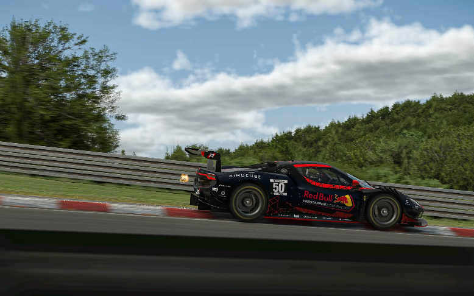
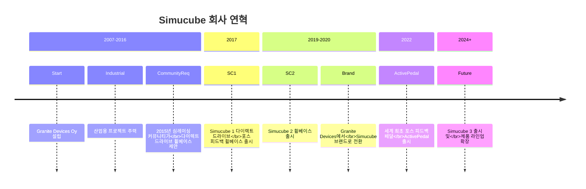
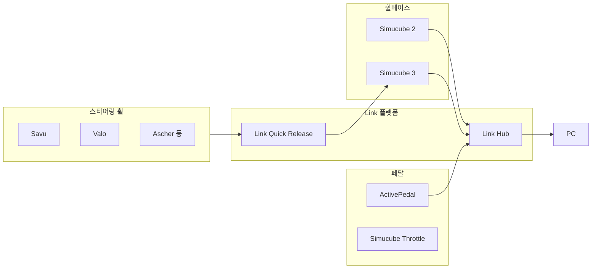
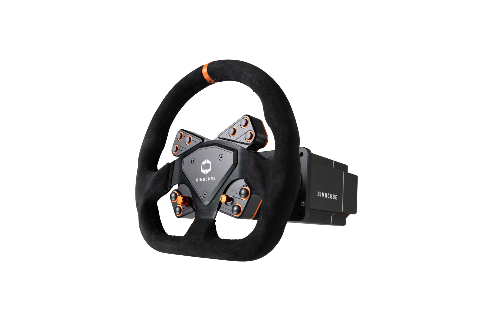
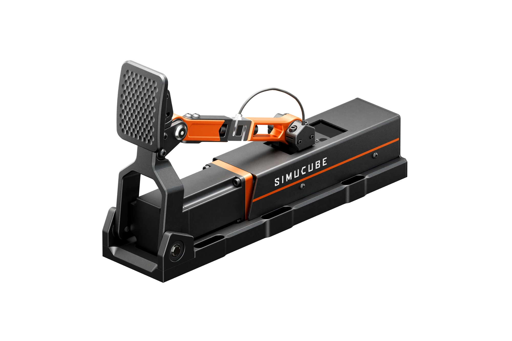

## 개요

**Simucube**는 핀란드 탐페레에 본사를 둔 **Granite Devices Oy**가 운영하는 프리미엄 심레이싱(Sim Racing) 장비 제조사다. 다이렉트 드라이브 휠베이스와 세계 최초 포스 피드백 페달(ActivePedal)로 프로 레이서와 심레이싱 엘리트 팀이 널리 사용한다.

- **한 줄 요약**: 실제 레이스카에 가까운 피드백과 정밀도를 제공하는 심레이싱 장비의 업계 표준 브랜드.
- **추천 대상**: 심레이싱에 본격 투자하려는 유저, 프로·아마 레이서 연습용, F1·GT·랠리·드리프트 시뮬레이션을 즐기는 이들.

---

## 심레이싱이란?

심레이싱은 가상 트랙에서 다른 사람들과 경주하는 이스포츠다. PC와 전용 하드웨어(휠·페달·시트 등)로 실제 운전에 가깝게 느껴지도록 구성된다.

오늘날 빠르게 성장하는 스포츠이며, 장비의 현실성이 올라가면서 최상위 모터스포츠 드라이버들도 레이스 연습·시뮬레이션에 심레이싱을 활용한다. Simucube의 다이렉트 드라이브 휠베이스와 포스 피드백 ActivePedal 같은 혁신은, 가장 현실적인 경험을 추구하는 유저들의 선택지가 되었다.

심레이싱 커뮤니티는 초보자부터 베테랑까지 다양한 배경의 레이싱 애호가로 이루어져 있으며, iRacing·Assetto Corsa·rFactor 2 등 시뮬레이터에서 온라인 이벤트와 대회를 운영·참가한다.

---

## Simucube 소개

Simucube는 **실제 레이스카에 가까운 경험**을 제공하면서도, 실제 레이싱보다 훨씬 낮은 비용으로 경쟁 욕구를 채울 수 있는 최상급 시뮬레이터 장비를 만든다.

- **운영 법인**: Granite Devices Oy (핀란드 탐페레)
- **팀 규모**: 60명 이상의 전문가
- **특징**: 직원 소유(employee-owned) 회사로, 팀원이 회사 운영·주인의 역할을 한다.

심레이싱 커뮤니티를 핵심으로 둔다. 글로벌 이벤트 참여, Discord 등 채널을 통해 유저 피드백을 수집하고, 그 피드백이 제품 개발 방향에 직접 반영된다.

---

## 회사의 역사

Simucube의 성장은 커뮤니티와 함께한 혁신의 연대기다. 아래 타임라인은 주요 마일스톤을 요약한 것이다.

```mermaid
timeline
    title Simucube 회사 연혁
    section 2007-2016
        Start : Granite Devices Oy 설립
        Industrial : 산업용 프로젝트 주력
        CommunityReq : 2015년 심레이싱 커뮤니티가</br>다이렉트 드라이브 휠베이스 제안
    section 2017
        SC1 : Simucube 1 다이렉트 드라이브</br>포스 피드백 휠베이스 출시
    section 2019-2020
        SC2 : Simucube 2 휠베이스 출시
        Brand : Granite Devices에서</br>Simucube 브랜드로 전환
    section 2022
        ActivePedal : 세계 최초 포스 피드백 페달</br>ActivePedal 출시
    section 2024+
        Future : Simucube 3 출시 및</br>제품 라인업 확장
```

### 2007–2016: 시작

모회사 Granite Devices Oy가 설립되었다. 처음 8년간은 산업용 프로젝트에 주력했고, 2015년 심레이싱 커뮤니티가 Granite Devices에 접근하면서 최초의 다이렉트 드라이브 포스 피드백 휠베이스에 대한 논의가 시작되었다.

### 2017: Simucube 1 출시

커뮤니티 의견을 반영해 Granite Devices는 Simucube 1 다이렉트 드라이브 포스 피드백 휠베이스 시스템을 설계·출시하며 심레이싱 시장에 진입했다.

### 2019–2020: Simucube 2와 브랜드 전환

선구적인 다이렉트 드라이브 휠베이스인 Simucube 2를 선보였다. 제품이 심레이싱 커뮤니티에서 빠르게 인기를 얻었고, 심레이싱에 집중하기 위해 브랜드를 Simucube로 전환했다.

### 2022: ActivePedal

세계 최초의 포스 피드백 페달인 Simucube ActivePedal을 출시해, 심레이싱 업계에 새로운 제품 카테고리를 만들었다.

### 2024년 이후

Simucube 3 휠베이스와 Link 플랫폼(Quick Release, Link Hub, Tuner 3.0) 등 다음 세대 혁신을 이어가며 제품 라인업과 회사 규모를 확장하고 있다.

---

## 제품 생태계 구조

Simucube 제품은 휠베이스·스티어링 휠·페달·Link Hub로 구성되며, Simucube 3부터는 Link 플랫폼으로 통합 관리된다.

```mermaid
flowchart LR
    subgraph Wheelbase["휠베이스"]
        SC2["Simucube 2"]
        SC3["Simucube 3"]
    end
    subgraph Pedals["페달"]
        AP["ActivePedal"]
        Throttle["Simucube Throttle"]
    end
    subgraph Link["Link 플랫폼"]
        LinkHub["Link Hub"]
        LinkQR["Link Quick Release"]
    end
    subgraph Wheels["스티어링 휠"]
        Savu["Savu"]
        Valo["Valo"]
        Ascher["Ascher 등"]
    end
    PC["PC"]
    LinkHub --> PC
    SC2 --> LinkHub
    SC3 --> LinkHub
    AP --> LinkHub
    LinkQR --> SC3
    Wheels --> LinkQR
```

---

## 주요 제품 라인업

### Simucube 3 Wheelbase (최신 세대)

Simucube 3는 차세대 다이렉트 드라이브 휠베이스 시리즈다. 새로운 제어 알고리즘, P3G 폴리곤 퀵 릴리즈(Simucube Link Quick Release), 전용 Tuner 3.0 소프트웨어로 반응성과 정밀도를 높였다.

| 모델 | 토크 | 보증 | 비고 |
|------|------|------|------|
| Simucube 3 Sport | 15 Nm | 3년 | 진입용 |
| Simucube 3 Pro | 25 Nm | 3년 | 인기 모델 |
| Simucube 3 Ultimate | 35 Nm | 5년 | IPM 모터, 2026 출시 |

- **초저지연**: Link Hub를 통한 극히 빠른 폴링으로 반응성 확보
- **정밀도**: 레이저 스캔 기반 개별 보정, 텔레메트리 효과(ABS·RPM·노면 등)
- **Link Quick Release**: 전원·데이터 통과(Simucube LightBridge), 마모 없는 결합

### Simucube 2 Direct Drive Wheelbase

검증된 Simucube 2 다이렉트 드라이브 휠베이스는 세 가지 모델로 제공된다.

- **Simucube 2 Sport**: 입문용 고품질
- **Simucube 2 Pro**: 가장 인기 있는 중급
- **Simucube 2 Ultimate**: 플래그십

#### 공통 특징

- **초저지연(Ultra-low latency)**: 높은 반응성
- **내구성**: 산업용급 소재
- **부드러운 감각**: 스로틀링·코깅·노칭 최소화
- **정밀도**: 트랙의 미세한 디테일까지 전달

### Simucube ActivePedal

심레이싱용 포스 피드백 페달로, 브레이크·스로틀의 힘과 반응을 소프트웨어로 세밀하게 조정할 수 있다.

#### ActivePedal 라인업

- **ActivePedal Pro**: 전문가용 액티브 브레이크
- **ActivePedal Ultimate**: 최상위 브레이크
- **ActivePedal Ultimate + Throttle**: 브레이크·스로틀 번들
- **Simucube Throttle**: 독립 스로틀 페달

#### 장점

- 주행 중 실시간 조정
- 실제 차량에 가까운 효과 구현
- 차량별 프로필 지원
- 다양한 피드백 옵션
- 세계 최초 포스 피드백 페달 기술

### 스티어링 휠 및 번들

- **Formula·GT·Rally 번들**: 용도별 패키지
- **주요 휠**: FPEv2, X29(GSI X-29), Tahko GT-21, Tahko Round, Valo(Leather·Evo), Ascher Artura(Sport·Pro), Ascher F64 V3, Savu(Sport·Pro) 등

Simucube 3는 Simucube Link 호환 휠(BavarianSimTec Delta Pro SC, Lovely Dashboard 등)과 함께 플러그 앤 플레이로 사용할 수 있다.

---

## 프로페셔널들의 선택

Simucube는 세계 최고 수준의 레이싱 드라이버와 팀이 연습·시뮬레이션에 사용하는 브랜드다. 실제 레이스카와 유사한 피드백, 정밀도, 신뢰성이 선택 이유로 꼽힌다.

### 주요 프로 드라이버 및 팀

- **모터스포츠 레전드**: Antonio Giovinazzi(르망 24시간 우승), Tony Kanaan(IndyCar), Juan Pablo Montoya(전 F1·NASCAR·IndyCar), Heikki Kovalainen(전 F1·랠리)
- **현역 프로**: James Baldwin(GT), Nolan Siegel(Arrow McLaren IndyCar), Sebastian Montoya(F2), Tatiana Calderón(IMSA), Charlie Martin(GT)
- **드리프트**: Krisse Aalto, Alan Hynes
- **심레이싱 팀**: Team Redline(공식 파트너)

공식 사이트의 [Athletes, racers and teams](https://simucube.com/athletes-racers-and-teams/)에서 선수·팀 소개와 사용 장비를 확인할 수 있다.

---

## 고객 만족도

실제 사용자 평가 일부를 인용한다.

> "휠베이스의 골드 스탠다드입니다. 몇 년간의 공백 후 심레이싱으로 돌아왔을 때, Simucube를 다시 구매하는 것은 의심의 여지가 없었습니다. 두 개의 Simucube 2 Sport 베이스를 사용했고, 둘 다 문제가 전혀 없었습니다."  
> **— Jason**

> "수년간 Simucube 제품을 사용해 왔습니다. Simucube 2 Pro를 구매했는데 환상적입니다. 최근 ActivePedal을 구입했는데 기대를 뛰어넘었습니다. 품질이 뛰어나고 관리 소프트웨어가 훌륭합니다. 오랫동안 충성 고객으로 남을 계획입니다."  
> **— Gianluca Capellini**

> "Simucube 2 Pro는 놀랍습니다! 8nm 베이스에서 이것으로 전환했는데 정말 큰 변화입니다! 고객 서비스는 말할 것도 없이 매우 빠르고 효율적입니다. 10점 만점에 10점!"  
> **— Luis Martin**

---

## 회사 정보 및 구매

- **회사명**: Granite Devices Oy
- **본사**: Visiokatu 3 (Hermia 6), FI-33720 Tampere, Finland
- **VAT ID**: FI26771487
- **공식 스토어·지원**: [simucube.com](https://simucube.com/) — 제품 구매, 보증(최대 5년), 30일 무료 반품, 테스트 센터 검색, 고객 지원 안내

---

## 종합 평가

### 장점

- **검증된 품질**: 낮은 불량률, 산업용급 내구성
- **프로 채택**: F1·IndyCar·르망 우승자·Team Redline 등이 사용
- **기술 혁신**: 세계 최초 포스 피드백 페달(ActivePedal), Simucube 3·Link 플랫폼
- **커뮤니티 중심**: 사용자 피드백이 제품 개발에 반영
- **직원 소유**: 장기 비전과 품질에 대한 책임
- **지원**: 프리미엄 제품에 맞는 고객 서비스, 긴 보증

### 한 줄 평

**실제 레이스에 가깝게 연습하고 싶다면, Simucube는 업계 표준에 가까운 선택이다.** 프로와 동일한 휠베이스·페달로 일관된 피드백과 정밀도를 얻을 수 있다.

심레이싱에 본격 투자하려는 레이싱 애호가라면, Simucube 제품과 공식 스토어·문서를 통해 라인업과 호환성을 확인한 뒤 예산과 용도에 맞는 모델을 고르는 것을 권한다.

---

## 참고 문헌

1. **Simucube 공식 웹사이트** — 제품 소개, 스토어, 지원. [https://simucube.com/](https://simucube.com/)
2. **Simucube 3** — 차세대 다이렉트 드라이브 휠베이스 상세. [https://simucube.com/simucube-3](https://simucube.com/simucube-3)
3. **Athletes, racers and teams** — Simucube를 사용하는 프로 드라이버·팀 소개. [https://simucube.com/athletes-racers-and-teams/](https://simucube.com/athletes-racers-and-teams/)
