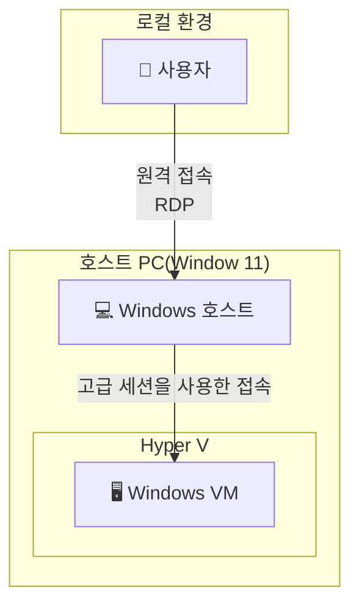
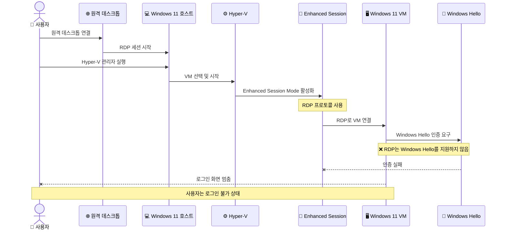
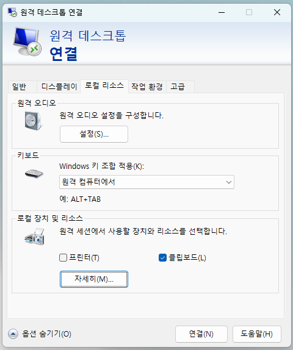
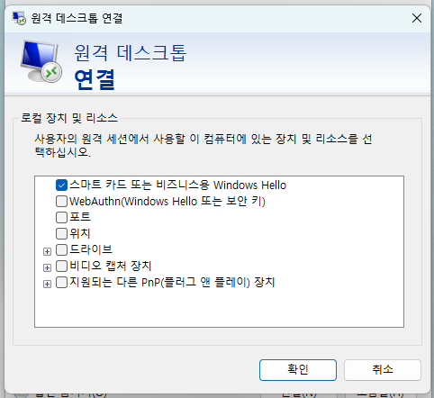

## 문제 상황

호스트 PC에 원격 데스크톱으로 연결한 상태에서 Hyper-V 가상 머신을 사용하는 경우, 특히 고급 세션 모드(Enhanced Session Mode)로 Windows VM에 로그인할 때 문제가 발생할 수 있습니다.

Hyper-V 가상 머신에서 고급 세션 모드를 사용할 때, Windows Hello로 로그인하려고 하면 다음과 같은 문제가 발생할 수 있습니다:

- 로그인 화면이 나타나지 않음
- 화면이 잠금 화면 배경에서 멈춤
- 아무런 입력도 받지 않는 상태로 고정됨
- 마우스와 키보드가 반응하지 않음

이 문제는 특히 Windows VM에 Microsoft 계정으로 로그인하고 Windows Hello PIN을 설정한 경우 자주 발생합니다.

### 시스템 구성도



### 문제 발생 흐름



## 문제의 원인

이 문제의 근본 원인은 **원격 데스크톱 환경에서 Hyper-V 고급 세션 모드를 사용할 때 RDP 프로토콜이 이중으로 사용되기 때문**입니다.

### 기술적 배경

1. **이중 RDP 연결 구조**
   - **1차 RDP**: 사용자 PC → Windows 11 호스트 PC (원격 데스크톱 연결)
   - **2차 RDP**: 호스트 PC → Hyper-V VM (Enhanced Session Mode)
   - 두 계층 모두 RDP 프로토콜을 사용하여 연결

2. **RDP와 Windows Hello의 비호환성**
   - RDP 프로토콜은 Windows Hello의 생체 인식(지문, 얼굴 인식) 인증을 지원하지 않습니다
   - PIN 기반의 Windows Hello 인증도 RDP 환경에서는 작동하지 않습니다
   - 이는 RDP 프로토콜의 근본적인 설계 제약사항입니다
   - 특히 원격 환경에서는 보안상의 이유로 더욱 제한됩니다

3. **원격 환경에서의 추가 문제**
   - 이미 원격 데스크톱으로 연결된 상태에서 VM에 다시 RDP로 접속
   - Windows Hello는 로컬 하드웨어(TPM, 생체인식 센서)에 의존하는데, 이중 원격 환경에서는 접근 불가
   - VM 내부의 Windows Hello가 인증을 요구하지만 RDP로는 응답할 수 없음

4. **결과적인 증상**
   - VM이 Windows Hello 인증을 요구하지만, RDP는 이를 처리할 수 없음
   - 로그인 화면이 표시되지 않거나 잠금 화면에서 멈춘 상태로 나타남
   - 마우스와 키보드 입력이 전혀 반응하지 않음

## 해결 방법

원격 환경에서 이 문제를 해결하는 4가지 방법을 소개합니다. **방법 2**(VM에서 Windows Hello 비활성화)가 가장 근본적이고 권장되는 해결책입니다.

### 방법 1: 일시적으로 고급 세션 모드 비활성화

원격 데스크톱으로 호스트에 연결한 상태에서 가장 빠르게 적용할 수 있는 임시 해결책입니다.

#### 단계별 절차

1. Hyper-V 가상 머신 연결 창에서 상단 메뉴의 **View(보기)** 클릭
2. **Enhanced Session(고급 세션)** 옵션을 선택 해제
3. 기본 세션 모드로 전환되면 일반 암호 입력 화면이 나타남
4. 암호를 입력하여 로그인

#### 장단점

**장점:**
- 즉시 적용 가능
- 추가 설정 불필요

**단점:**
- 고급 세션 모드의 기능을 사용할 수 없음 (클립보드 공유, 드라이브 마운트 등)
- VM을 시작할 때마다 반복해야 함
- 임시 해결책일 뿐 근본적인 해결은 아님

### 방법 2: VM에서 Windows Hello 비활성화 (권장)

가장 근본적이고 권장되는 해결 방법입니다.

#### 단계별 절차

**1단계: 기본 모드로 VM에 로그인**
```
1. VM 연결 창의 View 메뉴에서 "Enhanced Session" 선택 해제
2. 기본 모드로 전환
3. 암호를 입력하여 VM에 로그인
```

**2단계: VM 내부에서 Windows Hello 비활성화**
```
1. 설정(Settings) 앱 열기 (Win + I)
2. 계정(Accounts) → 로그인 옵션(Sign-in options) 이동
3. "Windows Hello 로그인 필요" 옵션 찾기
4. 해당 옵션을 끄기(Off)로 설정
5. PIN 대신 암호 사용 옵션 선택
```

**3단계: 고급 세션 모드 재활성화**
```
1. VM 연결 종료
2. Hyper-V 관리자 열기
3. 파일 → Hyper-V 설정 클릭
4. "고급 세션 모드 정책" 확인 및 활성화
5. "고급 세션 모드" 확인 및 활성화
```

**4단계: 정상 작동 확인**
```
1. VM 다시 시작
2. 고급 세션 모드로 자동 연결 확인
3. 암호로 정상 로그인 확인
4. 클립보드 공유 등 고급 기능 작동 확인
```

#### 장점

- 고급 세션 모드의 모든 기능을 사용 가능
- 영구적인 해결책
- VM 성능과 사용성 최적화

#### 주의사항

- Windows Hello를 사용하고 싶다면 기본 세션 모드를 사용해야 함
- 로컬 PC에서는 Windows Hello를 계속 사용 가능 (VM 내부만 비활성화)

### 방법 3: 로컬 계정으로 전환

Microsoft 계정 대신 로컬 계정을 사용하는 방법입니다.

#### 단계별 절차

**1단계: 로컬 계정 생성**
```
1. 설정 → 계정 → 가족 및 다른 사용자
2. "이 PC에 다른 사용자 추가" 클릭
3. "이 사용자의 로그인 정보가 없습니다" 선택
4. "Microsoft 계정이 없는 사용자 추가" 선택
5. 사용자 이름과 암호 설정
```

**2단계: 관리자 권한 부여**
```
1. 생성한 계정 클릭
2. "계정 유형 변경" 선택
3. "관리자"로 변경
```

**3단계: 로컬 계정으로 로그인**
```
1. VM 로그아웃
2. 새로 생성한 로컬 계정으로 로그인
3. 고급 세션 모드 사용 확인
```

#### 장단점

**장점:**
- Microsoft 계정 동기화 문제 회피
- 더 빠른 로그인
- 호환성 문제 감소

**단점:**
- Microsoft 계정의 동기화 기능 사용 불가
- OneDrive 자동 연동 등의 기능 제한
- 기존 사용자 프로필 이전 필요 가능

### 방법 4: RDP 연결 시 스마트 카드 또는 비지니스용 Windows Hello 활성화

Windows의 원격 데스크톱 연결 설정에서 특정 옵션을 활성화하여 문제를 해결할 수 있습니다.

#### 단계별 절차

**1단계: 원격 데스크톱 연결 설정 열기**
```
1. 시작 메뉴에서 "원격 데스크톱 연결" 검색 및 실행
2. 또는 Win + R → "mstsc" 입력 후 실행
```

**2단계: 고급 설정으로 이동**


```
1. 원격 데스크톱 연결 창에서 "옵션 표시" 클릭
2. "로컬 리소스" 탭 클릭
3. "로컬 장치 및 리소스" 섹션 찾기
```

**3단계: 스마트 카드 또는 비지니스용 Windows Hello 활성화**



```
1. "스마트 카드 또는 비지니스용 Windows Hello" 옵션 체크
2. 필요시 다른 옵션도 함께 설정:
   - WebAuthn(Windows Hello 또는 보안 키)
   - 그룹
   - 위치
   - 드라이브
   - 기타 지원되는 다른 PnP(플러그 앤 플레이) 장치
```

**4단계: 연결 설정 저장 및 적용**
```
1. "일반" 탭으로 이동
2. 컴퓨터 이름에 VM 주소 입력 (localhost 또는 VM IP)
3. "저장" 버튼 클릭하여 설정 저장
4. "연결" 버튼으로 연결 시도
```

#### Hyper-V에서 적용하는 방법

Hyper-V의 고급 세션 모드도 내부적으로 RDP를 사용하므로, 이 설정이 도움이 될 수 있습니다:

```powershell
# PowerShell 관리자 권한으로 실행
# VM에 대한 Enhanced Session 설정 확인
Get-VMHost | fl *Enhanced*

# Enhanced Session Mode 활성화
Set-VMHost -EnableEnhancedSessionMode $true
```

#### 장단점

**장점:**
- Windows Hello를 VM에서 비활성화하지 않아도 됨
- RDP 프로토콜 레벨에서 인증 방식 변경
- 비지니스용 Windows Hello 지원
- 보안성 유지 가능

**단점:**
- 모든 환경에서 작동하지 않을 수 있음
- 비지니스용 Windows Hello가 구성되어 있어야 효과적
- 일반 Windows Hello PIN과는 다른 방식

#### 주의사항

- **비지니스용 Windows Hello**는 일반 Windows Hello와 다릅니다
- 조직/회사에서 관리하는 Windows Hello for Business 환경에서 더 효과적
- 개인 PC에서는 방법 2(Windows Hello 비활성화)가 더 간단할 수 있음

#### 언제 이 방법을 사용하나요?

이 방법은 다음 상황에서 유용합니다:
- 비지니스용 Windows Hello가 이미 구성된 환경
- 조직 정책상 Windows Hello를 비활성화할 수 없는 경우
- VM에서도 강력한 인증을 유지해야 하는 경우
- 보안 컴플라이언스 요구사항이 있는 경우

## 추가 팁 및 문제 해결

### 원격 데스크톱 연결 최적화

원격 환경에서 Hyper-V를 사용할 때 추가 권장사항:

1. **안정적인 네트워크 연결 유지**
   - 원격 데스크톱 연결이 끊기면 VM 세션도 영향을 받을 수 있습니다
   - 가능하면 유선 연결 사용을 권장합니다

2. **RDP 세션 설정 조정**
   - 원격 데스크톱 연결 시 "컴퓨터 구성 저장"으로 설정을 보관하세요
   - 디스플레이 해상도와 색상 설정을 적절히 조정하여 성능 향상

3. **호스트 PC 성능 고려**
   - 원격으로 접속한 호스트에서 VM을 실행하므로 충분한 리소스 필요
   - 최소 16GB RAM, 가능하면 32GB 이상 권장

### Hyper-V 설정 확인

원격 데스크톱으로 연결한 호스트에서 고급 세션 모드가 제대로 활성화되어 있는지 확인:

```powershell
# PowerShell 관리자 권한으로 실행
Get-VMHost | Select-Object -Property EnableEnhancedSessionMode
```

결과가 `True`인지 확인합니다.

### VM 설정 확인

특정 VM에 대한 고급 세션 설정 확인:

```powershell
# VM 이름을 실제 VM 이름으로 변경
Get-VM -Name "VM이름" | Select-Object -Property EnhancedSessionTransportType
```

### 원격 데스크톱 서비스 확인

VM 내부에서 RDP 서비스가 실행 중인지 확인:

```powershell
# VM 내부에서 실행
Get-Service TermService
```

서비스가 실행 중이어야 합니다.

### 방화벽 설정

드물지만 방화벽이 RDP를 차단하는 경우:

```powershell
# VM 내부에서 관리자 권한으로 실행
Enable-NetFirewallRule -DisplayGroup "원격 데스크톱"
```

## 참고 자료

### 공식 문서
- [Microsoft Learn - Hyper-V Enhanced Session Mode](https://learn.microsoft.com/en-us/virtualization/hyper-v-on-windows/user-guide/enhanced-session-mode)
- [Microsoft Learn - Windows Hello Configuration](https://learn.microsoft.com/en-us/windows/security/identity-protection/hello-for-business/)

### 커뮤니티 자료
- [Reddit - Hyper-V Manager Issues](https://www.reddit.com/r/HyperV/)
- [Spiceworks Community - Hyper-V Discussions](https://community.spiceworks.com/virtualization)
- [Windows 10 Forums - Hyper-V Section](https://www.tenforums.com/virtualization/)

### 동영상 튜토리얼
- "Hyper-V: Fix No Login Screen on Virtual Windows 11" (YouTube)
- "How to Fix Hyper-V Login In Enhanced Session Mode Not Working" (YouTube)
- "No login screen in Hyper-V Windows 11 Enhanced Session" (YouTube)

## 결론

원격 데스크톱 환경에서 Hyper-V 고급 세션 모드를 사용할 때 Windows Hello 로그인 문제는 **이중 RDP 연결 구조와 RDP 프로토콜의 근본적인 제약사항** 때문에 발생합니다.

### 권장 해결 방법

**VM 내부에서 Windows Hello를 비활성화하고 일반 암호 로그인을 사용하는 것**이 가장 현실적이고 안정적인 해결책입니다.

이 방법의 장점:
- ✅ 원격 환경에서 안정적인 VM 접속 가능
- ✅ Enhanced Session Mode의 모든 편의 기능 사용 가능 (클립보드 공유, 드라이브 리디렉션 등)
- ✅ 추가 설정이나 복잡한 구성 불필요
- ✅ 호스트 PC에서는 Windows Hello를 계속 사용하여 보안 유지

### 보안 고려사항

원격으로 접속하는 환경 특성상:
- 호스트 PC의 Windows Hello로 1차 보안 확보
- VM은 개발/테스트 용도로 사용하므로 일반 암호로도 충분
- 필요시 복잡한 암호 정책 적용으로 보안 보완 가능

### 향후 전망

이 문제는 Windows 11의 Microsoft 계정 필수화 정책과 원격 근무 증가로 인해 더욱 빈번하게 발생하고 있습니다. Microsoft에서도 이 문제를 인지하고 있지만, RDP 프로토콜의 구조적 한계와 보안 정책으로 인해 단기간 내 근본적인 해결은 어려울 것으로 보입니다.