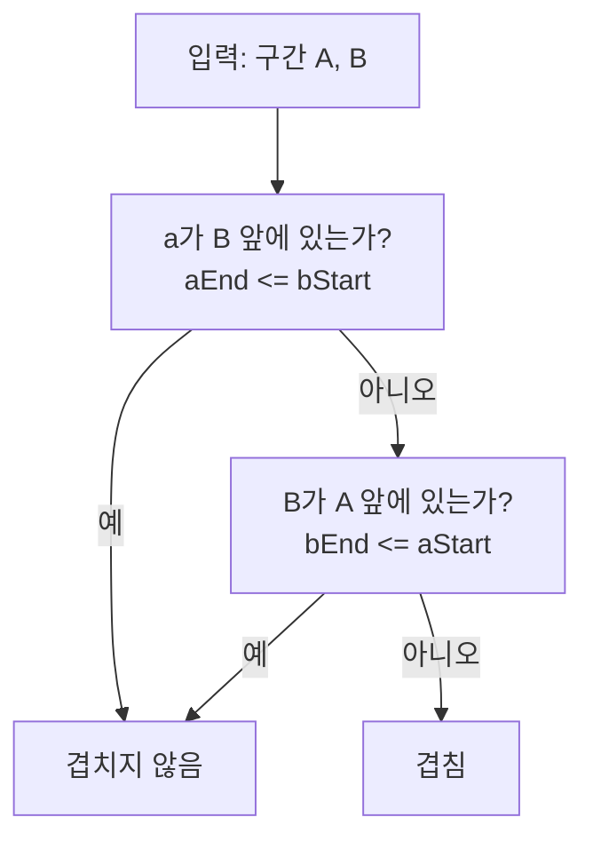

반복적으로 등장하지만 자주 실수하는 문제 중 하나가 **"두 구간이 겹치는가?"**이다. 스케줄링, 시간 범위, 인덱스 구간, AABB 충돌 등 다양한 맥락에서 쓰인다. 이 글에서는 **반열림 구간 규약**과 **부정(negation)을 통한 단순화**에 집중해, 1차원·2차원 겹침 판별을 안정적으로 유도하고 실무 함정까지 정리한다.

**참고**: 구조적 아이디어와 예시는 [How to check for overlapping intervals (zayenz.se)](https://zayenz.se/blog/post/how-to-check-for-overlapping-intervals/)의 부정 기반 접근을 바탕으로 재구성했다.

---

## 개념 요약

- **구간 표현**: 반열림 \([start, end)\) — `start`는 포함, `end`는 미포함. 프로그래밍에서 슬라이스·인덱스·날짜 범위와 잘 맞아 오프바이원 실수를 줄인다.
- **겹침의 정의**: 두 구간에 공통으로 포함되는 점이 하나라도 있으면 겹친다.
- **핵심 관찰**: "겹친다"를 직접 나열하면 경우가 많고 실수하기 쉽다. **"겹치지 않는다"는 경우가 두 가지뿐**이므로, 이를 부정하면 단순한 식이 나온다.

---

## 접근 방식

### 핵심 관찰

두 반열림 구간 \([aStart, aEnd), [bStart, bEnd)\)가 **겹치지 않는** 경우는 다음 둘뿐이다.

1. **a가 b보다 완전히 앞에 있음**: \(aEnd \le bStart\)
2. **b가 a보다 완전히 앞에 있음**: \(bEnd \le aStart\)

따라서 **겹침**은 위 두 조건의 부정이다.

\[
\text{겹침} \iff \lnot(aEnd \le bStart \;\lor\; bEnd \le aStart)
\]

**드모르간 법칙** \(\lnot(P \lor Q) \equiv (\lnot P \land \lnot Q)\)과 부등식 부정(\(\lnot(x \le y) \equiv y < x\))을 적용하면:

\[
(bStart < aEnd) \;\land\; (aStart < bEnd)
\]

즉, **한 줄 조건**으로 정리된다.

### 판별 로직 흐름 (Mermaid)



---

## 1차원 구간: 반열림 [start, end)

두 반열림 구간 \((aStart, aEnd), (bStart, bEnd)\)에 대해:

\[
a \text{와 } b \text{가 겹침} \iff bStart < aEnd \;\land\; aStart < bEnd
\]

### 파이썬

```python
# 42jerrykim.github.io에서 더 많은 정보를 확인할 수 있다
def overlaps_half_open(a_start: int, a_end: int, b_start: int, b_end: int) -> bool:
    # [a_start, a_end) and [b_start, b_end)
    return (b_start < a_end) and (a_start < b_end)

def overlaps_closed(a_start: int, a_end: int, b_start: int, b_end: int) -> bool:
    # [a_start, a_end] and [b_start, b_end]
    return (b_start <= a_end) and (a_start <= b_end)
```

### 자바스크립트 / 타입스크립트

```ts
// 42jerrykim.github.io에서 더 많은 정보를 확인할 수 있다
export function overlapsHalfOpen(aStart: number, aEnd: number, bStart: number, bEnd: number): boolean {
  return bStart < aEnd && aStart < bEnd;
}

export function overlapsClosed(aStart: number, aEnd: number, bStart: number, bEnd: number): boolean {
  return bStart <= aEnd && aStart <= bEnd;
}
```

### C++

```cpp
// 42jerrykim.github.io에서 더 많은 정보를 확인할 수 있다
#include <algorithm>
#include <cstdint>

bool overlaps_half_open(int64_t aStart, int64_t aEnd, int64_t bStart, int64_t bEnd) {
    return (bStart < aEnd) && (aStart < bEnd);
}

bool overlaps_closed(int64_t aStart, int64_t aEnd, int64_t bStart, int64_t bEnd) {
    return (bStart <= aEnd) && (aStart <= bEnd);
}
```

### 교집합 기반 동일식

교집합을 직접 만들면 직관이 더 분명해진다. 반열림 규약에서:

\[
[\max(aStart,\, bStart),\; \min(aEnd,\, bEnd)) \text{가 비어있지 않다} \iff \max < \min
\]

```python
# 42jerrykim.github.io에서 더 많은 정보를 확인할 수 있다
def overlaps_via_intersection(a_start, a_end, b_start, b_end):
    inter_start = max(a_start, b_start)
    inter_end = min(a_end, b_end)
    return inter_start < inter_end
```

---

## 2차원 직사각형(AABB): 축 정렬 상자 겹침

축에 정렬된 두 상자 \(A = [Ax1, Ax2) \times [Ay1, Ay2)\), \(B = [Bx1, Bx2) \times [By1, By2)\)는 **두 축 모두에서** 1차원 겹침이 성립해야 겹친다.

\[
Bx1 < Ax2 \;\land\; Ax1 < Bx2 \;\land\; By1 < Ay2 \;\land\; Ay1 < By2
\]

```python
# 42jerrykim.github.io에서 더 많은 정보를 확인할 수 있다
def box_overlaps(a, b) -> bool:
    # a, b: x1, x2, y1, y2 with [x1,x2), [y1,y2)
    return (b.x1 < a.x2) and (a.x1 < b.x2) and (b.y1 < a.y2) and (a.y1 < b.y2)
```

한 축이라도 겹치지 않으면 상자도 겹치지 않는다.

---

## 복잡도 분석

| 항목 | 복잡도 | 비고 |
|------|--------|------|
| **시간 복잡도** | \(O(1)\) | 두 구간의 네 끝점만 비교 |
| **공간 복잡도** | \(O(1)\) | 상수 개 변수 |

2차원 AABB도 축당 \(O(1)\)이므로 전체 \(O(1)\)이다.

---

## 코너 케이스 및 실수 포인트

| 케이스 | 설명 | 처리 방법 |
|--------|------|-----------|
| **반열림 vs 폐구간** | 혼용 시 경계에서 결과가 달라짐 | 한 규약으로 통일. 폐구간이면 `<=` 사용 |
| **빈 구간** | \(start = end\)인 반열림 구간은 빈 구간 | 필요 시 입력 검증: `start <= end` (빈 허용 시 `start == end` 가능) |
| **부동소수점** | `==` 또는 경계 비교가 불안정 | 정수 스케일로 변환하거나 ε-여유 비교 |
| **날짜·타임존** | 서머타임·타임존 전환 | UTC 타임스탬프(정수 ms/초)로 통일 후 반열림 적용 |
| **인자 순서** | `overlaps(a,b)` vs `overlaps(b,a)` | 대칭이어야 함. 단위 테스트로 검증 |

---

## 실무 함정과 체크리스트

- **오프바이원**: 정수 인덱스·날짜 범위는 반열림 \([start, end)\)로 표현하면 경계 처리가 단순하다. 예: 하루 단위는 \([2025-01-01, 2025-01-02)\).
- **폐구간 혼용**: 양쪽이 모두 폐구간이면 `<=`로 바꾼다. 혼합 규약은 피한다.
- **시간/타임존**: 가급적 UTC 타임스탬프(정수)로 변환한 뒤 반열림 규약을 적용한다.
- **부동소수점**: 경계가 실수면 정수 스케일(예: 센티초)로 바꾸거나, 엄격 비교 대신 작은 여유(ε)를 둔다.
- **성질 테스트**: 대칭성, 인자 순서 교환 시 결과 동일, 빈 교집합 판정과의 동치 등을 단위 테스트에 포함한다.

---

## 대량 데이터에서의 응용

- **선 스윕(sweep line)**: 많은 구간의 모든 겹침 쌍을 찾을 때, 시작·끝 이벤트를 정렬해 선 스윕으로 \(O(n \log n + k)\)에 처리할 수 있다.
- **인덱스 구조**: 동적 질의·갱신이 필요하면 인터벌 트리, 세그먼트 트리, 구간 트리를 검토한다.

---

## 요약

- **반열림** \([start, end)\)을 쓰면 경계 오류가 줄어든다.
- **"겹치지 않는다"**의 두 경우를 부정한 식이 가장 단순하다: `bStart < aEnd && aStart < bEnd`.
- **2D AABB**는 축별 겹침의 AND다.
- 실무에서는 타임존·부동소수점·빈 구간·입력 검증까지 고려해 방어적으로 구현하는 것이 좋다.

---

## 참고 문헌 및 출처

- [How to check for overlapping intervals — zayenz.se](https://zayenz.se/blog/post/how-to-check-for-overlapping-intervals/)
- [Interval (mathematics) — Wikipedia](https://en.wikipedia.org/wiki/Interval_(mathematics))
- [What's the most efficient way to test if two ranges overlap? — Stack Overflow](https://stackoverflow.com/questions/3269434/whats-the-most-efficient-way-to-test-if-two-ranges-overlap)
- [Lobsters discussion: How to check for overlapping intervals](https://lobste.rs/s/cireck/how_check_for_overlapping_intervals)
