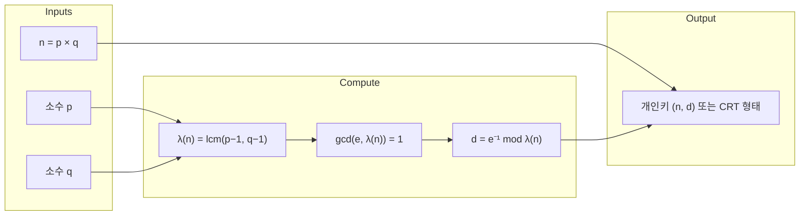

## 개요

현대 RSA의 개인키 정의는 교과서와 달리 **φ(n)이 아니라 λ(n)** 기준으로 바뀌었다. 고전적인 표현처럼 "e · d ≡ 1 (mod φ(n))"가 아니라, IETF·NIST 표준은 **λ(n) = lcm(p−1, q−1, …)** 에 대해 **e · d ≡ 1 (mod λ(n))** 를 만족하는 d를 개인지수로 쓴다. 이 글은 해당 변화가 표준에 어떻게 명시되는지, 왜 λ(n)이 채택되었는지, 실무·보안에 어떤 영향을 주는지까지 한 번에 정리한다.

**이 포스트가 도움이 되는 대상**

- RSA 키 생성·검증을 구현하거나 표준을 따르는 개발자
- φ(n)과 λ(n) 차이를 정확히 알고 싶은 보안·암호 학습자
- RFC 8017, NIST SP 800-56B 등 표준 문서를 해석할 때 참고가 필요한 독자

---

## 표준에서의 명시

### RFC 8017 (PKCS #1 v2.2)

- **§3.1 RSA 공개키**: 공개키 조건에 **"GCD(e, λ(n)) = 1, where λ(n) = LCM(r₁−1, …, rᵤ−1)"** 를 명시한다.
- **§3.2 RSA 개인키**: 개인키 조건에 **"d satisfies e · d ≡ 1 (mod λ(n))"** 를 명시한다. 즉 d는 λ(n)에 대한 e의 모듈러 역원이다.
- 참조: [RFC 8017](https://www.rfc-editor.org/rfc/rfc8017) §3.1, §3.2.

### NIST SP 800-56B Rev.2

- RSA 기반 정수분해 암호에서 키 조건을 **λ(n) 기준**으로 둔다. e와 λ(n)이 서로소이며 **d ≡ e⁻¹ (mod λ(n))** 가 되도록 정의한다.
- 참조: [NIST SP 800-56B Rev.2](https://csrc.nist.gov/pubs/sp/800/56/b/r2/final).

위 두 문서는 실무 표준이 **φ(n)이 아닌 λ(n) 정의**를 채택함을 직접 보여 준다. 개념이 뒤바뀐 것이 아니라, **올바른 최소 주기 λ(n)** 에 대한 모듈러 역원을 쓰도록 정리된 것이다.

---

## 카르마이클 함수 λ(n) 한눈에 보기

**정의**: λ(n)은 **gcd(a, n)=1** 인 모든 정수 a에 대해 **a^λ(n) ≡ 1 (mod n)** 을 만족하는 **가장 작은 양의 정수**다. 즉 \((\mathbb{Z}/n\mathbb{Z})^\times\) 의 **지수(exponent)** 이다.

**성질**

- 항상 **λ(n) | φ(n)** 이며, n = pq (서로 다른 홀수 소수)일 때 **λ(n) = lcm(p−1, q−1)**.
- 일반적으로 \(n = \prod p_i^{r_i}\) 이면 **λ(n) = lcm(λ(p₁^r₁), …, λ(pₖ^rₖ))**.
- 중국인의 나머지 정리(CRT)와 결합해 **a^λ(n) ≡ 1 (mod n)** 이 도출된다.

**RSA와의 연관**: RSA에서 개인지수는 **e · d ≡ 1 (mod λ(n))** 로 두는 것이 표준이며, λ(n) ≤ φ(n) 이라 d가 더 작아지는 경향이 있다.

### λ(n)과 키 정의의 관계 (개념도)

아래 다이어그램은 n, p, q에서 λ(n)을 구하고, 그다음 d를 얻는 흐름을 요약한다.

---

## 왜 φ(n) 대신 λ(n)인가?

- **최소 지수 성질**: λ(n)은 "gcd(a, n)=1 인 모든 a에 대해 a^λ(n) ≡ 1 (mod n)"을 만족하는 **최소** 양의 정수다. φ(n)은 이를 보장하는 (대개 더 큰) **상한**이다.
- **작은 d 유도**: λ(n) | φ(n) 이므로, 같은 e에 대해 d는 보통 더 작게 나와 복호화가 근소하게 빨라질 수 있다.
- **CRT·Garner와의 궁합**: 실제 속도 이득은 λ(n) 자체보다 **CRT 분해**와 **Garner 알고리즘**을 통한 구현 최적화에서 더 크다. 표준도 CRT 지표(dP, dQ, qInv 등)와 Garner를 λ(n) 정의와 일관되게 둔다.

실험적으로 gcd(p−1, q−1)의 기대 크기가 크지 않아 λ(n)/φ(n) 차이만으로의 체감 성능 이득은 작다. 다만 수학적으로 **더 타이트한 지표**를 쓰는 것이 정의상 깔끔하고, CRT 계보와도 자연스럽게 맞닿는다.

---

## 키 생성 관행 업데이트

- **e 고정, d 계산**: 현대 구현은 보통 **e = 65537** 을 고정하고 **d = e⁻¹ mod λ(n)** 을 계산한다. e 선택 이유는 안전성과 성능의 균형(짧은 해밍 무게, 널리 쓰이는 보안 관행)이다.
- **검증 조건**: 표준은 **gcd(e, λ(n)) = 1** 을 요구하며, 개인키 표현은 **(n, d)** 또는 **CRT 형태 (p, q, dP, dQ, qInv, …)** 를 모두 허용한다.

---

## 보안과 성능 관점의 정리

- **보안 수준**: λ(n) 기반 정의는 RSA의 안전 가정(인수분해/지수 역상 난이도)과 양립하며, OAEP·PSS 같은 상위 스킴의 안전성 증명과도 충돌하지 않는다.
- **성능**: λ(n) 사용만으로의 이득은 제한적이다. 실무 성능은 **CRT 분해**, **모듈러 거듭제곱 최적화**, **상수시간 구현**, **캐시/분기 완화**가 좌우한다.

---

## 구현 체크리스트

- **키 검증**: n이 서로 다른 홀수 소수의 곱인지, **gcd(e, λ(n)) = 1** 인지 확인한다.
- **CRT 경로**: **dP = d mod (p−1)**, **dQ = d mod (q−1)**, **qInv = q⁻¹ mod p** 를 정확히 세팅한다.
- **타이밍·에러 채널**: 복호·검증 실패 경로를 통합하고, 블라인딩 등 **부채널 완화**를 적용한다.

---

## 참고 문헌

1. **RFC 8017**: PKCS #1: RSA Cryptography Specifications Version 2.2 — §3.1 (RSA Public Key), §3.2 (RSA Private Key). [https://www.rfc-editor.org/rfc/rfc8017](https://www.rfc-editor.org/rfc/rfc8017)
2. **NIST SP 800-56B Rev.2**: Recommendation for Pair-Wise Key-Establishment Using Integer Factorization Cryptography. [https://csrc.nist.gov/pubs/sp/800/56/b/r2/final](https://csrc.nist.gov/pubs/sp/800/56/b/r2/final)
3. **Wikipedia: Carmichael function**: λ(n) 정의, φ(n)과의 관계, 암호에서의 활용. [https://en.wikipedia.org/wiki/Carmichael_function](https://en.wikipedia.org/wiki/Carmichael_function)
