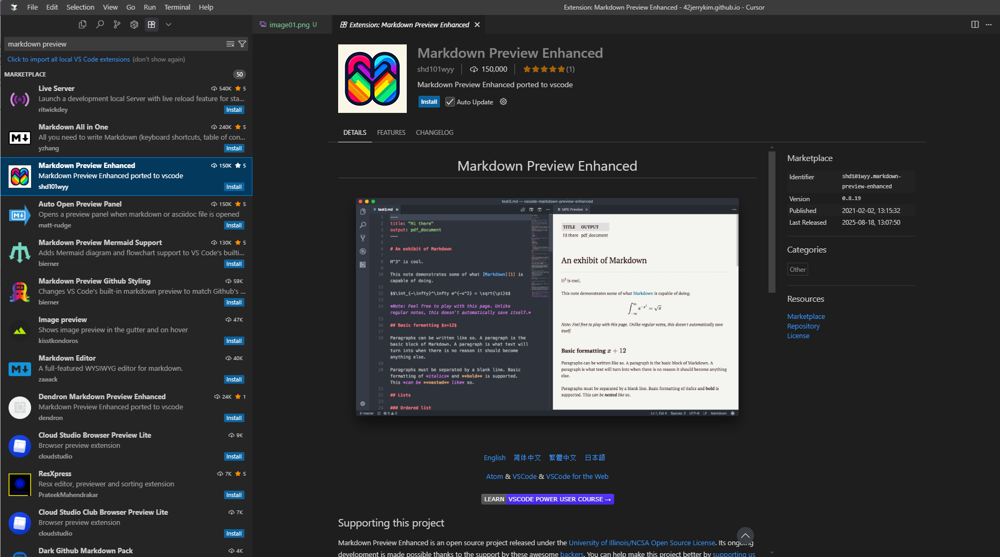
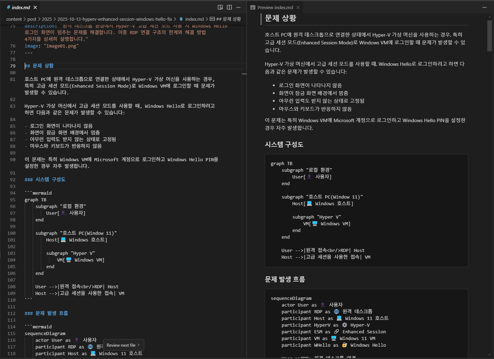
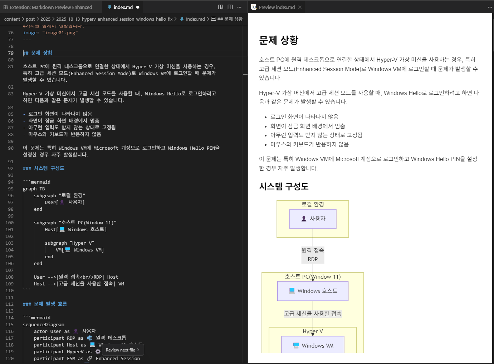
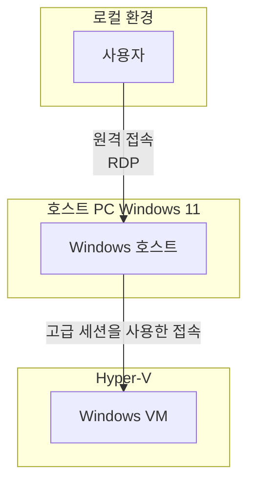
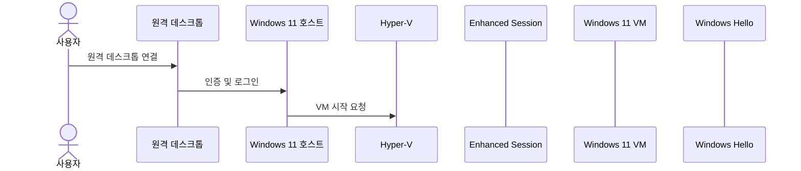
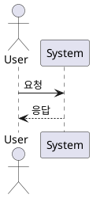

마크다운으로 문서를 작성할 때 다이어그램을 포함해야 하는 경우가 많다. 특히 기술 문서, API 명세, 시스템 설계서를 작성할 때 **플로우차트**, **시퀀스 다이어그램**, **구성도**를 넣으면 이해도가 크게 올라간다. 다만 코드만 있고 미리보기에서 다이어그램이 그대로 텍스트로 나오면 작업 효율이 떨어진다.

**Markdown Preview Enhanced**는 VSCode에서 마크다운 문서를 작성할 때 **PlantUML**, **Mermaid** 등 다이어그램 언어를 실시간으로 렌더링해 보여 주는 익스텐션이다. 기본 마크다운 프리뷰와 달리 다이어그램을 즉시 시각화하고, PDF·HTML 내보내기, 수식 지원, 코드 청크 등 확장 기능까지 제공한다.



---

## 개요: 왜 쓰는가

- **대상**: 마크다운으로 기술 문서·API 문서·블로그 포스트를 쓰는 개발자, 기술 작가, 학생.
- **해결하는 문제**: 기본 VSCode 프리뷰에서는 Mermaid·PlantUML 코드가 코드 블록으로만 보이고, 다이어그램으로 렌더링되지 않음.
- **핵심 가치**: 텍스트로 다이어그램을 작성하고, **실시간 미리보기**로 결과를 바로 확인할 수 있어 반복 작업이 줄고 품질이 올라간다.

---

## 익스텐션 설치 전 vs 후

### 설치 전: 기본 VSCode 마크다운 프리뷰

기본 VSCode 마크다운 프리뷰에서는 Mermaid·PlantUML 코드가 **그대로 텍스트(코드 블록)** 로만 표시된다. 다이어그램이 렌더링되지 않아 실제 결과물을 확인하려면 외부 도구나 별도 빌드가 필요하다.



위와 같이 Mermaid 코드가 코드 블록으로만 보이고, 시각화되지 않는다.

### 설치 후: 다이어그램 즉시 렌더링

Markdown Preview Enhanced를 설치하면 **동일한 코드**가 미리보기에서 바로 다이어그램으로 변환된다.



같은 Mermaid 코드가 색상, 화살표, 레이아웃이 적용된 다이어그램으로 렌더링된다. 시스템 구성도나 시퀀스 다이어그램을 문서 안에서 바로 확인할 수 있다.

---

## 지원 다이어그램과 기능 요약

| 종류 | 설명 |
|------|------|
| **Mermaid** | 플로우차트, 시퀀스 다이어그램, 간트 차트, 상태 다이어그램 등 |
| **PlantUML** | UML 다이어그램, 시퀀스·클래스·액티비티 다이어그램 등 (Java 또는 온라인 서버 필요) |
| **GraphViz** | DOT 언어 기반 그래프 시각화 |
| **기타** | Vega, WaveDrom, LaTeX 수식, 코드 청크 등 |

- **실시간 미리보기**: 저장하지 않아도 수정 내용이 곧바로 반영된다.
- **스크롤 동기화**: 에디터와 미리보기 간 자동 스크롤 맞춤.
- **내보내기**: PDF, HTML, PNG, JPEG 등으로 내보내기 가능.

---

## Mermaid 다이어그램 예제 (규칙 준수)

Mermaid를 쓸 때는 다음을 지키는 것이 좋다. **노드 ID**는 공백 없이 camelCase·PascalCase로 쓰고, **예약어**(`end`, `graph`, `subgraph` 등)는 노드 ID로 쓰지 않는다. 라벨에 **등호·괄호·연산자** 등이 들어가면 **큰따옴표**로 감싸고, **줄바꿈**은 `\n` 대신 `</br>`을 사용하면 파서 오류를 줄일 수 있다.

아래는 로컬–호스트–VM 구조를 나타낸 플로우차트 예제다. 엣지 라벨에 `</br>`을 사용했다.


```mermaid
graph TB
    subgraph LocalEnv["로컬 환경"]
        UserNode["사용자"]
    end
    subgraph HostPC["호스트 PC Windows 11"]
        HostNode["Windows 호스트"]
    end
    subgraph HyperVGroup["Hyper-V"]
        VMNode["Windows VM"]
    end
    UserNode -->|"원격 접속</br>RDP"| HostNode
    HostNode -->|"고급 세션을 사용한 접속"| VMNode
```

이렇게 작성하면 미리보기에서 구성도가 깔끔하게 렌더링된다.

### 시퀀스 다이어그램 예제


```mermaid
sequenceDiagram
    actor UserActor as 사용자
    participant RDPClient as 원격 데스크톱
    participant WinHost as Windows 11 호스트
    participant HyperV as Hyper-V
    participant ESM as Enhanced Session
    participant WinVM as Windows 11 VM
    participant WHello as Windows Hello

    UserActor ->> RDPClient: 원격 데스크톱 연결
    RDPClient ->> WinHost: 인증 및 로그인
    WinHost ->> HyperV: VM 시작 요청
```

시퀀스 다이어그램도 텍스트만으로 작성하면 미리보기에서 자동으로 렌더링된다.

---

## 설치 방법

1. **VSCode** 실행
2. **Extensions** 패널 열기 (`Ctrl+Shift+X`)
3. **"Markdown Preview Enhanced"** 검색
4. **Install** 클릭

[VSCode Marketplace](https://marketplace.visualstudio.com/items?itemName=shd101wyy.markdown-preview-enhanced)에서 설치할 수 있으며, 800만 회 이상 설치된 인기 익스텐션이다.

---

## 사용 방법

### 미리보기 열기

- **`Ctrl+K V`**: 미리보기를 **옆에** 열기 (에디터와 나란히 배치)
- **`Ctrl+Shift+V`**: 미리보기 **토글**
- **`Ctrl+Shift+S`**: 미리보기와 소스 **스크롤 동기화**

마크다운 파일(`.md`)을 연 뒤 위 단축키로 미리보기를 켜면, 다이어그램이 실시간으로 갱신된다.

### Mermaid 플로우차트 작성

````markdown

```mermaid
graph LR
    StartNode[시작] --> ProcessNode[처리]
    ProcessNode --> EndNode[종료]
```
````

### PlantUML 시퀀스 다이어그램 작성

PlantUML을 쓰려면 로컬에 **Java**가 설치되어 있거나, 익스텐션/문서에 따라 온라인 렌더링 서버를 사용할 수 있다.

````markdown

```plantuml
@startuml
actor User
participant System
User -> System: 요청
System --> User: 응답
@enduml
```
````

---

## 장점 정리

### 문서 작성 생산성

- 코드와 다이어그램을 **한 파일**에서 관리
- **실시간 미리보기**로 즉각적인 피드백
- Git 등 **버전 관리**에 텍스트 기반이라 diff·리뷰가 수월함

### 렌더링 품질

- Mermaid·PlantUML 기본 스타일로 **읽기 좋은 다이어그램** 생성
- 테마·CSS 설정으로 스타일 조정 가능
- **이미지(PNG/JPEG) 내보내기**로 다른 문서에 삽입하기 쉬움

### 개발·운영 연계

- CI/CD에서 마크다운 빌드 시 동일 문법 활용 가능
- API 문서·아키텍처 문서를 한 저장소에서 관리하기에 적합

---

## PDF·HTML 내보내기 및 수식

### 내보내기

- 미리보기 창에서 **우클릭** → **Export** → **HTML** 또는 **PDF** 선택
- Puppeteer 기반으로 PDF가 생성되므로, 복잡한 다이어그램·수식이 포함된 문서도 내보내기 가능하다.

### 수학 수식 (LaTeX)

LaTeX 문법으로 인라인·블록 수식을 쓸 수 있다.

```markdown
인라인: $E = mc^2$

블록:
$$
\int_0^\infty e^{-x^2} dx = \frac{\sqrt{\pi}}{2}
$$
```

---

## 기본 프리뷰와 비교

| 항목 | 기본 VSCode Markdown Preview | Markdown Preview Enhanced |
|------|-----------------------------|---------------------------|
| Mermaid | 코드 블록으로만 표시 | 실시간 다이어그램 렌더링 |
| PlantUML | 미지원 | 지원 (Java 또는 서버) |
| 내보내기 | 제한적 | PDF, HTML, PNG, JPEG 등 |
| 수식 | 제한적 | LaTeX 지원 |
| 스크롤 동기화 | 없음 | 지원 |
| 코드 청크·프레젠테이션 | 없음 | 지원 |

기술 문서에 다이어그램을 자주 넣는다면 Markdown Preview Enhanced 도입을 추천한다.

---

## 설정과 팁

### settings.json 예시

```json
{
  "markdown-preview-enhanced.breakOnSingleNewLine": true,
  "markdown-preview-enhanced.enableTypographer": true,
  "markdown-preview-enhanced.previewTheme": "github-light.css"
}
```

- `breakOnSingleNewLine`: 한 줄 바꿈을 문단 구분으로 처리할지 여부
- `previewTheme`: 미리보기 테마 (예: `github-light.css`, `github-dark.css`)

### 자주 쓰는 단축키

- **`Ctrl+K V`**: 미리보기를 옆에 열기
- **`Ctrl+Shift+V`**: 미리보기 토글
- **`Ctrl+Shift+S`**: 스크롤 동기화
- **`Esc`**: 사이드바 TOC 토글

### 복잡한 다이어그램

다이어그램이 너무 크거나 노드가 많으면 렌더링이 느려질 수 있다. **여러 개로 나누거나**, 단계별로 subgraph를 나누어 쓰는 편이 좋다.

---

## 주의사항

- **PlantUML**: 로컬 렌더링을 쓰려면 **Java** 설치가 필요하다. 없으면 온라인 서버 옵션을 확인하자.
- **링크**: 본문에 외부 링크를 넣을 때는 **접근 가능한 URL**만 사용하고, 404·5xx가 나오는 링크는 제거하거나 대체 URL로 교체하는 것이 좋다.

---

## 정리

**Markdown Preview Enhanced**는 마크다운으로 기술 문서·API 문서·블로그를 쓰는 사람에게 유용한 도구다. Mermaid·PlantUML로 다이어그램을 텍스트로 작성하고, **실시간 미리보기**로 결과를 확인할 수 있어 반복 작업이 줄고 품질 관리가 쉬워진다.

아직 사용해 보지 않았다면 [VSCode Marketplace](https://marketplace.visualstudio.com/items?itemName=shd101wyy.markdown-preview-enhanced)에서 설치해 보자.

---

## 참고 자료

- [Markdown Preview Enhanced 공식 문서 (영문)](https://shd101wyy.github.io/markdown-preview-enhanced/#/)
- [Mermaid 공식 문서 (mermaid.js.org)](https://mermaid.js.org/)
- [PlantUML 공식 사이트](https://plantuml.com/)
- [VSCode Marketplace - Markdown Preview Enhanced](https://marketplace.visualstudio.com/items?itemName=shd101wyy.markdown-preview-enhanced)
