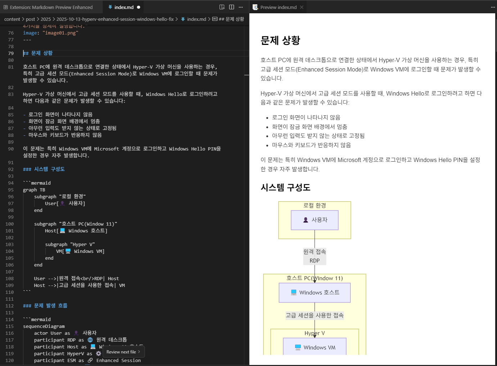

마크다운으로 문서를 작성할 때 다이어그램을 포함해야 하는 경우가 많습니다. 특히 기술 문서나 개발 문서를 작성할 때 시스템 구조도, 순서도, 시퀀스 다이어그램 등을 추가하면 내용의 이해도를 크게 높일 수 있습니다.

**Markdown Preview Enhanced**는 VSCode에서 마크다운 문서를 작성할 때 PlantUML, Mermaid 등의 다이어그램 언어를 실시간으로 렌더링하여 아름답게 표시해주는 강력한 익스텐션입니다.


## 익스텐션 설치 전 vs 후

### 설치 전: 기본 VSCode 마크다운 프리뷰

기본 VSCode의 마크다운 프리뷰에서는 Mermaid나 PlantUML 코드가 그대로 텍스트로 표시됩니다. 다이어그램이 렌더링되지 않아 실제 결과물을 확인할 수 없습니다.


위 이미지에서 볼 수 있듯이, Mermaid 다이어그램 코드가 코드 블록으로만 표시되고 시각화되지 않습니다.

### 설치 후: 아름다운 다이어그램 렌더링

Markdown Preview Enhanced를 설치하면 동일한 코드가 즉시 아름다운 다이어그램으로 변환됩니다!



같은 Mermaid 코드가 전문적인 수준의 다이어그램으로 렌더링되는 것을 확인할 수 있습니다. 시스템 구성도가 색상, 아이콘, 화살표와 함께 명확하게 표시됩니다.

## 주요 특징

### 다양한 다이어그램 지원

Markdown Preview Enhanced는 다음과 같은 다양한 다이어그램 형식을 지원합니다:

- **Mermaid**: 플로우차트, 시퀀스 다이어그램, 간트 차트 등
- **PlantUML**: UML 다이어그램, 시퀀스 다이어그램, 클래스 다이어그램 등
- **GraphViz**: 그래프 시각화
- **기타**: Vega, WaveDrom 등 다양한 포맷

### 실시간 미리보기

코드를 작성하는 동안 실시간으로 렌더링된 결과를 확인할 수 있어 생산성이 크게 향상됩니다. 파일을 저장하지 않아도 변경사항이 즉시 반영됩니다.

### Mermaid 다이어그램 예제

아래와 같은 Mermaid 코드를 작성하면 위의 image02.png와 같이 아름다운 다이어그램으로 렌더링됩니다:


이러한 시스템 구성도를 코드로 작성하면, 설치 후 이미지에서 본 것처럼 깔끔하게 렌더링됩니다.

### 순서도와 시퀀스 다이어그램


이러한 시퀀스 다이어그램도 텍스트로 작성하면 자동으로 아름답게 렌더링됩니다.

## 설치 방법

1. **VSCode 실행**
2. **Extensions 패널 열기** (Ctrl+Shift+X)
3. **"Markdown Preview Enhanced" 검색**
4. **Install 버튼 클릭**

익스텐션은 150,000개 이상의 다운로드와 5점 만점의 평점을 받은 인기 있는 도구입니다.

## 사용 방법

### 기본 사용법

1. 마크다운 파일(`.md`)을 엽니다
2. `Ctrl+K V` 또는 `Ctrl+Shift+V`를 눌러 미리보기를 엽니다
3. 에디터와 미리보기를 나란히 배치하여 실시간으로 결과를 확인합니다

### Mermaid 다이어그램 작성

````markdown

````

### PlantUML 다이어그램 작성

````markdown

````

## 장점

### 문서 작성 생산성 향상

- 코드와 다이어그램을 한 곳에서 관리
- 실시간 미리보기로 즉각적인 피드백
- 버전 관리 시스템과 완벽한 통합

### 아름다운 렌더링

- 전문적인 수준의 다이어그램 생성
- 다양한 테마와 스타일 지원
- 이미지로 내보내기 가능

### 개발자 친화적

- 텍스트 기반 다이어그램으로 버전 관리 용이
- 코드 리뷰에 적합한 형식
- CI/CD 파이프라인과 통합 가능

### 다양한 활용

- 기술 문서 작성
- API 문서화
- 시스템 설계 문서
- 프로젝트 계획서
- 학습 자료 제작

## 추가 기능

### PDF/HTML 내보내기

작성한 문서를 PDF나 HTML로 내보낼 수 있습니다:

- 우클릭 → "Markdown Preview Enhanced: Open Preview"
- 미리보기에서 우클릭 → "HTML" 또는 "PDF" 선택

### 수학 수식 지원

LaTeX 문법을 사용한 수학 수식도 지원합니다:

```markdown
$E = mc^2$

$$
\int_0^\infty e^{-x^2} dx = \frac{\sqrt{\pi}}{2}
$$
```

## 다른 마크다운 익스텐션과의 비교

### 기본 VSCode Markdown Preview

- 제한적인 기능
- 다이어그램 미지원
- 단순한 마크다운 렌더링만 가능
- Mermaid, PlantUML 코드가 텍스트로만 표시됨

### Markdown Preview Enhanced

- 강력한 다이어그램 지원
- 다양한 내보내기 옵션 (PDF, HTML, PNG 등)
- 확장 가능한 기능 (커스텀 CSS, 테마 등)
- 활발한 커뮤니티 지원
- 실시간 렌더링으로 즉각적인 피드백

앞서 보여드린 설치 전/후 비교 이미지에서 차이가 명확하게 드러납니다. 동일한 Mermaid 코드가 기본 프리뷰에서는 단순 텍스트로 표시되지만, Markdown Preview Enhanced에서는 전문적인 다이어그램으로 변환됩니다.


## 팁과 요령

### 단축키 활용

- `Ctrl+K V`: 미리보기를 옆에 열기
- `Ctrl+Shift+V`: 미리보기 전환

### 커스터마이징

설정(`settings.json`)에서 다양한 옵션을 조정할 수 있습니다:

```json
{
  "markdown-preview-enhanced.breakOnSingleNewLine": true,
  "markdown-preview-enhanced.enableTypographer": true,
  "markdown-preview-enhanced.previewTheme": "github-light.css"
}
```

### 스니펫 활용

자주 사용하는 다이어그램 패턴을 스니펫으로 저장하여 빠르게 사용할 수 있습니다.

## 주의사항

### PlantUML 사용 시

PlantUML을 사용하려면 Java가 설치되어 있어야 합니다. 또는 온라인 렌더링 서버를 사용할 수 있습니다.

### 복잡한 다이어그램

너무 복잡한 다이어그램은 렌더링 속도가 느려질 수 있습니다. 적절히 분할하는 것이 좋습니다.

## 결론

Markdown Preview Enhanced는 마크다운으로 문서를 작성하는 모든 개발자와 기술 작가에게 필수적인 도구입니다. 특히 다이어그램이 포함된 기술 문서를 작성할 때 그 진가를 발휘합니다.

PlantUML과 Mermaid를 통해 텍스트로 다이어그램을 작성하고, 실시간으로 아름답게 렌더링된 결과를 확인하면서 작업할 수 있다는 점은 문서 작성 생산성을 크게 향상시킵니다.

아직 사용해보지 않으셨다면, 지금 바로 [VSCode Marketplace](https://marketplace.visualstudio.com/items?itemName=shd101wyy.markdown-preview-enhanced)에서 설치해보세요!

## 참고 자료

- [Markdown Preview Enhanced 공식 문서](https://shd101wyy.github.io/markdown-preview-enhanced/#/)
- [Mermaid 공식 문서](https://mermaid.js.org/)
- [PlantUML 공식 사이트](https://plantuml.com/)
- [VSCode Marketplace - Markdown Preview Enhanced](https://marketplace.visualstudio.com/items?itemName=shd101wyy.markdown-preview-enhanced)
