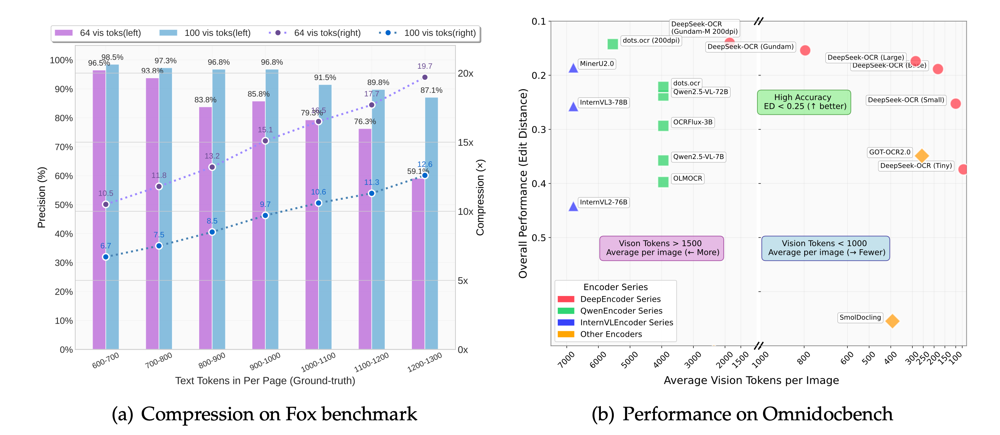

DeepSeek-AI가 2025년 10월 20일, 문서 처리와 OCR 분야에 혁신을 가져올 새로운 비전-언어 모델 **DeepSeek-OCR**을 공개했습니다. 이 모델은 광학 2D 매핑을 통한 장문 컨텍스트 압축이라는 독창적인 접근 방식으로, 기존 모델들보다 월등히 적은 비전 토큰으로 높은 성능을 달성합니다.



## 개요

### 프로젝트 정보

* **프로젝트명**: DeepSeek-OCR: Contexts Optical Compression
* **개발사**: DeepSeek-AI
* **발표일**: 2025년 10월 20일
* **라이선스**: MIT License
* **주요 기술**: Vision-Text Compression, DeepEncoder, MoE Architecture
* **GitHub**: https://github.com/deepseek-ai/DeepSeek-OCR
* **Hugging Face**: https://huggingface.co/deepseek-ai/DeepSeek-OCR
* **주요 특징**: 
  - 10배 압축률에서 97% OCR 정확도
  - 20배 압축률에서 60% 정확도
  - 최소 토큰으로 최대 성능 달성

### 기술적 혁신

DeepSeek-OCR의 핵심은 **비전-텍스트 압축 패러다임**입니다. 현재 대규모 언어 모델(LLM)들은 긴 텍스트를 처리할 때 시퀀스 길이에 대해 2차 복잡도로 증가하는 계산 비용 문제를 겪고 있습니다. DeepSeek-OCR은 시각적 모달리티를 효율적인 압축 매체로 활용하여 이 문제를 해결합니다.

## 주요 기능

### 1. DeepEncoder 아키텍처

DeepSeek-OCR의 핵심은 약 380M 파라미터의 **DeepEncoder**입니다:

- **SAM-base** (80M): 윈도우 어텐션 기반의 시각적 인식 특징 추출
- **CLIP-large** (300M): 밀집 글로벌 어텐션을 통한 시각적 지식 특징 추출
- **16× 토큰 압축기**: 두 컴포넌트를 연결하는 2레이어 컨볼루션 모듈

이 구조는 고해상도 입력에서도 낮은 활성화 메모리와 최소한의 비전 토큰을 유지합니다.

### 2. 다중 해상도 지원

DeepSeek-OCR은 다양한 사용 사례를 위한 여러 해상도 모드를 제공합니다:

| 모드 | 해상도 | 비전 토큰 수 | 용도 |
|------|--------|-------------|------|
| Tiny | 512×512 | 64 | 경량 처리 |
| Small | 640×640 | 100 | 일반 문서 |
| Base | 1024×1024 | 256 | 고품질 문서 |
| Large | 1280×1280 | 400 | 복잡한 레이아웃 |
| Gundam | 동적 | n×100+256 | 초고해상도 |

### 3. 압축 성능 분석

Fox 벤치마크에서 테스트한 결과:

- **10배 압축률**: 96.5-98.5% 디코딩 정확도
- **12배 압축률**: 약 90% 정확도
- **20배 압축률**: 약 60% 정확도

이는 텍스트를 이미지로 변환하여 압축하는 방식으로 거의 무손실 컨텍스트 압축이 가능함을 시사합니다.

### 4. 실용적 성능

OmniDocBench 벤치마크에서 DeepSeek-OCR은:

- **100 토큰**으로 GOT-OCR2.0(256 토큰) 능가
- **800 토큰 미만**으로 MinerU2.0(6,790 토큰) 초과 성능
- **Gemini 2.5-Pro와 경쟁력 있는 성능**을 적은 토큰으로 달성

### 5. OCR 2.0 기능

전통적인 OCR을 넘어 다양한 고급 파싱 기능을 제공합니다:

- **차트 파싱**: HTML 테이블 형식으로 변환
- **화학식 인식**: SMILES 형식 출력
- **평면 기하학 파싱**: 기하학적 도형 구조화
- **다국어 지원**: 약 100개 언어 지원
- **일반 비전 이해**: 이미지 설명, 객체 감지, 그라운딩

## 기술 아키텍처

### 모델 구성

```
DeepSeek-OCR = DeepEncoder + DeepSeek3B-MoE-A570M

DeepEncoder:
├── SAM-base (80M)
│   └── 윈도우 어텐션 기반 인식
├── 16× 컨볼루션 압축기
│   └── 2레이어, 커널 3, 스트라이드 2
└── CLIP-large (300M)
    └── 글로벌 어텐션 기반 지식

Decoder:
└── DeepSeek3B-MoE (64 experts)
    ├── 활성화 파라미터: 570M
    ├── 라우팅 전문가: 6/64
    └── 공유 전문가: 2
```

### 학습 파이프라인

**1단계: DeepEncoder 독립 학습**
- 소형 언어 모델 활용
- 차세대 토큰 예측 프레임워크
- OCR 1.0/2.0 데이터 + 100M 일반 데이터
- 2 에폭, 배치 크기 1280, 학습률 5e-5

**2단계: DeepSeek-OCR 전체 학습**
- 파이프라인 병렬화(PP=4)
- 20 노드 × 8 A100-40G GPU
- 데이터 병렬화(DP=40), 글로벌 배치 640
- 학습 속도: 텍스트 전용 90B 토큰/일, 멀티모달 70B 토큰/일

### 데이터 구성

- **OCR 1.0 (70%)**: 문서 OCR, 자연 장면 OCR
  - 30M PDF 페이지 (100개 언어)
  - 3M Word 문서
  - 20M 자연 장면 이미지
- **OCR 2.0**: 차트(10M), 화학식(5M), 기하학(1M)
- **일반 비전 (20%)**: 캡션, 감지, 그라운딩
- **텍스트 전용 (10%)**: 언어 능력 유지\

## 설치 및 사용법

### 환경 설정

```bash
# Conda 환경 생성
conda create -n deepseek-ocr python=3.12.9 -y
conda activate deepseek-ocr

# PyTorch 설치 (CUDA 11.8)
pip install torch==2.6.0 torchvision==0.21.0 torchaudio==2.6.0 \
    --index-url https://download.pytorch.org/whl/cu118

# 의존성 설치
pip install -r requirements.txt
pip install flash-attn==2.7.3 --no-build-isolation
```

### vLLM 추론

```python
from vllm import LLM, SamplingParams
from vllm.model_executor.models.deepseek_ocr import NGramPerReqLogitsProcessor
from PIL import Image

# 모델 생성
llm = LLM(
    model="deepseek-ai/DeepSeek-OCR",
    enable_prefix_caching=False,
    mm_processor_cache_gb=0,
    logits_processors=[NGramPerReqLogitsProcessor]
)

# 배치 입력 준비
image_1 = Image.open("document1.png").convert("RGB")
image_2 = Image.open("document2.png").convert("RGB")
prompt = "<image>\nFree OCR."

model_input = [
    {
        "prompt": prompt,
        "multi_modal_data": {"image": image_1}
    },
    {
        "prompt": prompt,
        "multi_modal_data": {"image": image_2}
    }
]

sampling_param = SamplingParams(
    temperature=0.0,
    max_tokens=8192,
    extra_args=dict(
        ngram_size=30,
        window_size=90,
        whitelist_token_ids={128821, 128822},  # <td>, </td>
    ),
    skip_special_tokens=False,
)

# 출력 생성
model_outputs = llm.generate(model_input, sampling_param)

for output in model_outputs:
    print(output.outputs[0].text)
```

### Transformers 추론

```python
from transformers import AutoModel, AutoTokenizer
import torch

model_name = 'deepseek-ai/DeepSeek-OCR'

tokenizer = AutoTokenizer.from_pretrained(model_name, trust_remote_code=True)
model = AutoModel.from_pretrained(
    model_name, 
    _attn_implementation='flash_attention_2', 
    trust_remote_code=True, 
    use_safetensors=True
)
model = model.eval().cuda().to(torch.bfloat16)

# 레이아웃 포함 마크다운 변환
prompt = "<image>\n<|grounding|>Convert the document to markdown."
# 또는 레이아웃 없는 순수 OCR
# prompt = "<image>\nFree OCR."

image_file = 'your_image.jpg'
output_path = 'output_dir'

res = model.infer(
    tokenizer, 
    prompt=prompt, 
    image_file=image_file, 
    output_path=output_path, 
    base_size=1024,  # Base 모드
    image_size=640,  # Small 모드
    crop_mode=True,
    save_results=True, 
    test_compress=True
)
```

### 프롬프트 예시

```python
# 문서 마크다운 변환 (레이아웃 포함)
"<image>\n<|grounding|>Convert the document to markdown."

# 일반 이미지 OCR (레이아웃 포함)
"<image>\n<|grounding|>OCR this image."

# 레이아웃 없는 순수 OCR
"<image>\nFree OCR."

# 차트/도표 파싱
"<image>\nParse the figure."

# 상세한 이미지 설명
"<image>\nDescribe this image in detail."

# 특정 텍스트 위치 찾기
"<image>\nLocate <|ref|>선택한 텍스트<|/ref|> in the image."
```

## 성능 비교

### OmniDocBench 결과 (Edit Distance, 낮을수록 좋음)

| 모델 | 토큰 | 전체 (영문) | 전체 (중문) |
|------|------|------------|------------|
| MinerU2.0 | 6,790 | 0.133 | 0.238 |
| Gemini 2.5-Pro | - | 0.148 | 0.212 |
| dots.ocr (200dpi) | 5,545 | 0.125 | 0.160 |
| InternVL3-78B | 6,790 | 0.218 | 0.296 |
| Qwen2.5-VL-72B | 3,949 | 0.214 | 0.261 |
| GOT-OCR2.0 | 256 | 0.287 | 0.411 |
| **DeepSeek-OCR (Small)** | **100** | **0.221** | **0.284** |
| **DeepSeek-OCR (Base)** | **256(182)** | **0.137** | **0.240** |
| **DeepSeek-OCR (Gundam)** | **795** | **0.127** | **0.181** |

### 문서 유형별 성능

| 문서 유형 | Tiny (64) | Small (100) | Base (256) | Gundam (795) |
|----------|-----------|-------------|------------|--------------|
| 슬라이드 | 0.116 | 0.111 | 0.080 | 0.085 |
| 도서 | 0.147 | 0.085 | 0.037 | 0.035 |
| 재무보고서 | 0.207 | 0.079 | 0.027 | 0.289 |
| 교과서 | 0.173 | 0.147 | 0.100 | 0.095 |
| 시험지 | 0.294 | 0.171 | 0.130 | 0.094 |
| 학술논문 | 0.395 | 0.131 | 0.052 | 0.039 |
| 신문 | 0.940 | 0.744 | 0.645 | 0.122 |

## 연구 의의와 미래 전망

### 1. 컨텍스트 압축의 새로운 패러다임

DeepSeek-OCR은 비전 모달리티를 활용한 텍스트 압축이라는 새로운 방향을 제시합니다:

- **메모리 감쇠 메커니즘**: 오래된 컨텍스트를 점진적으로 압축하여 인간의 기억 곡선 모방
- **무한 컨텍스트 아키텍처**: 최근 정보는 고해상도 유지, 오래된 정보는 자원 절약
- **계산 효율성**: 정보 보존과 계산 제약의 균형

### 2. VLM/LLM 발전 기여

- **토큰 할당 최적화**: 비전-텍스트 압축 비율에 대한 정량적 가이드라인 제공
- **사전학습 데이터 생성**: 대규모 문서 처리로 고품질 학습 데이터 생성
- **STEM 분야 응용**: 화학, 수학, 기하학 등 전문 영역 처리 능력

### 3. 향후 연구 방향

논문에서 제시한 추가 연구 주제:

- **디지털-광학 텍스트 인터리브 사전학습**
- **Needle-in-a-Haystack 테스트**
- **압축률 최적화 연구**
- **메모리 망각 메커니즘 심화**

## 종합 평가

### 장점

- **혁신적 압축 기술**: 10배 압축률에서 97% 정확도는 획기적
- **효율적 아키텍처**: 최소 토큰으로 최대 성능 달성
- **실용적 성능**: 대규모 프로덕션 환경에서 검증됨
- **다양한 기능**: OCR 1.0/2.0, 다국어, 일반 비전 통합
- **오픈소스**: MIT 라이선스로 완전 공개
- **우수한 문서화**: 상세한 논문과 코드 예제 제공

### 제한사항

- **초기 단계 연구**: 실제 장문 컨텍스트 압축 검증 필요
- **복잡한 레이아웃**: 신문 등 초고밀도 문서는 많은 토큰 필요
- **SFT 미포함**: 채팅봇 형태가 아닌 컴플리션 프롬프트 필요
- **20배 이상 압축**: 정확도가 크게 하락 (60% 이하)

DeepSeek-OCR은 OCR과 문서 처리 분야에 혁신을 가져온 모델입니다. 비전-텍스트 압축이라는 새로운 패러다임을 제시하고, 실용적인 성능과 효율성을 모두 달성했습니다. 특히 오픈소스로 공개되어 연구와 실무에 모두 활용 가능한 점이 큰 장점입니다.

## 결론

DeepSeek-OCR은 단순한 OCR 모델을 넘어, 비전-언어 모델의 새로운 가능성을 보여주는 연구입니다. 광학 컨텍스트 압축이라는 독창적인 접근으로 LLM의 장문 컨텍스트 처리 문제에 대한 실마리를 제공하며, 동시에 실용적인 문서 처리 도구로서의 가치도 입증했습니다.

앞으로 디지털-광학 인터리브 학습, 메모리 망각 메커니즘 등 후속 연구가 진행되면, 진정한 의미의 무한 컨텍스트 처리가 가능해질 수 있습니다. 이는 AI의 장기 기억과 효율적인 정보 처리라는 핵심 과제에 대한 중요한 진전이 될 것입니다.

### 한 줄 평

"10배 압축으로 97% 정확도를 달성하며, 비전-텍스트 압축의 새로운 지평을 연 혁신적인 OCR 모델"

### 추천 대상

- **AI 연구자**: 컨텍스트 압축, VLM 토큰 최적화 연구자
- **문서 처리 개발자**: 대규모 문서 파싱, OCR 시스템 구축자
- **데이터 엔지니어**: LLM/VLM 사전학습 데이터 생성 담당자
- **학술 연구자**: 다국어 문서, 수학/화학 공식 처리 필요자

### 관련 프로젝트

- **GOT-OCR2.0**: End-to-End OCR 선행 연구
- **Vary**: 비전 어휘 확장 VLM
- **InternVL**: 타일 기반 고해상도 처리
- **Qwen2-VL**: 적응형 해상도 인코딩
- **MinerU**: 정밀 문서 콘텐츠 추출

## 참고 문헌 및 출처

- [DeepSeek-OCR Paper - arXiv](https://arxiv.org/abs/2510.18234)
- [DeepSeek-OCR GitHub Repository](https://github.com/deepseek-ai/DeepSeek-OCR)
- [DeepSeek-OCR on Hugging Face](https://huggingface.co/deepseek-ai/DeepSeek-OCR)
- [DeepSeek-AI Official Blog](https://deepseek.ai/blog/deepseek-ocr-context-compression)
- [OmniDocBench - CVPR 2025](https://arxiv.org/abs/2412.07626)
- [GeekNews - DeepSeek OCR 소개](https://news.hada.io/topic?id=23794)

