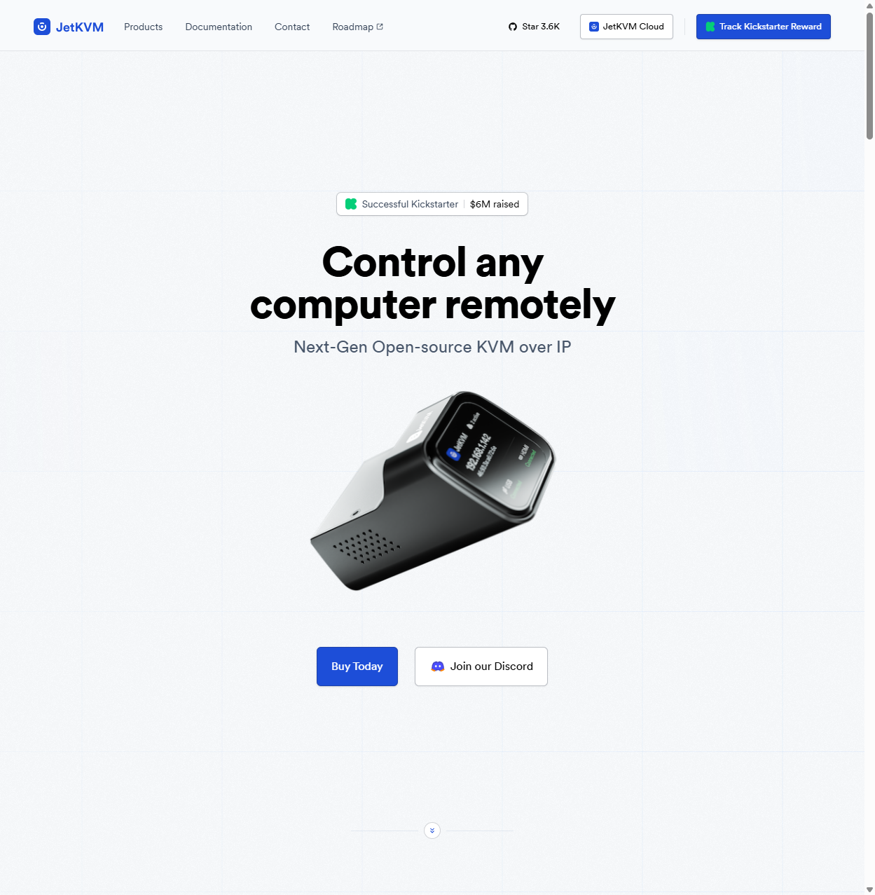

JetKVM은 차세대 오픈소스 KVM (Keyboard, Video, Mouse) over IP 솔루션으로, 컴퓨터, 서버, 워크스테이션을 효율적으로 원격 관리할 수 있도록 설계된 고성능 하드웨어입니다. BuildJet, Inc.에서 개발한 이 제품은 Kickstarter 캠페인에서 600만 달러를 모금하며 큰 성공을 거두었으며, 현재 GitHub에서 3.6K개의 스타를 받은 오픈소스 프로젝트로 활발히 개발되고 있습니다.

## 주요 특징

### 초저지연 비디오 스트리밍

JetKVM의 가장 인상적인 특징 중 하나는 초저지연 비디오 스트리밍 기능입니다:

- **해상도 및 프레임레이트**: 1080p 해상도에서 60FPS 지원
- **지연 시간**: 30-60 밀리초의 매우 낮은 지연 시간
- **인코딩**: 효율적인 H.264 인코딩 사용
- **응답성**: 마우스와 키보드 동작이 부드럽고 즉각적으로 전달

이러한 성능 덕분에 원격 접속이 마치 로컬에서 작업하는 것처럼 느껴집니다.

### 완전한 오픈소스 아키텍처

JetKVM은 투명성과 확장성을 위해 완전히 오픈소스로 개발되었습니다:

#### 소프트웨어 스택
- **운영체제**: Linux 5.10 with Buildroot
- **컨트롤러**: Golang 기반 백엔드
- **대시보드**: React, Tailwind CSS 기반 프론트엔드
- **펌웨어**: C 언어
- **프로토콜**: WebRTC 기반 통신

#### 오픈소스 저장소
- **KVM Runtime**: Go 백엔드와 React 대시보드 조합
- **Cloud API & Dashboard**: 클라우드 관리 인터페이스
- **Documentation**: 완전한 문서화
- **Core System**: BusyBox 기반 미니멀 Linux 시스템

모든 소스 코드는 [GitHub](https://github.com/jetkvm)에서 확인할 수 있으며, 개발자들은 SSH를 통해 쉽게 접근하여 소프트웨어를 수정하거나 커스터마이징할 수 있습니다.

### 선택적 클라우드 액세스

JetKVM은 프라이버시를 최우선으로 하면서도 편리한 원격 접속을 제공합니다:

- **WebRTC 기반**: JetKVM Cloud를 통한 선택적 원격 관리
- **NAT 통과**: 가장 제한적인 NAT 환경에서도 작동하는 STUN 및 TURN 서버
- **보안 연결**: 빠르고 안전한 직접 연결
- **자체 호스팅 가능**: Cloud API를 포크하여 자신만의 클라우드 서비스 구축 가능

클라우드 액세스는 선택 사항이며, 로컬 네트워크에서만 사용할 수도 있습니다.

### 확장 가능한 하드웨어

JetKVM의 하드웨어는 RJ12 확장 포트를 통해 완전히 커스터마이징 가능합니다. 다양한 확장 보드를 추가하여 기능을 확장할 수 있습니다:

#### ATX Extension Board
- 데스크톱 컴퓨터의 원격 전원 제어
- 리셋 제어 기능

#### DC Power Control Extension
- DC 전원 장치의 원격 전원 관리

#### Serial Console Extension
- JetKVM을 통한 원격 시리얼 포트 액세스

## 기술 사양

### 하드웨어 사양

#### 연산 성능
- **CPU**: RockChip RV1106G3
- **코어**: Single core ARM Cortex-A7
- **메모리**: 256 MB DDR3L
- **저장공간**: 16 GB eMMC

#### 연결 및 확장
- **이더넷**: RJ45 (최대 100 Mbps)
- **USB**: USB-C (최대 480 Mbit/s)
- **비디오**: HDMI Mini
- **확장**: RJ12 확장 포트

#### 크기 및 무게
- **높이**: 31 mm (1.22 inches)
- **너비**: 43 mm (1.69 inches)
- **깊이**: 60 mm (2.3 inches)
- **무게**: 30 gram (1.06 oz)

#### 전기 및 작동 요구사항
- **라인 전압**: 100-240V AC
- **주파수**: 50Hz to 60Hz, 단상
- **작동 온도**: 50 to 95°F (10 to 35°C)
- **보관 온도**: -40 to 116°F (-40 to 47°C)
- **상대 습도**: 5% to 90% 비응축

## 사용 사례

JetKVM은 다양한 시나리오에서 활용될 수 있습니다:

### 데이터 센터 관리
- 서버 부팅 실패 시 원격 트러블슈팅
- BIOS 설정 조정
- 운영체제 설치 및 재설치
- 하드웨어 모니터링

### 홈 랩 (Home Lab)
- 개인 서버 관리
- 실험 및 테스트 환경 구축
- 원격 개발 환경

### IT 전문가
- 원격 기술 지원
- 시스템 유지보수
- 긴급 상황 대응

### 개발자
- 원격 개발 환경 구축
- CI/CD 파이프라인 관리
- 테스트 환경 제어

## 커뮤니티 및 지원

JetKVM은 활발한 커뮤니티와 지원 시스템을 갖추고 있습니다:

- **Discord**: 커뮤니티 지원 및 최신 소식
- **GitHub**: 소스 코드, 이슈 트래킹, 기여
- **Documentation**: 상세한 문서 및 튜토리얼
- **Twitter/X**: 빠른 업데이트 및 팁

## 구매 및 배송

JetKVM은 공식 리셀러를 통해 구매할 수 있습니다:

- **iKoolCore**: https://www.ikoolcore.com/products/jetkvm
- **Wisdpi**: https://www.wisdpi.com/products/jetkvm

60개 이상의 국가로 배송되며, 지역에 따라 가격이 다를 수 있습니다. 미국, EU, 캐나다, 영국을 포함한 주요 지역을 지원합니다.

## 장점 및 평가

### 주요 장점

1. **완전한 오픈소스**: 모든 소프트웨어와 문서가 공개되어 있어 커스터마이징과 학습이 용이
2. **초저지연**: 30-60ms의 지연 시간으로 실시간 원격 제어 가능
3. **고해상도**: 1080p 60FPS 지원으로 선명한 화면 품질
4. **확장성**: RJ12 포트를 통한 다양한 확장 보드 지원
5. **프라이버시 중심**: 선택적 클라우드 액세스, 로컬 네트워크만 사용 가능
6. **컴팩트한 디자인**: 30g의 초경량, 소형 디자인

### 리뷰어 평가

JetKVM을 테스트한 모든 기술 리뷰어들이 극찬을 아끼지 않았습니다. 전문 데이터 센터부터 홈 랩까지, 이 제품은 기술 세계가 기다려온 원격 액세스 솔루션이라는 평가를 받고 있습니다.

## 개발 및 커스터마이징

JetKVM은 개발자 친화적으로 설계되었습니다:

- **SSH 액세스**: 장치에 직접 SSH로 접속하여 수정 가능
- **Golang 및 React**: 친숙한 개발 도구와 프레임워크 사용
- **BusyBox Linux**: 불필요한 서비스 없이 핵심 컴포넌트만 포함
- **Fork 및 기여**: GitHub에서 포크하여 새로운 기능 추가 가능

## 문서 및 리소스

JetKVM은 포괄적인 문서를 제공합니다:

- **Getting Started**: 빠른 시작 가이드
- **Troubleshooting**: 문제 해결 방법
- **Device FAQs**: 장치 관련 자주 묻는 질문
- **Kickstarter FAQs**: 킥스타터 후원자를 위한 FAQ
- **Peripheral Devices**: 주변 장치 사용 방법
- **Networking**: 로컬 및 원격 액세스 설정
- **Video**: 비디오 품질 및 HDMI EDID 설정
- **Advanced Usage**: 팩토리 리셋, 개발, OTA 업데이트

## 결론

JetKVM은 현대적인 원격 관리 솔루션을 찾는 IT 전문가, 개발자, 파워 유저들에게 이상적인 선택입니다. 완전한 오픈소스 아키텍처, 초저지연 비디오 스트리밍, 확장 가능한 하드웨어, 그리고 프라이버시 중심의 설계가 결합되어 강력하면서도 유연한 솔루션을 제공합니다.

Kickstarter에서의 성공적인 캠페인과 GitHub에서의 활발한 커뮤니티는 이 제품의 품질과 잠재력을 증명합니다. 데이터 센터 관리, 홈 랩 운영, 원격 트러블슈팅 등 어떤 용도로든 JetKVM은 신뢰할 수 있는 원격 액세스 솔루션을 제공합니다.

## 참고 링크

- [공식 웹사이트](https://jetkvm.com/)
- [GitHub 저장소](https://github.com/jetkvm/kvm)
- [Cloud API](https://github.com/jetkvm/cloud-api)
- [문서](https://jetkvm.com/docs)
- [Discord 커뮤니티](https://jetkvm.com/discord)
- [Roadmap](https://github.com/orgs/jetkvm/projects/7)

