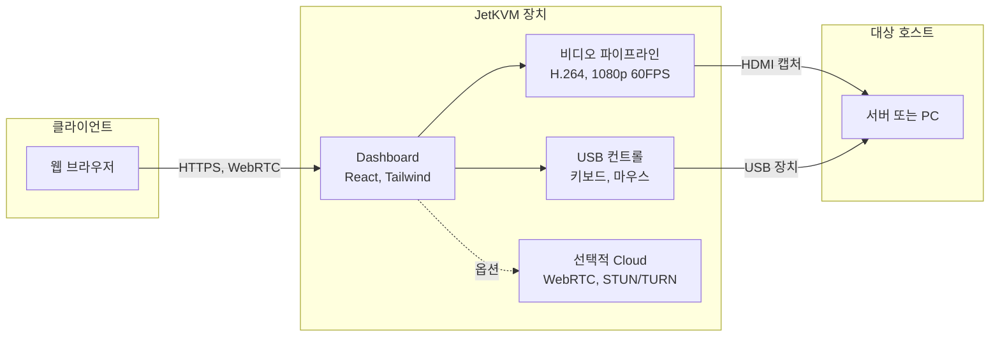

## 개요

**JetKVM**은 BuildJet, Inc.가 개발한 **차세대 오픈소스 KVM(Keyboard, Video, Mouse) over IP** 솔루션으로, 컴퓨터·서버·워크스테이션을 네트워크를 통해 원격 관리할 수 있도록 설계된 전용 하드웨어 장치이다. Kickstarter 캠페인에서 약 **600만 달러**를 모금했으며, GitHub에서 **4,000개 이상**의 스타를 보유한 오픈소스 프로젝트로 활발히 유지보수되고 있다.

**추천 대상**: 데이터센터·홈랩에서 서버/PC 원격 콘솔 접근이 필요한 관리자, BIOS·부팅 단계 트러블슈팅이 필요한 IT 엔지니어, 상용 KVM over IP 비용을 줄이고 오픈소스로 커스터마이징하고 싶은 개발자·파워 유저.

---

## JetKVM 시스템 구조

JetKVM은 사용자 브라우저와 대상 호스트 사이에 위치하며, 비디오 캡처·H.264 인코딩·USB 키보드/마우스 에뮬레이션·선택적 클라우드 연동을 한 장치에서 담당한다. 전체 데이터 흐름은 아래와 같다.

```mermaid
flowchart LR
  subgraph ClientSide["클라이언트"]
    Browser["웹 브라우저"]
  end
  subgraph JetKVMDevice["JetKVM 장치"]
    Dashboard["Dashboard</br>React, Tailwind"]
    VideoPath["비디오 파이프라인</br>H.264, 1080p 60FPS"]
    USBCtrl["USB 컨트롤</br>키보드, 마우스"]
    CloudOpt["선택적 Cloud</br>WebRTC, STUN/TURN"]
  end
  subgraph TargetHost["대상 호스트"]
    Host["서버 또는 PC"]
  end
  Browser -->|"HTTPS, WebRTC"| Dashboard
  Dashboard --> VideoPath
  Dashboard --> USBCtrl
  Dashboard -.->|"옵션"| CloudOpt
  VideoPath -->|"HDMI 캡처"| Host
  USBCtrl -->|"USB 장치"| Host
```

- **클라이언트**: 웹 브라우저만으로 접속하며, 별도 클라이언트 설치가 필요 없다.
- **JetKVM 장치**: Linux 5.10(Buildroot)·Golang 백엔드·React 대시보드로 구성되며, RJ12 확장 포트로 ATX/DC 전원·시리얼 콘솔 등 확장 보드 연결이 가능하다.
- **대상 호스트**: HDMI·USB로 연결된 서버 또는 PC로, 전원·BIOS·OS 부팅 전 단계부터 원격 제어할 수 있다.

---

## 주요 특징

### 초저지연 비디오 스트리밍

JetKVM의 가장 큰 강점은 **실시간에 가까운 비디오 스트리밍**이다.

| 항목 | 내용 |
|------|------|
| 해상도·프레임 | 1080p, 60 FPS |
| 지연 시간 | 30~60 ms |
| 인코딩 | H.264 |
| 체감 | 마우스·키보드 동작이 로컬에 가깝게 반응 |

이 수준의 지연이면 원격에서 BIOS 설정 변경, OS 설치, 콘솔 작업이 무리 없이 가능하다.

### 완전한 오픈소스 아키텍처

소프트웨어 스택과 문서가 전부 공개되어 있어, 검증·수정·재배포가 가능하다.

| 레이어 | 기술 |
|--------|------|
| OS | Linux 5.10, Buildroot |
| 컨트롤러 | Golang |
| 대시보드 | React, Tailwind CSS |
| 펌웨어 | C |
| 원격 프로토콜 | WebRTC |

**공개 저장소 예시**

- **KVM Runtime**: [jetkvm/kvm](https://github.com/jetkvm/kvm) — Go 백엔드 + React 대시보드
- **Cloud API & Dashboard**: [jetkvm/cloud-api](https://github.com/jetkvm/cloud-api) — 클라우드 관리·원격 연결 오케스트레이션
- **Documentation**: [jetkvm.com/docs](https://jetkvm.com/docs) — 설치·설정·트러블슈팅
- **Core System**: BusyBox 기반 미니멀 Linux

SSH로 장치에 접속해 소프트웨어를 직접 수정·커스터마이징할 수 있으며, Cloud API를 포크해 자체 호스팅 클라우드 서비스를 구축할 수도 있다.

### 선택적 클라우드 액세스

- **WebRTC 기반**: JetKVM Cloud를 통한 선택적 원격 접속.
- **NAT 대응**: STUN·TURN 서버로 제한적인 NAT 환경에서도 연결 지원.
- **프라이버시**: 클라우드는 옵션이며, 로컬 네트워크만 사용하는 구성이 가능하다.

### 확장 가능한 하드웨어

RJ12 확장 포트를 통해 공식 확장 보드로 기능을 늘릴 수 있다.

| 확장 보드 | 용도 |
|-----------|------|
| **ATX Extension Board** | 데스크톱 PC 원격 전원·리셋 제어 |
| **DC Power Control Extension** | DC 전원 장치 원격 전원 관리 |
| **Serial Console Extension** | 시리얼 콘솔 원격 접근 |

---

## 기술 사양

### 하드웨어

| 구분 | 사양 |
|------|------|
| **연산** | RockChip RV1106G3, Single core ARM Cortex-A7, 256 MB DDR3L, 16 GB eMMC |
| **연결** | RJ45(최대 100 Mbps), USB-C(최대 480 Mbit/s), HDMI Mini, RJ12 확장 |
| **크기·무게** | 31×43×60 mm, 약 30 g (리셀러에 따라 130 g 등 상이할 수 있음) |
| **전원** | 5V 전용, 제어 대상 PC의 USB-A 또는 USB-C로 공급 권장 (5V 초과 시 손상 가능) |
| **작동 환경** | 10~35°C, 상대습도 5~90% 비응축 |

### 소프트웨어 스택

운영체제 Linux 5.10(Buildroot), 컨트롤러 Golang, 대시보드 JavaScript·React·Tailwind, 펌웨어 C로 구성된다.

---

## 사용 사례

- **데이터 센터**: 서버 부팅 실패·BIOS 설정·OS 재설치·하드웨어 점검 등 아웃오브밴드(OOB) 관리
- **홈 랩**: 개인 서버·NAS·테스트용 PC 원격 콘솔 및 전원 제어
- **IT 지원**: 원격 기술 지원·긴급 복구·설정 변경
- **개발·CI/CD**: 원격 개발 머신·빌드 서버 콘솔 접근 및 테스트 환경 제어

---

## 커뮤니티 및 지원

- **Discord**: [jetkvm.com/discord](https://jetkvm.com/discord) — 커뮤니티·지원·소식
- **GitHub**: [jetkvm/kvm](https://github.com/jetkvm/kvm), [jetkvm/cloud-api](https://github.com/jetkvm/cloud-api) — 소스·이슈·기여
- **문서**: [jetkvm.com/docs](https://jetkvm.com/docs) — 시작 가이드·트러블슈팅·FAQ·네트워킹·비디오 설정·고급 사용(팩토리 리셋, OTA 등)
- **Roadmap**: [jetkvm 프로젝트 보드](https://github.com/orgs/jetkvm/projects/7)

---

## 구매 및 배송

JetKVM은 공식 리셀러를 통해 구매할 수 있으며, 60개 이상 국가로 배송된다.

- **iKoolCore**: [ikoolcore.com/products/jetkvm](https://www.ikoolcore.com/products/jetkvm) (미국·EU·캐나다·영국 등)
- **WisdPi**: [wisdpi.com/products/jetkvm](https://www.wisdpi.com/products/jetkvm)

가격·재고·배송 정책은 리셀러 사이트를 확인하는 것이 좋다. 확장 보드(ATX, DC 전원, 시리얼 콘솔)는 별도 구매 옵션으로 제공된다.

---

## 장점 및 한계

### 장점

1. **완전한 오픈소스**: 소프트웨어·문서 공개로 커스터마이징·학습·자체 호스팅에 유리
2. **초저지연**: 30~60 ms로 실시간에 가까운 원격 조작
3. **1080p 60 FPS**: H.264로 선명한 화면 품질
4. **확장성**: RJ12 기반 공식 확장 보드로 전원·시리얼 등 확장
5. **프라이버시**: 클라우드 사용 여부 선택 가능, 로컬 전용 구성 가능
6. **경량·소형**: 휴대·랙 주변 배치에 유리

### 한계 및 주의

- **전원**: 5V 전용이며, USB PD 등 비규격 전원 사용 시 손상 가능성이 있으므로 제조사 권장 방식(제어 대상 PC USB 또는 공식 확장 보드) 준수 필요
- **리뷰 일부**: ATX 확장 보드가 특정 폼팩터(예: 일부 Lenovo Tiny)와 맞지 않는다는 사례가 있음 — 구매 전 호환성 확인 권장

---

## 종합 평가

JetKVM은 **오픈소스 KVM over IP**를 원하는 데이터센터·홈랩·IT 팀에게 실용적인 선택이다. 초저지연·1080p 60 FPS·완전 오픈소스·확장 하드웨어·선택적 클라우드가 한데 묶여 있어, 비용 대비 기능과 투명성이 뛰어나며, Kickstarter와 GitHub에서의 반응도 이를 뒷받침한다. 5V 전원 규격과 확장 보드 호환성만 확인하면, 원격 콘솔·전원 제어·시리얼 접근이 필요한 환경에서 잘 쓸 수 있는 솔루션이다.

**한 줄 평**: 오픈소스로 전 스택이 공개된, 초저지연 1080p KVM over IP. 데이터센터·홈랩 원격 관리용으로 추천한다.

---

## 참고 문헌

1. JetKVM 공식 웹사이트. *JetKVM - Control any computer remotely*. [https://jetkvm.com/](https://jetkvm.com/). 2026. 3. 17. 접근.
2. JetKVM. *jetkvm/kvm*. GitHub. [https://github.com/jetkvm/kvm](https://github.com/jetkvm/kvm). 2026. 3. 17. 접근.
3. JetKVM. *JetKVM Documentation*. [https://jetkvm.com/docs](https://jetkvm.com/docs). 2026. 3. 17. 접근.
4. JetKVM. *jetkvm/cloud-api*. GitHub. [https://github.com/jetkvm/cloud-api](https://github.com/jetkvm/cloud-api). 2026. 3. 17. 접근.
