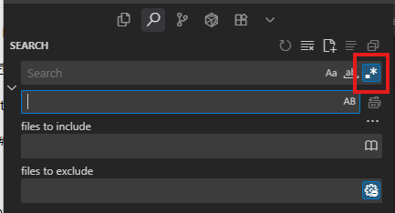
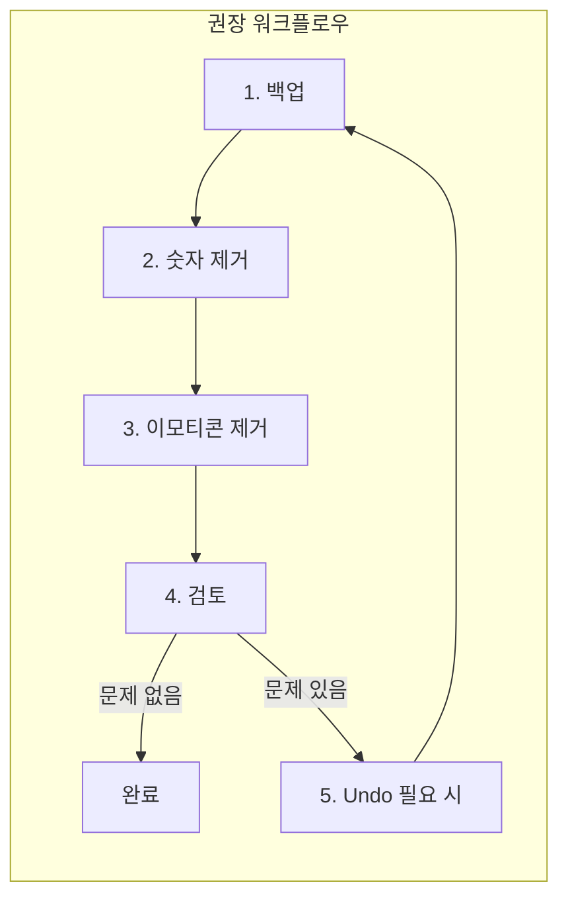

## 들어가며

마크다운 문서를 작성하다 보면 heading(제목)에 번호나 이모티콘을 넣어 구조를 표현하곤 합니다. 문서가 완성된 뒤에는 이런 장식적 요소를 제거하고 제목만 깔끔하게 남기고 싶을 때가 있습니다.

**이 글에서 다루는 내용**

- 계층적 번호(`1.`, `2.1.1`, `2)` 등)를 제거하는 정규식
- 이모티콘을 명시적으로 나열해 제거하는 정규식
- 유니코드 범위로 이모티콘을 넓게 제거하는 정규식
- VSCode Find & Replace에서의 사용 방법과 권장 워크플로우
- 제목 일부인 숫자·문자는 보존하도록 설계한 이유와 주의사항

VSCode의 정규식 검색·치환을 쓰면 수십~수백 개의 heading을 한 번에 정리할 수 있습니다. 아래 세 가지 패턴은 그대로 복사해 실전에서 바로 쓸 수 있도록 안전하게 설계했습니다.

### 정리 전·후 예시

**정리 전:**

```markdown
## 1. 소개
### 2) 주요 기능
#### 10.1.1 캡슐화
## 🎯 목표
```

**정리 후:**

```markdown
## 소개
### 주요 기능
#### 캡슐화
## 목표
```

---

## 숫자 제거 정규식 (계층적 번호 포함)

### 패턴

```regex
^(#{2,4})\s+\d+(?:\.\d+)*[\.\):\-]?\s+
```

**Replace:** `$1 ` (공백 한 칸 포함)

### 처리하는 케이스

이 정규식은 다양한 형태의 번호 매기기를 처리합니다.

| 정리 전 | 정리 후 |
|--------|--------|
| `## 1. 제목` | `## 제목` |
| `### 2) 소제목` | `### 소제목` |
| `#### 3: 내용` | `#### 내용` |
| `## 10- 예시` | `## 예시` |
| `#### 10.1.1 캡슐화` | `#### 캡슐화` |
| `### 1.2.3.4 계층` | `### 계층` |

### 패턴 상세 분석

```regex
^(#{2,4})\s+\d+(?:\.\d+)*[\.\):\-]?\s+
```

| 패턴 | 설명 |
|------|------|
| `^` | 줄의 시작 |
| `(#{2,4})` | `##`, `###`, `####` 캡처 (그룹 1) |
| `\s+` | 하나 이상의 공백 |
| `\d+` | 하나 이상의 숫자 |
| `(?:\.\d+)*` | `.숫자`가 0번 이상 반복 (예: 10.1.1) |
| `[\.\):\-]?` | 구두점 하나 선택 (`.`, `)`, `:`, `-`) |
| `\s+` | 제목 앞 공백 |

**Replace `$1 `**: 캡처한 heading 마크(`##` 등) 뒤에 공백 하나만 두어 제목 텍스트와 구분합니다.

### 보존되는 케이스

다음과 같은 경우는 **의도적으로 변경하지 않습니다.**

- `### "I am Iron Man" 리콜` → 변경 없음
- `### 2029년, 최후의 전쟁` → 변경 없음 (숫자 뒤 구두점 없음)
- `### **도입부 (Exposition)**` → 변경 없음

숫자 뒤에 구두점이 있고, 그 다음에 공백이 있는 경우에만 매칭되므로 제목 본문에 포함된 숫자는 보존됩니다.

---

## 이모티콘 제거 정규식 (명시적 나열)

### 패턴

```regex
^(#{2,4})\s+[🎯✨🚀💡📌⭐🔥💪👍❤️🎉🎊🏆🎁]+\s+
```

**Replace:** `$1 `

### 처리하는 케이스

- `## 🎯 목표` → `## 목표`
- `### ✨ 특징` → `### 특징`
- `#### 🚀 시작하기` → `#### 시작하기`
- `## 💡🔥 주요 아이디어` → `## 주요 아이디어`

### 패턴 설명

| 패턴 | 설명 |
|------|------|
| `^(#{2,4})` | 줄 시작의 `##`~`####` 캡처 |
| `\s+` | 공백 하나 이상 |
| `[🎯✨🚀💡…]+` | 나열한 이모티콘 중 하나 이상 |
| `\s+` | 제목 앞 공백 |

### 장단점

**장점**

- 동작이 예측 가능하고 안전함
- VSCode에서 그대로 사용 가능
- 제거할 이모티콘만 골라서 지정 가능

**단점**

- 패턴에 없는 이모티콘은 제거되지 않음
- 새 이모티콘을 쓰려면 대괄호 안 목록을 수정해야 함

### 이모티콘 추가하기

자주 쓰는 이모티콘을 더 넣으려면 대괄호 안에 추가하면 됩니다.

```regex
^(#{2,4})\s+[🎯✨🚀💡📌⭐🔥💪👍❤️🎉🎊🏆🎁📝🔖✅❌➡️⬅️]+\s+
```

---

## 이모티콘 제거 정규식 (유니코드 범위)

### 패턴

```regex
^(#{2,4})\s+[\u{1F300}-\u{1F9FF}\u{2600}-\u{26FF}\u{2700}-\u{27BF}\u{1F1E0}-\u{1F1FF}]+\s+
```

**Replace:** `$1 `

### 유니코드 범위 설명

| 범위 | 포함하는 문자 |
|------|----------------|
| `\u{1F300}-\u{1F9FF}` | 이모티콘·기호 (🌀~🧿 등) |
| `\u{2600}-\u{26FF}` | 기타 기호 (☀~⛿) |
| `\u{2700}-\u{27BF}` | 장식 기호 (✀~➿) |
| `\u{1F1E0}-\u{1F1FF}` | 지역 표시 기호 (🇦~🇿) |

### 장단점

**장점**

- 대부분의 이모티콘을 한 번에 커버
- 패턴 수정 없이 새 이모티콘도 처리 가능

**단점**

- VSCode 버전·설정에 따라 유니코드 범위 미지원일 수 있음
- 일부 환경에서는 동작하지 않을 수 있음

---

## VSCode에서 사용하는 방법

### 1단계: Find & Replace 열기

**Ctrl + H** (Windows/Linux) 또는 **Cmd + Option + F** (macOS), 또는 메뉴 **Edit > Replace**를 선택합니다.

### 2단계: 정규식 모드 활성화



Find & Replace 창에서 다음 중 하나를 수행합니다.

- `.*` 버튼 클릭
- **Alt + R** (Windows/Linux) 단축키 사용

### 3단계: 패턴 입력

**Find** 필드에 위에서 소개한 정규식 중 하나를 넣습니다.

```regex
^(#{2,4})\s+\d+(?:\.\d+)*[\.\):\-]?\s+
```

**Replace** 필드에는 반드시 `$1 `(공백 포함)을 입력합니다.

### 4단계: 실행

- **Replace All**: 매칭된 항목을 한 번에 치환
- **Replace**: 한 건씩 확인하며 치환

### Replace 필드 공백 주의

**Replace에는 반드시 공백을 포함하세요.**

- 올바른 예: `$1 ` (숫자 1 뒤 공백 한 칸)
- 잘못된 예: `$1` (공백 없음)

공백이 없으면 heading 마크와 제목이 붙습니다.

- `##제목` (잘못됨)
- `## 제목` (올바름)

---

## 권장 워크플로우

### 단계별 적용 순서

아래 순서를 따르면 실수 없이 안전하게 정리할 수 있습니다.


```mermaid
flowchart LR
  subgraph workflow["권장 워크플로우"]
    Backup["1. 백업"]
    RemoveNum["2. 숫자 제거"]
    RemoveEmoji["3. 이모티콘 제거"]
    Review["4. 검토"]
    Undo["5. Undo 필요 시"]
    Backup --> RemoveNum
    RemoveNum --> RemoveEmoji
    RemoveEmoji --> Review
    Review -->|"문제 없음"| Done["완료"]
    Review -->|"문제 있음"| Undo
    Undo --> Backup
  end
```

1. **백업**: 중요 문서는 git commit 또는 복사본 생성
2. **숫자 제거**: 첫 번째 정규식 실행
3. **이모티콘 제거**: 필요 시 두 번째(또는 세 번째) 정규식 실행
4. **검토**: 변경 결과 확인
5. **Undo**: 문제가 있으면 **Ctrl + Z** (또는 **Cmd + Z**)로 되돌리기

### 파일·폴더 범위 지정

특정 파일이나 폴더에만 적용하려면:

1. Explorer에서 해당 파일 또는 폴더 선택
2. 우클릭 후 **Find in Folder...** 선택
3. Find & Replace에서 정규식 입력
4. **Replace All** 실행

### 프로젝트 전체 적용 시

**Ctrl + Shift + H**로 전역 검색/치환을 연 뒤:

1. **Files to include**에 `**/*.md` 입력 (마크다운만 대상)
2. 정규식 입력
3. **Replace All** 전에 미리보기로 매칭 결과를 꼭 확인

---

## 실전 사용 예시

### 예시 1: 기술 문서 정리

**변경 전:**

```markdown
## 1. 개요
### 1.1 배경
### 1.2 목적
## 2. 아키텍처
### 2.1 시스템 구조
#### 2.1.1 프론트엔드
#### 2.1.2 백엔드
```

**적용 정규식:** `^(#{2,4})\s+\d+(?:\.\d+)*[\.\):\-]?\s+`  
**Replace:** `$1 `

**변경 후:**

```markdown
## 개요
### 배경
### 목적
## 아키텍처
### 시스템 구조
#### 프론트엔드
#### 백엔드
```

### 예시 2: 블로그 포스트 정리

**변경 전:**

```markdown
## 🎯 학습 목표
### 📌 핵심 개념
### ✨ 실습 예제
## 🚀 시작하기
### 💡 준비사항
```

**적용 정규식:** `^(#{2,4})\s+[🎯✨🚀💡📌⭐🔥💪👍❤️🎉🎊🏆🎁]+\s+`  
**Replace:** `$1 `

**변경 후:**

```markdown
## 학습 목표
### 핵심 개념
### 실습 예제
## 시작하기
### 준비사항
```

### 예시 3: 번호와 이모티콘 혼합

번호와 이모티콘이 함께 있을 때는 **숫자 제거 → 이모티콘 제거** 순서로 두 번 적용합니다.

**변경 전:**

```markdown
## 1. 🎯 프로젝트 개요
### 1.1 📌 목표
### 1.2 ✨ 특징
## 2. 🚀 구현
```

**1단계 (숫자 제거)** 적용 후:

```markdown
## 🎯 프로젝트 개요
### 📌 목표
### ✨ 특징
## 🚀 구현
```

**2단계 (이모티콘 제거)** 적용 후:

```markdown
## 프로젝트 개요
### 목표
### 특징
## 구현
```

---

## 주의해야 할 경우

### 제목 일부인 숫자는 보존됨

다음처럼 제목 본문에 포함된 숫자는 의도적으로 건드리지 않습니다.

- `### 2029년, 최후의 전쟁` → 변경 없음
- `## Windows 10 설치하기` → 변경 없음
- `### Python 3.11 새 기능` → 변경 없음

숫자 뒤에 구두점(`.`, `)`, `:`, `-`)이 있고 그 다음에 공백이 있을 때만 매칭되도록 설계했기 때문입니다.

### 따옴표와 마크다운 문법

- `### "I am Iron Man" 리콜` → 변경 없음
- `### **도입부 (Exposition)**` → 변경 없음
- `## [링크 텍스트](url)` → 변경 없음

### GitHub 이슈 스타일 제목

`## #123 버그 수정`처럼 `#` 뒤에 숫자가 오는 경우는 기본 패턴에 포함되지 않습니다. 이런 형식만 제거하려면 다음 패턴을 사용할 수 있습니다.

```regex
^(#{2,4})\s+#\d+\s+
```

**Replace:** `$1 `

---

## 정규식 패턴 확장

### H1까지 포함하려면

`#{2,4}`를 `#{1,4}`로 바꿉니다.

```regex
^(#{1,4})\s+\d+(?:\.\d+)*[\.\):\-]?\s+
```

### 구두점 종류 추가

다른 구두점도 허용하려면 문자 클래스에 추가합니다.

```regex
^(#{2,4})\s+\d+(?:\.\d+)*[\.\):\-\]\>]?\s+
```

`## 1] 제목`, `## 1> 제목` 등도 처리됩니다.

### 로마 숫자

로마 숫자(I, II, III, IV 등)만 제거하려면:

```regex
^(#{2,4})\s+[IVX]+[\.\):\-]\s+
```

---

## 추가 활용 팁

### 스니펫으로 저장

자주 쓰는 정규식을 VSCode 스니펫으로 두면 편합니다.

1. **File > Preferences > Configure User Snippets**
2. **markdown.json** 선택
3. 예시 스니펫 추가:

```json
{
  "Remove Heading Numbers": {
    "prefix": "regex-number",
    "body": ["^(#{2,4})\\s+\\d+(?:\\.\\d+)*[\\.\\):\\-]?\\s+"],
    "description": "Remove numbers from markdown headings"
  }
}
```

### 정규식 테스트

복잡한 패턴은 온라인 도구에서 먼저 검증하는 것이 좋습니다.

- [Regex101](https://regex101.com) — 여러 정규식 엔진 지원, 설명 자동 생성
- [RegExr](https://regexr.com) — PCRE·JavaScript 지원, 치트시트 제공

**참고:** 온라인 도구에서는 `^`가 줄 단위로 동작하려면 **Multiline(m)** 플래그를 켜야 할 수 있습니다.

---

## 성능과 대용량 파일

### 대용량 마크다운 처리

수천 줄 이상의 파일에서는:

1. 가능하면 파일을 구간별로 나누어 적용하거나
2. 필요한 섹션만 선택한 뒤 Find in Selection으로 제한
3. VSCode가 느려지면 다른 탭을 줄여 메모리 부담을 줄이기

### 정규식 선택

- 공백만 매칭할 때는 ` +`가 `\s+`보다 약간 빠를 수 있으나, 탭 등이 있으면 `\s+`가 더 안전합니다.

---

## 마무리

마크다운 heading 정리에 쓸 수 있는 세 가지 정규식을 정리했습니다.

1. **숫자 제거:** `^(#{2,4})\s+\d+(?:\.\d+)*[\.\):\-]?\s+`
2. **이모티콘 제거 (명시적):** `^(#{2,4})\s+[🎯✨🚀💡📌⭐🔥💪👍❤️🎉🎊🏆🎁]+\s+`
3. **이모티콘 제거 (유니코드):** `^(#{2,4})\s+[\u{1F300}-\u{1F9FF}\u{2600}-\u{26FF}\u{2700}-\u{27BF}\u{1F1E0}-\u{1F1FF}]+\s+`

제목 본문에 포함된 숫자나 문구는 보존하고, 번호 매기기와 이모티콘만 제거하도록 설계했으므로 문서 구조를 해치지 않고 정리할 수 있습니다. 정규식을 한 번 익혀두면 마크다운 문서 작업 속도를 크게 높일 수 있습니다.

---

## 참고 자료

- [VSCode - Find and Replace (Advanced search options)](https://code.visualstudio.com/docs/editor/codebasics#_advanced-search-options)
- [MDN - Regular expressions (JavaScript Guide)](https://developer.mozilla.org/en-US/docs/Web/JavaScript/Guide/Regular_Expressions)
- [Regex101 - 정규식 테스트 및 설명](https://regex101.com)
