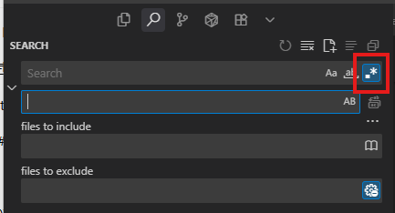

## 들어가며

마크다운 문서를 작성하다 보면 heading(제목)에 번호나 이모티콘을 넣어 구조를 표현하곤 합니다. 하지만 문서가 완성되면서 이런 장식적 요소들을 제거하고 깔끔하게 정리하고 싶을 때가 있습니다.

```markdown
## 1. 소개
### 2) 주요 기능
#### 10.1.1 캡슐화
## 🎯 목표
```

위와 같은 형식을 다음처럼 깔끔하게 만들고 싶다면?

```markdown
## 소개
### 주요 기능
#### 캡슐화
## 목표
```

VSCode의 강력한 정규식 기능을 활용하면 수십, 수백 개의 heading을 한 번에 정리할 수 있습니다. 이 글에서는 실전에서 바로 사용할 수 있는 세 가지 정규식 패턴을 소개합니다.

## 숫자 제거 정규식 (계층적 번호 포함)

### 패턴

```regex
^(#{2,4})\s+\d+(?:\.\d+)*[\.\):\-]?\s+
```

**Replace:** `$1 `

### 처리하는 케이스

이 정규식은 다양한 형태의 번호 매기기를 처리합니다:

- `## 1. 제목` → `## 제목`
- `### 2) 소제목` → `### 소제목`
- `#### 3: 내용` → `#### 내용`
- `## 10- 예시` → `## 예시`
- `#### 10.1.1 캡슐화` → `#### 캡슐화`
- `### 1.2.3.4 계층` → `### 계층`

### 패턴 상세 분석

```regex
^(#{2,4})\s+\d+(?:\.\d+)*[\.\):\-]?\s+
```

각 부분이 하는 역할을 살펴보겠습니다:

| 패턴 | 설명 |
|------|------|
| `^` | 줄의 시작을 나타냅니다 |
| `(#{2,4})` | ##, ###, ####를 캡처합니다 (그룹 1) |
| `\s+` | 하나 이상의 공백 문자 |
| `\d+` | 첫 번째 숫자 (하나 이상의 숫자) |
| `(?:\.\d+)*` | `.숫자` 패턴이 0번 이상 반복 (10.1.1 같은 계층) |
| `[\.\):\-]?` | 구두점 선택적으로 하나 (`.` `)` `:` `-`) |
| `\s+` | 제목 앞의 공백 |

**Replace `$1 `**: 캡처한 heading 마크(##, ###, ####) + 공백 하나

### 보존되는 케이스

이 정규식은 다음과 같은 경우를 안전하게 보존합니다:

- `### "I am Iron Man" 리콜` → 변경 없음 ✓
- `### 2029년, 최후의 전쟁` → 변경 없음 ✓ (년 앞에 구두점 없음)
- `### **도입부 (Exposition)**` → 변경 없음 ✓

숫자 뒤에 구두점이 있거나, 공백 뒤에 바로 구두점이 있는 경우에만 매칭되므로 제목의 일부인 숫자는 보존됩니다.

## 이모티콘 제거 정규식 (명시적 나열)

### 패턴

```regex
^(#{2,4})\s+[🎯✨🚀💡📌⭐🔥💪👍❤️🎉🎊🏆🎁]+\s+
```

**Replace:** `$1 `

### 처리하는 케이스

- `## 🎯 목표` → `## 목표`
- `### ✨ 특징` → `### 특징`
- `#### 🚀 시작하기` → `#### 시작하기`
- `## 💡🔥 주요 아이디어` → `## 주요 아이디어`

### 패턴 설명

```regex
^(#{2,4})\s+[🎯✨🚀💡📌⭐🔥💪👍❤️🎉🎊🏆🎁]+\s+
```

| 패턴 | 설명 |
|------|------|
| `^(#{2,4})` | 줄 시작의 ##, ###, #### 캡처 |
| `\s+` | 공백 문자 하나 이상 |
| `[🎯✨🚀💡📌⭐🔥💪👍❤️🎉🎊🏆🎁]+` | 나열된 이모티콘 중 하나 이상 |
| `\s+` | 제목 앞의 공백 |

### 장단점

**장점:**
- 안전하고 예측 가능합니다
- VSCode에서 바로 작동합니다
- 원하는 이모티콘만 선택적으로 제거 가능합니다

**단점:**
- 나열되지 않은 이모티콘은 제거되지 않습니다
- 새로운 이모티콘을 추가하려면 패턴을 수정해야 합니다

### 이모티콘 추가하기

자주 사용하는 이모티콘을 추가하려면 대괄호 안에 원하는 이모티콘을 넣으면 됩니다:

```regex
^(#{2,4})\s+[🎯✨🚀💡📌⭐🔥💪👍❤️🎉🎊🏆🎁📝🔖✅❌➡️⬅️]+\s+
```

## 이모티콘 제거 정규식 (유니코드 범위)

### 패턴

```regex
^(#{2,4})\s+[\u{1F300}-\u{1F9FF}\u{2600}-\u{26FF}\u{2700}-\u{27BF}\u{1F1E0}-\u{1F1FF}]+\s+
```

**Replace:** `$1 `

### 유니코드 범위 설명

이 패턴은 유니코드 범위를 사용하여 거의 모든 이모티콘을 커버합니다:

| 범위 | 포함하는 이모티콘 |
|------|------------------|
| `\u{1F300}-\u{1F9FF}` | 이모티콘 및 기호 (🌀~🧿) |
| `\u{2600}-\u{26FF}` | 기타 기호 (☀~⛿) |
| `\u{2700}-\u{27BF}` | 장식 기호 (✀~➿) |
| `\u{1F1E0}-\u{1F1FF}` | 지역 표시 기호 (🇦~🇿) |

### 장단점

**장점:**
- 거의 모든 이모티콘을 자동으로 커버합니다
- 패턴을 수정하지 않아도 새로운 이모티콘 처리 가능합니다

**단점:**
- VSCode 버전이나 설정에 따라 유니코드 범위가 지원되지 않을 수 있습니다
- 일부 환경에서는 작동하지 않을 수 있습니다

## VSCode에서 사용하는 방법

### 1단계: Find & Replace 열기

**Ctrl + H**를 누르거나 메뉴에서 Edit > Replace를 선택합니다.

### 2단계: 정규식 모드 활성화



Find & Replace 창에서 다음 중 하나를 수행합니다:
- `.*` 버튼 클릭
- **Alt + R** 단축키 사용

### 3단계: 패턴 입력

**Find** 필드에 위에서 소개한 정규식 중 하나를 입력합니다.

```regex
^(#{2,4})\s+\d+(?:\.\d+)*[\.\):\-]?\s+
```

**Replace** 필드에 `$1 `을 입력합니다 (공백 포함 주의!).

### 4단계: 실행

- **Replace All**: 모든 항목을 한 번에 변경
- **Replace**: 하나씩 확인하며 변경

### 주의사항

**Replace 필드에 공백을 꼭 포함하세요!**

- 올바른 예: `$1 ` (공백 있음)
- 잘못된 예: `$1` (공백 없음)

공백이 없으면 heading 마크와 제목이 붙어버립니다:
- `##제목` (잘못됨)
- `## 제목` (올바름)

## 실전 사용 예시

### 예시 1: 기술 문서 정리

**변경 전:**
```markdown
## 1. 개요
### 1.1 배경
### 1.2 목적
## 2. 아키텍처
### 2.1 시스템 구조
#### 2.1.1 프론트엔드
#### 2.1.2 백엔드
```

**정규식 적용:**
```regex
^(#{2,4})\s+\d+(?:\.\d+)*[\.\):\-]?\s+
```

**변경 후:**
```markdown
## 개요
### 배경
### 목적
## 아키텍처
### 시스템 구조
#### 프론트엔드
#### 백엔드
```

### 예시 2: 블로그 포스트 정리

**변경 전:**
```markdown
## 🎯 학습 목표
### 📌 핵심 개념
### ✨ 실습 예제
## 🚀 시작하기
### 💡 준비사항
```

**정규식 적용:**
```regex
^(#{2,4})\s+[🎯✨🚀💡📌⭐🔥💪👍❤️🎉🎊🏆🎁]+\s+
```

**변경 후:**
```markdown
## 학습 목표
### 핵심 개념
### 실습 예제
## 시작하기
### 준비사항
```

### 예시 3: 혼합 형식 정리

번호와 이모티콘이 섞여 있는 경우, 두 정규식을 순차적으로 적용합니다:

**변경 전:**
```markdown
## 1. 🎯 프로젝트 개요
### 1.1 📌 목표
### 1.2 ✨ 특징
## 2. 🚀 구현
```

**1단계: 숫자 제거**
```regex
^(#{2,4})\s+\d+(?:\.\d+)*[\.\):\-]?\s+
```

**중간 결과:**
```markdown
## 🎯 프로젝트 개요
### 📌 목표
### ✨ 특징
## 🚀 구현
```

**2단계: 이모티콘 제거**
```regex
^(#{2,4})\s+[🎯✨🚀💡📌⭐🔥💪👍❤️🎉🎊🏆🎁]+\s+
```

**최종 결과:**
```markdown
## 프로젝트 개요
### 목표
### 특징
## 구현
```

## 주의해야 할 경우들

### 제목 일부인 숫자는 보존됨

정규식이 안전하게 설계되어 다음과 같은 경우는 변경하지 않습니다:

- `### 2029년, 최후의 전쟁` → 변경 없음 ✓
- `## Windows 10 설치하기` → 변경 없음 ✓
- `### Python 3.11 새 기능` → 변경 없음 ✓

이는 숫자 뒤에 구두점(`.` `)` `:` `-`)이 있어야만 매칭되도록 설계되었기 때문입니다.

### 따옴표와 마크다운 문법 보존

- `### "I am Iron Man" 리콜` → 변경 없음 ✓
- `### **도입부 (Exposition)**` → 변경 없음 ✓
- `## [링크 텍스트]` → 변경 없음 ✓

### #1 스타일 제목

GitHub 이슈 스타일의 제목(`## #123 버그 수정`)은 현재 패턴으로 매칭되지 않습니다. 이런 경우를 처리하려면 다음 패턴을 사용하세요:

```regex
^(#{2,4})\s+#\d+\s+
```

## 권장 워크플로우

### 단계별 적용 순서

1. **먼저 백업**: 중요한 문서는 git commit 또는 복사본 생성
2. **숫자 제거**: 첫 번째 정규식 실행
3. **이모티콘 제거**: 두 번째 정규식 실행 (필요시)
4. **검토**: 변경 사항 확인
5. **Undo**: 문제가 있으면 Ctrl + Z

### 파일 범위 지정

특정 파일이나 폴더에만 적용하고 싶다면:

1. Explorer에서 파일/폴더 선택
2. 우클릭 > "Find in Folder..." 선택
3. Find & Replace 창에서 정규식 입력
4. Replace All

### 프로젝트 전체 적용

프로젝트 전체에 적용할 때는 더 신중해야 합니다:

1. **Ctrl + Shift + H**로 전역 검색/치환 열기
2. Files to include에 `**/*.md` 입력 (markdown 파일만)
3. 정규식 입력
4. **Replace All** 전에 꼭 미리보기 확인!

## 추가 활용 팁

### 스니펫으로 저장

자주 사용하는 정규식은 VSCode 스니펫으로 저장하면 편리합니다:

1. File > Preferences > Configure User Snippets
2. markdown.json 선택
3. 다음 스니펫 추가:

```json
{
  "Remove Heading Numbers": {
    "prefix": "regex-number",
    "body": ["^(#{2,4})\\s+\\d+(?:\\.\\d+)*[\\.\\):\\-]?\\s+"],
    "description": "Remove numbers from markdown headings"
  }
}
```

### 키보드 매크로

반복 작업이 많다면 키보드 매크로를 설정하세요:

1. Settings > Keyboard Shortcuts
2. "Replace" 검색
3. 원하는 단축키 설정

### 정규식 테스트

복잡한 정규식은 온라인 도구에서 먼저 테스트하세요:

- [regex101.com](https://regex101.com)
- [regexr.com](https://regexr.com)

**주의**: 온라인 도구에서는 `^` 앵커가 다르게 동작할 수 있으므로 멀티라인 모드를 켜야 합니다.

## 정규식 패턴 확장

### H1도 포함하려면

`#{2,4}`를 `#{1,4}`로 변경:

```regex
^(#{1,4})\s+\d+(?:\.\d+)*[\.\):\-]?\s+
```

### 더 많은 구두점 지원

다른 구두점도 지원하려면 문자 클래스에 추가:

```regex
^(#{2,4})\s+\d+(?:\.\d+)*[\.\):\-\]\>]?\s+
```

이제 `## 1] 제목`이나 `## 1> 제목`도 처리됩니다.

### 로마 숫자 지원

로마 숫자(I, II, III, IV...)를 제거하려면:

```regex
^(#{2,4})\s+[IVX]+[\.\):\-]\s+
```

## 성능 고려사항

### 대용량 파일 처리

수천 줄의 대용량 마크다운 파일을 처리할 때:

1. 파일을 여러 개로 분할하거나
2. 섹션별로 나누어서 적용
3. VSCode가 느려지면 다른 탭 닫기

### 정규식 최적화

- `\s+` 대신 ` +` (공백 문자만)을 쓰면 약간 더 빠릅니다
- 하지만 탭 문자가 있을 수 있으므로 `\s+`가 더 안전합니다

## 마무리

마크다운 문서의 heading을 정리하는 세 가지 정규식 패턴을 살펴봤습니다:

1. **숫자 제거**: `^(#{2,4})\s+\d+(?:\.\d+)*[\.\):\-]?\s+`
2. **이모티콘 제거 (명시적)**: `^(#{2,4})\s+[🎯✨🚀💡📌⭐🔥💪👍❤️🎉🎊🏆🎁]+\s+`
3. **이모티콘 제거 (유니코드)**: `^(#{2,4})\s+[\u{1F300}-\u{1F9FF}\u{2600}-\u{26FF}\u{2700}-\u{27BF}\u{1F1E0}-\u{1F1FF}]+\s+`

이 패턴들은 실제 프로젝트에서 바로 사용할 수 있도록 안전하게 설계되었습니다. 제목의 일부인 숫자나 문자는 보존하면서도 불필요한 번호 매기기와 이모티콘만 제거합니다.

정규식은 처음에는 어려워 보일 수 있지만, 한 번 익혀두면 문서 작업의 생산성을 크게 향상시킬 수 있습니다. 이 가이드가 여러분의 마크다운 작업에 도움이 되길 바랍니다!

## 참고 자료

- [VSCode 정규식 문법](https://code.visualstudio.com/docs/editor/codebasics#_advanced-search-options)
- [JavaScript 정규식 가이드](https://developer.mozilla.org/en-US/docs/Web/JavaScript/Guide/Regular_Expressions)
- [Regex101 - 정규식 테스트 도구](https://regex101.com)

