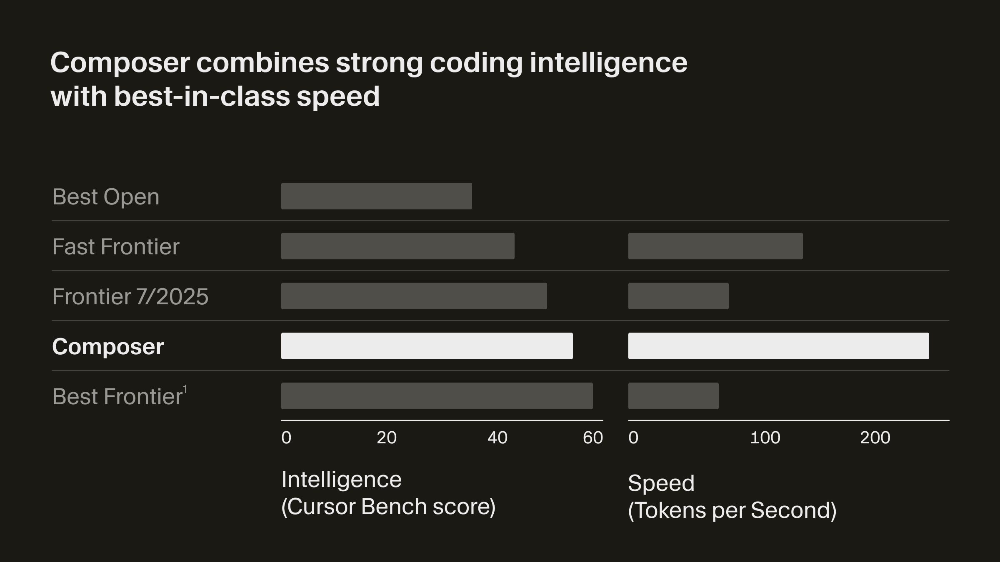
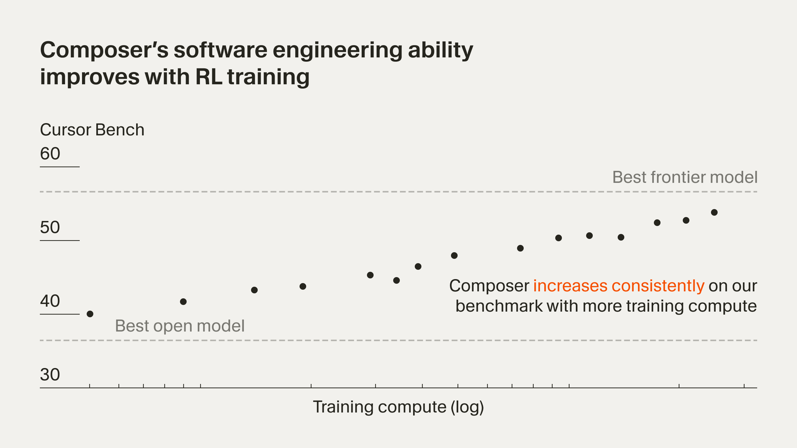
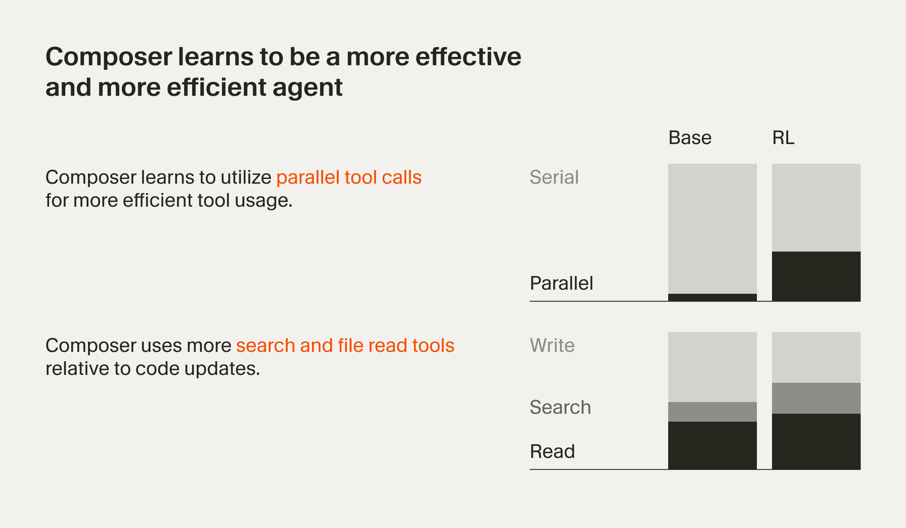

> 본 글은 [Cursor 공식 블로그](https://cursor.com/blog/composer) 정보를 바탕으로 작성했습니다.

2025년 10월 29일, Cursor는 소프트웨어 엔지니어링을 위한 새로운 에이전트 모델인 **Composer**를 발표했습니다. Composer는 강화학습(Reinforcement Learning)으로 훈련된 대규모 모델로, 프론티어 수준의 코딩 성과를 달성하면서도 유사한 모델 대비 4배 빠른 생성 속도를 제공합니다.

## Composer란?

Composer는 Cursor의 새로운 에이전트 모델로, 소프트웨어 엔지니어링 지능과 속도에 최적화되어 있습니다. 이 모델은 대규모 코드베이스에서 실제 소프트웨어 엔지니어링 과제를 완수하도록 훈련되었으며, 프로덕션 검색 및 편집 도구에 접근하여 다양한 어려운 문제를 효율적으로 해결할 수 있습니다.

### 개발 배경

Composer 개발의 동기는 Cursor의 커스텀 자동완성 모델인 Cursor Tab 개발 경험에서 비롯되었습니다. 개발자들은 종종 인터랙티브 사용을 지원할 수 있는 가장 스마트한 모델을 원하며, 코딩의 흐름을 유지할 수 있는 도구를 필요로 합니다. Cursor는 더 빠른 에이전트 모델의 영향을 이해하기 위해 프로토타입 모델인 Cheetah를 실험했고, Composer는 이를 더욱 지능적으로 발전시킨 버전입니다.

## 핵심 기술적 특징

### Mixture of Experts (MoE) 아키텍처

Composer는 전문가 혼합(Mixture of Experts, MoE) 언어 모델로, 장문 컨텍스트 생성 및 이해를 지원합니다. 이 아키텍처는 모델이 특정 작업에 대해 가장 적합한 전문가를 선택적으로 활성화할 수 있도록 하여, 효율성과 성능을 동시에 달성합니다.

### 장문 컨텍스트 처리

Composer는 긴 컨텍스트를 생성하고 이해할 수 있어, 대규모 코드베이스에서도 효과적으로 작동합니다. 이는 복잡한 소프트웨어 프로젝트에서 필수적인 기능입니다.

### 강화학습 기반 특화

Composer는 다양한 개발 환경에서 강화학습을 통해 소프트웨어 엔지니어링에 특화되었습니다. 각 훈련 반복에서 모델은 문제 설명을 받고 최상의 응답을 생성하도록 지시받습니다. 이 응답은 코드 편집, 계획, 또는 정보성 답변일 수 있습니다.

## 성능 및 벤치마크

### Cursor Bench 평가

Cursor는 모델의 소프트웨어 개발자에게의 유용성을 가능한 한 정확하게 측정하는 평가를 구축했습니다. **Cursor Bench**는 Cursor의 엔지니어 및 연구원들로부터의 실제 에이전트 요청과 이러한 요청에 대한 손으로 큐레이션된 최적 솔루션으로 구성됩니다. 이 평가는 에이전트의 정확성뿐만 아니라 코드베이스의 기존 추상화 및 소프트웨어 엔지니어링 관행 준수도 측정합니다.

### 벤치마크 결과

Composer는 벤치마크에서 프론티어 코딩 성과를 달성했습니다. 특히:

- **Fast Frontier 클래스**: Haiku 4.5, Gemini Flash 2.5와 같은 효율적인 추론을 위한 모델들과 비교
- **Best Open 클래스**: Qwen Coder, GLM 4.6과 같은 최근 오픈 웨이트 모델 릴리스와 비교
- **생성 속도**: 유사한 모델 대비 **4배 빠른 토큰 생성 속도**

### 모델 클래스 비교

- **Fast Frontier**: 효율적인 추론을 위해 설계된 모델들 (Haiku 4.5, Gemini Flash 2.5 등)
- **Best Open**: 최근 오픈 웨이트 모델 릴리스 (Qwen Coder, GLM 4.6 등)
- **Frontier 7/2025**: 올해 7월에 사용 가능했던 최고 모델
- **Best Frontier**: GPT-5, Sonnet 4.5 등 Composer보다 성능이 우수한 모델들

Composer는 Fast Frontier 클래스에서 탁월한 성능을 보이면서도, Best Frontier 모델들보다 빠른 속도를 제공합니다.

## 강화학습 훈련 방법

### 실세계 소프트웨어 엔지니어링 과제

Composer는 대규모 코드베이스에서 실제 소프트웨어 엔지니어링 과제를 완수하도록 훈련되었습니다. 훈련 중 모델은 프로덕션 검색 및 편집 도구 세트에 접근할 수 있으며, 다양한 어려운 문제를 효율적으로 해결하도록 지시받습니다.

### 도구 접근 및 사용

모델은 다음과 같은 도구들에 접근할 수 있습니다:

- **파일 읽기 및 편집**: 간단한 파일 조작 작업
- **터미널 명령**: 더 강력한 작업을 위한 명령 실행
- **코드베이스 전체 시맨틱 검색**: 대규모 코드베이스에서의 효율적인 탐색

### 효율적 학습 인센티브

강화학습을 통해 모델은 소프트웨어 엔지니어링에 효과적으로 특화될 수 있습니다. 특히:

- **도구 사용의 효율적 선택**: 응답 속도가 인터랙티브 개발의 중요한 구성 요소이므로 효율적인 도구 사용 선택을 장려
- **병렬 처리 최대화**: 가능할 때마다 병렬 처리를 최대화하도록 학습
- **불필요한 응답 최소화**: 증거 없이 주장하지 않도록 훈련되어 도움이 되는 어시스턴트로 작동

### 자발적 학습 행동

RL 과정에서 모델은 유용한 행동을 자발적으로 학습합니다:

- 복잡한 검색 수행
- 린터 오류 수정
- 단위 테스트 작성 및 실행

이러한 학습은 명시적인 지시 없이 자연스럽게 발생합니다.

## 기술적 혁신

### MXFP8 MoE 커널

대규모 MoE 모델의 효율적인 훈련은 인프라 구축 및 시스템 연구에 상당한 투자가 필요합니다. Cursor는 MXFP8 MoE 커널을 전문가 병렬화 및 하이브리드 샤딩 데이터 병렬화와 결합하여 네이티브로 저정밀도 훈련을 수행합니다. 이를 통해 최소한의 통신 비용으로 수천 개의 NVIDIA GPU에 훈련을 확장할 수 있습니다.

### 사후 훈련 양자화 없이 빠른 추론

MXFP8로 훈련하면 사후 훈련 양자화 없이 더 빠른 추론 속도를 제공할 수 있습니다. 이는 모델의 품질을 유지하면서도 추론 속도를 크게 향상시킵니다.

### 하이브리드 샤딩 데이터 병렬화

하이브리드 샤딩 데이터 병렬화 방식을 통해 모델은 여러 GPU에 분산되어 효율적으로 훈련됩니다. 이는 메모리 사용을 최적화하고 통신 오버헤드를 최소화합니다.

## 훈련 인프라

### PyTorch와 Ray 기반 비동기 강화학습

Cursor는 PyTorch와 Ray를 활용한 커스텀 훈련 인프라를 구축하여 대규모 비동기 강화학습을 지원합니다. 이 인프라는 대규모 모델 훈련의 복잡성을 효율적으로 처리합니다.

### 대규모 샌드박스 코딩 환경

RL 중 모델은 Cursor Agent 하네스의 모든 도구를 호출할 수 있어야 합니다. 이러한 도구는 코드 편집, 시맨틱 검색 사용, 문자열 grep, 터미널 명령 실행을 허용합니다. 규모에서 모델이 이러한 도구를 효과적으로 호출하도록 가르치는 것은 클라우드에서 수십만 개의 동시 샌드박스 코딩 환경 실행을 필요로 합니다.

### 가상 머신 스케줄러 재작성

이러한 워크로드를 지원하기 위해 Cursor는 Background Agents를 위해 구축한 기존 인프라를 적응시켰습니다. 가상 머신 스케줄러를 재작성하여 훈련 실행의 버스트 특성과 규모를 지원합니다. 이를 통해 RL 환경과 프로덕션 환경의 원활한 통합이 가능해졌습니다.

## 실제 활용 사례

### Cursor 내부 사용

Cursor는 소프트웨어 엔지니어링을 위한 도구를 구축하며, 자체 개발한 도구를 적극적으로 활용합니다. Composer 개발의 동기 중 하나는 자신들의 작업에서 도달할 수 있는 에이전트를 개발하는 것이었습니다.

최근 몇 주 동안 많은 동료들이 일상적인 소프트웨어 개발에서 Composer를 사용하고 있다는 사실이 확인되었습니다. 이는 Composer가 실제 개발 작업에서 유용한 도구임을 보여줍니다.

### 개발자 워크플로 통합

Composer는 개발자의 코딩 흐름을 유지하면서도 강력한 AI 어시스턴트 기능을 제공합니다. 인터랙티브한 사용을 지원하는 빠른 속도와 높은 지능의 균형을 통해 개발자들이 코딩의 즐거움을 유지할 수 있도록 합니다.

## 결론

Composer는 소프트웨어 엔지니어링을 위한 AI 에이전트의 새로운 지평을 열었습니다. 강화학습으로 훈련된 MoE 아키텍처를 통해 프론티어 수준의 코딩 성과를 달성하면서도, 유사한 모델 대비 4배 빠른 생성 속도를 제공합니다.

MXFP8 기반의 효율적인 인프라와 대규모 샌드박스 환경에서의 훈련은 Composer가 실제 개발 작업에서 실용적이고 유용한 도구임을 보여줍니다. Cursor 내부에서의 실제 사용 사례는 이러한 모델이 개발자의 일상적인 소프트웨어 개발에 통합될 수 있음을 입증합니다.

Composer의 출시는 소프트웨어 엔지니어링의 미래를 향한 중요한 이정표입니다. 개발자들이 더 효율적이고 즐겁게 코딩할 수 있는 환경을 제공하는 Composer와 같은 도구들이 계속 발전하면서, AI와 인간 개발자 간의 협력이 더욱 깊어질 것입니다.

**참고 자료:**
- [Cursor Composer 공식 블로그 포스트](https://cursor.com/blog/composer)

