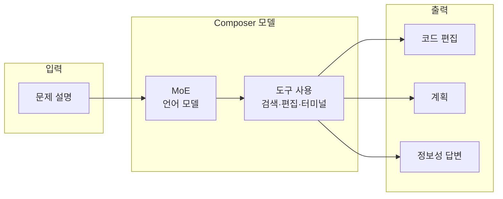

> 본 글은 [Cursor 공식 블로그](https://cursor.com/blog/composer) 및 [MXFP8 MoE 커널 포스트](https://cursor.com/blog/kernels)를 바탕으로 작성했습니다.

2025년 10월 29일, Cursor는 소프트웨어 엔지니어링용 **에이전트 모델 Composer**를 발표했습니다. Composer는 **강화학습(Reinforcement Learning)**으로 훈련된 대규모 **MoE(Mixture of Experts)** 언어 모델로, Cursor 자체 벤치마크인 **Cursor Bench**에서 프론티어 수준의 코딩 성과를 보이면서도, 유사한 성능의 모델 대비 **약 4배 빠른 토큰 생성 속도**를 제공합니다. 이 포스트에서는 Composer의 정의, 기술적 특징, 벤치마크, 훈련 인프라, 활용 관점을 정리하고, 한눈에 보는 요약표와 참고 문헌을 제시합니다.

## Composer란?

**Composer**는 Cursor가 만든 새로운 에이전트 전용 모델입니다. “소프트웨어 엔지니어링 지능”과 “속도”에 맞춰 설계되었으며, 대규모 코드베이스에서 실제 개발 과제(코드 편집, 계획 수립, 정보성 답변 등)를 수행하도록 훈련되었습니다. 훈련 시에는 프로덕션급 검색·편집 도구에 접근할 수 있어, 파일 읽기·편집, 터미널 명령 실행, 코드베이스 전체 시맨틱 검색 등을 활용해 다양한 난이도의 문제를 해결하도록 학습했습니다.

### 개발 동기

Composer 개발 동기는 Cursor의 **자동완성 모델 Cursor Tab** 경험에서 비롯되었습니다. 개발자들은 “가능한 한 스마트하면서도 인터랙티브하게 쓸 수 있는 모델”을 원하며, 코딩 흐름을 끊지 않는 도구를 필요로 합니다. Cursor는 더 빠른 에이전트의 효과를 파악하기 위해 프로토타입 **Cheetah**를 실험했고, Composer는 이를 더 지능적으로 발전시킨 버전입니다. 공식 블로그에서는 이를 다음과 같이 요약합니다.

> "Composer is our new agent model designed for software engineering intelligence and speed. On our benchmarks, the model achieves frontier coding results with generation speed four times faster than similar models."  
> — [Cursor, Composer 공식 블로그](https://cursor.com/blog/composer), 2025년 10월

즉, **프론티어급 코딩 성과**와 **동급 대비 4배 빠른 생성 속도**를 동시에 목표로 한 모델입니다.

## 핵심 기술적 특징

### MoE 아키텍처와 장문 컨텍스트

Composer는 **Mixture of Experts(MoE)** 언어 모델로, 긴 컨텍스트의 생성과 이해를 지원합니다. MoE 구조에서는 작업에 따라 적절한 “전문가” 서브네트워크만 선택적으로 활성화하므로, 전체 파라미터 규모를 키우지 않고도 표현력을 높이고, 추론 시 계산량을 줄일 수 있습니다. 이를 통해 대규모 코드베이스에서도 효과적으로 동작하도록 설계되었습니다.

### 강화학습 기반 소프트웨어 엔지니어링 특화

Composer는 다양한 개발 환경에서 **강화학습(RL)**을 통해 소프트웨어 엔지니어링에 특화되었습니다. 매 훈련 반복마다 모델은 “문제 설명”을 입력받고, “최선의 응답”(코드 편집, 계획, 정보성 답변 등)을 내도록 지시받습니다. 응답 속도가 인터랙티브 개발에서 중요하므로, RL 보상 설계를 통해 **도구 사용의 효율적 선택**, **가능한 병렬 처리 극대화**, **증거 없이 주장하지 않기** 등을 학습합니다. 그 과정에서 복잡한 검색 수행, 린터 오류 수정, 단위 테스트 작성·실행 같은 행동이 명시적 지시 없이도 나타납니다.

아래 다이어그램은 Composer의 역할과 훈련·추론 흐름을 단순화한 것입니다. 노드 ID는 camelCase로 두고, 라벨에 등호나 특수문자가 있을 경우 큰따옴표로 감쌌습니다.

```mermaid
flowchart LR
  subgraph Input["입력"]
    Prob["문제 설명"]
  end
  subgraph ComposerModel["Composer 모델"]
    MoE["MoE</br>언어 모델"]
    Tools["도구 사용</br>검색·편집·터미널"]
  end
  subgraph Output["출력"]
    Edit["코드 편집"]
    Plan["계획"]
    Answer["정보성 답변"]
  end
  Prob --> MoE
  MoE --> Tools
  Tools --> Edit
  Tools --> Plan
  Tools --> Answer
```

## 성능 및 벤치마크

### Cursor Bench

Cursor는 “개발자에게 실제로 얼마나 유용한지”를 측정하는 **Cursor Bench**를 운영합니다. Cursor 엔지니어·연구원의 **실제 에이전트 요청**과 그에 대한 **손으로 큐레이션한 최적 솔루션**으로 구성되며, 정답 여부뿐 아니라 **코드베이스의 기존 추상화·소프트웨어 엔지니어링 관행 준수**까지 평가합니다.

### 모델 클래스와 벤치마크 결과

Cursor는 벤치마크 점수와 성격에 따라 모델을 여러 클래스로 나눕니다. Composer는 그중 **Fast Frontier** 클래스(효율적 추론용 모델: Haiku 4.5, Gemini Flash 2.5 등)와 비교되며, **Best Open**(Qwen Coder, GLM 4.6 등 최근 오픈 웨이트)보다 우수한 코딩 성과를 보입니다. **Best Frontier**(GPT-5, Sonnet 4.5 등)보다는 성능이 낮지만, **토큰 생성 속도는 유사 구간 모델 대비 약 4배 빠릅니다.**

| 클래스 | 설명 | 예시 모델 |
|--------|------|-----------|
| **Fast Frontier** | 효율적 추론용, Composer 비교 대상 | Haiku 4.5, Gemini Flash 2.5 |
| **Best Open** | 최근 오픈 웨이트 | Qwen Coder, GLM 4.6 |
| **Frontier 7/2025** | 2025년 7월 시점 최고급 | 해당 시점 프론티어 |
| **Best Frontier** | Composer보다 성능 우수 | GPT-5, Sonnet 4.5 |

Composer는 **Fast Frontier** 구간에서 탁월한 성능을 내면서, Best Frontier보다 빠른 응답 속도를 제공하는 것이 목표입니다.

## 강화학습 훈련 방법과 도구

훈련 시 Composer는 **실제 소프트웨어 엔지니어링 과제**를 대규모 코드베이스에서 수행하도록 설계되었습니다. 사용 가능한 도구는 다음과 같습니다.

- **파일 읽기·편집**: 단순 파일 조작
- **터미널 명령**: 더 복잡한 작업 실행
- **코드베이스 전체 시맨틱 검색**: 대규모 저장소 탐색

RL을 통해 **효율적인 도구 선택**, **병렬 처리 극대화**, **불필요한 응답·무근거 주장 최소화**가 유도되며, 복잡한 검색, 린터 수정, 단위 테스트 작성·실행 등은 별도 지시 없이 학습됩니다.

## 기술적 혁신: MXFP8 MoE와 인프라

대규모 MoE 모델을 효율적으로 훈련하려면 인프라와 시스템 연구가 필요합니다. Cursor는 **MXFP8 MoE 커널**을 **전문가 병렬화** 및 **하이브리드 샤딩 데이터 병렬화**와 결합해, **네이티브 저정밀도(MXFP8) 훈련**을 수행합니다. 이를 통해 수천 개의 NVIDIA GPU로 훈련을 확장하면서 통신 비용을 줄였습니다. MXFP8로 훈련하면 **사후 훈련 양자화 없이** 더 빠른 추론이 가능해, 품질을 유지한 채 속도를 크게 끌어올릴 수 있습니다.

MXFP8과 MoE 커널에 대한 상세 내용은 Cursor 블로그의 [MXFP8 MoE 커널 포스트](https://cursor.com/blog/kernels)에서 다룹니다. 해당 글에서는 Hopper 대비 Blackwell에서의 TMEM·양자화 오버헤드, 블록 스케일 행렬 곱·그룹 행렬 곱, 양자화 커널 설계 등이 설명됩니다.

### 훈련 인프라 요약

- **PyTorch·Ray 기반** 커스텀 훈련 인프라로 대규모 **비동기 강화학습** 지원
- RL 중 모델은 **Cursor Agent 하네스의 모든 도구**(코드 편집, 시맨틱 검색, grep, 터미널 등) 호출 가능
- 규모 확장을 위해 **수십만 개의 동시 샌드박스 코딩 환경**을 클라우드에서 실행
- **Background Agents**용 기존 인프라를 활용하고, **가상 머신 스케줄러**를 재작성해 훈련 실행의 버스트성·규모를 수용하며, RL 환경과 프로덕션 환경을 통합

## 한눈에 보기: Composer 요약

| 항목 | 내용 |
|------|------|
| **정의** | 소프트웨어 엔지니어링용 에이전트 MoE 언어 모델 |
| **훈련** | 강화학습, 실제 코드베이스·프로덕션 도구 활용 |
| **벤치마크** | Cursor Bench, Fast Frontier 구간에서 프론티어급 코딩 성과 |
| **속도** | 유사 모델 대비 약 4배 빠른 토큰 생성 |
| **인프라** | MXFP8 MoE 커널, 전문가·하이브리드 샤딩 병렬화, PyTorch·Ray |
| **추론** | 사후 양자화 없이 MXFP8 기반 빠른 추론 |

## 실제 활용과 트레이드오프

### Cursor 내부 사용

Cursor는 자사 제품을 적극 활용하며, Composer 개발 동기 중 하나는 “자신들의 일상 작업에서 실제로 쓰고 싶은 에이전트”를 만드는 것이었습니다. 발표 시점 기준으로 많은 내부 동료가 일상적인 소프트웨어 개발에 Composer를 사용하고 있어, 실사용 가능성이 검증되고 있습니다.

### 장점과 한계

**장점**으로는 (1) Cursor Bench 기준 프론티어급 코딩 성과, (2) 동급 대비 약 4배 빠른 생성 속도로 인터랙티브 사용에 유리, (3) MXFP8 기반 효율적 훈련·추론, (4) RL을 통한 도구 사용·효율성·품질 학습을 들 수 있습니다.

**한계·트레이드오프**로는 (1) 벤치마크가 Cursor 자체 평가(Cursor Bench)에 기반하므로 외부 재현·비교는 제한적일 수 있음, (2) Best Frontier(GPT-5, Sonnet 4.5 등)보다는 성능이 낮음, (3) 모델 규모·훈련 비용으로 인해 오픈 웨이트가 아닌 Cursor 서비스 내 전용 모델로 제공된다는 점을 고려할 수 있습니다. 따라서 “최고 성능”보다 “속도와 성능의 균형”이 중요한 일상 개발·프로토타이핑에 적합한 선택입니다.

## 결론

Composer는 소프트웨어 엔지니어링을 위한 AI 에이전트의 한 축을 담당합니다. 강화학습으로 훈련된 MoE 아키텍처와 MXFP8 기반 인프라를 통해, 프론티어 수준의 코딩 성과와 유사 모델 대비 4배 빠른 생성 속도를 동시에 추구합니다. Cursor 내부에서의 실제 사용 사례는 일상 개발 워크플로에 통합 가능한 실용적 도구임을 보여주며, “가장 똑똑한 모델”보다 “빠르고 쓸 만한 에이전트”를 원하는 개발자에게 유용한 옵션이 됩니다.

---

## 참고 문헌

1. **Cursor — Composer: Building a fast frontier model with RL**  
   https://cursor.com/blog/composer  
   Composer 발표, MoE·RL·Cursor Bench·속도 비교 설명.

2. **Cursor — MXFP8 MoE kernels**  
   https://cursor.com/blog/kernels  
   MXFP8 저정밀도 훈련, MoE 레이어 최적화, Blackwell·Hopper 비교, 양자화·커널 설계.

3. **Open Compute Project — OCP Microscaling (MX) Formats Specification**  
   https://www.opencompute.org/documents/ocp-microscaling-formats-mx-v1-0-spec-final-pdf  
   MXFP8 등 MX 포맷의 공식 스펙 (Cursor kernels 글에서 참조).
