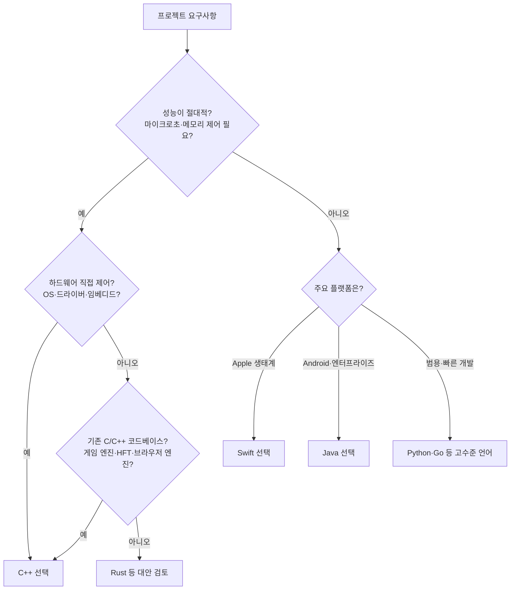
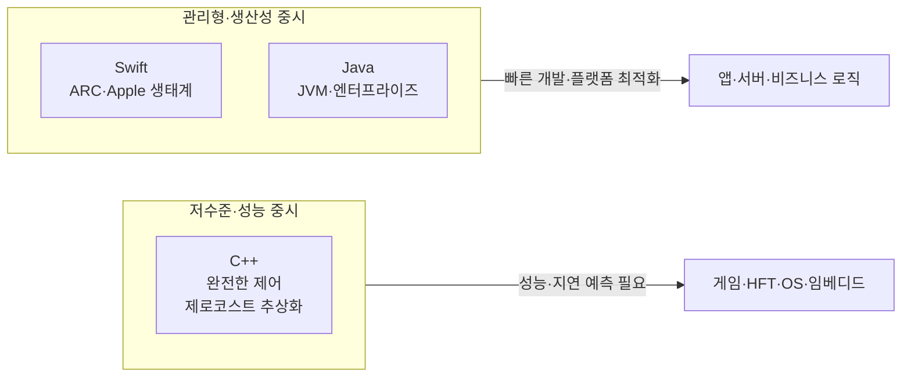

많은 개발자들이 C++를 배우면서 느끼는 공통된 경험이 있습니다. "왜 이렇게 복잡하지?" Swift나 Java를 배운 후 C++를 접하면, 그 복잡함에 압도됩니다. 포인터, 메모리 관리, 템플릿 메타프로그래밍, RAII, 그리고 수많은 예외 상황들. 그럼에도 C++는 여전히 가장 널리 사용되는 프로그래밍 언어 중 하나입니다. 이 모순을 이해하는 것이 중요합니다.

이 글에서는 C++의 복잡성에도 불구하고 지속적으로 사용되는 이유에 대한 다양한 관점을 탐구합니다.

## 이 글에서 다루는 내용

- **C++가 어려운 이유**: 메모리 관리, 템플릿 메타프로그래밍, 복잡한 문법과 예외 상황
- **C++가 필요한 이유**: 성능·하드웨어 제어가 중요한 영역, 레거시 생태계, 제로코스트 추상화·컴파일 타임 최적화
- **Swift·Java와의 비교**: 각 언어의 장단점과 적합한 사용 사례
- **언어 선택 플로우**: 프로젝트 요구사항에 따른 C++ vs Swift vs Java 선택 가이드
- **현실적인 통찰**: 쉬운 언어의 숨겨진 비용, C++ 학습 곡선, Rust 등 대안

---

## C++가 어려운 이유

### 복잡한 메모리 관리

C++는 프로그래머가 직접 메모리를 관리해야 합니다. Swift나 Java의 가비지 컬렉터가 자동으로 메모리를 정리해주는 것과 달리, C++에서는 `new`와 `delete`를 명시적으로 호출해야 하며, 메모리 누수나 이중 해제 같은 버그를 피하기 위해 세심한 주의가 필요합니다.

```cpp
// C++에서 메모리 관리가 필요한 예시
int* ptr = new int[100];
// ... 사용 중 ...
delete[] ptr;  // 잊어버리면 메모리 누수!
```

현대 C++에서는 `std::unique_ptr`, `std::shared_ptr`, RAII를 활용해 이러한 부담을 크게 줄일 수 있지만, 그 개념 자체를 이해하는 데도 시간이 듭니다.

### 템플릿 메타프로그래밍의 난해함

C++의 템플릿 시스템은 강력하지만 이해하기 어렵습니다. 템플릿 특수화, SFINAE, 그리고 컴파일 타임 계산은 초보자에게는 마법처럼 보입니다. C++20의 Concepts로 가독성이 나아졌지만, 여전히 학습 곡선이 높습니다.

### 복잡한 문법과 예외 상황

C++는 수십 년에 걸쳐 발전하면서 다양한 기능이 추가되었고, 문법이 복잡해졌습니다. 초기화만 해도 `=`, `{}`, `()` 등 여러 방식이 있으며, 각각의 의미가 다릅니다. Undefined behavior, ODR(One Definition Rule), 링킹 이슈 등 예외 상황도 많습니다.

---

## 그럼에도 불구하고 C++가 필요한 이유

### 성능이 절대적으로 중요한 영역

#### 게임 엔진 개발

Unreal Engine, Unity의 C++ 백엔드, 그리고 대부분의 AAA 게임들은 C++로 작성됩니다. 게임은 초당 60프레임 이상을 유지해야 하며, 렌더링 파이프라인에서 1밀리초의 지연도 플레이어 경험에 영향을 줍니다. Swift나 Java의 가비지 컬렉터가 예측 불가능한 pause를 발생시킬 수 있는 반면, C++는 정확한 메모리 할당과 해제 시점을 제어할 수 있습니다.

#### 고빈도 거래(HFT) 시스템

금융 시장에서 마이크로초 단위의 지연은 수백만 달러의 손실을 의미할 수 있습니다. C++로 작성된 거래 시스템은 하드웨어에 가까운 성능을 제공하며, Java의 JVM 오버헤드나 Swift의 런타임 비용 없이 실행됩니다.

### 하드웨어 제어가 필요한 영역

#### 운영체제 개발

Linux, Windows, macOS의 커널은 대부분 C/C++로 작성됩니다. 운영체제는 하드웨어를 직접 제어해야 하며, 메모리 레이아웃과 CPU 레지스터에 대한 세밀한 제어가 필요합니다. Swift나 Java는 이러한 저수준 접근을 제공하지 않습니다.

#### 임베디드 시스템

IoT 디바이스, 미세 컨트롤러, 자동차의 ECU(Electronic Control Unit) 등은 제한된 메모리와 CPU 성능을 가집니다. C++는 이러한 제약 조건에서도 효율적으로 동작하며, 필요한 만큼만 리소스를 사용할 수 있습니다.

### 레거시 시스템과의 호환성

수십 년간 쌓인 C/C++ 코드베이스는 전 세계 인프라의 핵심입니다. 데이터베이스 엔진(MySQL, PostgreSQL), 브라우저 엔진(Chromium, Firefox), 그리고 수많은 시스템 라이브러리들이 C++로 작성되어 있습니다. 이러한 시스템을 완전히 재작성하는 것은 현실적으로 불가능합니다.

### Zero-Cost Abstraction

C++의 핵심 철학 중 하나는 "zero-cost abstraction"입니다. 추상화를 사용해도 런타임 오버헤드가 없어야 한다는 의미입니다.

```cpp
// C++의 템플릿은 컴파일 타임에 코드를 생성
template<typename T>
T add(T a, T b) {
    return a + b;
}

// 호출 시: add<int>(3, 4)
// 컴파일 후: 일반 함수 호출과 동일한 성능
```

반면 Java나 Swift의 제네릭은 타입 삭제(type erasure)를 통해 런타임에 타입 정보를 잃거나, 추가적인 런타임 비용이 발생할 수 있습니다.

### 컴파일 타임 최적화

C++ 컴파일러는 매우 공격적인 최적화를 수행합니다. 인라인 함수, 루프 언롤링, 데드 코드 제거 등이 컴파일 타임에 이루어져, 최종 실행 파일은 인간이 작성한 코드와는 매우 다르게 최적화됩니다.

---

## 언제 어떤 언어를 선택할까?

요구사항에 따른 언어 선택을 다음 플로우로 정리할 수 있습니다.



---

## Swift/Java와의 비교

### Swift의 장점과 제약

Swift는 현대적인 문법과 안전한 메모리 관리(ARC)를 제공하며, iOS/macOS 개발에 최적화되어 있습니다. 그러나:

- **플랫폼 제한**: 주로 Apple 생태계에 국한됨
- **성능**: C++에 비해 다소 느림 (하지만 대부분의 경우 충분히 빠름)
- **하드웨어 제어**: 운영체제 레벨의 제어가 어려움

### Java의 장점과 제약

Java는 플랫폼 독립성과 풍부한 생태계를 제공합니다. 그러나:

- **JVM 오버헤드**: 가비지 컬렉터와 JIT 컴파일러로 인한 지연
- **메모리 사용량**: C++에 비해 높은 메모리 사용
- **실시간 시스템**: 가비지 컬렉터로 인한 예측 불가능한 지연

### 사용 사례 비교 요약

| 언어 | 적합한 사용 사례 | 부적합한 사용 사례 |
|------|----------------|------------------|
| C++ | 게임 엔진, 운영체제, 임베디드, HFT, 브라우저 엔진 | 일반적인 웹 애플리케이션, 빠른 프로토타이핑 |
| Swift | iOS/macOS 앱, Apple 생태계 개발 | 크로스 플랫폼, 하드웨어 제어가 필요한 시스템 |
| Java | 엔터프라이즈 애플리케이션, 안드로이드, 대규모 서버 | 실시간 시스템, 메모리가 극히 제한된 환경 |

---

## C++ vs GC 언어: 트레이드오프 도식

성능·제어와 생산성·안전성 사이의 관계를 한눈에 보면 다음과 같습니다.



---

## 현실적인 통찰

### "쉬운" 언어의 숨겨진 비용

Swift나 Java가 "쉽다"고 느껴지는 이유는 언어가 많은 것을 대신 처리해주기 때문입니다. 하지만 이것은 양면의 칼입니다:

- **가비지 컬렉터**: 편리하지만 예측 불가능한 지연 발생
- **런타임**: 유연성을 제공하지만 오버헤드 존재
- **추상화**: 생산성을 높이지만 성능 제어가 어려움

### C++의 학습 곡선

C++를 배우는 것은 어렵습니다. 하지만 일단 익숙해지면:

- **문제 해결 능력**: 메모리와 성능에 대한 깊은 이해
- **다른 언어 이해**: 다른 언어의 내부 동작 방식 이해에 도움
- **유연성**: 필요한 만큼의 제어 가능

### 미래의 대안: Rust

Rust는 C++의 성능과 메모리 안전성을 결합한 언어로 주목받고 있습니다. 그러나 C++의 방대한 생태계와 레거시 코드를 대체하기까지는 시간이 필요합니다. 시스템 프로그래밍을 새로 시작하는 프로젝트에서는 Rust를 검토할 가치가 있습니다.

---

## 결론: 적절한 도구를 선택하라

프로그래밍 언어는 도구일 뿐입니다. 망치로 나사를 박으려 하거나, 드라이버로 못을 박으려 하면 일이 어려워집니다.

**C++를 선택해야 하는 경우:**

- 성능이 절대적으로 중요한 시스템
- 하드웨어를 직접 제어해야 하는 경우
- 메모리와 CPU 리소스가 극히 제한된 환경
- 기존 C/C++ 코드베이스와 통합이 필요한 경우

**Swift/Java를 선택해야 하는 경우:**

- 빠른 개발 속도가 중요한 경우
- 플랫폼별 최적화된 솔루션이 필요한 경우 (Swift: Apple, Java: 안드로이드/엔터프라이즈)
- 개발 생산성과 유지보수성이 성능보다 중요한 경우

C++의 복잡성은 사실상 그 힘의 원천입니다. 메모리와 성능에 대한 완전한 제어를 제공하는 대가로, 개발자는 더 많은 책임을 져야 합니다. 하지만 이러한 제어가 필요한 영역에서는 C++가 여전히 최선의 선택입니다.

Swift나 Java가 "더 쉽다"는 것은 사실입니다. 하지만 "쉬움"이 항상 "더 나음"을 의미하는 것은 아닙니다. 각 언어는 고유한 목적과 사용 사례를 가지고 있으며, 성공적인 개발자는 이러한 차이를 이해하고 적절한 도구를 선택할 수 있어야 합니다.

C++의 미래는 여전히 밝습니다. TIOBE 지수에서도 C++는 상위권을 유지하고 있으며, 성능이 중요한 영역에서의 지배력은 계속될 것입니다. Rust와 같은 현대적인 대안이 부상하고 있지만, C++의 방대한 생태계와 검증된 성능은 당분간 강력한 선택지로 남아 있을 것입니다.

---

## 참고 문헌

1. **ISO C++ (isocpp.org)** — C++ 표준, 뉴스, 논의. [https://isocpp.org](https://isocpp.org)
2. **cppreference.com** — C/C++ 언어 및 표준 라이브러리 레퍼런스. [https://en.cppreference.com](https://en.cppreference.com)
3. **TIOBE Index** — 프로그래밍 언어 인기도 지수 (C++ 순위 등). [https://www.tiobe.com/tiobe-index/](https://www.tiobe.com/tiobe-index/)
