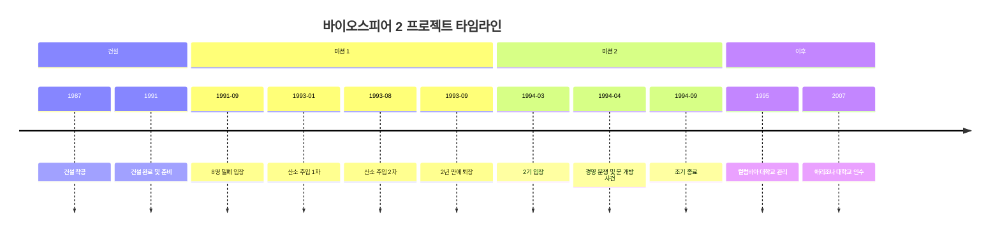
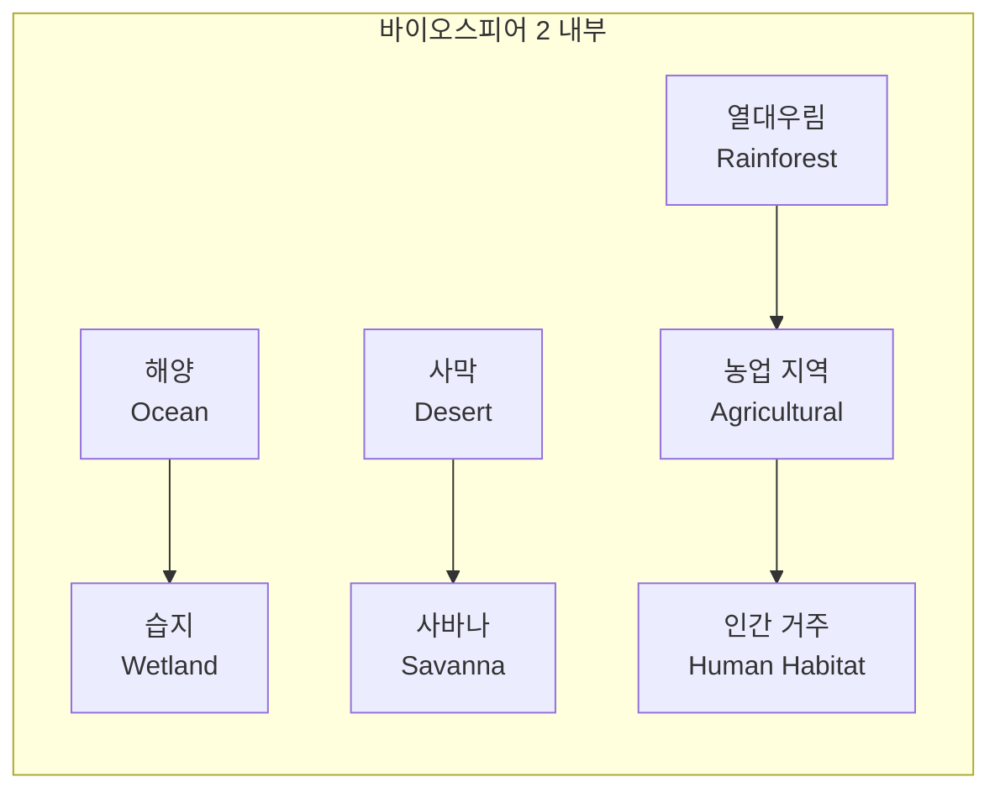
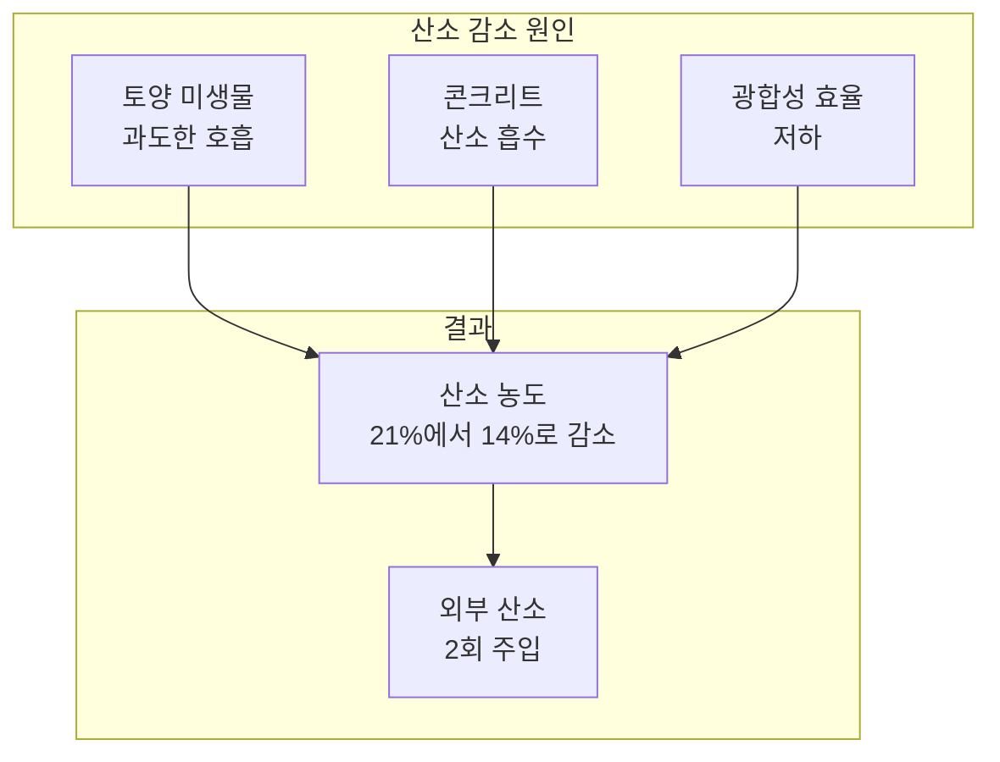

## 개요: 바이오스피어 2란?

**바이오스피어 2(Biosphere 2)**는 인류가 시도한 가장 야심 찬 밀폐 생태계 실험 중 하나다. "지구(바이오스피어 1) 다음의 두 번째 생물권"이라는 의미를 담고 있으며, 1991년부터 1994년까지 미국 애리조나주 오라클(Oracle)에서 진행되었다. 약 **12,700㎡(3.14에이커)** 규모의 거대한 밀폐 구조물 안에 지구의 다양한 생태계를 재현하고, 8명의 연구원이 2년간 외부와 단절된 채 자급자족 생활을 시도한 이 실험은 **테라포밍**과 **우주 식민지 건설**의 가능성을 탐색하기 위한 것이었다.

**추천 대상**: 우주·환경·생태에 관심 있는 독자, 밀폐 생태계·테라포밍·ISS·화성 기지 설계에 관심 있는 이들, 과학사·실패에서 배우는 교훈을 찾는 독자.



---

## 프로젝트 배경과 목적

### 테라포밍을 향한 첫걸음

바이오스피어 2는 미래의 화성이나 다른 행성에서 인류가 거주할 수 있는지를 검증하기 위한 실험이었다. 다른 행성을 테라포밍하기 전에, 지구 안에서 독립적인 생태계를 만들고 유지할 수 있는지 먼저 확인하는 것이 목표였다.

### 건설과 비용

| 항목 | 내용 |
|------|------|
| **건설 기간** | 1987년~1991년(약 4년) |
| **건설 비용** | 약 2억 달러(현재 가치로 약 4억 달러 이상) |
| **후원자** | 석유 재벌 에드워드 베스(Edward Bass) |
| **설계·리더** | 존 P. 앨런(John P. Allen)과 연구팀 |

거대한 철골·유리·콘크리트로 이루어진 구조물은 완전히 밀폐되어 외부와 물질 교환이 없도록 설계되었다. 오직 **태양광**만 투명한 유리를 통해 들어올 수 있었고, 일부 전력은 외부의 액화천연가스(LNG) 화력발전소에서 공급받았다.

---

## 실험 타임라인 구조

전체 프로젝트와 두 차례의 밀폐 미션은 아래와 같이 요약할 수 있다.

---

## 내부 생태계 구성: 지구의 축소판

바이오스피어 2는 지구의 다양한 생태계를 재현한 **7개 주요 구역**으로 구성되었다. 아래 다이어그램은 구역 간 관계와 면적·역할을 요약한다.

총 **3,000여 종**의 동식물이 도입되어 복잡한 생태계 네트워크를 이뤘다.

### 1. 열대우림 (Rainforest)



- 아마존에서 도입한 300여 종의 식물
- 높이 약 27m 공간에 다층 식생 구조
- 고온다습 환경 유지

### 2. 해양 (Ocean)



- 약 2,650㎡ 규모의 인공 바다
- 카리브해 산호초·해양 생물
- 파도 생성 장치로 해양 환경 재현

### 3. 사막 (Desert)

- 선인장·건조지대 식물
- 낮은 습도·높은 온도 유지
- 사막 생태계 수분 순환 연구

### 4. 습지 (Wetland)

- 담수와 염수가 만나는 맹그로브 생태계
- 수생 식물·다양한 미생물
- 수질 정화 기능 테스트

### 5. 사바나 (Savanna)

- 초원과 나무가 혼합된 생태계
- 건기·우기 순환 재현

### 6. 농업 지역 (Agricultural Area)

- 벼, 밀, 토마토, 오이 등 150여 종 농작물
- 닭, 돼지, 염소 등 가축 사육
- 연구원 식량 생산 담당

### 7. 인간 거주 구역 (Human Habitat)

- 8명을 위한 생활 공간
- 실험실, 주방, 침실 등 편의 시설

---

## 실험 진행: 2년간의 도전 (미션 1)

### 기본 정보

| 항목 | 내용 |
|------|------|
| **기간** | 1991년 9월 26일 ~ 1993년 9월 26일 (2년) |
| **참가자** | 바이오스페리안 8명(남 4, 여 4) |
| **구성** | 생물학자, 식물학자, 엔지니어, 의사 등 |

### 주요 임무

- 내부에서 식량 100% 자급자족
- 산소·이산화탄소 순환 유지
- 물 재활용 시스템 운영
- 폐기물 퇴비화 후 농업 활용
- 생태계 모니터링 및 데이터 수집

연구원들은 외부와 완전히 단절된 채 하루 평균 **4시간 농업 노동**과 **4시간 연구 활동**을 수행했다.

---

## 주요 문제점과 실패 원인

### 1. 산소 농도의 급격한 감소

실험 시작 후 **16개월째** 가장 심각한 위기가 찾아왔다. 정상 대기의 산소 농도는 약 21%인데, 바이오스피어 2 내부는 **14%**까지 떨어졌다. 해발 5,000m 이상 고산과 비슷한 수준이라 연구원들은 고산병과 유사한 증상(수면 무호흡, 피로 등)을 겪었다.

**원인 요약**을 인과 구조로 정리하면 다음과 같다.

**① 토양 미생물의 과도한 호흡**

- 비옥한 토양을 위해 유기물을 대량 투입
- 토양 미생물이 유기물 분해 시 예상보다 훨씬 많은 산소 소비
- 미생물 호흡량을 과소평가한 설계 오류

**② 콘크리트의 산소 흡수**

- 구조물에 사용된 대량의 콘크리트가 경화·탄산화 과정에서 산소를 흡수
- 콘크리트 내부의 미경화 성분이 지속적으로 산소와 반응
- 이 현상은 실험 전 예측하지 못한 변수였다(컬럼비아 대학교 등 후속 연구로 규명)

**③ 광합성 효율 저하**

- 겨울철 일조량 감소로 식물 광합성 효율 저하
- 온실 유리의 먼지·오염으로 투과율 감소

**대응**: 1993년 1월과 8월 두 차례 외부에서 산소를 주입했다. "완전한 자급자족"이라는 실험 전제를 포기한 것으로, 프로젝트의 가장 큰 실패로 기록된다.

### 2. 이산화탄소 농도 증가

산소가 줄어드는 동안 이산화탄소 농도는 정상(약 0.04%)의 **수십 배**까지 올라갔다. 미생물 호흡과 유기물 분해로 발생한 CO₂가 식물의 광합성으로 충분히 흡수되지 못했기 때문이다.

**영향**: 식물 성장 패턴 변화, 일부 식물 고사, 연구원들의 호흡 곤란.

### 3. 식량 부족과 영양 결핍

농업 지역 생산량은 계획의 약 **80%** 수준에 그쳤다.

**원인**: 일조량 부족, 해충·질병, 토양 영양소 불균형, 계절별 생산량 편차.

**결과**: 연구원 평균 10~15% 체중 감소, 만성적 영양 부족, 일일 칼로리 섭취가 권장량의 약 70% 수준. 한 명은 부상 치료를 위해 일시적으로 외부로 나갔다.

### 4. 생태계 불균형

**예상치 못한 변화**:

- **곤충**: 불개미 폭발적 증가, 꿀벌·수분 매개 곤충 대부분 멸종, 바퀴벌레 대량 발생 → 수분 작업을 인간이 수작업으로 대체
- **척추동물**: 대부분의 새 번식 실패 또는 사망, 일부 물고기·양서류 개체군 감소
- **식물**: 덩굴식물 과도 성장으로 다른 식물 억압, 일부 나무 약화, 목질부 약화로 쓰러질 위험(낮은 산소·바람 부족)

### 5. 심리적 스트레스와 갈등

- 좁은 공간에서의 2년 생활, 식량 부족·산소 부족에 따른 불안·인지 기능 저하
- 팀 내 갈등·파벌 형성, 외부 단절로 인한 고립감

연구원들은 실험 중반부터 두 파벌로 나뉘어 서로 대화를 거부하는 등 심한 갈등을 겪었다. 미래 우주 거주에서 **심리적 지원**과 **갈등 관리**의 중요성을 보여주는 사례가 되었다.

---

## 두 번째 미션과 실험 종료

### 미션 2 (1994년 3월 ~ 9월)

첫 번째 미션의 교훈을 반영해 개선된 조건에서 2기 미션이 진행되었으나, **재정 문제**와 **관리팀 간 갈등**(경영권 분쟁, 문 개방 사건 등)으로 6개월 만에 조기 종료되었다. 2기에서는 식량 자급자족을 달성했으나, 시설 운영 주체 해체 등으로 밀폐 실험은 더 이상 이어지지 않았다.

### 실험 종료 후

- **1995년**: 컬럼비아 대학교가 관리 시작
- **2007년**: 애리조나 대학교가 인수
- **현재**: 교육·연구 시설로 활용, 일반인 투어·교육 프로그램 운영

---

## 실험의 의의와 교훈

### 1. 생태계 복잡성에 대한 이해

바이오스피어 2는 생태계가 예상보다 **훨씬 복잡하고 예측 불가능**하다는 것을 보여줬다. 수천 개의 변수가 서로 영향을 주고받으며, 작은 변화가 전체 시스템에 파급 효과를 일으킬 수 있음을 확인했다.

### 2. 지구 생태계의 소중함

실패는 역설적으로 **지구 자연 생태계의 정교함**을 깨닫게 했다. 수십억 년에 걸쳐 진화한 지구의 생태계는 인간이 몇 년 만에 재현할 수 없는 균형을 유지하고 있다.

### 3. 테라포밍의 어려움

지구에서 풍부한 자원과 기술을 동원해도 2년간 8명을 완전 자급자족으로 부양하지 못했다. **화성이나 달**에서 영구 식민지를 건설하는 것은 훨씬 더 어려운 과제임을 시사한다.

### 4. 우주 거주지 설계에 대한 교훈

**기술적**: 산소 생산·소비 균형, 미생물 활동 정밀 모델링, 식량 생산 안정성, 백업·비상 계획의 필요성.

**심리적**: 장기 우주 임무에서의 심리 지원, 팀 갈등 관리, 개인 공간·프라이버시, 외부와의 소통 채널 유지.

이러한 교훈은 **국제우주정거장(ISS)** 생명 유지 시스템 설계와, NASA·SpaceX 등 **화성 탐사 계획**의 현실적 접근(초기에는 지구 보급 전제, 완전 자급자족은 장기 목표)에 반영되었다.

### 5. 과학적 성과

실패했지만 많은 **과학적 데이터**를 남겼다.

- 밀폐 환경에서의 생물지구화학 순환
- CO₂ 농도 변화가 생태계에 미치는 영향
- 산호초 생태계의 산성화 연구
- 기후 변화 시뮬레이션

현재 애리조나 대학교는 바이오스피어 2를 활용해 **기후 변화**, **수자원 관리**, **생태계 회복** 등 연구를 진행하고 있다.

---

## 현재의 바이오스피어 2

### 연구 시설로의 전환

2007년 애리조나 대학교 인수 이후, 바이오스피어 2는 **지구 과학 연구**의 핵심 실험 시설로 자리 잡았다.

- **기후 변화 연구**: 온도·CO₂ 농도 조절로 미래 기후 시나리오 시뮬레이션
- **수자원 연구**: 강수량 변화가 생태계에 미치는 영향
- **산호초 연구**: 해양 산성화가 산호초에 미치는 영향
- **토양 과학**: 토양 미생물·탄소 순환 연구

### 교육 프로그램

- 매년 수만 명이 투어·교육 프로그램에 참여
- 학생 대상 교육·일반인 대상 과학 강연·워크숍 운영

---

## 바이오스피어 2가 남긴 유산

1. **겸손한 자세**: 복잡한 생태계를 완전히 이해·재현하지 못한다는 점을 보여주었고, "모르는 것을 인정하는" 과학적 태도의 중요성을 일깨웠다.
2. **ISS 설계 반영**: 완전 자급자족이 아닌 지구 보급 전제, 산소·물 재생 시스템의 보수적 설계 등에 반영되었다.
3. **화성 탐사 계획**: 초기 화성 기지는 지구 보급을 전제로 하며, 완전 자급자족은 수십 년 단위의 장기 목표로 설정되는 흐름을 뒷받침했다.
4. **지구 생태계 보호**: "우리에게는 아직 플랜 B가 없다"는 메시지를 명확히 전달했다.

---

## 결론: 실패에서 배우는 지혜

바이오스피어 2는 **기술적으로는 실패**, **과학적으로는 귀한 실험**으로 평가된다. 이 프로젝트는 다음 같은 질문을 던진다.

- 인류는 정말 다른 행성에서 살 수 있을까?
- 지구를 떠나기 전에, 지구를 더 잘 이해하고 보호해야 하지 않을까?
- 테라포밍보다 지구 환경 보호가 더 시급한 과제가 아닐까?

우주로 나아가는 것은 중요하지만, 그 전에 **유일한 생명의 집인 지구**를 소중히 여기고 보호해야 한다는 메시지를 전한다. 실패의 역사를 간직한 이 거대한 구조물은 인류의 야망과 한계, 그리고 배움에 대한 열정을 동시에 보여주는 기념비로 남아 있다.

---

## 참고 문헌

1. **University of Arizona Biosphere 2** (공식 웹사이트). [biosphere2.org](https://biosphere2.org/) — 현재 연구·교육 프로그램 및 시설 소개.
2. **Wikipedia. "Biosphere 2."** [en.wikipedia.org/wiki/Biosphere_2](https://en.wikipedia.org/wiki/Biosphere_2) — 연혁, 구조, 미션 1·2, 경영 분쟁, 과학적 논의 요약.
3. **과학동아. "바이오스피어Ⅱ 대원 귀환 보고 — 화성진출 예비실험, 인공생태계 격리생활 2년."** 1993년 11월호. [dl.dongascience.com](https://dl.dongascience.com/dl/magazine/detail/S199311N011) — 1기 대원 인터뷰·당시 평가.
