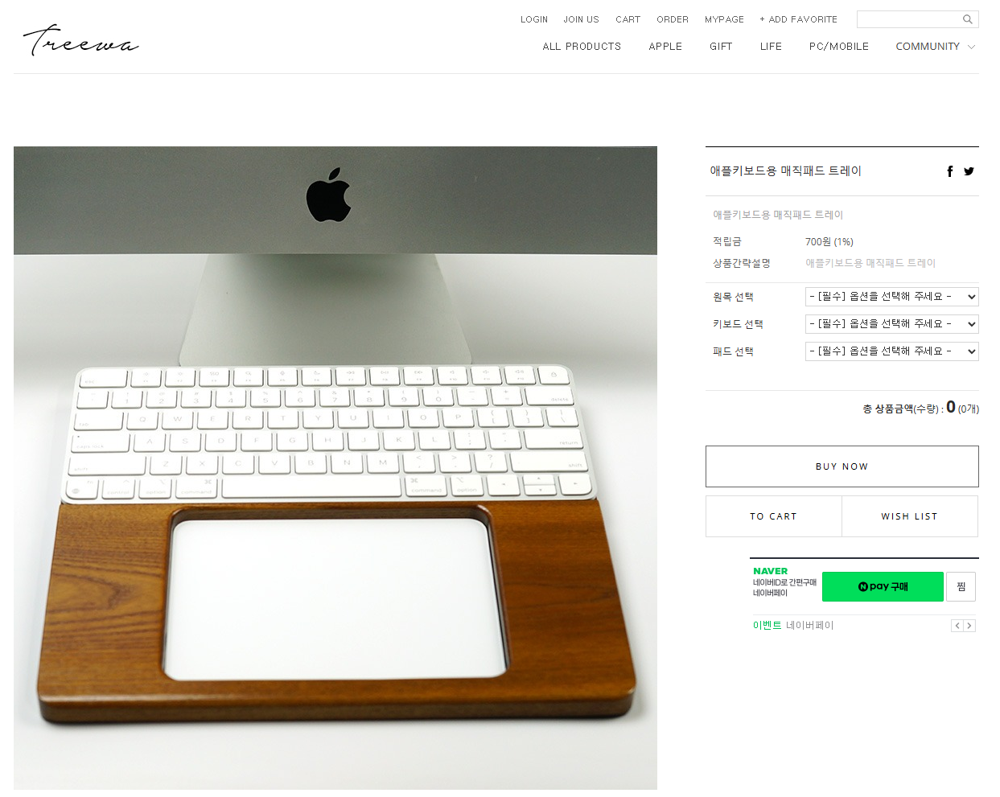

## 트리와 소개

트리와(Treewa)는 **천연 원목을 사용하여 고품질의 키보드 관련 액세서리와 데스크 오르가나이저를 제작하는 한국 기반의 주문 제작 업체**이다. 경기도 안성시에 위치한 이 업체는 사용자 맞춤형 에르고노믹 제품을 전문으로 하고 있으며, Apple 제품부터 일반 기계식 키보드까지 다양한 장비에 대응하는 제품을 공급하고 있다.

## 주요 제품

### 1. 원목 팜레스트 손목받침대 (커스텀 주문)

트리와의 대표 제품 중 하나는 **원목 팜레스트 손목받침대**로, 완전한 주문 제작(custom order) 방식으로 제공된다.

**제품 특징:**
- **재질:** 북미산 천연 원목 (애쉬, 메이플, 레드오크, 체리, 월넛 중 선택)
- **마감:** 폴리우레탄 처리로 내구성과 방수성을 확보
- **규격 커스터마이제이션:**
  - 길이: 최대 460mm까지 커스텀 가능
  - 폭: 기본 85mm 또는 와이드 100mm 선택
  - 높이: 개별 사용자 손목 크기에 맞게 제작
  - 두께: 기본 20mm
- **디자인 옵션:** A형, B형, C형, D형 등 다양한 디자인 제공

**제작 기간:**
주문 후 발송까지 **3~5일 소요**되며, 동일 규격의 제품이 아닌 주문 제작 상품이므로 취소나 변경 시 각 경우마다 가능 여부를 별도로 확인해야 한다.

### 2. 애플 제품 전용 액세서리

트리와는 Apple 사용자를 위한 전문 제품들도 제공한다:

- **애플 키보드 페리 C형:** 매직 키보드 전용 트레이
- **무선키보드+트랙패드 연결 Bar:** Apple 무선 키보드와 트랙패드를 연결하는 바

### 3. 기타 키보드 관련 제품

- **무선키보드 트레이 A형/B형:** 스탠드형 키보드 트레이
- **뉴메릭 키보드 트레이:** 숫자판 전용 트레이
- **해피해킹용 원목 팜레스트:** 해피해킹 키보드 전용 손목받침대

### 4. 데스크 액세서리

- **모니터 스탠드:** 목재 기반 모니터 거치대
- **스마트폰 스탠드:** 휴대폰 거치 솔루션
- **원목 마우스패드:** 천연 목재 마우스 패드

## 제품의 강점

### 천연 원목의 따뜻한 감성

모든 제품이 천연 원목으로 제작되어 플라스틱이나 금속 제품과는 다른 **자연스럽고 따뜻한 감성**을 제공한다. 원목이 주는 고유한 무늬와 색감은 데스크 환경의 미적 가치를 높인다.

### 구매 방법

**온라인 쇼핑몰 접속:**
- 주소: https://treewa.co.kr
- 카테고리: ALL PRODUCTS (총 19개 상품 제공)

## 커뮤니티 피드백

### 리뷰 평점

쇼핑몰의 고객 리뷰에 따르면, 대부분의 제품이 **5점 만점**의 높은 평가를 받고 있다. 고객들은 다음 항목에서 만족감을 표현하고 있다:

- 뛰어난 마무리와 품질
- 정확한 커스텀 제작
- 신속한 배송
- 친절한 고객 응대

### Q&A 커뮤니티

쇼핑몰의 Q&A 게시판에서는 다음과 같은 활발한 상담이 이루어지고 있다:
- 제품 사이즈 및 규격 문의
- 키보드 높이 및 길이 상담
- 다양한 키보드 모델 호환성 확인
- 커스텀 옵션 상세 설명

## 사용 사례

### 전문가들의 선택 사유

- **개발자 및 작가:** 하루 종일 키보드 작업을 하는 전문가들이 손목 피로 감소를 위해 선택
- **Apple 사용자:** MacBook과 매직 키보드, 트랙패드 사용자들의 워크스페이스 최적화
- **게이머:** 장시간 게이밍 세션 중 손목 건강 보호
- **학생:** 수능 준비나 대학 레포트 작성 시 에르고노믹 지원

## 사업 정보

| 항목 | 내용 |
|------|------|
| 상호 | 트리와 |
| 대표자 | 김병기 |
| 주소 | 경기도 안성시 공도읍 불당길 78-3 |
| 전화 | 010-2838-5224 |
| 사업자 등록번호 | 142-09-64368 |
| 통신판매업 신고 | 제2015-용인기흥-0181호 |
| 개인정보관리책임자 | 김병기(treewaus@gmail.com) |

## 추천 대상

### 이런 분들에게 추천합니다

- MacBook이나 Mac 기기를 주로 사용하는 Apple 팬
- 손목 건강을 중시하는 직업 프로그래머나 작가
- 데스크 셋업의 미적 가치를 중시하는 분
- 주문 제작의 세밀함과 개인화를 원하는 사용자
- 한국산 고품질 제품을 선호하는 소비자
- 자연스러운 원목 감성을 추구하는 분

## 결론

트리와는 **단순한 키보드 액세서리를 넘어 워크스페이스 문화를 개선하는 기업**이라고 평가할 수 있다. 천연 원목의 감성, 완벽한 커스터마이제이션, 국내 제조의 신뢰성을 갖춘 이 업체의 제품들은 손목 건강을 지키면서도 데스크 환경의 미적 가치를 높이고 싶은 사용자들에게 최고의 선택이 될 수 있다.

특히 **3~5일의 빠른 제작 기간**과 **합리적인 가격대**는 개인 사용자부터 기업까지 다양한 고객층에게 접근 가능한 제품을 제공한다는 점에서 매력적이다. 에르고노믹한 워크스페이스 구축을 고려하고 있는 분이라면, 트리와의 제품을 검토해볼 가치가 충분하다.

더 자세한 정보와 제품 구매는 [트리와 공식 쇼핑몰](https://treewa.co.kr)에서 확인할 수 있다.

