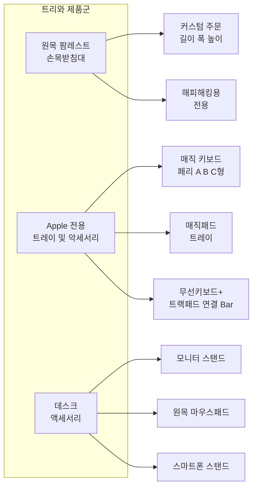
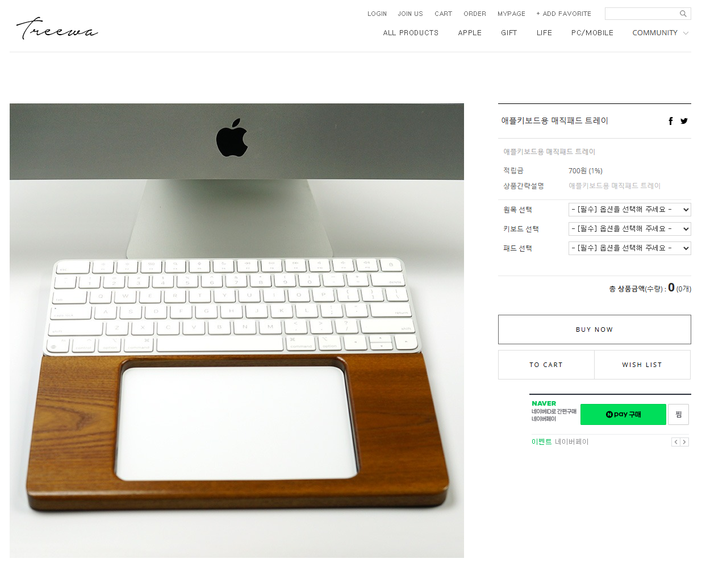
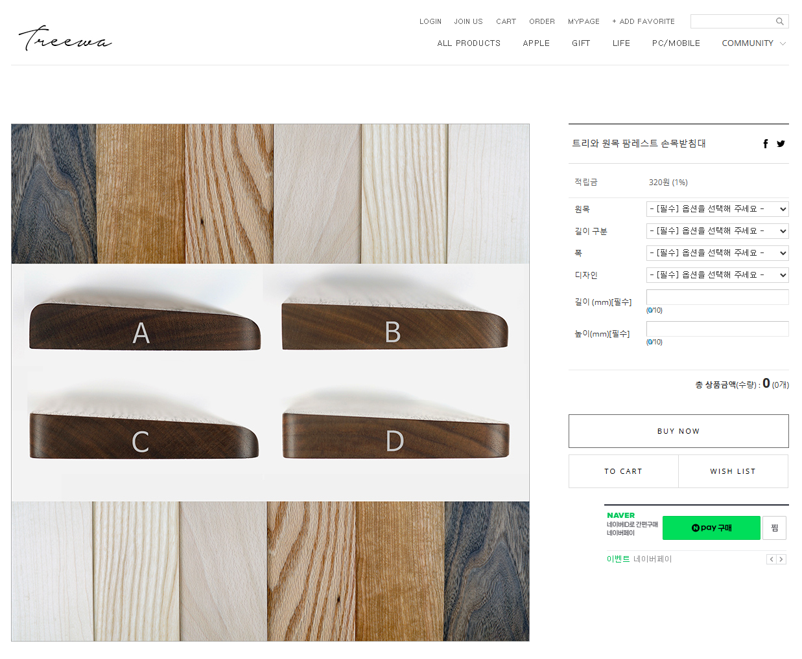
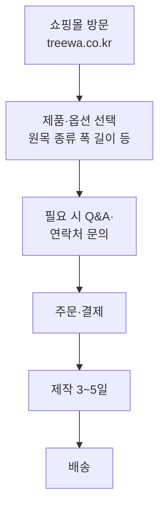

## 개요

### 제품 및 브랜드 정보

**트리와(Treewa)**는 천연 원목을 사용하여 고품질 키보드 액세서리와 데스크 오르가나이저를 **주문 제작**하는 한국 기반 업체다. 경기도 안성시에 위치한 이 업체는 사용자 맞춤형 에르고노믹 제품을 전문으로 하며, Apple 제품부터 일반 기계식 키보드·해피해킹까지 다양한 장비에 대응하는 제품을 공급한다.

| 항목 | 내용 |
|------|------|
| 상호 | 트리와 |
| 대표자 | 김병기 |
| 주소 | 경기도 안성시 공도읍 불당길 78-3 |
| 연락처 | 010-2838-5224 / treewaus@gmail.com |
| 공식 쇼핑몰 | [treewa.co.kr](https://treewa.co.kr) |
| 사업자 등록번호 | 142-09-64368 |
| 통신판매업 신고 | 제2015-용인기흥-0181호 |

### 추천 대상

- **Mac·Apple 사용자:** 매직 키보드, 매직 트랙패드, MacBook을 쓰며 데스크 정리와 손목 각도를 맞추고 싶은 분
- **장시간 타이핑 직군:** 개발자, 작가, 기획자 등 손목 피로 감소와 에르고노믹 지원을 원하는 분
- **데스크 셋업 감성:** 원목·미니멀한 워크스페이스를 추구하는 분
- **호환성 맞춤이 필요한 사용자:** 키보드 길이·높이·폭이 제각각인 기계식·해피해킹 사용자
- **국내 제작·빠른 납기 선호:** 3~5일 제작·국내 배송을 선호하는 소비자

---

## 제품 라인업 구조

트리와 제품은 **팜레스트·트레이·데스크 액세서리**로 구분되며, 키보드/기기별 호환 제품이 세분화되어 있다. 아래 다이어그램은 제품군과 선택 흐름을 요약한다.

```mermaid
flowchart LR
  subgraph TreewaProducts["트리와 제품군"]
    PalmRest["원목 팜레스트</br>손목받침대"]
    AppleAcc["Apple 전용</br>트레이 및 악세서리"]
    DeskAcc["데스크</br>액세서리"]
  end
  PalmRest --> CustomOrder["커스텀 주문</br>길이 폭 높이"]
  PalmRest --> HHK["해피해킹용</br>전용"]
  AppleAcc --> MagicTray["매직 키보드</br>페리 A B C형"]
  AppleAcc --> TrackpadTray["매직패드</br>트레이"]
  AppleAcc --> LinkBar["무선키보드+</br>트랙패드 연결 Bar"]
  DeskAcc --> MonitorStand["모니터 스탠드"]
  DeskAcc --> MousePad["원목 마우스패드"]
  DeskAcc --> PhoneStand["스마트폰 스탠드"]
```

---

## 주요 제품 상세

### 1. 원목 팜레스트 손목받침대 (커스텀 주문)

트리와의 대표 제품인 **원목 팜레스트 손목받침대**는 완전 주문 제작(custom order)으로 제공된다.

**재질·마감**

- **원목:** 북미산 천연 원목 (애쉬, 메이플, 레드오크, 체리, 월넛 중 선택)
- **마감:** 폴리우레탄 처리로 내구성·방수성 확보

**규격 커스터마이제이션**

| 항목 | 옵션 |
|------|------|
| 길이 | 최대 460mm까지 커스텀 |
| 폭 | 기본 85mm / 와이드 100mm |
| 높이 | 사용자 손목 크기에 맞춤 제작 |
| 두께 | 기본 20mm |

**디자인:** A형, B형, C형, D형 등 다양한 형태 제공.

**제작 기간:** 주문 후 발송까지 **3~5일** 소요. 주문 제작 상품이므로 취소·변경은 쇼핑몰 Q&amp;A 또는 연락처로 별도 문의해야 한다.

### 2. Apple 전용 액세서리

- **매직 키보드 페리 A형·B형·C형:** 매직 키보드 전용 트레이 (약 120,000~130,000원대)
- **애플 키보드용 매직패드 트레이 / 애플 매직패드 트레이:** 키보드+트랙패드 일체 배치용 (약 65,000~70,000원대)
- **무선키보드+트랙패드 연결 Bar:** Apple 무선 키보드와 트랙패드를 연결하는 바 (약 15,000원대)

### 3. 기타 키보드·데스크 제품

- **무선키보드 트레이 A형·B형:** 스탠드형 키보드 트레이
- **뉴메릭 키보드 트레이:** 숫자판 전용 트레이
- **해피해킹용 원목 팜레스트:** 해피해킹 키보드 전용 손목받침대
- **모니터 스탠드, 스마트폰 스탠드, 원목 마우스패드:** 데스크 정리·원목 감성 연출용

---

## 구매·배송·문의 흐름

주문 전 **키보드 모델·희망 치수**를 정하면, 커스텀 제작 시 오차를 줄일 수 있다. 아래는 일반적인 구매·제작 흐름이다.

```mermaid
flowchart TD
  Visit["쇼핑몰 방문</br>treewa.co.kr"]
  Choose["제품·옵션 선택</br>원목 종류 폭 길이 등"]
  Qna["필요 시 Q&amp;A·</br>연락처 문의"]
  Order["주문·결제"]
  Make["제작 3~5일"]
  Ship["배송"]
  Visit --> Choose
  Choose --> Qna
  Qna --> Order
  Order --> Make
  Make --> Ship
```

- **쇼핑몰:** [트리와 공식 쇼핑몰](https://treewa.co.kr) — ALL PRODUCTS 등에서 전체 상품 확인
- **문의:** Q&amp;A 게시판, 전화(010-2838-5224), 이메일(treewaus@gmail.com) 활용

---

## 제품의 강점과 고려 사항

### 강점

- **천연 원목 감성:** 플라스틱·금속 대비 자연스럽고 따뜻한 질감과 무늬로 데스크 환경 미적 가치 향상
- **완전 커스텀:** 길이·폭·높이를 키보드와 손목에 맞춰 제작 가능
- **빠른 제작:** 3~5일 내 제작·발송으로 대기 부담이 적음
- **국내 제조·문의 용이:** 국내 업체라 A/S·문의 접근성이 좋음
- **쇼핑몰 리뷰:** 고객 리뷰에서 마무리·품질·배송·응대에 대한 만족도가 높게 나타남

### 고려 사항

- **주문 제작 특성:** 취소·변경이 어렵거나 불가할 수 있으므로, 주문 전 치수·옵션을 꼼꼼히 확인하는 것이 좋다
- **가격대:** 원목·주문 제작 특성상 대량생산 플라스틱 팜레스트보다 비싼 편이다

---

## 커뮤니티·리뷰 요약

쇼핑몰의 REVIEW·Q&amp;A 게시판에서는 다음과 같은 내용이 자주 다뤄진다.

- 제품 **사이즈·규격** 문의 및 키보드 높이·길이 상담
- 다양한 **키보드 모델 호환성** 확인
- **커스텀 옵션** 상세 설명 및 변경 요청

전반적으로 **마무리 품질·커스텀 정확도·배송 속도·고객 응대**에 대한 만족 리뷰가 많다.

---

## 사용 사례

- **개발자·작가:** 하루 종일 키보드 작업 시 손목 피로 완화·각도 유지
- **Apple 사용자:** MacBook + 매직 키보드 + 트랙패드 조합의 워크스페이스 정리 및 손목 지원
- **게이머:** 장시간 게이밍 시 손목 부담 완화
- **학생:** 장시간 타이핑(보고서·수험 공부 등) 시 에르고노믹 보조

---

## 종합 평가

### 한 줄 평

트리와는 **단순 키보드 액세서리를 넘어, 손목 건강과 데스크 감성을 동시에 챙기고 싶은 이에게 맞춤형 원목 팜레스트와 Apple·데스크 악세서리를 제공하는 국내 주문 제작 업체**로 정리할 수 있다.

### 장단점 요약

| 구분 | 내용 |
|------|------|
| 장점 | 천연 원목 감성, 완전 커스텀, 3~5일 제작, 국내 제조·문의 용이, 쇼핑몰 평판 양호 |
| 단점 | 주문 제작 특성상 취소·변경 제한, 가격은 대량생산 제품 대비 높은 편 |

에르고노믹한 워크스페이스와 원목 감성을 함께 고려 중이라면, 트리와 제품을 후보로 검토할 만하다. 구체적인 치수·옵션·가격은 [트리와 공식 쇼핑몰](https://treewa.co.kr)에서 확인할 수 있다.

---

## 참고 문헌·링크

- [트리와 공식 쇼핑몰 — 전체 상품](https://treewa.co.kr/product/list.html?cate_no=45) — 제품 목록 및 가격 확인
- [트리와 쇼핑몰 이용 안내 (GUIDE)](https://treewa.co.kr/shopinfo/guide.html) — 배송·결제·교환 안내
- [트리와 인스타그램 @treewaus](https://www.instagram.com/treewaus/) — 제품 사진·소식
