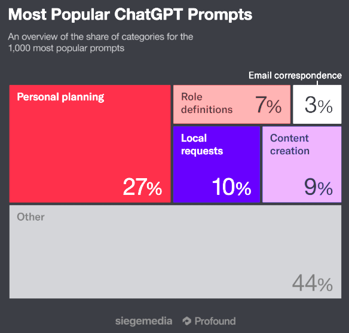
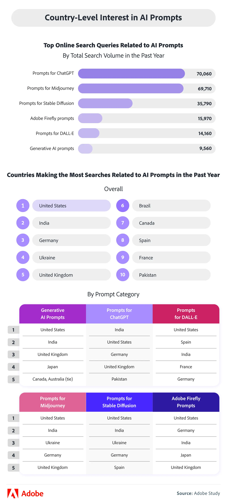

생성형 AI가 일상과 업무에 깊숙이 자리잡으면서, 사용자들이 실제로 어떤 문장과 프롬프트를 가장 많이 사용하는지에 대한 관심이 높아지고 있습니다. 이 글에서는 Siege Media, Adobe, AIPRM 등 신뢰할 수 있는 출처의 최신 연구를 종합하여, 생성형 AI 사용자들의 실제 사용 패턴과 트렌드를 데이터로 분석합니다.

## 핵심 요약

- **질문 답변이 압도적 1위**: 사용자의 68%가 생성형 AI를 질문에 답하기 위해 사용
- **개인 비서로서의 AI**: 27%가 일정 관리, 계획 수립 등 일상 관리에 활용
- **"Prompts for ChatGPT"**: 전 세계에서 가장 많이 검색된 AI 프롬프트 쿼리 (70,000+ 검색)
- **세대별 차이**: 밀레니얼 세대(34.7%)와 Z세대(33%)가 가장 활발한 사용자층
- **산업별 활용**: 마케팅/광고(37%), 기술(35%), 컨설팅(30%) 순으로 높은 활용도

## 가장 인기있는 프롬프트 카테고리

Siege Media가 Profound와 협력하여 분석한 1,000개의 가장 인기있는 3단어 ChatGPT 프롬프트 데이터에 따르면, 사용자들의 프롬프트는 크게 6가지 카테고리로 분류됩니다.



### 계획 및 일정 관리 (27%)

**가장 높은 비율을 차지**하는 카테고리로, AI가 호기심의 대상에서 실용적 도구로 전환되었음을 보여줍니다.

**대표적인 프롬프트:**
- "Every single day" (매일)
- "Hours per week" (주당 시간)
- "Long-term goals" (장기 목표)
- "Time management skills" (시간 관리 기술)
- "Call next week" (다음 주 통화)

**사용 사례:**
- 일일 업무 계획 수립
- 주간/월간 스케줄 관리
- 운동 루틴 작성
- 여행 일정 계획
- 프로젝트 마일스톤 설정

### 지역 검색 및 작업 요청 (10%)

전통적인 Google 검색에서 대화형 AI 검색으로의 전환을 보여주는 카테고리입니다.

**대표적인 프롬프트:**
- "New York City"
- "Los Angeles CA"
- "Salt Lake City"

**검색 방식의 변화:**

| 기존 Google 검색 | 현재 LLM 프롬프트 |
|---|---|
| "Restaurants near me" | "Recommend an affordable Italian restaurant near me with vegetarian options" |
| "Flights from NYC to LA" | "Help me find the cheapest nonstop flight from New York to LA next weekend" |
| "Things to do in Chicago" | "Plan a two-day itinerary in Chicago for someone who loves art and unique food" |

### 채널별 콘텐츠 제작 (9%)

크리에이터 이코노미가 AI로 확장되고 있음을 보여줍니다.

**대표적인 프롬프트:**
- "Social media posts" (소셜 미디어 게시물)
- "Landing page copy" (랜딩 페이지 카피)
- "Facebook ad copy" (페이스북 광고 카피)
- "Long form content" (장문 콘텐츠)
- "Short form videos" (짧은 동영상)
- "Social media campaigns" (소셜 미디어 캠페인)

**활용 분야:**
- 블로그 포스트 작성
- 소셜 미디어 콘텐츠 기획
- 광고 카피 작성
- 이메일 마케팅 콘텐츠
- 비디오 스크립트 작성

### 역할 정의 및 템플릿 (7%)

AI가 조직 코치 역할을 수행하며, 사용자들이 직업적 명확성을 찾는 데 도움을 주고 있습니다.

**산업별 역할 프롬프트:**

| 산업 | 대표 프롬프트 |
|---|---|
| **마케팅** | Digital marketing manager, Direct response copywriter, Social media manager |
| **영업** | Business development manager, Senior account executive, Enterprise account executive, Real estate agent |
| **고객 성공** | Customer success manager, Customer service team |
| **임원진** | Chief financial officer, Chief product officer, Chief technology officer, Chief marketing officer, Executive vice president |

### 이메일 및 서신 (3%)

감정적으로 지능적인 응답에 대한 수요가 증가하고 있습니다.

**대표적인 프롬프트:**
- "Thoughts best regards"
- "Response best regards"
- "Soon best regards"

### 기타 (44%)

다양한 사용 사례가 포함된 카테고리로, AI가 생산성을 넘어 인간의 감정과 호기심을 반영하는 도구로 사용되고 있음을 보여줍니다.

**일반 프롬프트:**
- "Creative problem solving" (창의적 문제 해결)
- "Critical thinking skills" (비판적 사고 기술)
- "Real-world impact" (실제 영향)
- "Cross-functional leadership" (교차 기능 리더십)
- "Mental health care" (정신 건강 관리)
- "Informed decision making" (정보에 입각한 의사결정)

**구조화된 데이터 프롬프트:**
- "Cell phone number"
- "Mobile phone number"
- "Contact email address"
- "Team email address"
- "Global postal code"

## 글로벌 검색 트렌드 분석

Adobe의 연구에 따르면, 전 세계적으로 생성형 AI 프롬프트에 대한 관심이 급증하고 있습니다.



### 가장 많이 검색된 쿼리

**1위: "Prompts for ChatGPT"**
- 70,000+ 검색
- 전 세계에서 가장 많이 검색된 AI 관련 프롬프팅 쿼리

**Top 5 안에 포함된 도구:**
- ChatGPT (압도적 1위)
- Adobe Firefly
- Midjourney (미국 내 2위, 11,840회)

### 국가별 관심도

**AI 프롬프트 검색량 상위 국가:**
1. 🇺🇸 **미국**
2. 🇮🇳 **인도**
3. 🇩🇪 **독일**

**미국 내 통계:**
- ChatGPT 프롬프트 검색: 13,270회 (1위)
- Midjourney 프롬프트 검색: 11,840회 (2위)
- Adobe Firefly: Top 5 안에 포함

### 학습 선호도 (미국 사용자)

**AI 프롬프트 학습 의향:**
- 79%가 효과적인 프롬프트 작성 방법 학습에 관심
- 67% 이상이 관련 강좌 수강 의향 있음

**학습하고 싶은 주제 Top 3:**
1. 다양한 출력/AI 도구를 위한 프롬프트 엔지니어링 (78%)
2. 특정 예술 스타일 생성 (38%)
3. AI 모델 간의 차이점 이해 (37%)

**선호하는 학습 형식:**
1. 녹화된 비디오 강의 (53%)
2. 인터랙티브 워크숍 (19%)
3. 실시간 온라인 수업 (17%)

## 주요 트렌드 분석

### Trend #1: AI를 개인 플래너로 활용

**핵심 발견:**
- 27%의 사용자가 일상 계획과 일정 관리에 AI 활용
- AI가 단순 질문 답변을 넘어 사용자의 하루를 구조화

**일반적인 동사 패턴:**
- "Plan my..." (계획해줘)
- "Schedule..." (일정 잡아줘)
- "Organize..." (정리해줘)
- "Help me manage..." (관리하는 것 도와줘)

### Trend #2: 로컬 검색의 대화형 전환

**변화의 핵심:**
- 지역 의도가 사라지지 않고 대화형으로 진화
- 전통적인 Google 검색 행동을 AI가 대체

**예시:**
```
[이전] "best restaurants in downtown"
[현재] "Recommend a quiet restaurant in downtown with outdoor seating, 
       good for business meetings, under $50 per person"
```

### Trend #3: 콘텐츠 제작의 간소화

**핵심 변화:**
- 9%가 콘텐츠 제작에 프롬프트 사용
- 5개 도구 대신 하나의 프롬프트로 완성

**영향받는 영역:**
- Canva 템플릿 대체
- 소셜 미디어 포스트 생성기 대체
- 콘텐츠 아이디어 발상부터 최적화까지 통합

### Trend #4: 역할 정의를 통한 업스킬링

**사용 이유:**
- 역할 명확성 확보
- 업스킬링 및 교육
- 의사결정 개선

**인사이트:**
- AI가 조직 코치 역할 수행
- 복잡한 직장 구조 탐색 지원
- 전문성 및 커뮤니케이션 격차 해소

### Trend #5: 감정 지능적 응답 요구 증가

**핵심 욕구:**
- 단순히 "올바른" 글쓰기를 넘어서
- 청중과 "공감"하는 콘텐츠 원함

**프롬프트 예시:**
- "Write this in a friendly tone"
- "Make it more professional"
- "Sound more enthusiastic"
- "Adjust the tone to be empathetic"

**결과:**
- 프롬프트 유창성이 새로운 리터러시로 부상
- 더 나은 프롬프트 = 더 나은 결과물

## 실용적인 프롬프트 작성 팁

### 효과적인 프롬프트의 구성 요소

**1. 맥락 제공:**
```
[나쁜 예] "블로그 글 써줘"
[좋은 예] "SaaS 스타트업 창업자를 위한 1,500자 분량의 블로그 글을 작성해줘.
         주제는 '고객 이탈률 감소 전략'이고, 데이터 기반 접근과 실제 사례를
         포함해줘. 톤은 전문적이면서도 접근하기 쉽게 해줘."
```

**2. 역할 지정:**
```
"당신은 10년 경력의 디지털 마케팅 전문가입니다. 
 소규모 비즈니스를 위한 소셜 미디어 전략을 제안해주세요."
```

**3. 출력 형식 명시:**
```
"다음 형식으로 정리해줘:
 1. 요약 (3-5개 불릿 포인트)
 2. 상세 분석 (각 섹션별 200자)
 3. 실행 단계 (번호가 매겨진 리스트)"
```

**4. 제약 조건 설정:**
```
"1,000자 이내로 작성하고, 
 - 전문 용어는 최소화
 - 구체적인 숫자와 예시 포함
 - 초보자도 이해할 수 있게"
```

### 카테고리별 프롬프트 템플릿

#### 계획 및 일정 관리
```
"나는 [직업/상황]이고 [목표]를 달성하고 싶습니다.
 현재 제약 조건은 [시간/리소스]이고,
 [기간] 동안의 실행 가능한 계획을 세워주세요.
 각 단계별로 예상 소요 시간과 우선순위를 표시해주세요."
```

#### 콘텐츠 제작
```
"[타겟 청중]을 위한 [콘텐츠 유형]을 작성해주세요.
 주제: [구체적 주제]
 톤: [친근함/전문적/유머러스 등]
 길이: [단어 수/문단 수]
 포함 요소: [CTA/통계/예시 등]
 목적: [인지도/전환/교육 등]"
```

#### 문제 해결
```
"나는 [상황/문제]에 직면해 있습니다.
 목표는 [원하는 결과]이고,
 시도해본 방법은 [이전 시도들]입니다.
 다양한 해결책을 제시하고, 각각의 장단점과
 실행 난이도를 평가해주세요."
```

#### 학습 및 이해
```
"[개념/주제]를 [비유/스토리/다이어그램]로 설명해주세요.
 내 배경 지식: [수준]
 학습 목표: [구체적 목표]
 선호하는 학습 방식: [시각적/단계별/예시 중심]"
```

### 프롬프트 개선 전략

**반복적 개선 과정:**

1. **초안 프롬프트 작성**
   ```
   "마케팅 전략 만들어줘"
   ```

2. **맥락 추가**
   ```
   "소규모 온라인 서점을 위한 디지털 마케팅 전략을 만들어줘.
    예산은 월 $500이고, 주요 고객은 25-40세 독서 애호가야."
   ```

3. **구조와 세부사항 명시**
   ```
   "소규모 온라인 서점을 위한 3개월 디지털 마케팅 전략을 다음 형식으로 작성해줘:
    
    예산: 월 $500
    타겟: 25-40세 독서 애호가
    
    포함 요소:
    1. 주간별 실행 계획
    2. 각 채널별 예산 배분 (소셜미디어, 이메일, 광고)
    3. 예상 ROI와 측정 지표
    4. 리스크와 대응 방안
    
    실제 집행 가능한 수준으로 구체적으로 작성해줘."
   ```

4. **피드백 반영**
   ```
   "위 전략에서 인스타그램 부분을 더 상세히 해줘.
    - 주간 포스팅 일정
    - 콘텐츠 아이디어 10개
    - 해시태그 전략
    - 인플루언서 협업 방안"
   ```

## 실전 활용 가이드

### 즉시 적용 가능한 프롬프트 모음

#### A. 업무 생산성

**회의록 요약:**
```
다음 회의록을 읽고:
1. 주요 결정사항 (불릿 포인트)
2. 액션 아이템 (담당자와 기한 포함)
3. 다음 회의 안건
형식으로 정리해주세요.

[회의록 내용 붙여넣기]
```

**이메일 작성:**
```
[상황 설명]에 대해 [수신자]에게 보낼 이메일을 작성해줘.
톤: [공식적/친근한/감사의]
길이: 200-300단어
포함 사항: [요청사항/배경/다음 단계]
```

**프레젠테이션 개요:**
```
[주제]에 대한 15분 프레젠테이션 개요를 만들어줘.
청중: [직급/배경]
목표: [정보 전달/설득/교육]
슬라이드 구성을 시간 배분과 함께 제시해줘.
```

#### B. 학습 및 이해

**복잡한 개념 설명:**
```
[개념]를 다음 3가지 방법으로 설명해줘:
1. 5세 아이에게 설명하듯이
2. 전문가에게 설명하듯이
3. 실생활 비유를 사용해서
```

**학습 계획:**
```
[주제]를 [기간] 동안 학습하는 계획을 세워줘.
현재 수준: [초급/중급/고급]
하루 가능 시간: [시간]
학습 목표: [구체적 목표]
주차별 마일스톤과 체크리스트를 포함해줘.
```

#### C. 창작 및 콘텐츠

**블로그 아이디어:**
```
[주제/산업]에 대한 블로그 포스트 아이디어 10개를 제안해줘.
각 아이디어마다:
- SEO 키워드 3개
- 예상 독자층
- 핵심 메시지
- 독특한 관점
```

**소셜 미디어 콘텐츠:**
```
[제품/서비스]에 대한 [플랫폼] 포스트를 작성해줘.
형식: [이미지+캡션/동영상 스크립트/캐러셀]
목적: [인지도/참여/전환]
톤: [브랜드 톤]
해시태그 5개 포함
```

### 산업별 특화 프롬프트

#### 마케팅/광고 (37% 활용)

```
[캠페인 브리프]
우리 [제품/서비스]: [설명]
타겟 고객: [상세 페르소나]
예산: [금액]
기간: [시작-종료]
목표: [인지도/리드/판매]

다음을 제공해줘:
1. 캠페인 컨셉 3가지 (각각 장단점)
2. 채널 믹스 및 예산 배분
3. 크리에이티브 방향
4. KPI 및 측정 방법
5. 리스크 및 대응 방안
```

#### 기술 (35% 활용)

```
[코드 리뷰/디버깅]
언어: [프로그래밍 언어]
문제: [구체적 문제 설명]
코드: [코드 붙여넣기]

다음을 분석해줘:
1. 문제의 원인
2. 수정 방법 (코드 예시)
3. 최적화 제안
4. 베스트 프랙티스 적용
5. 테스트 케이스
```

#### 컨설팅 (30% 활용)

```
[비즈니스 분석]
클라이언트: [산업/규모]
현재 상황: [문제/기회]
목표: [원하는 결과]
제약: [예산/시간/리소스]

다음 형식으로 분석해줘:
1. 현황 분석 (SWOT)
2. 문제 정의
3. 솔루션 옵션 3가지
4. 권장 접근 방식
5. 실행 로드맵
6. 예상 결과 및 ROI
```

### 피해야 할 실수

**❌ 너무 모호한 프롬프트:**
```
"좋은 마케팅 전략 알려줘"
→ 맥락, 목표, 제약 조건이 없음
```

**✅ 개선된 버전:**
```
"월 예산 $1,000로 로컬 베이커리의 인스타그램 팔로워를
 3개월 내 500명에서 2,000명으로 늘리는 전략을 제안해줘.
 타겟은 25-45세 여성, 맛집 탐방을 좋아하는 사람들이야."
```

**❌ 한 번에 너무 많은 요청:**
```
"마케팅 전략, 콘텐츠 캘린더, 광고 카피, 예산 계획, ROI 분석 다 해줘"
→ 결과물의 품질이 떨어짐
```

**✅ 단계적 접근:**
```
1단계: "먼저 전체 마케팅 전략부터 논의하자"
2단계: "좋아, 이제 이 전략을 기반으로 콘텐츠 캘린더를 만들어줘"
3단계: "각 콘텐츠에 맞는 광고 카피를 작성해줘"
```

**❌ 출력 형식 미지정:**
```
"프로젝트 계획 세워줘"
→ 형식이 불명확해 재작업 필요
```

**✅ 형식 명시:**
```
"프로젝트 계획을 다음 형식의 표로 작성해줘:
| 단계 | 작업 | 담당자 | 기간 | 의존성 | 산출물 |
```

## 결론 및 핵심 시사점

### 주요 발견사항

1. **실용성이 호기심을 압도**
   - 68%가 질문 답변에 사용
   - 27%가 일상 계획 및 일정 관리에 활용
   - "재미"에서 "생산성"으로의 명확한 전환

2. **대화형 검색의 부상**
   - 키워드에서 자연어 문장으로
   - 맥락과 의도를 포함한 구체적 요청
   - Google 검색 패러다임의 변화

3. **프롬프트 리터러시의 중요성**
   - 78%가 프롬프트 엔지니어링 학습 원함
   - 더 나은 프롬프트 = 더 나은 결과
   - 새로운 핵심 역량으로 부상

4. **세대간 격차 존재하나 줄어드는 추세**
   - 밀레니얼과 Z세대가 선도
   - 모든 세대에서 사용률 증가
   - 2025년까지 베이비붐 세대도 12배 증가 예상

5. **산업별 차별화된 활용**
   - 마케팅/기술/컨설팅 선도
   - 의료 분야는 아직 보수적
   - 산업별 맞춤 접근 필요

### 실천 가이드

**개인 사용자를 위한 조언:**

1. **구체적으로 요청하기**
   - 맥락, 목표, 제약 조건 명시
   - 출력 형식 지정
   - 예시 제공

2. **반복적으로 개선하기**
   - 초안 → 피드백 → 수정
   - 2-3회 반복이 최적
   - 대화를 이어가며 정교화

3. **프롬프트 라이브러리 구축**
   - 효과적인 프롬프트 저장
   - 카테고리별 분류
   - 상황에 맞게 커스터마이징

4. **지속적 학습**
   - 새로운 기능 탐색
   - 커뮤니티 베스트 프랙티스 참고
   - 실험과 실패를 두려워하지 않기

**기업 사용자를 위한 조언:**

1. **전략적 도입**
   - 명확한 목표 설정 (비용 절감 vs 성장)
   - 파일럿 프로젝트로 시작
   - 점진적 확대

2. **조직 역량 강화**
   - 프롬프트 엔지니어링 교육
   - 베스트 프랙티스 공유
   - 내부 프롬프트 라이브러리 구축

3. **측정과 최적화**
   - 명확한 KPI 설정
   - 효과 측정 및 분석
   - 지속적 개선

4. **윤리와 거버넌스**
   - 사용 가이드라인 수립
   - 데이터 프라이버시 준수
   - 인간 검증 프로세스 유지

## 참고 자료 및 출처

- [Siege Media - Inside the 1,000 Most Popular ChatGPT Prompts [New Data]](https://www.siegemedia.com/research/popular-chatgpt-prompts)  
- [Adobe - Global Generative AI Search Data: Top Countries & Tools](https://www.adobe.com/express/learn/blog/generative-ai-search-trends)  
- [AIPRM - 50+ Generative AI Statistics 2024](https://www.aiprm.com/generative-ai-statistics/)
