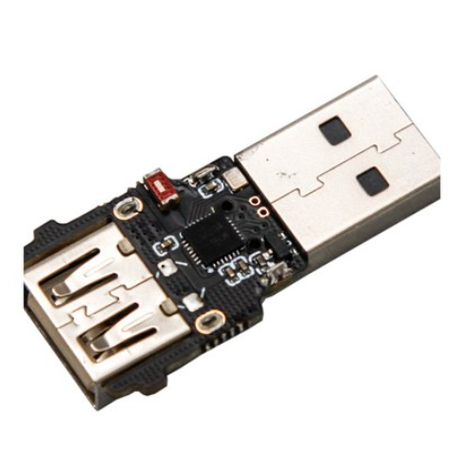

  
## EasyLink U2U 모듈 소개



EasyLink U2U 모듈은 기존의 유선 기계식 키보드를 최신의 QMK/VIAL 펌웨어 지원으로 완전히 업그레이드할 수 있는 획기적인 범용 핫스왑 모듈입니다. 기계식 키보드 커뮤니티에서 높은 인기를 얻고 있는 이 제품은 기존 키보드의 PCB를 교체할 필요 없이 간단한 설치만으로 고급 커스터마이징 기능을 모두 활용할 수 있습니다.

## 주요 기능

### QMK 펌웨어 지원
- QMK 오픈소스 펌웨어 완벽 지원
- 무한한 키매핑 가능성
- 복잡한 매크로 설정 가능
- 프로그래밍 경험자를 위한 고급 기능

### VIAL 소프트웨어
- VIAL은 QMK 펌웨어를 위한 그래픽 인터페이스 기반 설정 도구
- VIA/VIAL 웹 버전을 통한 설정으로 별도 소프트웨어 설치 불필요
- JSON 레이아웃 파일 지원
- 직관적인 UI로 초보자도 쉽게 사용 가능

## 제품 사양

| 항목 | 사양 |
|------|------|
| 모듈명 | EasyLink U2U |
| 호환성 | 범용 기계식 키보드 |
| 펌웨어 | QMK 지원 |
| 설정도구 | VIA/VIAL |

## 사용자 평가

### 긍정적인 반응
- VIAL 소프트웨어 호환성 우수
- 설치가 간단하고 직관적
- 다양한 키보드 레이아웃 지원
- 매크로 설정이 뛰어남

### 주의사항
- 일부 사용자 리뷰에서 매크로 콤보 개수 수정이 제한될 수 있다고 언급
- VIA 레이아웃이 모든 키보드에 기본 제공되지는 않음
- 중국 제조업체이므로 기술 지원이 제한적일 수 있음

## 설정 방법

### 1단계: VIAL/VIA 소프트웨어 준비
```
- VIAL 펌웨어 파일 다운로드
- 웹 버전 VIA 접속 (via.getreuer.com)
- JSON 레이아웃 파일 준비
```

### 2단계: 레이아웃 로드
```
VIA에서 "Load Draft Definition"을 선택하여
제공된 JSON 파일 선택
```

### 3단계: 키 매핑 설정
```
- 레이어 설정
- 키 바인딩 커스터마이징
- 매크로 작성
- 설정 저장
```

## 누가 이 제품을 구매해야 할까?

### 추천 사용자
- 기계식 키보드 커스터마이징에 관심이 있는 사람
- 프로그래밍이나 매크로 기능이 필요한 전문가
- 기존 키보드를 현대화하고 싶은 사용자
- 다양한 키 레이아웃을 실험해보고 싶은 사용자

### 주의할 사용자
- 기계식 키보드를 처음 접하는 초보자 (설정이 복잡할 수 있음)
- 기술 지원이 절대적으로 필요한 사용자
- 즉각적인 AS를 원하는 사용자 (중국 배송)

## 종합 평가

EasyLink U2U 모듈은 기계식 키보드 커뮤니티에서 높이 평가받는 제품입니다. QMK/VIAL 지원으로 무한한 커스터마이징 가능성을 제공하며, 가격대도 매우 합리적입니다. 다만 일부 제약사항이 있으므로 구매 전에 충분한 정보 습득이 필요합니다.

**최종 평점**: ⭐⭐⭐⭐☆ (4/5)

- 기능성: ⭐⭐⭐⭐⭐
- 가격: ⭐⭐⭐⭐☆
- 호환성: ⭐⭐⭐⭐☆
- 설정 난이도: ⭐⭐⭐☆☆ (다소 어려움)
- 지원: ⭐⭐⭐☆☆

## 결론

EasyLink U2U 모듈은 기존 기계식 키보드를 현대화하고자 하는 사용자들에게 훌륭한 선택입니다. 합리적인 가격에 고급 기능을 제공하며, 커뮤니티의 지원도 활발합니다. 설정에 약간의 노력이 필요하지만, 그 보상으로 완벽하게 커스터마이징된 키보드 경험을 얻을 수 있습니다.

**참고자료**
- [AliExpress - EasyLink U2U 모듈](https://ko.aliexpress.com/item/1005006481165921.html)
- [JKLP EasyLink U2U 소프트웨어 가이드](https://m.blog.naver.com/lovbible/223171482165)
- [DcinSide 기계식키보드 갤러리](https://gall.dcinside.com/mgallery/board/view/?id=mechanicalkeyboard&no=1960434)

