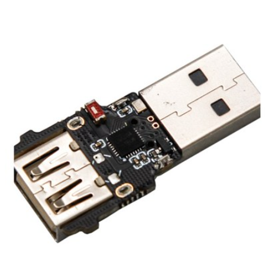
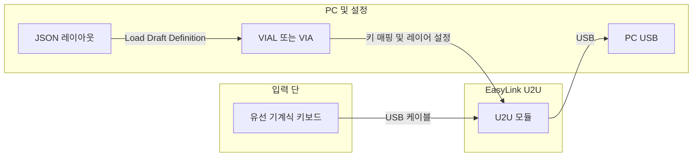

이 글에서는 **EasyLink U2U** 모듈을 소개한다. 기존 유선 기계식 키보드를 PCB 교체 없이 **QMK** 펌웨어와 **VIAL/VIA** 설정 도구로 업그레이드할 수 있는 범용 핫스왑 모듈이며, 제품 개요·추천 대상·구성 흐름·주요 기능·사양·설정 방법·사용자 평가·종합 평가를 정리했다.

## 제품 개요 및 추천 대상

**EasyLink U2U**는 기계식 키보드와 PC 사이에 끼워 넣는 **USB to USB(U2U)** 변환 모듈이다. 키보드 자체 PCB를 바꾸지 않고도 **QMK** 오픈소스 펌웨어 기반의 키 매핑·레이어·탭댄스·매크로(펌웨어/환경에 따라 제한 있음)를 사용할 수 있게 해 준다. **VIAL** 또는 **VIA**(웹/앱)로 그래픽 설정이 가능하며, JSON 레이아웃 파일을 로드해 다양한 키 배열에 대응할 수 있다.

### 추천 대상

- 기계식 키보드 커스터마이징(레이어·매크로·탭댄스)에 관심 있는 사용자
- 프로그래밍·단축키·매크로가 필요한 개발자·실무자
- 기존 유선 키보드를 현대적인 펌웨어로 활용하고 싶은 사용자
- 다양한 키 레이아웃을 실험해 보고 싶은 사용자

### 비추천 또는 주의 대상

- 기계식 키보드를 처음 쓰는 초보자(설정 난이도가 다소 높을 수 있음)
- 매크로·AS 등 기술 지원을 반드시 받아야 하는 사용자(중국 제조·배송 특성상 한계 있음)

---

## 구성 및 동작 흐름

EasyLink U2U는 키보드와 PC 사이에서 입력을 중계하며, PC에서는 일반 USB HID 키보드로 인식된다. 설정은 VIAL/VIA로 레이아웃·키 매핑·매크로를 편집한 뒤 모듈(펌웨어)에 반영하는 구조다. 아래 다이어그램은 장치 연결과 설정 흐름을 요약한다.

```mermaid
flowchart LR
  subgraph inputGroup["입력 단"]
    keyboardUnit["유선 기계식 키보드"]
  end
  subgraph moduleGroup["EasyLink U2U"]
    u2uModule["U2U 모듈"]
  end
  subgraph hostGroup["PC 및 설정"]
    pcHost["PC USB"]
    vialApp["VIAL 또는 VIA"]
    jsonLayout["JSON 레이아웃"]
  end
  keyboardUnit -->|"USB 케이블"| u2uModule
  u2uModule -->|"USB"| pcHost
  vialApp -->|"키 매핑 및 레이어 설정"| u2uModule
  jsonLayout -->|"Load Draft Definition"| vialApp
```

- **입력 단**: 기존 유선 기계식 키보드를 USB로 U2U 모듈에 연결한다. 무선 사용 시 2.4GHz 동글을 모듈에 꽂는 구성도 가능하다.
- **모듈**: EasyLink U2U가 키 입력을 받아 QMK 펌웨어로 처리한 뒤, PC에는 일반 키보드로 전달한다.
- **설정**: VIAL 앱 또는 VIA 웹에서 JSON 레이아웃을 로드한 뒤, 레이어·키 바인딩·탭댄스·매크로를 설정하고 저장하면 모듈에 적용된다.

---

## 주요 기능

### QMK 펌웨어 지원

- **QMK** 오픈소스 펌웨어를 사용해 키 매핑·레이어·탭댄스·매크로 등 고급 기능을 제공한다.
- 레이어 전환, 모딩키(탭 시 한 키·홀드 시 다른 키), 더블탭·탭+홀드 등 **탭댄스** 동작이 잘 지원된다는 사용자 후기가 많다.
- **Any key**나 탭댄스에 QMK 키코드(예: `LCA(KC_PGUP)`, `C_S(KC_SPACE)`)를 넣어 단축키·매크로를 흉내 내는 방식으로 보완할 수 있다. 키코드는 [QMK Keycodes](https://docs.qmk.fm/keycodes) 문서를 참고하면 된다.
- 일부 키보드·펌웨어 조합에서는 **VIA 스타일 매크로 녹화**가 동작하지 않을 수 있으며, 펌웨어 업데이트 후 개선되는 사례도 있다.

### VIAL·VIA 소프트웨어

- **VIAL**은 QMK 기반 키보드를 위한 그래픽 설정 도구이며, **VIA**는 웹(via.getreuer.com) 또는 앱으로 동일한 개념의 설정을 제공한다.
- **VIA 웹 버전**을 쓰면 별도 프로그램 설치 없이 브라우저에서 레이아웃·키 매핑을 할 수 있다. 이 경우 해당 키보드용 **JSON 레이아웃 파일**이 필요하며, 제조사·커뮤니티에서 공유하는 파일을 사용할 수 있다.
- **VIAL 앱**을 설치하면 JSON 없이도 지원 목록에 있는 기기로 바로 설정할 수 있는 경우가 많다. 웹 VIA용 JSON이 없는 키보드라도 VIAL에서 풀 배열 등으로 설정할 수 있다는 후기가 있다.
- 마우스 키(커서 이동·버튼)도 지원하며, 가속 등은 QMK 마우스 키 설정으로 조정할 수 있다.

---

## 제품 사양

| 항목 | 내용 |
|------|------|
| 모듈명 | EasyLink U2U |
| 연결 방식 | USB to USB (키보드 ↔ 모듈 ↔ PC) |
| 무선 | 2.4GHz 동글 연결 시 무선 사용 가능(제품 사양·동글 별도 확인) |
| 펌웨어 | QMK 호환 |
| 설정 도구 | VIAL, VIA(웹·앱) |
| 레이아웃 | JSON Draft Definition 또는 VIAL 내장 레이아웃 |
| 호환성 | USB HID 키보드로 동작하는 범용 기계식 키보드 |

가격·배송은 알리익스프레스 등 해외 직구 기준이며, 제조사는 중국이라 기술 지원·AS는 제한적일 수 있다.

---

## 설정 방법

### 1단계: VIAL 또는 VIA 준비

- **VIAL**: [VIAL 공식](https://get.vial.today/) 등에서 VIAL 앱을 다운로드·설치한다.
- **VIA 웹**: [via.getreuer.com](https://via.getreuer.com/)에 접속한다. 이 경우 키보드용 **JSON 레이아웃 파일**을 준비한다(제조사·커뮤니티 공유 파일 활용).

### 2단계: 레이아웃 로드 (VIA 웹 사용 시)

- VIA 웹에서 **"Load Draft Definition"**을 선택한 뒤, 사용할 키보드의 JSON 파일(예: `lgk_easylink.json`)을 선택한다.
- 여러 키보드가 정의되어 있으면 목록에서 해당 키보드(예: LGK_Easylink)를 선택한다.

### 3단계: 키 매핑 및 저장

- 레이어별로 키를 바인딩하고, 필요 시 **탭댄스**(LT, 탭·홀드·더블탭 등)·**매크로**(지원 시)·**마우스 키**를 설정한다.
- 변경 사항은 모듈에 저장되며, 재연결 후에도 유지된다.
- **펌웨어 업데이트**가 필요한 경우(매크로 미동작 등): VIAL에서 "Reboot to Bootloader" 등으로 부트로더 모드로 들어간 뒤, 제조사·커뮤니티에서 제공하는 펌웨어 파일로 플래시한다. 실패 시 키보드를 뺀 채로 VIAL을 재시작한 뒤 다시 플래시하면 되는 경우가 많다.

---

## 사용자 평가 요약

### 장점

- **VIAL/VIA 호환성**이 좋고, 웹 VIA로도 설정 가능하다.
- **설치가 단순**하며(키보드–모듈–PC 연결), PCB 교체가 필요 없다.
- **다양한 레이아웃**을 JSON 또는 VIAL로 지원하며, **탭댄스·레이어**가 안정적으로 동작한다는 평가가 많다.
- **가격 대비 기능**이 뛰어나 커뮤니티에서 인기 있는 제품이다.

### 주의사항

- **매크로**는 키보드·펌웨어에 따라 VIA 녹화 방식이 동작하지 않을 수 있고, Any key·탭댄스로 대체하거나 **펌웨어 업데이트** 후 해결되는 사례가 있다.
- **VIA 웹** 사용 시 해당 키보드용 JSON 레이아웃이 없을 수 있어, VIAL 앱이나 커뮤니티 공유 JSON을 활용해야 할 수 있다.
- **동시 키 입력(동시키)** 이 6키까지로 제한된다는 후기가 있으며, 리듬 게임 등 N키 롤오버가 필요한 사용자는 확인이 필요하다.
- **중국 제조** 특성상 기술 지원·AS는 제한적일 수 있다.

---

## 종합 평가

EasyLink U2U는 **기존 유선 기계식 키보드를 QMK/VIAL 환경으로 올려 쓰고 싶은 사용자**에게 적합한 범용 모듈이다. 레이어·탭댄스·키 리맵이 잘 동작하고, VIAL/VIA로 설정이 편리하며, 가격 대비 성능이 좋다는 평가가 많다. 반면 매크로·동시키 제한·레이아웃 파일 확보·지원 한계 등은 구매 전에 고려할 부분이다.

**한 줄 평**: PCB 교체 없이 유선 기계식 키보드를 QMK/VIAL로 업그레이드할 수 있는 가성비 좋은 U2U 모듈이다.

| 항목 | 평가 |
|------|------|
| 기능성 | ⭐⭐⭐⭐⭐ |
| 가격 대비 | ⭐⭐⭐⭐☆ |
| 호환성 | ⭐⭐⭐⭐☆ |
| 설정 난이도 | ⭐⭐⭐☆☆ (초보자는 학습 필요) |
| 지원·AS | ⭐⭐⭐☆☆ |

---

## 참고 문헌

- [AliExpress - EasyLink U2U 모듈](https://ko.aliexpress.com/item/1005006481165921.html) — 제품 구매 페이지.
- [JKLP EasyLink U2U 소프트웨어 (VIA/VIAL) : 네이버 블로그](https://m.blog.naver.com/lovbible/223171482165) — VIAL/VIA 웹 사용법, JSON 레이아웃·VIA "Load Draft Definition" 절차, 첨부 파일 활용 가이드.
- [이지링크 - 아이니 조합 후기 (기계식키보드 갤러리)](https://gall.dcinside.com/mgallery/board/view/?id=mechanicalkeyboard&no=1960434) — 실사용 후기, 탭댄스·마우스 키·매크로 이슈 및 펌웨어 업데이트 참고 글 링크.
