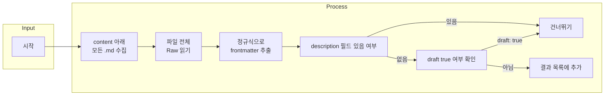

## 도입: 왜 description 검사가 필요한가

Hugo나 Jekyll 같은 **정적 사이트 생성기**를 쓰면 콘텐츠는 대부분 마크다운 파일이고, 각 파일 상단의 **frontmatter**에 제목·날짜·설명 같은 메타데이터가 들어간다. 그중 **description** 필드는 검색 엔진 최적화(SEO)와 소셜 미디어 공유 시 미리보기 문구로 쓰이므로, 배포되는 모든 글에 적절한 description이 있는지 관리하는 것이 좋다. 수십·수백 개의 `.md`가 쌓이면 일부에서 description이 빠지는 경우가 생기기 마련이다. 이때 "description이 **없는** 파일만 골라내는" 작업이 필요한데, Cursor나 VSCode의 기본 검색만으로는 한계가 있다.

이 글에서는 **PowerShell만으로** frontmatter 블록 안에 `description:` 필드가 없는 마크다운 파일을 찾는 방법을 단계별로 다룬다. `draft: true`인 작성 중인 글은 제외하는 로직, 정규식 설명, 결과 저장·실무 팁, 그리고 대안(ripgrep)과의 트레이드오프까지 포함해, 규칙을 완전히 반영해 내용과 구조를 보강했다.

---

## 정의·원칙: Frontmatter와 description의 역할

**Frontmatter**는 마크다운 파일 맨 위에 있는 메타데이터 블록이다. YAML·TOML·JSON 등으로 작성하며, Hugo에서는 보통 `---`로 감싼 YAML을 쓴다. 이 블록 안의 필드가 템플릿 선택, 게시 구조, SEO 메타 태그 등에 사용된다.

**description** 필드는 Hugo 공식 문서에 따르면, 페이지의 `summary`와 개념적으로 구분되며, 주로 HTML의 `<meta>` 요소에 들어가 검색 결과나 SNS 공유 시 요약문으로 노출된다. 따라서 "description 누락"이란, frontmatter 블록(`---` … `---`) 안에 `description:` 키가 없거나, 있어도 값이 비어 있는 경우를 의미한다. 이 글의 스크립트는 **키가 있고 값이 비어 있지 않은 경우**를 "있음"으로 보고, 그렇지 않으면 "누락"으로 판단한다.

---

## Cursor·VSCode 검색 패널의 한계

Cursor(또는 VSCode)의 검색 패널(Ctrl+Shift+F)은 기본적으로 **줄 단위 정규식 매칭**을 한다. Frontmatter는 여러 줄에 걸친 YAML 블록이기 때문에, "description 필드가 **없는** 경우"를 찾으려면 (1) 전체 frontmatter를 하나의 텍스트로 보는 **멀티라인 매칭**과 (2) "특정 패턴이 없다"는 **부정 조건(Negative Lookahead)**이 필요하다. VSCode 검색은 이런 고급 멀티라인 정규식을 지원하지 않으므로, **터미널 도구**(PowerShell, ripgrep 등)를 쓰는 편이 낫다.

---

## PowerShell 솔루션: 전체 흐름

아래 Mermaid 다이어그램은 스크립트의 논리적 흐름을 보여준다. 각 `.md` 파일에 대해 frontmatter를 추출한 뒤, description 유무와 draft 여부를 판단해, "description 없음 + draft 아님"인 파일만 결과로 낸다.



---

### 기본 스크립트: description 누락 파일 찾기

다음 PowerShell 스크립트는 `content` 디렉터리 하위의 모든 `.md` 파일을 검사해, frontmatter는 있지만 `description:` 필드가 없는 파일의 전체 경로를 출력한다. 목적은 "한 번에 누락 파일 목록을 얻는 것"이다.

```powershell
Get-ChildItem -Recurse -File -Filter *.md content | Where-Object {
  $c = Get-Content $_.FullName -Raw
  if ($c -match '^\s*---\s*\r?\n(?<fm>[\s\S]*?)\r?\n---\s*(\r?\n|$)') {
    $fm = $Matches.fm
    -not ($fm -match '(?m)^\s*description\s*:\s*\S')
  } else {
    $false
  }
} | Select-Object -ExpandProperty FullName
```

**동작 요약:** `Get-ChildItem`으로 `content` 아래 모든 `.md`를 나열하고, 각 파일을 `-Raw`로 한 번에 읽는다. 정규식으로 맨 앞의 `---` … `---` 블록을 추출해 `$Matches.fm`에 넣고, 그 안에 `description:` 뒤에 비공백 문자가 있는지 멀티라인 모드(`(?m)`)로 검사한다. 그런 매칭이 **없을 때만**(`-not`) 해당 파일을 통과시켜 경로를 찍는다. Frontmatter가 아예 없는 파일은 `if` 조건에서 걸러져 `$false`가 된다.

---

### Draft 제외: 작성 중인 글 건너뛰기

블로그에서는 `draft: true`로 표시된 미완성 글이 많을 수 있다. 이런 글은 아직 배포 대상이 아니므로 description이 없어도 괜찮다. 아래 스크립트는 "description 없음"이면서 동시에 "draft: true가 아님"인 파일만 출력한다.

```powershell
Get-ChildItem -Recurse -File -Filter *.md content | Where-Object {
  $c = Get-Content $_.FullName -Raw

  if ($c -match '^\s*---\s*\r?\n(?<fm>[\s\S]*?)\r?\n---\s*(\r?\n|$)') {
    $fm = $Matches.fm

    $hasDescription = ($fm -match '(?m)^\s*description\s*:\s*\S')
    $isDraftTrue    = ($fm -match '(?m)^\s*draft\s*:\s*"?true"?\b')

    (-not $hasDescription) -and (-not $isDraftTrue)
  }
  else {
    $false
  }
} | Select-Object -ExpandProperty FullName
```

**추가된 로직:** `$isDraftTrue`는 frontmatter 안에 `draft: true` 또는 `draft: "true"`가 있는지 확인하고, `(-not $hasDescription) -and (-not $isDraftTrue)`로 "description도 없고, 초안도 아닌" 경우만 남긴다.

---

### 정규식 상세 설명

PowerShell 정규식으로 frontmatter와 description·draft를 다루기 위해 다음 세 가지를 이해하면 유지보수에 도움이 된다.

**`(?m)` — Multiline 모드**  
`(?m)`을 쓰면 `^`와 `$`가 전체 문자열의 맨 앞·맨 뒤가 아니라 **각 줄의 시작·끝**을 의미한다. Frontmatter는 여러 줄이므로, "줄 시작에 오는 `description:`"을 찾을 때 필수다. `(?m)` 없이는 `^`가 첫 줄만 보고 나머지 줄의 `description:`을 놓친다.

**`\b` — 단어 경계**  
`"?true"?\b`에서 `\b`는 단어 경계다. `draft: true123`처럼 잘못된 값은 매칭하지 않고, `true`만 정확히 잡는다.

**`[\s\S]*?` — 최소 매칭**  
`[\s\S]`는 공백을 포함한 **모든 문자**이고, `*?`는 **최소 매칭(non-greedy)**이다. 그래서 첫 번째 `---` 다음부터 **두 번째 `---` 직전까지만** frontmatter로 인식하고, 본문이 frontmatter에 섞이지 않는다.

---

## 결과 저장 옵션

검색 결과를 파일로 남기면 나중에 참고하거나 다른 도구로 후처리하기 좋다. 아래는 결과를 변수에 담아 텍스트 파일로 저장하고, 개수를 출력하는 예이다.

```powershell
$results = Get-ChildItem -Recurse -File -Filter *.md content | Where-Object {
  $c = Get-Content $_.FullName -Raw
  if ($c -match '^\s*---\s*\r?\n(?<fm>[\s\S]*?)\r?\n---\s*(\r?\n|$)') {
    $fm = $Matches.fm
    $hasDescription = ($fm -match '(?m)^\s*description\s*:\s*\S')
    $isDraftTrue    = ($fm -match '(?m)^\s*draft\s*:\s*"?true"?\b')
    (-not $hasDescription) -and (-not $isDraftTrue)
  } else { $false }
} | Select-Object -ExpandProperty FullName

$results | Set-Content .\missing-description.txt
Write-Host "Description 누락 파일: $($results.Count)개"
```

`missing-description.txt`에는 한 줄에 하나씩 경로가 들어가며, Cursor에서 경로를 클릭해 해당 파일을 바로 열 수 있다.

---

## 실무 팁

**특정 디렉터리만 검사**  
전체 `content` 대신 `content/post` 등 하위만 보려면 `Get-ChildItem` 경로를 바꾼다. 예: `Get-ChildItem -Recurse -File -Filter *.md content/post`.

**파일명만 출력**  
전체 경로 대신 파일명만 필요하면 파이프 끝을 `Select-Object -ExpandProperty Name`으로 바꾼다.

**CSV로 내보내기**  
경로와 수정 날짜를 함께 쓰려면 `Select-Object FullName, LastWriteTime` 후 `Export-Csv .\missing-description.csv -NoTypeInformation`을 사용한다.

**Cursor Task로 등록**  
자주 쓴다면 `.vscode/tasks.json`에 등록해 "Tasks: Run Task"에서 실행할 수 있다. 아래는 한 줄로 넘긴 예시이다.

```json
{
  "version": "2.0.0",
  "tasks": [
    {
      "label": "Find Missing Descriptions",
      "type": "shell",
      "command": "pwsh",
      "args": [
        "-NoProfile",
        "-Command",
        "Get-ChildItem -Recurse -File -Filter *.md content | Where-Object { $c = Get-Content $_.FullName -Raw; if ($c -match '^\\s*---\\s*\\r?\\n(?<fm>[\\s\\S]*?)\\r?\\n---\\s*(\\r?\\n|$)') { $fm = $Matches.fm; $hasDescription = ($fm -match '(?m)^\\s*description\\s*:\\s*\\S'); $isDraftTrue = ($fm -match '(?m)^\\s*draft\\s*:\\s*\"?true\"?\\b'); (-not $hasDescription) -and (-not $isDraftTrue) } else { $false } } | Select-Object -ExpandProperty FullName"
      ],
      "group": "test",
      "presentation": { "reveal": "always", "panel": "new" }
    }
  ]
}
```

---

## 대안: ripgrep 사용과 트레이드오프

시스템에 [ripgrep](https://github.com/BurntSushi/ripgrep)이 설치되어 있으면 PCRE2 정규식으로 빠르게 검색할 수 있다. 예시는 다음과 같다.

```bash
rg --pcre2 -U -l --glob "*.md" '(?ms)\A---\R(?!(?:(?!\R---\R).)*^\s*description\s*:)(?:(?!\R---\R).)*\R---' content
```

다만 ripgrep은 별도 설치가 필요하고, "draft: true 제외"까지 넣으면 정규식이 더 복잡해진다. **PowerShell**은 Windows에 기본 있거나 쉽게 쓰이고, 조건 분기와 가독성·유지보수가 좋아서 "description 누락 + draft 제외"를 한 번에 다루기에는 더 유리하다. 반대로 **ripgrep**은 대량 파일에서 속도와 메모리 효율이 뛰어나므로, "일단 빠르게 후보만 뽑고 PowerShell로 재검사"하는 하이브리드도 가능하다.

| 구분 | PowerShell | ripgrep |
|------|------------|---------|
| 설치 | Windows 기본/간단 | 별도 설치 |
| draft 제외 | 스크립트로 명확히 분리 | 정규식 복잡도 증가 |
| 가독성·유지보수 | 높음 | 상대적으로 낮음 |
| 대량 파일 속도 | 상대적으로 느림 | 매우 빠름 |

---

## 언제 쓰고 언제 피할지

**사용해도 좋은 경우:** Hugo·Jekyll 등 정적 사이트의 마크다운 콘텐츠가 많고, 모든 게시 글에 description을 채우는 정책이 있을 때. CI에서 배포 전 검사 스크립트로 넣거나, 주기적으로 로컬에서 돌려 누락을 보정할 때 적합하다.

**피하는 편이 좋은 경우:** frontmatter가 없거나 비표준 형식(다른 구분자, 중첩 `---`)이 많은 레포, 또는 description을 의도적으로 비워 두는 규칙이 있는 경우. 그때는 스크립트 조건을 프로젝트에 맞게 수정하거나, 특정 디렉터리만 대상으로 제한하는 것이 좋다.

---

## 마치며

정적 사이트의 콘텐츠 품질을 유지하려면 frontmatter의 description을 빠짐없이 채우는 것이 중요하다. 이 글의 PowerShell 스크립트를 쓰면 description이 누락된 마크다운 파일을 빠르게 찾고, draft 글은 제외한 뒤 결과를 파일로 저장하거나 Task로 자동화할 수 있다. 정기적으로 실행해 SEO와 공유 미리보기 품질을 관리하는 것을 권한다.

**요약 체크리스트**

- [ ] `content`(또는 원하는 하위 경로)에서 모든 `.md`를 검사했다.
- [ ] frontmatter 추출 정규식이 `---` … `---` 한 블록만 잡는지 확인했다.
- [ ] description은 "키 존재 + 값 비어 있지 않음"으로 판단했다.
- [ ] `draft: true` 파일은 결과에서 제외했다.
- [ ] 필요 시 결과를 `.txt` 또는 `.csv`로 저장해 후처리했다.

---

## 참고 문헌

1. [Hugo — Front matter](https://gohugo.io/content-management/front-matter/) — frontmatter 형식과 `description`·`draft` 등 필드 설명.
2. [PowerShell — about_Regular_Expressions](https://learn.microsoft.com/en-us/powershell/module/microsoft.powershell.core/about/about_regular_expressions) — `-match`, `(?m)`, 캡처 그룹 등 정규식 문법.
3. [ripgrep (BurntSushi/ripgrep)](https://github.com/BurntSushi/ripgrep) — PCRE2 기반 고속 검색 도구.
