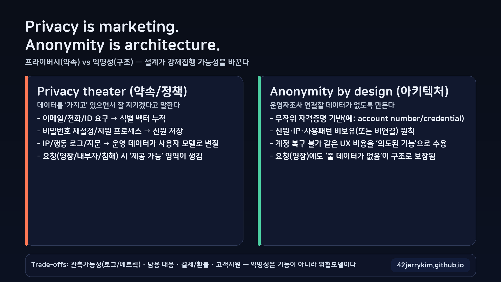
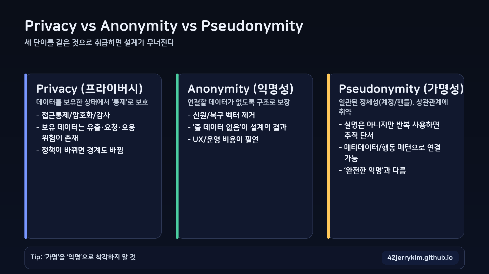
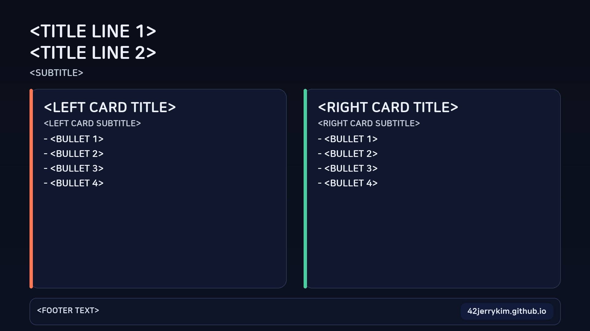

## 왜 이 도구가 필요한가

Hugo로 글을 쓰다 보면 “대표 이미지(커버/OG 이미지)”를 매번 만들기가 귀찮습니다.

- 글의 품질이 아니라 **디자인 작업**에 시간을 쓰게 됨
- 대표 이미지 스타일이 글마다 달라져 **사이트 일관성**이 깨짐
- 소셜 공유(OG)에서 글이 덜 눈에 띔

그래서 이 레포에는 **JSON 스펙 기반으로 대표 이미지를 생성하는 스크립트**를 추가했습니다.

- 생성기: `script/hero_infographic_generator.py`
- 샘플 스펙: `script/hero_infographic_example_spec.json`

## 결과물 예시

아래 이미지는 실제로 생성기가 만든 결과물입니다(1920×1080).


## 빠른 시작

### 1) 기본 생성(스펙 없이)

```bash
python script/hero_infographic_generator.py content/post/2025/2025-12-23-hero-infographic-generator-usage/image01.png
```

스펙을 주지 않으면 **기본 템플릿**으로 생성합니다(기존과 호환).

### 2) JSON 스펙으로 생성(추천)

```bash
python script/hero_infographic_generator.py content/post/2025/2025-12-23-hero-infographic-generator-usage/image01.png --spec script/hero_infographic_example_spec.json
```

### 3) 옵션 오버라이드

```bash
python script/hero_infographic_generator.py out.png ^
  --spec script/hero_infographic_example_spec.json ^
  --width 1200 --height 630 ^
  --cols 2 ^
  --brand "42jerrykim.github.io" ^
  --footer "Hugo 대표 이미지 자동 생성" ^
  --bullet-prefix "- "
```

## 스펙(JSON) 구조 설명

스펙 파일은 크게 다음 블록으로 구성됩니다.

- **`canvas`**: `{ width, height }`
- **`header`**: `{ lines: string[], subtitle?: string }`
- **`cards`**: 카드 배열(제목/부제/불릿/강조색)
- **`footer`**: `{ text?: string, brand?: string }`
- **`layout`**: `{ cols }` 카드 열 수(카드 개수에 따라 행은 자동)
- **`typography`**: `{ bullet_prefix }` 글머리 접두어(폰트 깨짐 방지용)

## 스펙 예시 3개(바로 복사해 쓰기)

아래 예시들은 모두 `--spec <file.json>` 형태로 사용할 수 있습니다.

### 예시 1) 비교 2-카드(기본형)



```json
{
  "canvas": { "width": 1920, "height": 1080 },
  "header": {
    "lines": ["Privacy is marketing.", "Anonymity is architecture."],
    "subtitle": "프라이버시(약속) vs 익명성(구조) — 설계가 강제집행 가능성을 바꾼다"
  },
  "cards": [
    {
      "title": "Privacy theater (약속/정책)",
      "subtitle": "데이터를 ‘가지고’ 있으면서 잘 지키겠다고 말한다",
      "accent": [255, 120, 85],
      "bullets": [
        "이메일/전화/ID 요구 → 식별 벡터 누적",
        "비밀번호 재설정/지원 프로세스 → 신원 저장",
        "IP/행동 로그/지문 → 운영 데이터가 사용자 모델로 변질",
        "요청(영장/내부자/침해) 시 ‘제공 가능’ 영역이 생김"
      ]
    },
    {
      "title": "Anonymity by design (아키텍처)",
      "subtitle": "운영자조차 연결할 데이터가 없도록 만든다",
      "accent": [75, 205, 160],
      "bullets": [
        "무작위 자격증명 기반(예: account number/credential)",
        "신원·IP·사용패턴 비보유(또는 비연결) 원칙",
        "계정 복구 불가 같은 UX 비용을 ‘의도된 기능’으로 수용",
        "요청(영장)에도 ‘줄 데이터가 없음’이 구조로 보장됨"
      ]
    }
  ],
  "footer": {
    "text": "Trade-offs: 관측가능성(로그/메트릭) · 남용 대응 · 결제/환불 · 고객지원 — 익명성은 기능이 아니라 위협모델이다",
    "brand": "42jerrykim.github.io"
  },
  "layout": { "cols": 2 },
  "typography": { "bullet_prefix": "- " }
}
```

### 예시 2) 3-카드(privacy/anonymity/pseudonymity)



```json
{
  "canvas": { "width": 1920, "height": 1080 },
  "header": {
    "lines": ["Privacy vs Anonymity vs Pseudonymity"],
    "subtitle": "세 단어를 같은 것으로 취급하면 설계가 무너진다"
  },
  "cards": [
    {
      "title": "Privacy (프라이버시)",
      "subtitle": "데이터를 보유한 상태에서 ‘통제’로 보호",
      "accent": [120, 150, 255],
      "bullets": [
        "접근통제/암호화/감사",
        "보유 데이터는 유출·요청·오용 위험이 존재",
        "정책이 바뀌면 경계도 바뀜"
      ]
    },
    {
      "title": "Anonymity (익명성)",
      "subtitle": "연결할 데이터가 없도록 구조로 보장",
      "accent": [75, 205, 160],
      "bullets": [
        "신원/복구 벡터 제거",
        "‘줄 데이터 없음’이 설계의 결과",
        "UX/운영 비용이 필연"
      ]
    },
    {
      "title": "Pseudonymity (가명성)",
      "subtitle": "일관된 정체성(계정/핸들), 상관관계에 취약",
      "accent": [255, 200, 90],
      "bullets": [
        "실명은 아니지만 반복 사용하면 추적 단서",
        "메타데이터/행동 패턴으로 연결 가능",
        "‘완전한 익명’과 다름"
      ]
    }
  ],
  "footer": { "text": "Tip: ‘가명’을 ‘익명’으로 착각하지 말 것", "brand": "42jerrykim.github.io" },
  "layout": { "cols": 3 },
  "typography": { "bullet_prefix": "- " }
}
```

### 예시 3) 포스트 템플릿(빈 카드 2개: 빠르게 채우기)



```json
{
  "canvas": { "width": 1920, "height": 1080 },
  "header": { "lines": ["<TITLE LINE 1>", "<TITLE LINE 2>"], "subtitle": "<SUBTITLE>" },
  "cards": [
    {
      "title": "<LEFT CARD TITLE>",
      "subtitle": "<LEFT CARD SUBTITLE>",
      "accent": [255, 120, 85],
      "bullets": ["<BULLET 1>", "<BULLET 2>", "<BULLET 3>", "<BULLET 4>"]
    },
    {
      "title": "<RIGHT CARD TITLE>",
      "subtitle": "<RIGHT CARD SUBTITLE>",
      "accent": [75, 205, 160],
      "bullets": ["<BULLET 1>", "<BULLET 2>", "<BULLET 3>", "<BULLET 4>"]
    }
  ],
  "footer": { "text": "<FOOTER TEXT>", "brand": "42jerrykim.github.io" },
  "layout": { "cols": 2 },
  "typography": { "bullet_prefix": "- " }
}
```

## 자주 겪는 문제(트러블슈팅)

### 폰트가 깨져 보인다

- 아이콘/특수문자는 폰트에 없을 수 있습니다.
- 그래서 `typography.bullet_prefix`는 기본값을 `- `로 두었습니다(일부 폰트에서 `•`가 깨짐 방지).
- 한글 폰트를 강제하고 싶으면 `--font <ttf>`를 사용하세요.

### 텍스트가 박스를 뚫고 나간다

- 공백이 적은 문자열(한글/긴 토큰)은 줄바꿈이 어려울 수 있습니다.
- 생성기는 **단어 래핑 + 문자 단위 강제 분할 fallback**이 있어 오버플로우를 줄입니다.

## Hugo에 붙이는 패턴

이 글처럼 frontmatter의 `image:`를 생성된 이미지 파일로 지정하면 됩니다.

```yaml
image: image01.png
```


