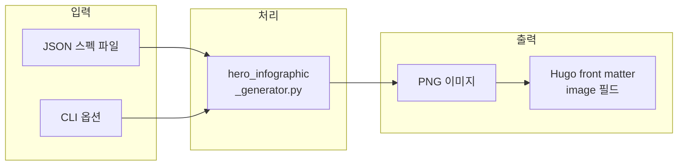
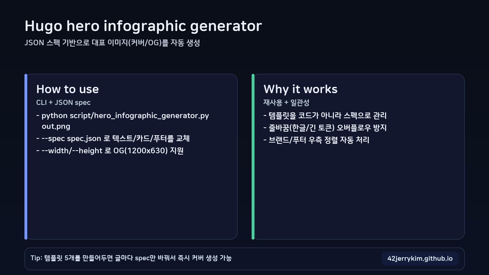
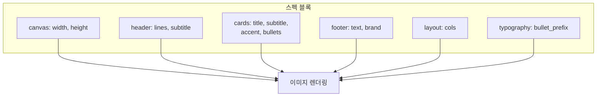
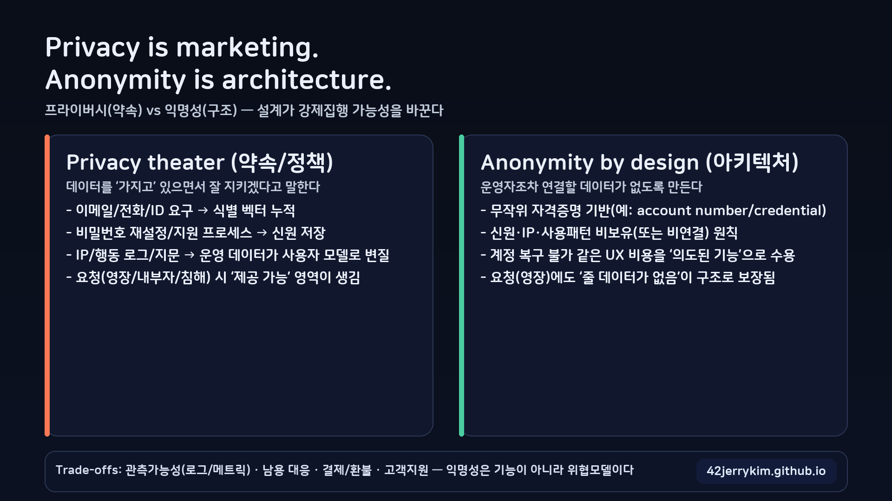
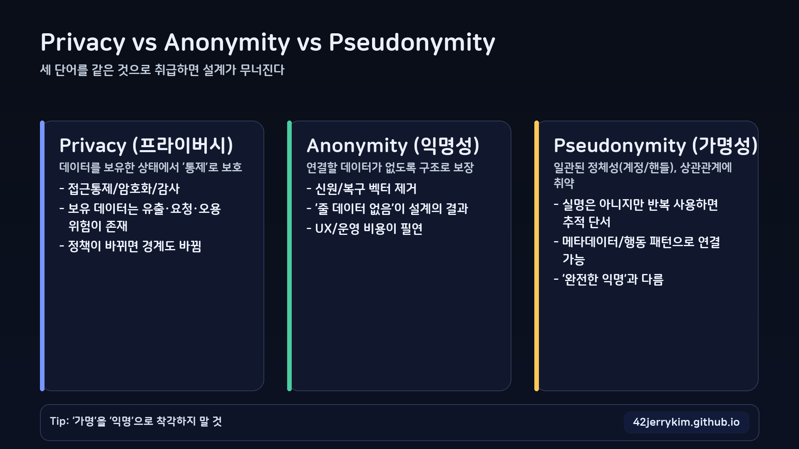
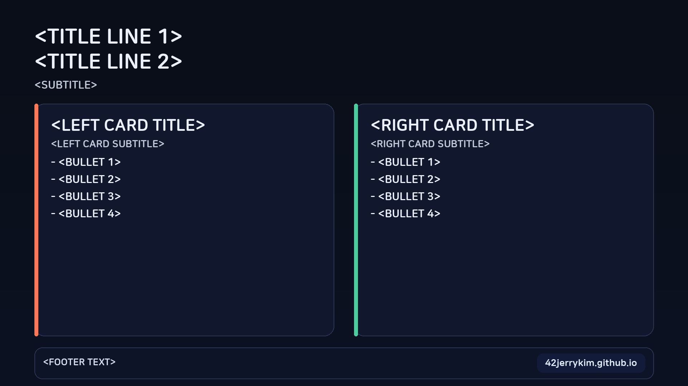

## 개요

### 도구 정보

Hugo로 글을 쓸 때 **대표 이미지(커버/OG 이미지)**를 매번 만드는 일은 부담이 됩니다. 글의 품질이 아니라 디자인 작업에 시간이 쓰이고, 스타일이 글마다 달라지면 사이트 일관성도 깨집니다. 소셜 공유(Open Graph)에서도 눈에 덜 띄게 됩니다.

이 레포에는 **JSON 스펙 기반으로 대표 이미지를 자동 생성하는 스크립트**가 포함되어 있습니다.

| 항목 | 내용 |
|------|------|
| 생성기 | `script/hero_infographic_generator.py` |
| 샘플 스펙 | `script/hero_infographic_example_spec.json` |
| 의존성 | Python 3, Pillow(PIL) |
| 출력 | PNG 이미지(기본 1920×1080, 옵션으로 1200×630 등) |

### 추천 대상

- Hugo(또는 Jekyll 등 정적 사이트)로 블로그를 운영하며 **포스트마다 대표 이미지를 통일하고 싶은 분**
- **JSON으로 레이아웃을 정의**하고 재사용하고 싶은 분
- **OG 이미지·카드 미리보기** 품질을 올리고 싶은 분
- **CLI·스크립트**로 이미지 생성을 자동화하고 싶은 분

---

## 전체 워크플로우

대표 이미지 생성부터 Hugo에 반영까지의 흐름은 아래와 같습니다.


```mermaid
flowchart LR
  subgraph inputGroup[입력]
    specFile["JSON 스펙 파일"]
    cliArgs["CLI 옵션"]
  end
  subgraph processGroup[처리]
    generator["hero_infographic</br>_generator.py"]
  end
  subgraph outputGroup[출력]
    pngOut["PNG 이미지"]
    hugoFront["Hugo front matter</br>image 필드"]
  end
  specFile --> generator
  cliArgs --> generator
  generator --> pngOut
  pngOut --> hugoFront
```

1. **JSON 스펙**으로 헤더·카드·푸터·레이아웃을 정의한다.
2. **CLI**에서 출력 경로와 필요 시 `--width`, `--height`, `--brand` 등으로 오버라이드한다.
3. 생성된 **PNG**를 포스트 번들에 두고 front matter의 `image:`에 지정하면 Hugo가 리스트·OG 등에 사용한다.

---

## 결과물 예시

아래는 생성기가 만든 대표 이미지 예시입니다(1920×1080).



---

## 빠른 시작

### 1) 기본 생성(스펙 없이)

```bash
python script/hero_infographic_generator.py content/post/2025/2025-12-23-hero-infographic-generator-usage/image01.png
```

스펙을 주지 않으면 **기본 템플릿**으로 생성됩니다(기존 동작과 호환).

### 2) JSON 스펙으로 생성(추천)

```bash
python script/hero_infographic_generator.py content/post/2025/2025-12-23-hero-infographic-generator-usage/image01.png --spec script/hero_infographic_example_spec.json
```

### 3) 옵션 오버라이드

```bash
python script/hero_infographic_generator.py out.png ^
  --spec script/hero_infographic_example_spec.json ^
  --width 1200 --height 630 ^
  --cols 2 ^
  --brand "42jerrykim.github.io" ^
  --footer "Hugo 대표 이미지 자동 생성" ^
  --bullet-prefix "- "
```

---

## 스펙(JSON) 구조 설명

스펙 파일은 아래 블록으로 구성됩니다. 스펙과 CLI 옵션이 동시에 있으면 CLI가 우선합니다.


```mermaid
flowchart TB
  subgraph specBlocks[스펙 블록]
    canvas["canvas: width, height"]
    header["header: lines, subtitle"]
    cards["cards: title, subtitle,</br>accent, bullets"]
    footer["footer: text, brand"]
    layout["layout: cols"]
    typography["typography: bullet_prefix"]
  end
  canvas --> renderNode
  header --> renderNode
  cards --> renderNode
  footer --> renderNode
  layout --> renderNode
  typography --> renderNode
  renderNode["이미지 렌더링"]
```

| 블록 | 설명 |
|------|------|
| **`canvas`** | `{ "width", "height" }` — 캔버스 크기(픽셀) |
| **`header`** | `{ "lines": string[], "subtitle"?: string }` — 상단 제목·부제 |
| **`cards`** | 카드 배열. 각 카드: `title`, `subtitle`, `accent`(RGB 배열), `bullets`(문자열 배열) |
| **`footer`** | `{ "text"?: string, "brand"?: string }` — 하단 문구·브랜드 |
| **`layout`** | `{ "cols" }` — 카드 열 수(행은 카드 개수에 따라 자동) |
| **`typography`** | `{ "bullet_prefix" }` — 글머리 기호 접두어(폰트 깨짐 방지용, 기본 `"- "`) |

---

## 스펙 예시 3개(바로 복사해 쓰기)

아래 예시는 모두 `--spec <file.json>`으로 사용할 수 있습니다.

### 예시 1) 비교 2-카드(기본형)



```json
{
  "canvas": { "width": 1920, "height": 1080 },
  "header": {
    "lines": ["Privacy is marketing.", "Anonymity is architecture."],
    "subtitle": "프라이버시(약속) vs 익명성(구조) — 설계가 강제집행 가능성을 바꾼다"
  },
  "cards": [
    {
      "title": "Privacy theater (약속/정책)",
      "subtitle": "데이터를 '가지고' 있으면서 잘 지키겠다고 말한다",
      "accent": [255, 120, 85],
      "bullets": [
        "이메일/전화/ID 요구 → 식별 벡터 누적",
        "비밀번호 재설정/지원 프로세스 → 신원 저장",
        "IP/행동 로그/지문 → 운영 데이터가 사용자 모델로 변질",
        "요청(영장/내부자/침해) 시 '제공 가능' 영역이 생김"
      ]
    },
    {
      "title": "Anonymity by design (아키텍처)",
      "subtitle": "운영자조차 연결할 데이터가 없도록 만든다",
      "accent": [75, 205, 160],
      "bullets": [
        "무작위 자격증명 기반(예: account number/credential)",
        "신원·IP·사용패턴 비보유(또는 비연결) 원칙",
        "계정 복구 불가 같은 UX 비용을 '의도된 기능'으로 수용",
        "요청(영장)에도 '줄 데이터가 없음'이 구조로 보장됨"
      ]
    }
  ],
  "footer": {
    "text": "Trade-offs: 관측가능성(로그/메트릭) · 남용 대응 · 결제/환불 · 고객지원 — 익명성은 기능이 아니라 위협모델이다",
    "brand": "42jerrykim.github.io"
  },
  "layout": { "cols": 2 },
  "typography": { "bullet_prefix": "- " }
}
```

### 예시 2) 3-카드(Privacy / Anonymity / Pseudonymity)



```json
{
  "canvas": { "width": 1920, "height": 1080 },
  "header": {
    "lines": ["Privacy vs Anonymity vs Pseudonymity"],
    "subtitle": "세 단어를 같은 것으로 취급하면 설계가 무너진다"
  },
  "cards": [
    {
      "title": "Privacy (프라이버시)",
      "subtitle": "데이터를 보유한 상태에서 '통제'로 보호",
      "accent": [120, 150, 255],
      "bullets": [
        "접근통제/암호화/감사",
        "보유 데이터는 유출·요청·오용 위험이 존재",
        "정책이 바뀌면 경계도 바뀜"
      ]
    },
    {
      "title": "Anonymity (익명성)",
      "subtitle": "연결할 데이터가 없도록 구조로 보장",
      "accent": [75, 205, 160],
      "bullets": [
        "신원/복구 벡터 제거",
        "'줄 데이터 없음'이 설계의 결과",
        "UX/운영 비용이 필연"
      ]
    },
    {
      "title": "Pseudonymity (가명성)",
      "subtitle": "일관된 정체성(계정/핸들), 상관관계에 취약",
      "accent": [255, 200, 90],
      "bullets": [
        "실명은 아니지만 반복 사용하면 추적 단서",
        "메타데이터/행동 패턴으로 연결 가능",
        "'완전한 익명'과 다름"
      ]
    }
  ],
  "footer": { "text": "Tip: '가명'을 '익명'으로 착각하지 말 것", "brand": "42jerrykim.github.io" },
  "layout": { "cols": 3 },
  "typography": { "bullet_prefix": "- " }
}
```

### 예시 3) 포스트 템플릿(빈 카드 2개: 빠르게 채우기)



```json
{
  "canvas": { "width": 1920, "height": 1080 },
  "header": { "lines": ["<TITLE LINE 1>", "<TITLE LINE 2>"], "subtitle": "<SUBTITLE>" },
  "cards": [
    {
      "title": "<LEFT CARD TITLE>",
      "subtitle": "<LEFT CARD SUBTITLE>",
      "accent": [255, 120, 85],
      "bullets": ["<BULLET 1>", "<BULLET 2>", "<BULLET 3>", "<BULLET 4>"]
    },
    {
      "title": "<RIGHT CARD TITLE>",
      "subtitle": "<RIGHT CARD SUBTITLE>",
      "accent": [75, 205, 160],
      "bullets": ["<BULLET 1>", "<BULLET 2>", "<BULLET 3>", "<BULLET 4>"]
    }
  ],
  "footer": { "text": "<FOOTER TEXT>", "brand": "42jerrykim.github.io" },
  "layout": { "cols": 2 },
  "typography": { "bullet_prefix": "- " }
}
```

---

## 자주 겪는 문제(트러블슈팅)

### 폰트가 깨져 보인다

- 아이콘·특수문자는 사용 중인 폰트에 없을 수 있습니다.
- `typography.bullet_prefix` 기본값은 `"- "`로 두어, 일부 환경에서 `•` 등이 깨지는 것을 피합니다.
- 한글 폰트를 지정하려면 `--font <ttf 경로>`를 사용하세요.

### 텍스트가 박스를 뚫고 나간다

- 공백이 적은 문자열(한글, 긴 영단어)은 줄바꿈이 어렵습니다.
- 생성기는 **단어 단위 래핑**과 **문자 단위 강제 분할 fallback**을 사용해 오버플로우를 줄입니다. 그래도 넘치면 카드의 `bullets` 문장을 짧게 나누거나 제목·부제 길이를 조절하는 것이 좋습니다.

### 스펙 JSON이 로드되지 않는다

- 파일 경로가 올바른지, JSON 문법(쉼표·따옴표)이 맞는지 확인하세요.
- 인코딩은 UTF-8을 권장합니다.

---

## Hugo에 붙이는 패턴

생성한 PNG를 포스트 번들에 두고, front matter의 `image:`에 파일명만 지정하면 됩니다. Hugo는 이 값을 리스트·상세 페이지·OG/Twitter 카드 등에 사용합니다.

```yaml
image: image01.png
```

Hugo에서 이미지 메타데이터 사용 방식은 공식 문서의 [Front Matter](https://gohugo.io/content-management/front-matter/)를 참고하면 됩니다.

---

## 참고 문헌

1. [Hugo — Front Matter](https://gohugo.io/content-management/front-matter/) — Hugo 콘텐츠 메타데이터 및 `image` 등 필드 설명.
2. [Pillow (PIL Fork) Documentation](https://pillow.readthedocs.io/) — Python 이미지 처리 라이브러리 Pillow 공식 문서.
3. [MDN — The metadata element](https://developer.mozilla.org/en-US/docs/Web/HTML/Element/meta) — HTML `meta` 요소와 OG 등 메타데이터 설명.

---

## 한 줄 요약

**JSON 스펙 하나로 Hugo 포스트 대표 이미지를 자동 생성하고, front matter `image`만 지정하면 리스트·OG까지 일관되게 쓸 수 있다.**
