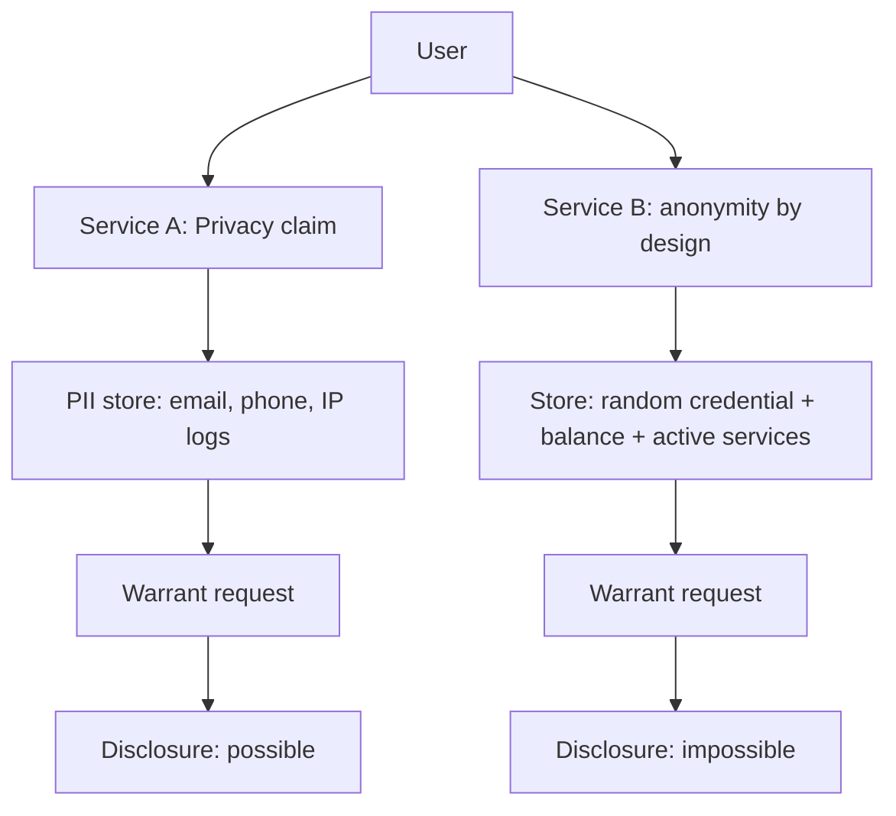

## 개요: “보호하겠다”는 약속과 “배신할 수 없다”는 구조

Servury의 글 제목은 자극적이지만, 아키텍트에게 중요한 질문을 던집니다. **프라이버시는 선언(약관·정책·홍보문)로도 말할 수 있지만, 익명성은 시스템이 데이터를 ‘애초에 만들지 않도록’ 설계해야만 성립한다**는 주장입니다. 원문에서 말하듯, “이메일로 비밀번호를 재설정할 수 있다면 나는 당신이 누구인지 안다… IP를 기록하면 어디 있는지도 안다”는 순간부터 익명성은 구조적으로 깨집니다. ([Servury 원문](https://servury.com/blog/privacy-is-marketing-anonymity-is-architecture/))

이 글은 감상문이 아니라, **“운영자가 협조하고 싶어도 협조할 수 없게 만드는 설계”**를 어디까지 구현할 수 있는지, 그리고 어떤 비용을 치르는지(관측가능성·결제·지원·남용 대응)까지 개발자/아키텍트 관점에서 정리합니다. 논의의 출발점은 Hada의 토론 요약입니다. ([Hada 토픽](https://news.hada.io/topic?id=25220))

## 용어 정리: Privacy / Anonymity / Pseudonymity

- **Privacy(프라이버시)**: 내가 맡긴 데이터가 “허가된 범위”에서만 쓰이도록 통제하는 것. 보통은 **데이터 보유를 전제**합니다(암호화, 접근통제, 정책, 감사 등).
- **Anonymity(익명성)**: 특정 행동/리소스를 **특정 개인 신원과 연결하기 어렵게** 만드는 것. 강한 익명성은 종종 **데이터 비보유**로 귀결됩니다.
- **Pseudonymity(가명성)**: “실명은 아니지만 일관된 정체성”을 쓰는 것(계정, 핸들, 지갑 주소 등). 익명처럼 보이지만 상관관계 분석에 취약합니다.

아키텍처 논의에서 혼동이 잦은 지점은 이겁니다: **프라이버시는 ‘보호를 잘하면 된다’고 말할 수 있지만, 익명성은 ‘연결할 데이터가 존재하지 않게’ 만들어야 한다**는 점입니다.

## “Privacy Theater”가 만들어지는 설계 패턴

Servury가 “performance art”라고 부른 부분은, 많은 서비스가 **프라이버시를 말하면서도 식별자를 시스템 곳곳에 누적**시키는 전형적 패턴입니다. ([Servury 원문](https://servury.com/blog/privacy-is-marketing-anonymity-is-architecture/))

### 누적되는 식별 벡터

- **이메일 기반 계정/복구**: 편의 기능(비밀번호 재설정)이 곧 **식별 가능성**이 됨.
- **전화 인증/신분증(KYC)**: 남용 방지·결제 리스크 관리라는 이름으로 **강한 실명 연결**을 주입.
- **IP/디바이스 지문/행동 로그**: “운영·보안” 목적의 관측 데이터가 **사실상 사용자 모델**이 됨.

이 패턴의 문제는 “악의”가 아니라 “보유” 자체입니다. 데이터는 유출될 수도 있고, 요청될 수도 있고, 내부자가 오용할 수도 있습니다. 원문 표현처럼 “가지고 있지 않으면 유출될 수도 없다”는 말은 기술적으로 너무 직설적이지만, 위협모델 관점에서는 정직합니다. ([Servury 원문](https://servury.com/blog/privacy-is-marketing-anonymity-is-architecture/))

## 익명성은 ‘정책’이 아니라 ‘데이터 흐름’을 바꾸는 일

익명성을 요구하면 결국 설계는 다음 질문으로 수렴합니다.

> “우리가 **운영을 지속**하려면 반드시 저장해야 하는 데이터는 무엇인가?”

Servury는 이 답을 매우 공격적으로 잡았습니다: **32자 랜덤 자격증명, 잔액, 활성 서비스 목록**만 저장하고 나머지는 저장하지 않는다는 선택입니다. ([Servury 원문](https://servury.com/blog/privacy-is-marketing-anonymity-is-architecture/))

### 핵심 트레이드오프: 계정 복구의 부재

익명성 설계는 종종 “불친절함”으로 나타납니다.

- “비밀번호를 잊어버렸어요”에 대해 **복구를 제공하지 않는다**
- 지원팀이 “결제 영수증/가입 시간/IP”로 소유권을 확인하는 절차도 **애초에 존재하지 않는다**

이건 UX 문제가 아니라, 설계 목표(식별 불가능성)를 지키기 위해 **공격면을 의도적으로 폐쇄**하는 결정입니다. Servury는 이 대목을 “우리가 당신을 모른다”로 요약합니다. ([Servury 원문](https://servury.com/blog/privacy-is-marketing-anonymity-is-architecture/))

## 케이스 스터디: Mullvad의 “데이터가 존재하지 않았다”

Servury 글에서 자주 인용되는 일화는 Mullvad VPN 사례입니다. 2023년 4월, 스웨덴 경찰이 영장을 들고 Gothenburg의 Mullvad 사무실을 방문했고, 고객 데이터를 담은 컴퓨터를 압수하려 했지만 **“아무것도 가져가지 못했고 고객 정보도 얻지 못했다”**고 Mullvad가 공식 블로그에서 밝힙니다. ([Mullvad 2023-04-20](https://mullvad.net/ko/blog/2023/4/20/mullvad-vpn-was-subject-to-a-search-warrant-customer-data-not-compromised))

이후 Mullvad는 관련 문서/프로토콜을 요청했고, 스웨덴 당국의 답변 및 배경(독일과의 국제 사법 공조 등)을 추가로 공유했습니다. ([Mullvad 2023-05-02](https://mullvad.net/en/blog/update-the-swedish-authorities-answered-our-protocol-request))

아키텍트 관점에서 중요한 포인트는 도덕성이나 “거부”가 아니라, **컴플라이언스가 ‘가능/불가능’로 갈리는 경계가 설계에서 결정**된다는 점입니다.

## Mermaid: “보유하는 서비스” vs “비보유하는 서비스”의 강제집행 차이

이 다이어그램은 단순화되어 있지만, 설계 결정을 딱 한 줄로 바꿔서 보여줍니다: **“연결 가능한 데이터(PII/로그)를 만들 것인가, 말 것인가”**.

## “익명성 서비스를 만들고 싶다”는 팀이 부딪히는 현실

여기서부터는 Hada 댓글의 실무적 문제제기가 유효합니다: 인프라/서비스 운영에는 보통 로그·메트릭·트레이스가 필수이고, 남용 대응도 필요합니다. ([Hada 토픽](https://news.hada.io/topic?id=25220))

### 익명성과 충돌하는 요구사항

- **관측가능성(Observability)**: 장애/보안 대응을 위해 남기는 데이터가 식별자로 변질될 수 있음
- **남용/어뷰징 대응**: 계정 단위 제재가 어려우면 네트워크 단(레이트리밋, 자원 할당, 결제/크레딧 모델)로 밀려남
- **결제/환불/분쟁 처리**: 전통 결제는 거래가 곧 실명 연결이 되고, 암호화폐도 “완전한 익명”은 아님
- **고객지원**: “복구 불가”를 UX로 설득해야 함(또는 아예 제공하지 않는다는 철학을 명확히 해야 함)

즉, “익명성”은 기능 하나가 아니라 **비즈니스/운영/법무/보안이 공유하는 위협모델**입니다.

## 아키텍트 체크리스트: ‘선의’가 아니라 ‘구조’로 보호하기

다음 질문에 “예”라고 답할수록, 프라이버시가 아니라 익명성 설계에 가까워집니다.

- **데이터 최소화**: “이 데이터가 없으면 서비스가 정말 불가능한가?”를 문서로 설명할 수 있는가
- **복구 트레이드오프**: 계정 복구를 제공한다면, 그로 인해 저장되는 신원 벡터를 명시했는가
- **로그의 비식별화**: 운영 로그가 사용자 정체성과 결합될 경로(키/세션/이메일/IP 고정)를 차단했는가
- **강제집행/내부자 위협**: “요청이 들어오면 줄 수밖에 없는 데이터”가 무엇인지 시스템적으로 파악했는가
- **정직한 커뮤니케이션**: “익명성 ≠ 면책/보안/투명성”을 제품 문서에 명확히 써두었는가 (Servury도 이 구분을 강조합니다.) ([Servury 원문](https://servury.com/blog/privacy-is-marketing-anonymity-is-architecture/))

## 결론: 프라이버시는 주장이고, 익명성은 비용이 드는 결정이다

“프라이버시는 데이터를 보호하겠다는 약속, 익명성은 애초에 데이터를 가지지 않는 상태”라는 Servury의 문장은 과격하지만, 아키텍트에게는 좋은 체크포인트입니다. ([Servury 원문](https://servury.com/blog/privacy-is-marketing-anonymity-is-architecture/))

익명성을 원한다면, 결국 제품은 더 불편해지고 운영은 더 어려워집니다. 그러나 그 비용은 단순한 불편함이 아니라, **배신이 어려운 구조를 사는 비용**일 수 있습니다.

## 참고 링크

- [Servury, *Privacy is Marketing. Anonymity is Architecture.*](https://servury.com/blog/privacy-is-marketing-anonymity-is-architecture/)
- [GeekNews/Hada 토론](https://news.hada.io/topic?id=25220)
- [Mullvad, *Customer data not compromised* (2023-04-20)](https://mullvad.net/ko/blog/2023/4/20/mullvad-vpn-was-subject-to-a-search-warrant-customer-data-not-compromised)
- [Mullvad, *Update: protocol request* (2023-05-02)](https://mullvad.net/en/blog/update-the-swedish-authorities-answered-our-protocol-request)

