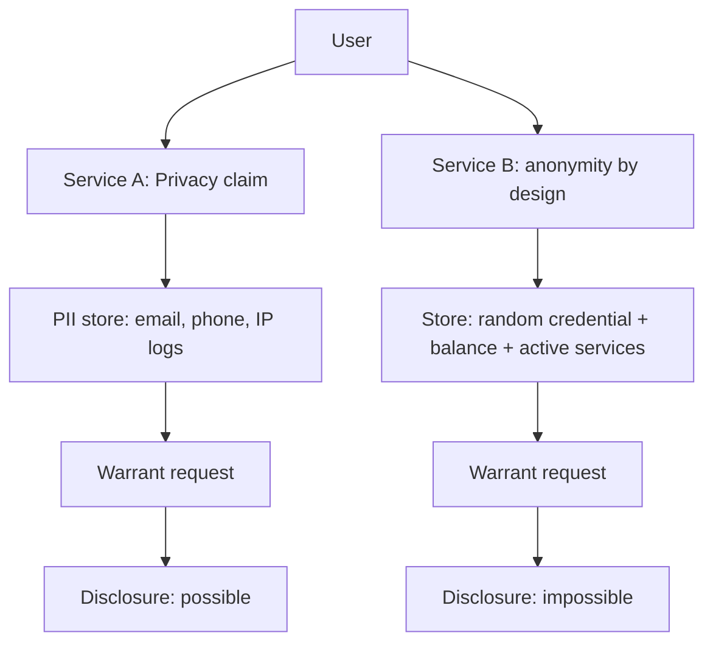

## 개요: “보호하겠다”는 약속과 “배신할 수 없다”는 구조

Servury의 글 제목은 자극적이지만, 아키텍트에게 중요한 질문을 던집니다. **프라이버시는 선언(약관·정책·홍보문)으로 말할 수 있지만, 익명성은 시스템이 데이터를 “애초에 만들지 않도록” 설계해야만 성립한다**는 주장입니다. 원문처럼 “이메일로 비밀번호를 재설정할 수 있다면 나는 당신이 누구인지 안다… IP를 기록하면 어디 있는지도 안다”는 순간부터 익명성은 구조적으로 깨집니다. ([Servury 원문](https://servury.com/blog/privacy-is-marketing-anonymity-is-architecture/))

이 글은 **“운영자가 협조하고 싶어도 협조할 수 없게 만드는 설계”**를 어디까지 구현할 수 있는지, 그리고 어떤 비용을 치르는지(관측가능성·결제·지원·남용 대응)까지 개발자·아키텍트 관점에서 정리합니다. 논의의 출발점은 GeekNews(Hada) 토론 요약입니다. ([Hada 토픽](https://news.hada.io/topic?id=25220))

**추천 대상**: 보안·프라이버시 정책을 설계하는 엔지니어, 데이터 최소화와 운영 요구사항 사이 트레이드오프를 고민하는 아키텍트, VPN·익명 서비스 설계에 관심 있는 개발자.

---

## 용어 정리: Privacy / Anonymity / Pseudonymity

아키텍처 논의에서 혼동이 잦은 지점을 먼저 구분합니다.

| 용어 | 정의 | 설계 함의 |
|------|------|-----------|
| **Privacy(프라이버시)** | 맡긴 데이터가 “허가된 범위”에서만 쓰이도록 통제하는 것. **데이터 보유**를 전제로 함(암호화, 접근통제, 정책, 감사 등). | “보호를 잘하면 된다”는 식의 주장이 가능. |
| **Anonymity(익명성)** | 특정 행동/리소스를 **특정 개인 신원과 연결하기 어렵게** 만드는 것. 강한 익명성은 **데이터 비보유**로 귀결되는 경우가 많음. | “연결할 데이터가 존재하지 않게” 만들어야 함. |
| **Pseudonymity(가명성)** | 실명은 아니지만 일관된 정체성(계정, 핸들, 지갑 주소 등)을 쓰는 것. 익명처럼 보이지만 상관관계 분석에 취약. | 가명은 식별자로 남을 수 있음. |

**정리**: 프라이버시는 “보호하겠다”는 약속으로 말할 수 있지만, 익명성은 “저장하지 않는다”는 **데이터 흐름·스키마 결정**으로만 달성할 수 있습니다.

---

## “Privacy Theater”가 만들어지는 설계 패턴

Servury가 “performance art”라고 부른 부분은, 많은 서비스가 **프라이버시를 말하면서도 식별자를 시스템 곳곳에 누적**시키는 전형적 패턴입니다. ([Servury 원문](https://servury.com/blog/privacy-is-marketing-anonymity-is-architecture/))

### 누적되는 식별 벡터

- **이메일 기반 계정/복구**: 편의 기능(비밀번호 재설정)이 곧 **식별 가능성**이 됨.
- **전화 인증/신분증(KYC)**: 남용 방지·결제 리스크 관리라는 이름으로 **강한 실명 연결**을 주입.
- **IP/디바이스 지문/행동 로그**: “운영·보안” 목적의 관측 데이터가 **사실상 사용자 모델**이 됨.

이 패턴의 문제는 “악의”가 아니라 **“보유” 자체**입니다. 데이터는 유출될 수도 있고, 요청될 수도 있고, 내부자가 오용할 수도 있습니다. “가지고 있지 않으면 유출될 수도 없다”는 표현은 기술적으로 직설적이지만, 위협 모델 관점에서는 정직한 원칙입니다.

---

## 익명성은 ‘정책’이 아니라 ‘데이터 흐름’을 바꾸는 일

익명성을 요구하면 설계는 다음 질문으로 수렴합니다.

> “우리가 **운영을 지속**하려면 반드시 저장해야 하는 데이터는 무엇인가?”

Servury는 이 답을 매우 공격적으로 잡았습니다: **32자 랜덤 자격증명, 잔액, 활성 서비스 목록**만 저장하고 나머지는 저장하지 않는다는 선택입니다. ([Servury 원문](https://servury.com/blog/privacy-is-marketing-anonymity-is-architecture/))

### 핵심 트레이드오프: 계정 복구의 부재

익명성 설계는 종종 “불친절함”으로 나타납니다.

- “비밀번호를 잊어버렸어요”에 대해 **복구를 제공하지 않는다**.
- 지원팀이 “결제 영수증/가입 시간/IP”로 소유권을 확인하는 절차도 **애초에 존재하지 않는다**.

이것은 UX 이슈가 아니라, 설계 목표(식별 불가능성)를 지키기 위해 **공격면을 의도적으로 폐쇄**하는 결정입니다. Servury는 “우리가 당신을 모른다”로 요약합니다. ([Servury 원문](https://servury.com/blog/privacy-is-marketing-anonymity-is-architecture/))

---

## 케이스 스터디: Mullvad의 “데이터가 존재하지 않았다”

Servury 글에서 자주 인용되는 일화는 Mullvad VPN 사례입니다.

- **2023년 4월**: 스웨덴 경찰이 영장을 들고 Gothenburg의 Mullvad 사무실을 방문, 고객 데이터를 담은 컴퓨터 압수를 시도했으나 **“아무것도 가져가지 못했고 고객 정보도 얻지 못했다”**고 Mullvad가 공식 블로그에서 밝힘. ([Mullvad 2023-04-20](https://mullvad.net/ko/blog/2023/4/20/mullvad-vpn-was-subject-to-a-search-warrant-customer-data-not-compromised))
- **이후**: Mullvad는 관련 문서/프로토콜을 요청했고, 스웨덴 당국의 답변 및 배경(독일과의 국제 사법 공조 등)을 추가로 공유함. ([Mullvad 2023-05-02](https://mullvad.net/en/blog/update-the-swedish-authorities-answered-our-protocol-request))

아키텍트 관점에서 중요한 포인트는 도덕성이나 “거부”가 아니라, **컴플라이언스가 “가능/불가능”으로 갈리는 경계가 설계에서 결정**된다는 점입니다. Mullvad는 무작위 16자리 계정 번호만으로 인증하며, 이메일·이름·연결 로그를 저장하지 않기 때문에, 압수해도 줄 데이터가 없었습니다.

---

## 다이어그램: “보유하는 서비스” vs “비보유하는 서비스”의 강제집행 차이

아래 다이어그램은 **“연결 가능한 데이터(PII/로그)를 만들 것인가, 말 것인가”**라는 설계 결정을 한눈에 보여줍니다.

```mermaid
flowchart TB
  User["User"] --> SvcPrivacy["Service A: Privacy claim"]
  SvcPrivacy --> PiiStore["PII store: email, phone, IP logs"]
  PiiStore --> WarrantA["Warrant request"]
  WarrantA --> DiscloseA["Disclosure: possible"]

  User --> SvcAnon["Service B: anonymity by design"]
  SvcAnon --> MinimalStore["Store: random credential + balance + active services"]
  MinimalStore --> WarrantB["Warrant request"]
  WarrantB --> DiscloseB["Disclosure: impossible"]
```

단순화된 비교이지만, **데이터를 보유하는 서비스**는 영장·요청 시 제공이 가능하고, **최소 데이터만 보유하는 서비스**는 구조적으로 제공할 수 없음을 나타냅니다.

---

## “익명성 서비스를 만들고 싶다”는 팀이 부딪히는 현실

Hada 댓글의 실무적 문제제기가 유효합니다: 인프라/서비스 운영에는 보통 로그·메트릭·트레이스가 필수이고, 남용 대응도 필요합니다. ([Hada 토픽](https://news.hada.io/topic?id=25220))

### 익명성과 충돌하는 요구사항

| 요구사항 | 충돌 내용 |
|----------|------------|
| **관측가능성(Observability)** | 장애/보안 대응을 위해 남기는 데이터가 식별자로 변질될 수 있음. |
| **남용/어뷰징 대응** | 계정 단위 제재가 어려우면 네트워크 단(레이트 리밋, 자원 할당, 결제/크레딧 모델)로 밀려남. |
| **결제/환불/분쟁 처리** | 전통 결제는 거래가 곧 실명 연결이 됨. 암호화폐도 “완전한 익명”은 아님. |
| **고객지원** | “복구 불가”를 UX로 설득해야 하거나, 아예 제공하지 않는다는 철학을 명확히 해야 함. |

즉, “익명성”은 기능 하나가 아니라 **비즈니스·운영·법무·보안이 공유하는 위협 모델**입니다.

---

## 아키텍트 체크리스트: ‘선의’가 아니라 ‘구조’로 보호하기

다음 질문에 “예”라고 답할수록, 프라이버시 선언이 아니라 **익명성 설계**에 가까워집니다.

1. **데이터 최소화**: “이 데이터가 없으면 서비스가 정말 불가능한가?”를 문서로 설명할 수 있는가?
2. **복구 트레이드오프**: 계정 복구를 제공한다면, 그로 인해 저장되는 신원 벡터를 명시했는가?
3. **로그의 비식별화**: 운영 로그가 사용자 정체성과 결합될 경로(키/세션/이메일/IP 고정)를 차단했는가?
4. **강제집행/내부자 위협**: “요청이 들어오면 줄 수밖에 없는 데이터”가 무엇인지 시스템적으로 파악했는가?
5. **정직한 커뮤니케이션**: “익명성 ≠ 면책/보안/투명성”을 제품 문서에 명확히 써두었는가? (Servury도 이 구분을 강조합니다.) ([Servury 원문](https://servury.com/blog/privacy-is-marketing-anonymity-is-architecture/))

---

## 결론: 프라이버시는 주장이고, 익명성은 비용이 드는 결정이다

“프라이버시는 데이터를 보호하겠다는 약속, 익명성은 애초에 데이터를 가지지 않는 상태”라는 Servury의 문장은 과격하지만, 아키텍트에게는 좋은 체크포인트입니다. ([Servury 원문](https://servury.com/blog/privacy-is-marketing-anonymity-is-architecture/))

익명성을 원한다면, 제품은 더 불편해지고 운영은 더 어려워집니다. 그 비용은 단순한 불편함이 아니라, **배신이 어려운 구조를 사는 비용**일 수 있습니다.

**한 줄 요약**: 프라이버시는 약관과 마케팅으로 말할 수 있지만, 익명성은 “저장하지 않는다”는 데이터 설계로만 실현된다.

---

## 참고 문헌

1. [Servury, *Privacy is Marketing. Anonymity is Architecture.*](https://servury.com/blog/privacy-is-marketing-anonymity-is-architecture/)
2. [GeekNews(Hada), 이제 사생활 보호는 아무 의미가 없고, 익명성이 중요해졌다 (토론)](https://news.hada.io/topic?id=25220)
3. [Mullvad, *Mullvad VPN was subject to a search warrant. Customer data not compromised.* (2023-04-20)](https://mullvad.net/ko/blog/2023/4/20/mullvad-vpn-was-subject-to-a-search-warrant-customer-data-not-compromised)
4. [Mullvad, *Update: The Swedish authorities answered our protocol request.* (2023-05-02)](https://mullvad.net/en/blog/update-the-swedish-authorities-answered-our-protocol-request)
