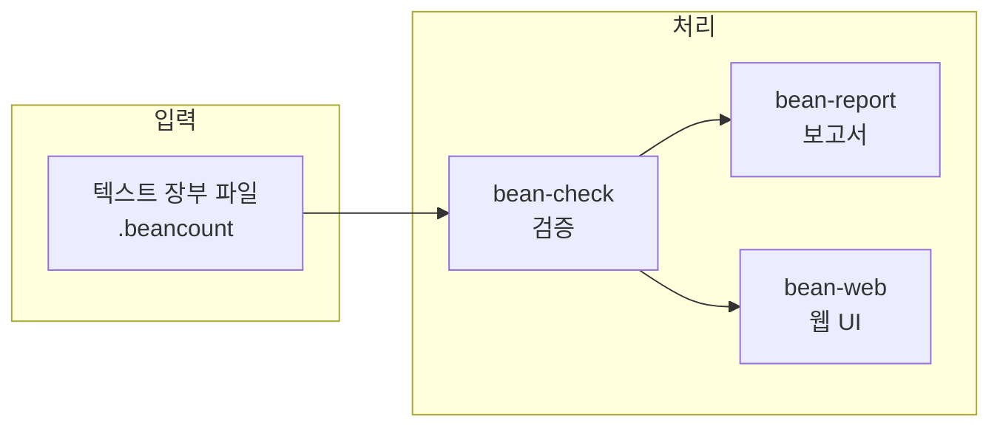
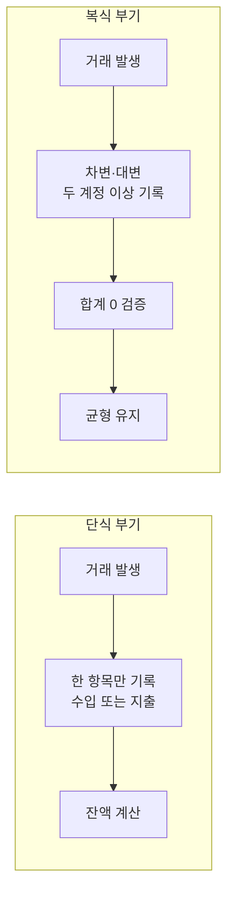
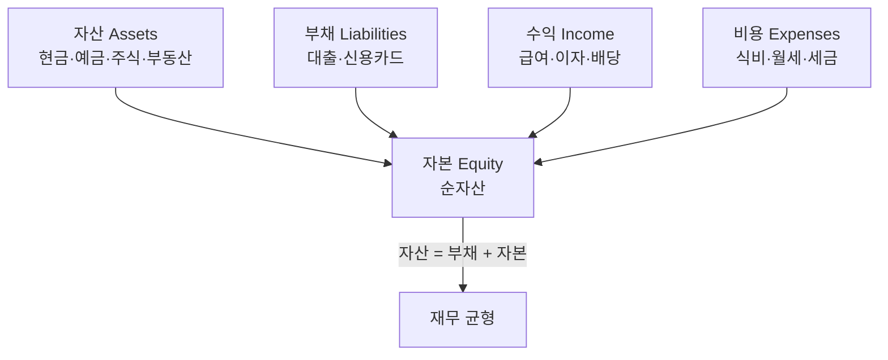

## 개요

[Beancount](https://github.com/beancount/beancount)는 텍스트 파일을 사용하여 재무 거래를 기록하고 관리하는 **복식 부기(Double-Entry Bookkeeping)** 시스템입니다. Martin Blais가 개발한 이 오픈소스 프로젝트는 2007년부터 이어져 왔으며, GitHub에서 5,000개 이상의 스타를 받은 실사용자 중심의 회계 솔루션입니다.

전통적인 회계 소프트웨어가 GUI와 데이터베이스에 의존하는 반면, Beancount는 **"코드로서의 회계(Accounting as Code)"** 철학을 따릅니다. 소프트웨어 개발자처럼 재무 데이터를 Git으로 버전 관리하고, 텍스트 편집기·CLI·스크립트로 자동화할 수 있습니다. Python으로 작성된 Beancount는 장부 기록을 넘어 강력한 보고 기능, 데이터 검증, 자동화된 거래 입력, 확장 가능한 플러그인 시스템을 제공하며, 개인 재무 관리·소규모 비즈니스 회계·투자 포트폴리오 추적까지 다양한 용도로 쓰입니다.

**이 포스트에서 다루는 내용:** Beancount 소개, 단식·복식 부기 개념, 5가지 계정 유형, 주요 기능, 설치·기본 사용법, 생태계·확장 도구, 다른 도구와의 비교, 학습 리소스, 참고 문헌.

---

## Beancount란 무엇인가?

Beancount는 금융 거래를 **텍스트 파일로 정의하는 도메인 언어**입니다. 메모리에 로드한 뒤 재무 보고서를 생성하고, 웹 인터페이스로 시각화할 수 있습니다. 전문 회계 지식이 없어도 개인 재무를 체계적으로 관리할 수 있는 도구입니다.



---

## 회계의 기본 개념: 단식 부기 vs 복식 부기

Beancount를 이해하려면 **단식 부기**와 **복식 부기**의 차이를 알아두는 것이 좋습니다.

### 단식 부기(Single-Entry Bookkeeping)

한 번에 한 방향(수입 또는 지출)만 기록하는 방식으로, 일상적인 가계부·현금 출납부에 가깝습니다.

**특징:**

- 각 거래를 한 번만 기록 (수입 또는 지출)
- 현금 입출만 추적
- 가계부, 간단한 현금장이 대표 예

**예시:**

```
날짜        내역             금액
2026-01-10  급여 입금       +3,000,000원
2026-01-15  식료품 구매      -150,000원
2026-01-20  월세 지불       -1,200,000원
잔액: 1,650,000원
```

**장점:** 이해하기 쉽고 기록이 빠르며, 소규모 개인 재무에 적합합니다.  
**단점:** 자산·부채·자본 관계를 보기 어렵고, 오류 검증이 힘들며 복잡한 거래 표현에 한계가 있습니다.

### 복식 부기(Double-Entry Bookkeeping)

15세기 이탈리아에서 정립된 방식으로, 현대 회계의 기본입니다. Beancount는 이 원칙을 따릅니다.

**핵심 원칙:**

- 모든 거래는 **최소 두 개의 계정**에 동시에 반영된다.
- **차변(Debit)**과 **대변(Credit)**의 합은 항상 0(균형)이다.
- "돈이 어디서 왔고, 어디로 갔는지"를 명확히 추적한다.

**같은 거래를 복식 부기로 기록한 예:**

```
# 급여 입금: 은행 계좌 증가, 급여 수입 발생
2026-01-10 급여
  Assets:Bank:Checking    +3,000,000원  (차변: 자산 증가)
  Income:Salary           -3,000,000원  (대변: 수입 발생)
  합계: 0원 (균형)

# 식료품 구매: 은행 계좌 감소, 식료품 비용 발생
2026-01-15 식료품
  Expenses:Groceries      +150,000원   (차변: 비용 발생)
  Assets:Bank:Checking    -150,000원   (대변: 자산 감소)
  합계: 0원 (균형)
```

**장점:** 자산·부채·자본·수익·비용을 한 번에 파악할 수 있고, 균형 검증으로 오류를 잡기 쉬우며, 재무제표·세금·감사에 적합합니다. **단점:** 학습 곡선과 초기 설정 비용이 있습니다.



### 5가지 기본 계정 유형

복식 부기에서는 모든 계정을 다음 다섯 가지 유형으로 구분합니다.

| 유형 | 의미 | Beancount 예시 |
|------|------|----------------|
| **자산(Assets)** | 소유한 것 | `Assets:Bank:Checking`, `Assets:Investments:Stocks` |
| **부채(Liabilities)** | 갚아야 할 것 | `Liabilities:CreditCard`, `Liabilities:Mortgage` |
| **자본(Equity)** | 순자산(자산 − 부채) | `Equity:OpeningBalances` |
| **수익(Income)** | 들어오는 돈 | `Income:Salary`, `Income:Dividends` |
| **비용(Expenses)** | 나가는 돈 | `Expenses:Rent`, `Expenses:Groceries` |



### 회계 등식

복식 부기의 핵심은 아래 등식이 항상 성립한다는 것입니다.

- **자산(Assets) = 부채(Liabilities) + 자본(Equity)**
- 확장하면: **자산 = 부채 + 자본 + (수익 − 비용)**

Beancount는 이 균형이 맞는지 자동으로 검증하며, 맞지 않으면 오류를 보고합니다.

### Beancount가 복식 부기를 쓰는 이유

1. **정확성**: 자동 균형 검증으로 입력 오류를 빠르게 발견  
2. **완전성**: 재무 상태의 전체 그림 파악  
3. **전문성**: 실제 기업 회계와 동일한 원칙  
4. **확장성**: 가계부 수준부터 복잡한 포트폴리오까지  
5. **보고서**: 대차대조표·손익계산서 등 재무제표 자동 생성  

---

## 주요 특징

### 1. 텍스트 기반 데이터 관리

모든 재무 데이터를 **평문(plain text)** 파일로 저장합니다.

- **버전 관리**: Git 등으로 변경 이력 추적
- **영구 보존**: 특정 벤더·소프트웨어에 종속되지 않음
- **편집 자유**: 원하는 에디터로 편집 가능
- **검색·자동화**: grep, sed, 스크립트로 처리 용이

### 2. 자동 균형 검증 및 오류 감지

- 모든 거래의 차변·대변 합계가 0인지 검증
- 계정 유형·날짜 순서·계정 개설·통화 일관성 검증
- 오류 발생 시 위치와 원인을 명확히 안내

### 3. 보고 기능

- 잔액 조회(Balance Sheet), 손익 계산(Income Statement), 현금 흐름표(Cash Flow)
- 계정별 거래 내역(Journal), 순자산 추이, 투자 포트폴리오 현황

### 4. 웹 인터페이스

내장 웹 서버로 대시보드·차트·계정별 내역·문서 첨부 등을 브라우저에서 확인할 수 있습니다.

---

## 왜 텍스트 기반 회계인가?

- **데이터 소유권**: Excel·상용 소프트웨어와 달리 사용자가 데이터를 완전히 소유하고, 평문으로 보관합니다.  
- **프로그래머 친화**: 스크립트로 반복 거래 자동화, 명세서 파싱, Python API로 커스텀 분석·테스트 주도 회계가 가능합니다.  
- **투명성·감사**: 모든 거래가 명시적으로 기록되고, 버전 관리로 변경 이력이 남아 세금·감사 시 유리합니다.

---

## 버전 정보

| 버전 | 상태 | 비고 |
|------|------|------|
| **Version 3** | 현재 안정 버전 | 2024년 6월부터 공식 안정. v2에서 핵심만 유지하고 많은 도구는 독립 프로젝트로 분리. 신규 사용자는 v3 사용 권장. |
| **Version 2** | 유지보수 종료 | 2020~2024년 유지보수 모드, 현재 업데이트 없음. 새 문법·제약 도입. |
| **Version 1** | 구버전 | 2013년 개발 중단. Ledger와 부분 호환 설계. |

---

## Beancount 파일 예제

```beancount
; 계정 정의
2026-01-01 open Assets:Checking:MyBank
2026-01-01 open Income:Salary
2026-01-01 open Expenses:Groceries
2026-01-01 open Expenses:Rent

; 초기 잔액
2026-01-01 * "Initial balance"
  Assets:Checking:MyBank    1000.00 USD

; 급여 입금
2026-01-15 * "January salary"
  Assets:Checking:MyBank    3000.00 USD
  Income:Salary            -3000.00 USD

; 식료품 구매
2026-01-20 * "Grocery shopping" "SuperMart"
  Expenses:Groceries         150.00 USD
  Assets:Checking:MyBank    -150.00 USD

; 월세 지불
2026-01-25 * "Monthly rent"
  Expenses:Rent             1200.00 USD
  Assets:Checking:MyBank   -1200.00 USD
```

- **계정 개설**: `open` 디렉티브로 계정 생성  
- **거래**: 날짜, 상태(`*`), 설명, 계정별 금액  
- **복식 부기**: 각 거래의 차변·대변 합계는 0

---

## 설치 방법

### pip 설치

```bash
pip install beancount
```

### 소스에서 빌드

```bash
git clone https://github.com/beancount/beancount.git
cd beancount
pip install .
```

### 기본 사용법

```bash
# 파일 검증
bean-check myfinances.beancount

# 잔액 조회
bean-report myfinances.beancount balances

# 웹 인터페이스 실행
bean-web myfinances.beancount
```

---

## 생태계와 확장 도구

| 분류 | 도구 | 설명 |
|------|------|------|
| 가져오기 | beancount-import, smart_importer, plaid2beancount | 은행·카드 명세 자동 가져오기, ML 분류, Plaid 연동 |
| 시각화 | **fava**, beancount-web, beancount-mobile | 웹 UI(가장 인기), 공식 웹, 모바일 앱 |
| 분석 | beancount-reds-importers, beancount-interpolate, beancount-portfolio | 다양한 금융기관 지원, 정기 거래 자동 생성, 포트폴리오 분석 |

---

## 사용 사례

- **개인 재무**: 일상 수입·지출, 예산·지출 분석, 세금 자료 준비, 재무 목표 추적  
- **투자**: 주식·채권·펀드 추적, 포트폴리오 성과·배당·이자 기록, 자본 이득 세금 계산  
- **소규모 비즈니스**: 사업 수입·지출, 청구서·부가세, 재무제표 생성  

---

## 다른 도구와의 비교

| 도구 | 특징 |
|------|------|
| **Ledger** | Beancount의 영감. Beancount는 더 엄격한 문법·명확한 오류 메시지·Python 생태계 활용. |
| **hledger** | Haskell 기반 Ledger 재구현. 비슷한 목표, 다른 문법·철학. |
| **GnuCash, Quicken** | GUI·데이터베이스 중심. Beancount는 텍스트·CLI·자동화·커스터마이징에 강점. |

---

## 학습 리소스

- [Beancount 공식 문서](https://beancount.github.io/docs/) — 설치·문법·쿼리·요리책·예제 등 전체 매뉴얼  
- [Beancount GitHub 저장소](https://github.com/beancount/beancount) — 소스코드·이슈·기여  
- 공식 문서 내 튜토리얼·예제 장부로 실습 후, fava 등으로 웹에서 확인하는 흐름을 권장합니다.

---

## 라이선스 및 기여

Beancount는 **GNU GPLv2** 오픈소스입니다. GitHub에서 버그 리포트·기능 제안·풀 리퀘스트로 기여할 수 있으며, Martin Blais는 Wise·PayPal 후원을 받고 있습니다.

---

## 시작하기 요약

1. [공식 문서](https://beancount.github.io/docs/)로 기본 개념·문법 학습  
2. 예제 장부 파일로 `bean-check`, `bean-report`, `bean-web` 실습  
3. 자신만의 `.beancount` 파일을 만들고 간단한 거래부터 기록  
4. fava 등 웹 UI로 시각화·검증  
5. 반복 작업은 스크립트·가져오기 도구로 자동화  

---

## 결론

Beancount는 **개인 재무를 코드처럼 관리**하고 싶은 사람에게 잘 맞는 도구입니다. 텍스트 기반이라 처음엔 낯설 수 있지만, 익숙해지면 데이터 소유권·버전 관리·확장성 측면에서 매우 강력한 재무 시스템을 만들 수 있습니다. 프로그래머라면 한 번쯤 시도해볼 만한 가치가 있습니다.

---

## 참고 문헌

1. Beancount Documentation. *Beancount User's Manual.* https://beancount.github.io/docs/  
2. Beancount. *Double-Entry Accounting from Text Files.* GitHub. https://github.com/beancount/beancount  
3. Beancount. *Getting Started with Beancount.* https://beancount.github.io/docs/getting_started_with_beancount.html  
4. Beancount. *The Double-Entry Counting Method.* https://beancount.github.io/docs/the_double_entry_counting_method.html  
5. Beancount. *A Comparison of Beancount and Ledger & HLedger.* https://beancount.github.io/docs/a_comparison_of_beancount_and_ledger_hledger.html  
