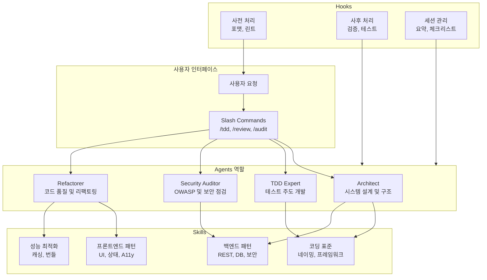

GitHub에는 수많은 개발 도구와 설정이 공유되지만, **Claude Code**를 단순 채팅 인터페이스가 아니라 **역할 기반 에이전트·자동화 워크플로**로 쓰고 싶다면 검토할 만한 저장소가 있다. **[everything-claude-code](https://github.com/affaan-m/everything-claude-code)**는 Anthropic 해커톤 우승자 Affaan Mustafa가 10개월간 실사용하며 다듬은 `.claude` 설정 모음으로, Context Rot 방지, TDD·보안·리팩토링 워크플로 자동화, 슬래시 명령어 기반 빠른 실행을 한 번에 구성할 수 있게 해 준다. 이 글에서는 이 설정 모음의 개요, 아키텍처, 적용 기준, 장단점을 정리하고 참고 문헌을 제시한다.

## 개요: 도구 정보와 추천 대상

**everything-claude-code**는 Claude Code(및 Cursor·Codex·Opencode 등 호환 환경)를 위한 **포괄적인 에이전트 하네스(agent harness)** 설정 시스템이다. 단순 프롬프트 모음이 아니라, **Skills(스킬)·Instincts(본능)·Memory(기억)·Security(보안)·Research-first 개발**을 하나의 체계로 묶어, 대화가 길어져도 초기 의도와 프로젝트 규칙을 유지하고 반복 설명을 줄이는 데 초점을 둔다.

제작자 Affaan Mustafa는 Anthropic 해커톤 우승 경력이 있으며, 10개월간 실제 프로젝트에 적용하며 검증한 설정을 공개했다. 공식 저장소 설명에 따르면 *"The agent harness performance optimization system"*으로, Claude Code를 그대로 쓰는 것보다 **일관된 코딩 스타일·아키텍처·보안·테스트**를 자동으로 유도하는 환경을 만드는 것이 목표다.

**추천 대상:** 팀 단위로 코딩 컨벤션과 아키텍처 일관성을 유지하고 싶은 개발팀, TDD·보안 감사·리팩토링을 AI와 함께 체계적으로 하고 싶은 실무자, Context Rot·AI 기억상실을 줄이고 장기 대화에서도 품질을 유지하고 싶은 Claude Code·Cursor 사용자.

## 아키텍처: Agents · Skills · Hooks · Slash Commands

설정집은 **Agents(역할별 에이전트)** · **Skills(재사용 워크플로)** · **Hooks(자동 트리거)** · **Slash Commands(빠른 실행)** 네 축으로 구성된다. 사용자 요청이 들어오면 슬래시 명령어나 에이전트 선택에 따라 해당 에이전트가 적용되고, 필요한 스킬이 로드되며, 훅이 사전·사후 처리로 자동 실행된다. 아래 다이어그램은 이 관계를 요약한다.

- **Agents:** 특정 역할에 최적화된 서브 에이전트. Architect는 시스템 설계·확장성, TDD Expert는 테스트 우선 사고, Security Auditor는 OWASP 등 보안 규칙, Refactorer는 코드 품질·기술 부채 해소에 집중한다.
- **Skills:** 프로젝트별 코딩 표준, 백엔드·프론트엔드 패턴, 성능 최적화 등 재사용 가능한 워크플로를 모듈화해 필요 시에만 로드한다.
- **Hooks:** 도구 실행 전후·세션 종료 시 자동으로 돌아가는 트리거로, 포맷·린트·검증·테스트·요약 리포트를 반복 수동 작업 없이 수행한다.
- **Slash Commands:** `/tdd`, `/review`, `/audit`, `/refactor`, `/test` 등 복잡한 워크플로를 한 번에 실행하는 진입점이다.

## 주요 기능 상세

### 1. Agents(에이전트) — 역할 기반 AI 전문가

전문 역할을 수행하는 서브 에이전트가 정의되어 있어, 작업 유형에 맞는 행동을 유도한다.

- **Architect:** 시스템 설계 및 구조 검토, 확장성·모듈화를 고려한 제안.
- **TDD Expert:** [테스트 주도 개발(Test-Driven Development)](https://martinfowler.com/bliki/TestDrivenDevelopment.html) 워크플로 전담. 테스트 우선 사고와 Red–Green–Refactor 사이클을 유지하도록 유도한다.
- **Security Auditor:** 코드 보안 취약점 점검, OWASP 등 보안 규칙 적용으로 일반적인 취약점을 조기에 차단한다.
- **Refactorer:** 코드 품질·가독성·구조 개선, 기술 부채 해소에 초점을 둔다.

각 에이전트는 독립적인 관점에서 작업을 분석해 품질을 높인다. 한 대화 안에서 여러 에이전트를 조합해 사용할 수도 있다.

### 2. Skills(스킬) — 재사용 가능한 워크플로

재사용 가능한 워크플로를 모듈로 정의해, 필요할 때만 불러와 사용한다.

- **코딩 표준:** 프로젝트의 라이브러리, 프레임워크, 네이밍 컨벤션 정의.
- **백엔드 패턴:** REST API, 데이터베이스 설계, 인증·보안 모범 사례.
- **프론트엔드 패턴:** UI 컴포넌트 구조, 상태 관리, 접근성(A11y) 규칙.
- **성능 최적화:** 캐싱 전략, 렌더링 최적화, 번들 크기 제어.

스킬을 프로젝트·팀 규칙에 맞게 수정하면, 에이전트가 그 규칙을 일관되게 따르게 된다.

### 3. Hooks(훅) — 자동화된 트리거

특정 이벤트 전후로 자동 실행되는 스크립트다.

- **사전 처리:** 도구 실행 전 자동 포맷팅, 린트 검사.
- **사후 처리:** 빌드 완료 후 자동 검증, 테스트 실행.
- **세션 관리:** 세션 종료 시 작업 요약·체크리스트 생성.
- **에러 처리:** 빌드 에러 발생 시 자동 분석 및 해결 제안 트리거.

반복적인 수동 단계를 줄이고, 워크플로를 예측 가능하게 만든다.

### 4. Slash Commands(슬래시 명령어) — 빠른 실행

복잡한 워크플로를 짧은 명령어로 실행한다.

- `/tdd`: TDD 워크플로 시작.
- `/review`: 전체 코드 리뷰 수행.
- `/audit`: 보안 감사 실행.
- `/refactor`: 코드 리팩토링 제안.
- `/test`: 테스트 스위트 작성.

내부적으로 적절한 에이전트와 스킬 조합이 선택되어 실행된다.

## 왜 사용해야 할까? — 실제 이점

Claude Code를 기본 설정으로만 쓰는 것도 유용하지만, everything-claude-code를 적용하면 **경험 많은 시니어와 페어 프로그래밍하는 듯한** 구조를 만들 수 있다.

- **일관성 유지:** 프로젝트 전반에서 코딩 스타일·네이밍·아키텍처 패턴이 유지되어, 코드 리뷰 시간이 줄고 기술 부채가 덜 쌓인다.
- **생산성 향상:** 매번 같은 컨텍스트를 설명하지 않아도 되어, 개발자는 핵심 로직과 문제 해결에 집중할 수 있다. 초기 설정 비용은 있으나 장기적으로 효율이 높다.
- **보안 강화:** 보안 검토가 워크플로에 녹아 들어가 OWASP 등 규칙이 자동으로 적용되고, 흔한 취약점이 초기 단계에서 걸러진다.
- **코드 품질:** 자동화된 리팩토링·테스트 생성·문서화로 품질이 일정 수준 이상 유지된다.
- **팀 협업:** 명확한 규칙과 패턴이 있어 팀원이 예상 가능한 방식으로 코드를 작성·검토할 수 있다.

## 적용 시나리오와 판단 기준

**적합한 경우:** 팀 또는 개인이 코딩 컨벤션·아키텍처·보안·테스트를 일관되게 유지하고 싶을 때, 장기 대화에서 Context Rot를 줄이고 싶을 때, TDD·리팩토링·보안 감사를 AI와 함께 체계적으로 돌리고 싶을 때. Claude Code·Cursor·Codex·Opencode 등 호환 환경을 쓰는 경우에 그대로 적용할 수 있다.

**부적합하거나 주의할 경우:** 매우 작은 1회성 스크립트만 다루는 경우에는 설정 비용 대비 이득이 작을 수 있다. 레거시 규칙이 팀 규칙과 다르다면 스킬·에이전트를 먼저 팀 규칙에 맞게 수정한 뒤 도입하는 것이 좋다. 또한 훅·자동화가 너무 많으면 빌드·테스트 시간이 늘어날 수 있으므로, 필요한 훅만 선택해 사용하는 것을 권한다.

**적용 체크리스트:** (1) 저장소를 클론하거나 설정 파일을 참고해 프로젝트에 맞게 Agents·Skills·Hooks를 커스터마이징했는가, (2) 작은 규모 작업으로 먼저 테스트해 보았는가, (3) 팀에 공유할 경우 문서와 온보딩을 준비했는가.

## 장단점과 종합 평가

**장점**

- Context Rot·AI 기억상실을 줄이는 구조로, 긴 대화에서도 초기 의도와 프로젝트 규칙을 유지하기 쉽다.
- TDD·보안·리팩토링이 워크플로에 통합되어, 품질과 보안을 반복적으로 강화할 수 있다.
- 슬래시 명령어로 복잡한 워크플로를 한 번에 실행할 수 있어 학습 곡선을 낮추고 생산성을 높인다.
- 오픈소스이며 GitHub에서 활발히 유지·보완되고 있어, 팀이 포크해 자체 규칙으로 확장하기 좋다.

**단점**

- 초기 설정·커스터마이징에 시간이 든다. 팀 규칙이 명확하지 않으면 스킬 정의부터 정리해야 한다.
- 훅·자동화가 많을수록 빌드·테스트 시간이 늘어날 수 있어, 필요한 것만 선택해 쓸 필요가 있다.
- Claude Code 및 호환 환경에 의존하므로, 다른 AI 코딩 도구로 옮길 때는 설정을 다시 짜야 할 수 있다.

**한 줄 평:** Claude Code를 팀 단위로 일관된 에이전트처럼 쓰고 싶다면, everything-claude-code로 Agents·Skills·Hooks·Slash Commands를 한 번 구성해 두고, 프로젝트 규칙에 맞게 다듬어 쓰는 구성을 권한다.

## 시작하기

공식 GitHub 저장소에서 설치·구성 가이드를 제공한다. 기본 단계는 다음과 같다.

1. **저장소 클론:** 레포지토리를 프로젝트에 클론하거나, 설정 파일을 참고해 자체 `.claude` 구성을 작성한다.
2. **커스터마이징:** 팀의 코딩 표준과 요구사항에 맞게 Agents·Skills·Hooks를 수정한다.
3. **테스트:** 작은 규모 작업으로 슬래시 명령어·에이전트·훅을 실제로 돌려 본다.
4. **통합:** 팀 전체가 사용하도록 문서를 정리하고 점진적으로 확대한다.

더 많은 사용 예시와 고급 설정은 공식 저장소에서 확인할 수 있다.

**[👉 affaan-m/everything-claude-code 바로가기](https://github.com/affaan-m/everything-claude-code)**

## 참고 문헌

1. [affaan-m/everything-claude-code — GitHub](https://github.com/affaan-m/everything-claude-code): 공식 저장소, 설치·구성·Slash Commands·Agents·Skills·Hooks 설명.
2. [OWASP Top Ten Web Application Security Risks — OWASP Foundation](https://owasp.org/www-project-top-ten/): Security Auditor 에이전트에서 참조할 수 있는 웹 애플리케이션 보안 표준.
3. [Test Driven Development — Martin Fowler](https://martinfowler.com/bliki/TestDrivenDevelopment.html): TDD Expert 에이전트의 Red–Green–Refactor 워크플로 이해를 위한 참고.

위 자료를 바탕으로 everything-claude-code를 도입·튜닝해 보시고, 팀의 코딩 품질과 보안·생산성에 맞게 조정해 보시기를 권한다.
