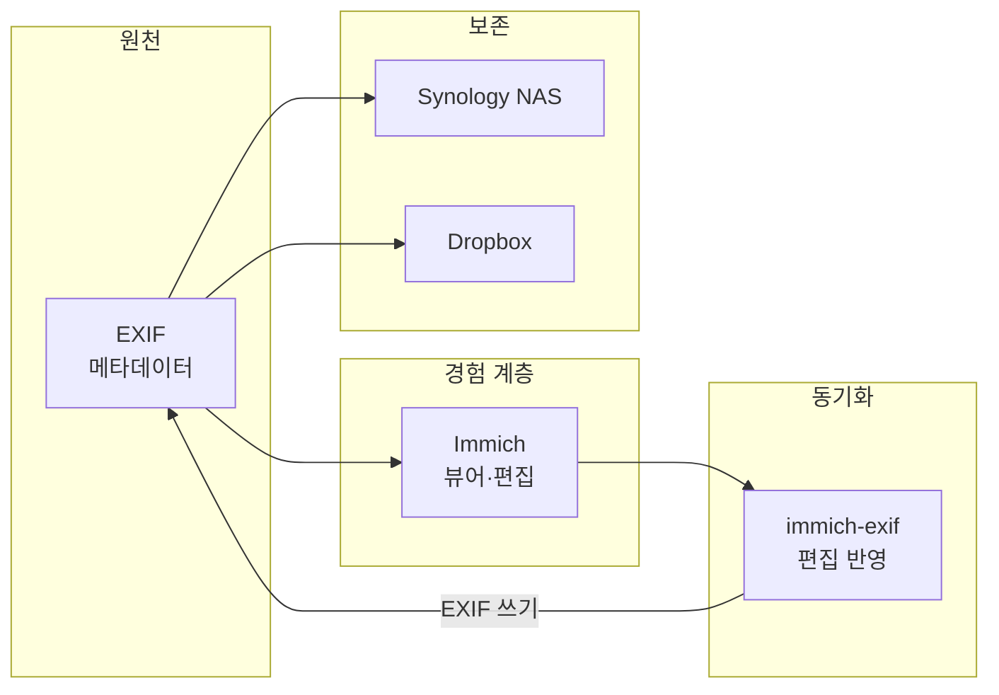

## 개요

Immich를 써 본 이라면 “구글 포토 같은 **발견(추억/검색)** 경험을, 내 서버에서 다시 얻고 싶다”는 욕심이 생긴다. 그런데 진짜 어려운 문제는 뷰어가 아니라 **장기 보존**이다. 앱이 바뀌고, DB 스키마가 바뀌고, 서비스가 사라져도 내 사진 라이브러리가 *수십 년 뒤에도* 그대로 살아있게 하려면, 무엇을 기준(원천)으로 삼을지부터 결정해야 한다.

Jaisen Mathai의 글 **[My Ridiculously Robust Photo Management System (Immich Edition)](https://jaisenmathai.com/articles/my-ridiculously-robust-photo-management-system-immich-edition/)** 은 이 고민을 공격적으로 해결한 사례다. 핵심은 한 줄로 요약된다.

- Immich에서 만든 변경(앨범/설명/위치/시간/즐겨찾기)을 **사진 파일의 EXIF에 저장**하고
- 그 결과물을 **Synology NAS + Dropbox**로 자동 백업해
- “앱/DB가 바뀌어도 살아남는 라이브러리”를 만든다

**추천 대상**: 셀프호스팅 Immich 사용자, EXIF/메타데이터를 파일에 남기고 싶은 이, 3-2-1 백업으로 장기 보존을 설계하려는 이.

아래에서는 이 글의 아이디어를 소개하고, Immich 공식 문서의 제약(특히 External Libraries의 메타데이터 보존)과 백업 포인트까지 함께 정리한다.

---

## 워크플로 전체 구조

Jaisen의 시스템은 “경험 → 통합 → 보존” 순으로 설계된다. 메타데이터는 EXIF를 원천으로 하며, Immich는 뷰어·편집 경험 계층이고, 최종 아티팩트는 NAS·Dropbox로 백업된다.

---

## 이 워크플로의 목표: Experience / Unify / Preserve

Jaisen은 자신의 사진 관리 철학을 다음 세 가지로 정리한다(중요도 순).

| 우선순위 | 키워드 | 의미 |
|---------|--------|------|
| 1 | **Experience** | 사진과 비디오가 “다시 그 순간을 살게” 만드는 발견 경험이 있어야 한다 |
| 2 | **Unify** | 부부(여러 기기)의 사진이 단일 라이브러리로 합쳐져야 한다 |
| 3 | **Preserve** | 수십 년 단위로 미래에도 유지되는 구조여야 한다 |

“Preserve”를 진짜로 밀어붙이면, 자연스럽게 **메타데이터를 어디에 저장할 것인가?** 로 귀결된다.

---

## DB 없이도 살아남는 메타데이터: EXIF를 원천으로 삼기

이 글의 가장 강한 주장(그리고 가장 논쟁적인 선택)은 다음과 같다.

- 앨범/설명/즐겨찾기 같은 정리 정보까지 포함해, 사진과 비디오의 메타데이터를 **외부 DB가 아니라 EXIF에만 의존**해야 오래 간다.

Jaisen은 10년 넘게 운영해 온 CLI 도구 **Elodie**를 “캐노니컬 오거나이저(canonical organizer)”로 두고, EXIF 기반으로 파일 시스템에 라이브러리를 ‘구체화(materialize)’하는 방식을 유지해 왔다. Elodie는 [GitHub: jmathai/elodie](https://github.com/jmathai/elodie)에서 공개되어 있으며, EXIF만으로 폴더 구조와 메타데이터를 일관되게 유지하는 데 쓰인다.

---

## Immich를 선택한 결정적 이유: External Libraries

Jaisen이 2025년 말 Immich를 본격 검토하게 된 계기는 **External Libraries**였다.

- 기존 폴더(예: NAS의 사진 폴더)를 Immich에 “외부 라이브러리”로 연결하면, Immich가 스캔해서 타임라인에 자산을 올린다.
- 중요하게도, 해당 경로를 **read-only(`:ro`)로 마운트**할 수 있다. 즉, “내 원본은 건드리지 마”가 가능하다.

Immich 공식 문서([External Libraries](https://docs.immich.app/features/libraries/))도 같은 맥락을 설명한다. 스캔을 통해 디스크의 파일을 자산으로 등록하고, 지도 보기/앨범 추가 등 일반 자산처럼 동작한다.

---

## External Libraries의 “치명적인” 한계

여기서 중요한 함정이 하나 있다. Immich 문서가 명확하게 경고하듯이:

- External Libraries의 자산에 대해 Immich에서 앨범 추가/설명 수정 등 메타데이터를 바꾸면,
  - 그 메타데이터는 **Immich 내부(PostgreSQL)에만 저장**되고
  - **원본 파일(외부 자산 파일)에 영속 저장되지 않는다.**
  - 파일을 외부에서 이동시키면(경로가 바뀌면) Immich는 새 자산으로 간주해, 기존 메타데이터가 리스캔 시점에 유실될 수 있다.

즉, “파일이 진짜 원천(source of truth)이고, Immich는 뷰어/경험 계층”이라는 철학을 유지하려면, **Immich에서 한 편집을 다시 파일 쪽(EXIF)으로 되돌려야** 한다.

---

## Jaisen의 해법: immich-exif 플러그인(편집을 EXIF로 되돌리기)

Jaisen은 이 지점을 해결하기 위해 Immich 편집 내용을 EXIF에 저장하는 방향으로 시스템을 확장했다.

- Immich는 기본적으로 변경을 Postgres DB에 저장한다(필요 시 [XMP sidecar](https://docs.immich.app/features/xmp-sidecars/)도 다룰 수 있음).
- Jaisen은 sidecar가 “너무 번거롭다”는 이유로, **메타데이터를 사진 파일에 임베드(embedded)** 하는 방식을 원했다.
- 그래서 자신이 쓰는 플러그인을 정리해 **`immich-exif`** 라는 더 단순한 버전을 공개했다.

참고: [jmathai/immich-exif](https://github.com/jmathai/immich-exif) — Immich의 변경 사항을 EXIF에 다시 쓰는 컨테이너형 플러그인.

---

## 운영에서 부딪히는 현실: “파일 이동 = 삭제 + 새로 생성” 문제

Elodie가 EXIF를 업데이트하면서 파일을 앨범 폴더로 **이동**시키는 방식은, Immich 입장에서는 다음과 같이 보인다.

- 원래 있던 경로의 파일이 사라짐 → **삭제로 인식**
- 새 경로에 새로운 파일이 생김 → **새 자산으로 인식**

이 문제는 External Libraries를 쓰는 많은 워크플로에서 반복해서 등장한다. Jaisen은 이를 **eventual consistency(최종적 일관성)** 접근으로 풀었다고 설명한다. 즉, “변경은 저장해 두고, 시간이 지나면 결국 원하는 상태로 수렴하게 한다”는 방식이다.

기술적 상세는 원문 범위를 벗어난다고 했지만, 진행 상황과 코드는 [Elodie 이슈 #496](https://github.com/jmathai/elodie/issues/496)에서 추적할 수 있다.

---

## 백업 관점에서 이 글이 더 유용한 이유

이 워크플로가 “robust”한 이유는 편집/정리뿐 아니라, **백업 전략**이 같이 붙기 때문이다.

Immich 공식 문서([Backup and Restore](https://docs.immich.app/administration/backup-and-restore/))는 백업을 다음처럼 정리한다.

- **3-2-1 백업**을 권장한다.
- Immich의 자동 DB 덤프는 `UPLOAD_LOCATION/backups`에 생기지만, **사진/영상 파일은 포함하지 않고 메타데이터만** 담는다.
- 종합 백업을 위해서는 **DB + 업로드/라이브러리 파일(`UPLOAD_LOCATION`)** 둘 다를 백업해야 한다.

Jaisen의 TL;DR 역시 “Immich를 통해 바꾼 내용이 EXIF에 들어가고, Synology NAS와 Dropbox로 자동 백업된다”는 점을 강조한다. 앱 레벨의 편집 경험을 누리면서도 “파일이 살아남는” 방향으로 백업을 맞춘 셈이다.

---

## 도입 시 점검할 질문들(체크리스트)

이 글을 읽고 바로 따라 하려면, 아래 질문에 답해 보는 것이 좋다.

1. **원천(source of truth)**  
   “DB가 원천”인가, “파일(EXIF)이 원천”인가?
2. **External Libraries 전략**  
   원본을 `:ro`로 마운트해서 Immich가 절대 수정/삭제하지 못하게 할 것인가?
3. **메타데이터 보존**  
   Immich 내부에만 저장되는 메타데이터(앨범/설명)가 리스캔/이동에 의해 날아가도 괜찮은가?  
   - 괜찮지 않다면: EXIF 임베드 vs XMP sidecar 중 어떤 방식으로 영속화할 것인가?
4. **백업**  
   Immich DB + `UPLOAD_LOCATION`(자산/생성물) + 외부 라이브러리 원본 폴더까지 포함해 3-2-1로 가져갈 것인가?

---

## 참고 문헌

1. Jaisen Mathai, **My Ridiculously Robust Photo Management System (Immich Edition)**, [jaisenmathai.com](https://jaisenmathai.com/articles/my-ridiculously-robust-photo-management-system-immich-edition/)
2. Immich, **External Libraries**, [docs.immich.app/features/libraries/](https://docs.immich.app/features/libraries/)
3. Immich, **Backup and Restore**, [docs.immich.app/administration/backup-and-restore/](https://docs.immich.app/administration/backup-and-restore/)
4. jmathai/immich-exif, **Write changes from Immich back to EXIF**, [github.com/jmathai/immich-exif](https://github.com/jmathai/immich-exif)
5. jmathai/elodie, **EXIF-based photo assistant and organizer**, [github.com/jmathai/elodie](https://github.com/jmathai/elodie)
