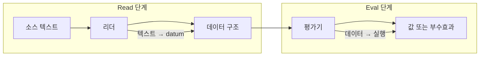
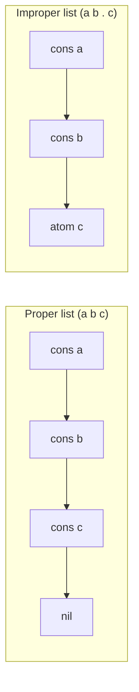

## 개요

S-expression(S-표현식)은 "Lisp의 괄호 문법"으로 흔히 소개되지만, 실제로는 **데이터의 외부 표현(external representation)** 이자, 많은 Lisp 계열 언어에서 **리더(reader)** 가 입력 텍스트를 데이터 구조로 바꾸는 **문법 규칙 전체**를 가리킵니다. S-expression을 제대로 이해하면 다음 질문들이 한 번에 정리됩니다.

- 왜 `(f x y)` 형태가 함수 호출로 해석되는가
- 왜 `(a . b)` 같은 점표기(dotted pair)가 존재하는가
- 왜 `'x`가 단순한 "문법 설탕"이 아니라 **코드=데이터**의 관문인가
- Scheme·Common Lisp·Clojure에서 "같아 보이지만 다른" reader 문법 차이는 무엇인가

이 포스트에서는 **고전적 정의 → 핵심 문법 치트시트 → 언어별 reader 차이 → read vs eval 구분 → 실전 팁** 순으로 S-expression 문법을 체계적으로 정리합니다.

---

## S-expression의 고전적 정의(원형)

John McCarthy의 1960년 논문 *Recursive Functions of Symbolic Expressions and Their Computation by Machine* 에서 S-expression은 다음 두 가지로 정의됩니다.

1. **Atom(원자)**: 원자 심볼은 S-expression이다.
2. **Ordered pair(순서쌍)**: \(e_1\)과 \(e_2\)가 S-expression이면 \((e_1 \cdot e_2)\)도 S-expression이다.

오늘날 우리가 쓰는 **리스트 표기**는, 이 순서쌍(cons cell)을 연쇄로 이어 붙인 **약식 표기**에 해당합니다. 즉 리스트는 "순서쌍의 특수한 나열"로 정의됩니다.

---

## Read와 Eval 파이프라인

S-expression을 문법으로 볼 때 헷갈림의 대부분은 **읽기(read)** 와 **평가(eval)** 를 섞어서 생각하는 데서 옵니다. 다음 구분을 명확히 두는 것이 중요합니다.

- **read**: 소스 텍스트 → 데이터 구조(리스트·심볼·숫자·문자열 등)
- **eval**: 데이터 구조 → 실행/값(언어의 평가 규칙에 따름)

즉 `(f x y)`는 **read 단계**에서는 그저 "세 원소를 가진 리스트"이고, **eval 단계**에서 비로소 "첫 원소를 연산자로 보고 나머지를 인자로 평가"하는 규칙이 적용됩니다(언어별 예외와 확장 존재).



---

## 핵심 문법 치트시트

아래는 "무엇이 S-expression(데이터)으로 **읽히는가**"에 초점을 둔 치트시트입니다. 평가/실행 규칙은 언어마다 더 다양하므로, 여기서는 **리더가 만들어 내는 데이터 형태**만 정리합니다.

### 1) Atom(원자)

- **심볼**: `foo`, `+`, `map`, `my-namespace/foo` (언어별 허용 문자·네임스페이스 규칙 상이)
- **숫자**: `42`, `3.14`
- **문자열**: `"hello"`

### 2) List(리스트)

괄호로 둘러싼 형태는 대부분 "리스트"로 읽힙니다.

```lisp
(a b c)
```

### 3) Dotted pair / Improper list(점표기, 비정상 리스트)

S-expression을 "순서쌍"으로 본다면 가장 원형에 가까운 표기는 점표기입니다.

```lisp
(a . b)
```

리스트는 cons의 연쇄이며, **proper list**는 마지막 cdr이 `nil`(또는 해당 언어의 빈 리스트)인 형태입니다. 언어마다 빈 리스트·`nil` 취급이 조금씩 다릅니다.

```lisp
(a b c)      ; (a . (b . (c . nil))) 의 약식
(a b . c)    ; (a . (b . c)) : 마지막이 nil이 아니므로 improper list
```

점표기는 **데이터 구조를 정확히 표현**할 때(예: `(key . value)` 같은 연관쌍) 특히 중요합니다. "약식이 어떻게 풀리는지"를 `cons`로 보면 직관이 생깁니다.

```lisp
; (a b c)
(cons 'a (cons 'b (cons 'c nil)))

; (a . b)
(cons 'a 'b)
```

**리스트와 dotted pair의 구조 차이**를 도식하면 다음과 같습니다.



### 4) Quote: `'x`가 의미하는 것

대부분의 Lisp 계열에서 `'exp`는 아래의 약식입니다.

```lisp
'x        ; (quote x)
'(a b c)  ; (quote (a b c))
```

즉 **리더 단계**에서 이미 `'`는 **리더 매크로(reader macro)** 로 동작해, 입력을 `(quote ...)` 형태의 데이터로 바꿉니다. "평가하지 말고 그대로 두라"는 지시가 데이터 구조로 들어가는 셈입니다.

### 5) Quasiquote / Backquote + Unquote(+ Splicing)

quote가 "그대로 두기"라면, quasiquote(backquote)는 "템플릿에 일부만 평가 값을 끼워 넣기"에 가깝습니다.

**Scheme·Common Lisp 계열** (표기: `` ` ``, `,`, `,@`) 예:

```lisp
`(a b ,x)     ; x를 평가해서 그 값이 들어감
`(a ,@xs b)   ; xs(리스트/시퀀스)를 풀어서(splice) 여러 원소로 삽입
```

**Clojure**는 같은 개념을 다른 기호로 씁니다 (표기: `` ` ``, `~`, `~@`).

```clojure
`(a ~x ~@xs)
```

---

## 언어별 reader 문법 차이

S-expression 자체는 개념이지만, 실제로는 각 언어의 **reader**를 만나게 됩니다. "비슷해 보이지만 다르다"는 지점을 요약합니다.

### Scheme (R5RS): datum / read syntax

Scheme 표준 문서는 "입력 문자열을 datum으로 읽는 규칙"을 문법으로 정의합니다. 리스트·dotted pair·quote·quasiquote가 **읽기 단계**에서 어떻게 해석되는지 확인하기 좋습니다.

- dotted pair: `(a . b)`
- quote: `'x`
- quasiquote: `` `(...) `` + `,` / `,@`

예:

```scheme
`(a ,x ,@xs)
```

### Common Lisp: reader macro characters

Common Lisp의 reader는 표준 macro character가 풍부합니다. 특히 `.`(점표기), `'`(quote), `` ` ``(backquote), `,`/`,@`(unquote/splicing)이 "입력 → 데이터" 변환을 규정합니다. backquote는 구현에 따라 내부적으로 `append`·`list`·`cons` 조합으로 변환되며, **리더가 특정한 데이터(코드)를 만들어 준다**는 점이 중요합니다. 또한 **readtable**을 통해 "어떤 문자가 어떤 방식으로 읽히는지"를 커스터마이즈할 수 있어, DSL·언어 제작에서 reader 단계가 특히 강력합니다.

### Clojure: S-expression + 추가 리터럴

Clojure는 리스트 기반 표현을 쓰지만, reader 레벨에서 다음 리터럴을 기본 제공합니다.

- **vector**: `[1 2 3]`
- **map**: `{:a 1 :b 2}`
- **keyword**: `:user/id`

syntax-quote(백틱)는 단순 quote보다 강해, 네임스페이스 자동 수식(qualification) 등 **매크로 작성에 유리한** 규칙이 있습니다. 즉 "S-expression을 읽는다"는 동일한 출발점 위에, 언어가 리더 규칙을 더 얹은 사례입니다.

```clojure
'(a b c)      ; (quote (a b c))
`(a ~x ~@xs)  ; syntax-quote + unquote / unquote-splicing
```

---

## 같은 표기, 다른 의미: 빈 리스트와 nil/false

reader 문법이 비슷해도, "빈 리스트·거짓·없음"의 **의미론**은 언어마다 다릅니다.

| 언어 | 빈 리스트 / 거짓 |
|------|------------------|
| **Common Lisp** | `NIL`은 빈 리스트이면서 거짓 |
| **Scheme** | `'()`(빈 리스트)와 `#f`(거짓) 분리 |
| **Clojure** | `nil`과 `false` 분리, 빈 컬렉션은 truthy |

---

## 실전 팁: 자주 하는 실수 6가지

1. **리더 vs 평가 혼동**: `(1 2 3)`은 "리스트로 읽히지만", 평가 단계에서는 (언어에 따라) 함수 호출 규칙으로 해석될 수 있다.
2. **Dotted list는 구조를 바꾼다**: `(a b . c)`는 `(a b c)`와 **완전히 다른** 자료구조다.
3. **공백은 토큰 경계**: `foo-bar`는 심볼 하나, `foo - bar`는 토큰 세 개다.
4. **Quote 없으면 심볼이 '값'으로 해석된다**: `(a b)`에서 `a`가 함수/연산자로 평가되는 계열이 많다.
5. **Quasiquote 중첩 깊이**: quasiquote 안에서 unquote가 언제 해석되는지는 중첩 규칙이 있다(매크로 작성 시 특히 주의).
6. **언어별 literal 확장**: Clojure의 벡터·맵·키워드처럼, "괄호만이 전부"가 아닌 언어가 많다.

---

## 요약: read vs eval이 문법 이해의 열쇠

S-expression을 "문법"으로 볼 때 가장 중요한 구분은 **read**와 **eval**입니다.

- **read**: 텍스트 → 데이터 구조 (리스트·심볼·숫자·문자열·…)
- **eval**: 데이터 구조 → 실행/값 (언어의 평가 규칙에 따름)

`(f x y)`는 read 단계에서는 그저 "리스트"이고, eval 단계에서 비로소 "첫 원소를 연산자로 보고 나머지를 인자로 평가"하는 규칙이 적용됩니다. 이 구분을 명확히 두면 dotted pair·quote·quasiquote·언어별 차이까지 한 번에 정리할 수 있습니다.

---

## 참고 자료

- [Recursive Functions of Symbolic Expressions and Their Computation by Machine (Part I)](https://www-formal.stanford.edu/jmc/recursive/node3.html) — John McCarthy (1960), S-expression 원형 정의.
- [Revised(5) Scheme — Syntax](https://people.csail.mit.edu/jaffer/r5rs/Syntax.html) — Scheme R5RS datum/read syntax.
- [Common Lisp HyperSpec — Section 2.4.6 Backquote](https://www.lispworks.com/documentation/HyperSpec/Body/02_df.htm) — CL reader macro, backquote 규격.
- [Clojure — The Reader](https://clojure.org/reference/reader) — Clojure reader forms, syntax-quote, 리터럴.
