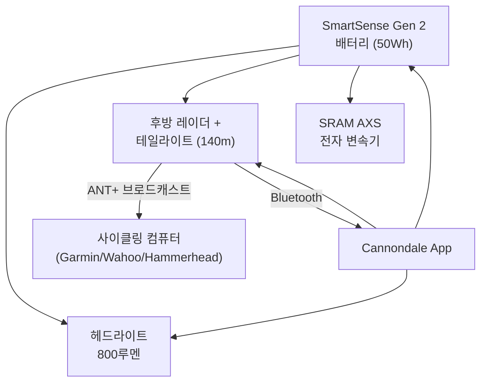

로드 사이클링은 짜릿한 경험을 선사하지만, 동시에 자동차·트럭·오토바이와 도로를 공유해야 하는 현실도 존재한다. Cannondale은 2022년 세계 최초로 완전 통합형 연결 시스템인 **SmartSense**를 선보이며 이 문제에 정면으로 대응했다. 그리고 2025 Synapse Carbon 출시와 함께 **SmartSense Gen 2**로 한 단계 더 진화했다. 이 글에서는 Gen 2의 핵심 구성요소와 Gen 1 대비 개선점, 그리고 실전 활용 가이드까지 상세히 살펴본다.



## SmartSense란 무엇인가

SmartSense는 온바이크 조명(전·후방), 후방 레이더, 센서, 스마트폰 앱이 유기적으로 연결된 캐논데일 고유의 에코시스템이다. 단순한 액세서리 모음이 아니라, **단일 배터리**가 모든 구성요소에 전력을 공급하는 완전 통합 시스템이라는 점이 차별점이다. 라이더의 가시성을 높이고 도로 상황 인지 능력을 강화해 매 라이딩마다 더 큰 자신감을 부여한다.

Gen 1은 2022년 등장해 혁신적인 개념을 제시했지만, 헤드유닛 크기나 배터리 용량 면에서 개선 여지가 있었다. Gen 2는 그 기반 위에 실질적인 성능 도약을 이루었다.

## SmartSense Gen 2 핵심 구성요소

### 헤드라이트 — 크기는 절반, 밝기는 두 배

Gen 2 헤드라이트는 **크기가 Gen 1의 절반**으로 줄어들었음에도 **800루멘**(StVZO 버전은 400루멘)을 출력한다. 이는 Gen 1 대비 두 배 이상 밝은 수치다. 스템 아래에 은밀하게 마운트되어 핸들바 주변을 깔끔하게 유지한다. 주간 플래시 모드부터 야간 고출력 모드까지 다양한 조명 패턴을 지원한다.

### 후방 레이더 + 테일라이트 — 단일 유닛으로 통합

Gen 2의 가장 눈에 띄는 변화 중 하나는 후방 레이더와 테일라이트가 **하나의 컴팩트한 유닛**으로 통합되었다는 점이다. 새들 아래 높은 위치에 장착되어 최적의 가시성을 확보한다.

- **감지 거리:** 최대 **140미터** 후방 차량 감지
- **React to Radar:** 차량이 접근하면 조명 밝기와 플래시 패턴이 자동으로 고가시성 모드로 전환 (StVZO 버전은 밝기 조절만 가능)
- Gen 1에서 따로 존재하던 "덩치 큰" 두 개의 유닛이 하나로 합쳐져 공기역학적으로도 유리해졌다

### 배터리 — 단일 전원으로 모든 것을 해결

Gen 2 배터리는 시스템의 핵심이다.

| 항목 | Gen 1 | Gen 2 |
|---|---|---|
| 배터리 용량 | ~20 Wh | **50 Wh** |
| 플래시 모드 런타임 | 제한적 | **24시간 이상** |
| 정속 모드 런타임 | — | **12시간 이상** |
| 설치 위치 | 외장 | StashPort 내장 |
| USB-C 충전 지원 | — | **지원** |
| 외부 기기 충전 | — | **지원** |
| SRAM AXS 변속 지원 | — | **지원** |

배터리는 프레임의 **StashPort** 안에 깔끔하게 수납된다. StashPort 도어를 열면 자동으로 내부 조명이 켜져 — 마치 자동차 글로브박스처럼 — 배터리를 쉽게 찾을 수 있다. 배터리를 분리하면 독립적인 **손전등**으로도 활용 가능하다. USB-C 포트를 통해 스마트폰이나 사이클링 컴퓨터를 충전하는 보조배터리 기능도 제공한다.

> **배터리 충전 시간:** 완전 방전 상태에서 20W 이상 충전기 사용 시 약 **2.5시간**

## Gen 1 vs Gen 2 전면 비교

| 항목 | SmartSense Gen 1 | SmartSense Gen 2 |
|---|---|---|
| 헤드라이트 크기 | 기준 | 절반 |
| 헤드라이트 밝기 | ~350루멘 | **800루멘** (International) |
| 레이더 + 테일라이트 | 별도 2개 유닛 | **단일 통합 유닛** |
| 후방 감지 거리 | 제한적 | **140m** |
| 배터리 용량 | ~20 Wh | **50 Wh** |
| 최대 런타임 | ~3시간 충전기준 | **24시간 (플래시 모드)** |
| 배터리 위치 | 외부 노출 | **StashPort 내장** |
| USB-C 방전 (기기 충전) | 불가 | **가능** |
| SRAM AXS 지원 | 불가 | **가능** |
| Garmin Power Mount 지원 | 불가 | **가능** (별도 부품 필요) |
| 호환 자전거 | 1세대 SmartSense 탑재 모델 | **2025 Synapse Carbon 등** |

> Gen 1과 Gen 2 구성요소는 **상호 호환되지 않는다**. 업그레이드 시 전체 시스템 교체가 필요하다.

## 라이트 모드 상세

SmartSense Gen 2는 지역 규정에 따라 두 가지 라이트 설정을 제공한다.

### International 모드

| 모드 | 헤드라이트 | 테일라이트 | 예상 배터리 수명 |
|---|---|---|---|
| 1 | 플래시 저출력 | 주간 플래시 | **24시간 이상** |
| 2 | 정속 저출력 | 정속 고출력 | 14시간 |
| 3 | 플래시 중출력 | 펠로톤 (정속 저전력) | 19시간 |
| 4 | 정속 고출력 | 야간 플래시 | 4시간 |

### StVZO 모드 (유럽 규정 준수)

| 모드 | 헤드라이트 | 테일라이트 | 예상 배터리 수명 |
|---|---|---|---|
| 1 | 정속 저출력 | 정속 고출력 | 15시간 |
| 2 | 꺼짐 | 정속 고출력 | 24시간 이상 |
| 3 | 정속 고출력 | 정속 고출력 | 8시간 |
| 4 | 꺼짐 | 정속 고출력 | 24시간 이상 |

> StVZO 버전은 유럽 도로 규정상 깜빡임(플래시) 모드가 금지되어 있다. 플래시 모드를 원한다면 International 버전 헤드라이트와 테일라이트 교체가 필요하다.

모드 변경은 테일라이트의 버튼을 짧게 눌러 순환하거나, Cannondale 앱에서 직접 선택할 수 있다.

## 레이더 시스템과 헤드유닛 연동

### Cannondale 앱 연동

앱의 **라이드 스크린**에서 접근 차량이 실시간으로 표시되며, 스피커 또는 블루투스 이어폰을 통해 오디오 경보를 받을 수 있다. 앱에서 Start Ride를 누르면 레이더가 활성화된다.

### 사이클링 컴퓨터(헤드유닛) 연동

SmartSense Gen 2는 **ANT+** 프로토콜로 브로드캐스트하며, 컴퓨터에서 **Garmin eRTL61x**로 인식된다. Garmin, Wahoo, Hammerhead 등 주요 헤드유닛과 호환된다.

- 레이더 정보, 배터리 잔량, 테일라이트 모드를 헤드유닛에서 직접 확인 가능
- 기존 Garmin Varia 레이더와 동일한 방식으로 설정

### 레이더 알림 색상 체계

| 색상 | 의미 |
|---|---|
| 녹색 | 후방 차량 없음 |
| 황색(앰버) | 차량 접근 중 |
| 빨간색 | 차량 고속 접근 |
| 빨간색 (차량 없을 때) | 장치 오류 |

## Cannondale 앱 활용 가이드

Cannondale 앱은 SmartSense의 두뇌 역할을 한다.

```
iOS: App Store → "Cannondale" 검색
Android: Google Play → "Cannondale" 검색
```

### 주요 기능

- **Auto Wake:** 휠 센서가 움직임을 감지하면 SmartSense가 자동 켜진다. 5분 이상 정차 시 자동 꺼짐
- **Deep Sleep:** 장기 비사용 시 배터리 방전 방지. 기본값 14일, 앱에서 커스터마이즈 가능
- **조명 커스터마이즈:** 밝기, 플래시 패턴, 각 모드 설정 세부 조정
- **배터리 잔량:** 앱에서 정확한 % 단위 확인 (배터리 LED는 4단계 색상 표시)
- **펌웨어 업데이트:** 앱을 통해 시스템 펌웨어 최신 상태 유지

### 배터리 잔량 LED 색상

| LED 색상 | 배터리 잔량 |
|---|---|
| 녹색 | 61% ~ 100% |
| 노란색 | 31% ~ 60% |
| 빨간색 | 6% ~ 30% |
| 빨간색 1초 간격 점멸 | 0% ~ 5% |

### 페어링 방법

1. Cannondale 앱 최신 버전으로 업데이트
2. Garage > Add Bike > Add Using Device 선택
3. 레이더의 버튼을 7초간 눌러 **페어링 모드** 진입 (상태 LED가 보라색으로 점멸)
4. 앱에서 SmartSense 장치 선택 후 안내에 따라 페어링 완료

## 2025 Synapse Carbon — SmartSense Gen 2 탑재 플래그십

SmartSense Gen 2의 첫 탑재 모델은 **2025 Cannondale Synapse Carbon**이다. BikeRadar는 이 자전거에 5/5점을 부여하며 "엔듀런스 바이크의 새로운 황금 기준"으로 평가했다.

- **프레임:** 에어로 설계, 42mm 타이어 클리어런스, StashPort 다운튜브 수납
- **구동계:** SRAM Force AXS 2x 무선 전자 변속 (SmartSense 배터리로 통합 전원 공급)
- **휠:** Reserve 42|49 Turbulent Aero 카본 휠 + DT Swiss 370 허브
- **가격:** $8,199 (USD) / £7,250 (GBP)

SmartSense Gen 2 배터리 하나가 조명, 레이더, SRAM AXS 변속기 모두에 전력을 공급한다는 점은 케이블 관리와 충전 루틴을 극적으로 단순화한다.

## 주요 Q&A

**Q. SmartSense Gen 1 부품을 Gen 2 자전거에 쓸 수 있나?**
> 불가하다. Gen 1과 Gen 2는 구성요소가 상호 의존적이며 서로 다른 자전거 모델에 대응한다.

**Q. 배터리가 방전되면 전자 변속이 멈추나?**
> 아니다. 배터리 잔량이 낮아지면 시스템이 자동으로 조명과 레이더를 끄고 변속 기능을 마지막까지 보호한다. 앱에서 이 기준 배터리 퍼센트를 직접 설정할 수 있다. SmartSense 배터리는 SRAM AXS 배터리 용량의 약 20배이므로, 5%도 완충 AXS 배터리에 해당한다.

**Q. 그룹 라이딩 시 조명이 너무 밝다는 불만이 있다면?**
> 앱 또는 테일라이트 버튼으로 모드를 변경할 수 있다. 모드 3의 "펠로톤" 후방 조명 설정을 활용하면 그룹 라이딩에 적합한 낮은 광도로 주행할 수 있다.

**Q. 새들백과 테일라이트가 간섭되면?**
> StashPort와 StashBag이 기본 제공되므로 공구와 비상 장비 대부분을 다운튜브에 수납할 수 있다. 새들백이 꼭 필요하다면 GoPro 스타일 연장 암을 이용해 테일라이트 위치를 조정하면 된다.

**Q. Garmin Edge Power Mount로 사이클링 컴퓨터를 충전할 수 있나?**
> 가능하다. 다만 공인 캐논데일 딜러를 통해 Higo Extension Cable 800mm(K7520380)와 SmartSense Gen 2 Splitter(K75005) 두 가지 부품 추가 설치가 필요하다.

## 아키텍처 다이어그램



## 정리

SmartSense Gen 2는 단순한 업그레이드가 아니다. 배터리 용량 2.5배 증가, 헤드라이트 밝기 2배 이상 향상, 레이더와 테일라이트의 단일 유닛 통합, SRAM AXS 변속 지원까지 — 모든 면에서 실질적인 진보를 이루었다. 특히 단일 배터리로 조명·레이더·전자 변속기를 모두 커버하는 개념은 라이딩 루틴을 근본적으로 단순화한다.

안전에 민감한 사이클리스트라면, SmartSense Gen 2가 탑재된 Synapse Carbon은 현재 시장에서 가장 통합적인 안전 솔루션을 갖춘 엔듀런스 바이크라 할 수 있다.

## 참고 자료

- [Cannondale SmartSense 공식 기술 페이지](https://www.cannondale.com/en/technology/smartsense)
- [Getting Started with SmartSense Gen 2 — Cannondale 지원 센터](https://support.cannondale.com/hc/en-us/articles/31809826713623-Getting-Started-with-SmartSense-Gen-2)
- [SmartSense Gen 2 FAQ — Cannondale 지원 센터](https://support.cannondale.com/hc/en-us/articles/37120456383127-SmartSense-Gen-2-FAQ)
- [Cannondale Synapse Carbon 2 SmartSense Review — BikeRadar](https://www.bikeradar.com/reviews/bikes/road-bikes/cannondale-synapse-carbon-2-smartsense-review)
- [The Best Feature on Cannondale's Stunning New Bike — Gear Patrol](https://www.gearpatrol.com/outdoors/2025-cannondale-synapse-road-bike/)
