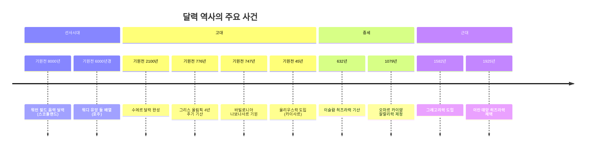

매일 아침 스마트폰을 집어 들고 날짜를 확인하는 것은 너무나 당연한 일이다. 오늘이 몇 월 며칠인지, 무슨 요일인지, 다음 주에 어떤 일정이 있는지 — 달력은 공기처럼 우리 삶에 스며들어 있어서 그 존재 자체를 의식하지 못한다. 그런데 문득 이런 생각이 든다면 어떨까. "도대체 누가, 왜, 어떻게 이 달력을 만들었을까?"

달력의 역사는 단순한 날짜 계산 이야기가 아니다. 그것은 인류가 우주의 리듬을 이해하고, 권력을 행사하고, 신을 섬기고, 농사를 짓기 위해 벌인 1만 년에 걸친 집착의 기록이다.

## 1만 년 전 동굴 벽에 새겨진 점들의 비밀

유럽 서부와 중부 곳곳의 구석기 동굴 벽화에는 동물 그림 옆에 점과 선이 이어진 수열이 반복된다. 오랫동안 학자들은 이것이 그냥 장식이라고 생각했다. 그런데 2023년 캠브리지 고고학 저널에 실린 연구는 이 점들이 달의 주기를 기록한 음력 달력이라는 주장을 제시했다. 겨울이 끝나는 시점부터 한 해를 시작하고, 동물의 짝짓기나 출산 시기를 "Y" 모양 기호로 표시한 일종의 생태 달력이라는 것이다.

스코틀랜드 애버딘셔의 워런 필드(Warren Field)에서는 더 구체적인 증거가 발견됐다. 2013년 고고학자들이 발굴한 열두 개의 구덩이와 호형 구조물은 약 기원전 8000년, 즉 지금으로부터 1만 년 전의 것으로 추정된다. 달의 위상 변화를 추적하는 이 구조물은 "세계에서 가장 오래된 달력"으로 불리게 됐다.

호주 빅토리아주에서는 원주민 워디 유앙(Wurdi Youang) 돌 배열이 1만 1000년 이상 됐을 것으로 추정된다. 그 정확도가 다소 떨어지는 것도 지구의 공전 궤도가 그 시기에 달랐기 때문이라는 분석이 나온다. 그리고 영국의 스톤헨지는 하지와 동지의 태양 방향에 맞춰 설계됐다. 돌을 쌓는 것만으로도 이미 인류는 달력을 만들고 있었던 셈이다.

> 인류는 글자를 발명하기 수천 년 전부터 달력을 만들고 있었다.

## 수메르인의 달력 고민: 달이 태양을 따라가지 않는다

기원전 2100년경 메소포타미아의 수메르인들은 최초로 **문자로 기록된 달력 체계**를 완성했다. 이들의 달력은 29~30일로 이루어진 12개의 달(月)로 구성됐고, 각 달은 초승달이 처음 보이는 날부터 시작됐다.

문제는 수학이었다. 달의 주기 12번을 더하면 354일이 된다. 그런데 태양이 하늘을 한 바퀴 도는 데는 365.242일이 걸린다. 약 11일의 차이가 매년 쌓이면, 몇십 년 후에는 "봄 축제"가 한겨울에 열리는 황당한 상황이 벌어진다. 수메르인들은 이 문제를 "윤달(intercalary month)"을 끼워 넣는 방식으로 해결했다. 그레고리력의 윤년과 같은 발상이다.

수메르 달력의 또 다른 특징은 도시마다 달의 이름이 달랐다는 것이다. 종교적 다양성 때문에 표준화가 이루어지지 않아, 서기들은 그냥 "첫 번째 달", "다섯 번째 달"이라고 쓰는 편을 택했다. 1, 2, 3···으로 달을 부른 최초의 사람들이 수메르의 관료들이었던 셈이다.

## 달력 역사의 타임라인

## 로마 달력의 탄생과 진화: 10개월에서 12개월로

### 겨울이 없었던 달력: 로물루스의 10개월 체계

기원전 753년, 전설에 따르면 로마를 건국한 초대 왕 로물루스(Romulus)가 최초의 로마 달력을 만들었다. 이 달력의 가장 기묘한 특징은 **1년이 304일**에 불과했다는 것이다. 3월(Martius)부터 12월(December)까지 10개의 달만 있었고, 겨울에 해당하는 약 61일은 아예 달력에 존재하지 않았다.

왜 겨울을 지웠을까? 로마인들의 세계에서 겨울은 농사도, 전쟁도 멈추는 "정지된 시간"이었다. 씨를 뿌릴 수도, 적을 정복할 수도 없는 계절에 굳이 이름을 붙일 이유가 없었던 것이다. 겨울은 그냥 기다리는 공백이었다.

이 10개월 달력에서 5번째부터 10번째 달은 아무 신이나 인물의 이름도 붙이지 않고 그냥 숫자로 불렀다.

| 로물루스 달력 | 의미 | 현재 달 |
|---|---|---|
| Martius | 전쟁의 신 마르스 | 3월 |
| Aprilis | "열리다(aperire)" 또는 아프로디테 | 4월 |
| Maius | 여신 마이아 | 5월 |
| Iunius | 여신 유노 | 6월 |
| **Quintilis** | 다섯 번째(quintus) | **7월** |
| **Sextilis** | 여섯 번째(sextus) | **8월** |
| **September** | 일곱 번째(septem) | **9월** |
| **October** | 여덟 번째(octo) | **10월** |
| **November** | 아홉 번째(novem) | **11월** |
| **December** | 열 번째(decem) | **12월** |

### 누마 폼필리우스: 겨울 공백을 메우다 (기원전 713년경)

2대 왕 누마 폼필리우스(Numa Pompilius)는 달력의 공백이 종교적으로도 문제가 있다고 판단했다. 신들을 섬기는 의식은 1년 내내 이어져야 했기 때문이다. 그는 겨울 공백에 두 달을 추가했다.

- **Ianuarius**: 문과 시작의 신 **야누스(Janus)**의 이름. 두 얼굴을 가진 야누스는 한 얼굴로 지나간 해를, 다른 얼굴로 새로 올 해를 바라본다. 연말에 붙인 달이었지만, 이름만큼은 "시작"을 상징했다.
- **Februarius**: 로마의 정화 의식 축제 **페브루아(Februa)**에서 유래. 새해를 맞이하기 전 몸과 마음을 씻어내는 "대청소의 달"이었다.

이렇게 12개월 체계가 완성됐지만, **새해는 여전히 3월 1일**이었다. 1월과 2월은 한 해의 마지막 두 달에 불과했다.

### 기원전 153년의 전쟁이 달력을 바꾸다

로마력에서 3월이 1월이 된 것은 심오한 철학적 결정이 아니었다. 완전히 **행정적 사고**였다.

기원전 153년, 히스파니아(지금의 스페인)에서 반란이 일어났다. 전쟁을 진압하러 가야 하는 새 집정관이 3월 1일 취임식을 기다릴 수 없었다. 급박한 상황 때문에 취임일을 **1월 1일로 앞당겼다**. 이것이 관례가 됐고, 이후 모든 집정관이 1월 1일에 취임하면서 자연스럽게 1월 1일이 새해 첫날로 굳어졌다.

이 관행은 훗날 카이사르의 달력 개혁으로 공식 확정되지만, 그 이야기는 잠시 후에 다루기로 하고 먼저 달 이름들의 유래를 살펴보자.

## 1월부터 12월까지: 신화와 황제가 새겨진 이름들

로마 달력의 변천사를 알고 나면, 각 달의 이름이 단순한 명칭이 아니라 로마 문명의 압축판임을 알 수 있다.

- **January (1월)** — 두 얼굴의 신 야누스(Janus). 과거를 돌아보는 얼굴과 미래를 내다보는 얼굴. 한 해의 경계에 서는 달에 이보다 적합한 신은 없었다.
- **February (2월)** — 정화 축제 페브루아(Februa). 누마 폼필리우스가 1월·2월을 마지막에 끼워 넣으며 남은 날수를 배분했기 때문에 가장 짧은 달이 됐다. 훗날 아우구스투스가 8월을 31일로 늘리면서 2월에서 하루를 더 빼앗아 오늘날의 28(29)일이 됐다.
- **March (3월)** — 전쟁의 신 마르스(Mars). 원래 1번째 달. 봄이 오면 전쟁 시즌이 열렸다.
- **April (4월)** — 라틴어 "열다(aperire)" 유래설이 유력. 꽃봉오리가 열리는 달. 아프로디테의 에트루리아식 발음 "아프루(Apru)"에서 왔다는 설도 있다.
- **May (5월)** — 아틀라스의 딸이자 헤르메스(메르쿠리우스)의 어머니인 여신 마이아(Maia). 또는 "연장자(maiores)"를 기리는 달이라는 설도 존재한다.
- **June (6월)** — 유피테르(Jupiter)의 아내이자 결혼·출산의 수호신 유노(Juno). 6월에 결혼하면 행복하다는 서양 전통 "June bride"가 여기서 유래했다.
- **July (7월)** — 원래 이름은 "다섯 번째 달" **퀸틸리스(Quintilis)**. 율리우스 카이사르가 암살된 기원전 44년, 로마 원로원이 그의 생일이 있는 달에 그의 이름을 붙였다. 역사상 최초로 살아있는 인간의 이름이 달에 붙여진 사례다.
- **August (8월)** — 원래 "여섯 번째 달" **섹스틸리스(Sextilis)**. 초대 황제 아우구스투스(Augustus)가 이집트를 정복하고 내전을 종식시킨 달이라 자신의 이름을 붙였다. 당시 29일이던 이 달을 7월(July, 31일)과 동등하게 맞추기 위해 2월에서 하루를 빼앗아 31일로 늘렸다. 덕분에 2월은 영구적으로 하루를 잃었다.
- **September (9월)** — 일곱 번째(septem). 실제로는 9번째.
- **October (10월)** — 여덟 번째(octo). 실제로는 10번째.
- **November (11월)** — 아홉 번째(novem). 실제로는 11번째.
- **December (12월)** — 열 번째(decem). 실제로는 12번째.

September~December의 이름과 순서 불일치는 로물루스 달력의 유산이자, 1월이 새해 첫달이 되면서 생긴 영구적인 "번호 오류"다. 수천 년이 지난 지금도 우리는 매달 이 오류를 반복하고 있다.

## 카이사르, 달력을 정치 무기로 쓰다

로마 달력이 10개월에서 12개월로, 3월 새해에서 1월 새해로 변해온 동안, 달력 자체는 점점 더 심각한 문제를 안고 있었다. 사제단이 윤달을 임의로 결정하는 권한을 정치적으로 악용하기 시작한 것이다. 자신들에게 유리한 집정관의 임기를 늘리거나, 반대파의 임기를 줄이기 위해 달력 자체를 조작했다. 기원전 46년, 율리우스 카이사르는 이집트에서 천문학자 소시게네스를 데려와 달력을 전면 개혁했다.

율리우스력의 핵심은 단순함이었다. 달의 관측에 의존하지 않고, 4년마다 하루를 더하는(윤년) 알고리즘만으로 작동하게 만들었다. 1년을 365.25일로 계산한 것이다. 기원전 45년 1월 1일, 새 달력이 공식 시행됐다.

그런데 카이사르는 개혁 직전 해인 기원전 46년을 **445일짜리 해**로 만들었다. 수십 년간 어긋난 달력을 한 번에 맞추기 위해서였다. 역사가들은 이 해를 "혼돈의 해(Year of Confusion)"라고 부른다. 로마 시민들 입장에서는 그야말로 황당한 경험이었을 것이다.

## 중세 페르시아의 천재, 0.00000X 오차로 1년의 길이를 재다

11세기 페르시아의 시인이자 수학자 오마르 카이얌(Omar Khayyam)은 오늘날 『루바이야트』로 더 유명하지만, 사실 그는 당대 최고의 천문학자이기도 했다. 셀주크 왕조의 말리크 샤(Malik-Shah)가 그를 이스파한 천문대로 초청해 달력 개혁을 맡긴 것이 1073년의 일이다.

18년간의 관측 끝에 카이얌이 산출한 1년의 길이는 **365.24219858156일**이었다. 현재 우리가 알고 있는 19세기 말 기준 1년의 길이는 365.242196일, 20세기 말 기준으로는 365.242190일이다. 카이얌의 오차는 소수점 여섯 번째 자리에서 나타난다.

더 놀라운 것은 1년의 길이 자체가 지구 공전 궤도의 변화 때문에 한 사람의 일생 동안에도 소수점 여섯 번째 자리에서 달라진다는 사실이다. 즉, 카이얌의 측정값이 "틀린" 것이 아니라 1079년 당시의 1년 길이를 정확하게 측정한 것이라는 뜻이다. 중세 페르시아에서 망원경도 없이 이런 정밀도를 달성했다는 것은 지금 봐도 경이롭다.

이렇게 만들어진 잘랄리력(Jalali calendar)은 율리우스력보다 정확하고 그레고리력에 육박하는 정밀도를 자랑한다.

## 마야의 두 달력, 52년마다 한 번 맞나요?

아메리카 대륙으로 건너가면 이야기는 한층 더 복잡해진다. 마야인들은 무려 두 개의 달력을 동시에 운영했다.

첫 번째는 **촐킨(Tzolkin), 260일 신성력**이다. 1~13의 숫자 주기와 20개의 날 이름이 맞물려 돌아간다. 이 달력은 개인의 운명 예측, 결혼·전쟁의 길일 선택, 신에 대한 제의 날짜 결정에 쓰였다. 260이라는 숫자가 어디서 왔는지는 아직도 논쟁 중이지만, 인간의 임신 기간(약 266일)과 관련이 있다는 설이 유력하다.

두 번째는 **하브(Haab), 365일 세속력**이다. 20일짜리 달 18개 + 불길한 5일(우아예브, Uayeb)로 구성됐다. 이 5일은 마야인들이 가장 두려워하는 기간으로, 집 밖에 나가는 것조차 꺼렸다고 한다.

이 두 달력이 동시에 시작점으로 돌아오는 주기는 **52년**이다. 마야인들은 이 52년을 "번들(bundle)"이라고 불렀고, 현대의 한 세기(century)에 해당하는 시간 단위로 여겼다. 52년 주기가 끝날 때마다 마야 사회 전체는 극도의 긴장 속에 놓였다. 새 주기가 시작되지 않을 수도 있다는 — 즉, 세상이 끝날 수도 있다는 — 공포 때문이었다. 모든 불을 끄고 새벽에 새 불을 피우는 "새 불 의식(New Fire Ceremony)"이 이때 거행됐다.

## 아프리카의 달력들, 왜 아무도 가르쳐주지 않았나

서아프리카 요루바 민족의 달력은 기원이 기원전 8042년경으로 추정되어, 현재까지 이어지는 문화권 중 가장 오래된 달력 체계 중 하나로 꼽힌다. 2025년 기준으로 10,067년의 역사를 가진 이 달력은 '코조다(Kojoda)'라고 불리며, 그레고리력의 5월 마지막 달 또는 6월 첫 달의 새달부터 한 해를 시작한다.

나이지리아 이그보(Igbo) 민족의 달력은 더욱 독특하다. 1년은 13달, 한 달은 7주, 한 주는 4일이다(장날 이름인 아포르, 은크워, 에케, 오리에가 요일 이름이다). 1년의 마지막 달 끝에는 하루가 더 붙는다. 이 체계는 서아프리카 장시장(market)의 4일 주기와 맞물려 경제 활동과 달력이 완전히 통합된 형태를 보여준다.

가나의 아칸(Akan) 민족은 6일 주기 주(週)를 사용했다(포함 계산으로 7일이라 불렀다). 그레고리력의 7일 주와 조합하면 40일 주기 "아다두아난(adaduanan)"이 만들어졌다. 아칸 달력에서 40일은 지금도 중요한 의례 주기로 쓰인다.

## 그레고리력은 왜 1582년에 갑자기 10일을 통째로 날려버렸나

율리우스력의 1년은 365.25일이다. 그런데 실제 1년은 365.24219···일이다. 차이는 겨우 11분 14초. 별것 아닌 것 같지만 이것이 1200년 이상 쌓이면 어떻게 될까?

1582년 무렵, 봄 분점(춘분)이 율리우스력 기준으로 3월 21일이 아니라 3월 11일에 일어나고 있었다. 부활절 날짜 계산의 기준이 되는 춘분이 10일이나 어긋난 것이다. 교황 그레고리우스 13세는 예수회 천문학자 크리스토퍼 클라우비우스의 자문을 받아 달력을 개혁했다.

해결책은 두 가지였다. 첫째, 1582년 10월 4일 다음 날을 10월 15일로 선언해 10일을 건너뛰었다. 이탈리아, 스페인, 포르투갈, 폴란드 시민들은 10월 5일부터 14일 사이에 태어난 날이 아예 존재하지 않는 경험을 했다. 둘째, 앞으로 100으로 나누어 떨어지는 해는 윤년에서 제외하되, 400으로 나누어 떨어지면 다시 윤년으로 인정하는 규칙을 만들었다(2000년은 윤년, 1900년은 아니었다).

이 개혁을 영국은 1752년에야 받아들였고, 러시아는 1918년 볼셰비키 혁명 이후에야 도입했다. 영국이 그레고리력을 받아들인 1752년에도 9월 2일 다음이 9월 14일이 되는 11일 점프가 발생했는데, 일부 영국 시민들이 "내 11일을 돌려달라"며 폭동을 일으켰다는 이야기가 전해진다(역사학자들은 실제 폭동 여부에 대해서는 회의적이지만, 적어도 상당한 혼란이 있었던 것은 사실이다).

## 달력을 보면 문명이 보인다

달력이 단순한 날짜표가 아니라는 것은 각 문명의 달력을 들여다보면 더 명확해진다.

- **이슬람 히즈라력**은 순수 음력이다. 달의 관측에만 의존하기 때문에 라마단은 매년 계절이 다르다. 태양에 종속되지 않겠다는 신학적 선택이다.
- **힌두 달력**은 달의 주기를 지키면서도 태양력과 맞추기 위해 복잡한 규칙으로 윤달을 삽입한다. 달의 완전성을 해치지 않겠다는 철학적 고집이다.
- **중국 송시력(授時曆)**은 13~14세기에 구면삼각법을 사용해 열대년의 길이를 계산했는데, 그 결과가 365.2425일로 그레고리력과 동일하다. 유럽보다 300년 앞서 같은 결론에 도달한 셈이다.

그리고 **로마 달력**의 흔적은 지금도 살아 숨쉰다. 앞서 살펴본 것처럼, September부터 December까지 이름과 순서가 어긋나는 이유는 10개월 로물루스 달력의 유산이 2600년 넘게 이어지고 있기 때문이다. 현대인들은 매달 달 이름을 말할 때마다 기원전 753년 로마의 흔적을 되풀이하고 있는 것이다.

## 달력은 아직 완성되지 않았다

오늘날 전 세계는 세속적 목적으로는 그레고리력을 공통으로 사용하지만, 종교적·문화적 목적으로는 수십 개의 달력이 여전히 살아 숨쉬고 있다.

유대력은 히브리 성경의 창조 연도를 기원으로 삼아 현재 5780년대를 살고 있다. 이슬람력은 2026년이 히즈라 1447년이다. 에티오피아 정교회는 그레고리력보다 7~8년 늦은 달력을 쓰기 때문에 에티오피아에서는 "2000년대"가 2007년에 시작됐다. 요르단력과 비크람 삼밧(Vikram Samvat)은 인도 전역에서 힌두 축제 날짜의 기준이 된다.

완벽한 달력은 존재하지 않는다. 달의 주기와 태양의 주기가 정수 비율로 딱 맞지 않는 한 — 그리고 그것은 물리적으로 불가능하다 — 어떤 달력도 완전할 수 없다. 인류는 앞으로도 이 11분 14초의 틈을 메우기 위해 이런저런 방법을 고안해낼 것이다.

어쩌면 달력의 역사는 완벽을 향한 인류의 집착이자, 우주의 불규칙함을 제 손으로 길들이려는 오랜 도전의 기록인지도 모른다. 그리고 그 도전은 지금도 계속되고 있다.

---

*참고: 이 글은 Wikipedia의 [History of calendars](https://en.wikipedia.org/wiki/History_of_calendars) 문서를 주요 자료로 활용했다.*
